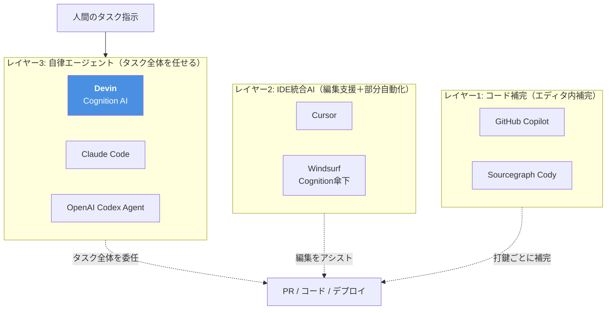

# Q1. Devinとは？

📚 [トップ索引](../../README.md) ｜ [カテゴリ索引: Devin入門（What/Who）](README.md)

---

> **メタ**: 最終確認日 2026/4/16 ｜ 根拠 https://docs.devin.ai/ ｜ 推定なし

### 結論: **Devinは、Cognition AI社が開発した「自律型AIソフトウェアエンジニア」**。人間エンジニアに指示するのと同じ感覚で、**自然言語でタスクを頼むと、コードの設計・実装・テスト・デバッグ・PR作成までを一人で遂行するAIエージェント**

### 一言での定義

> **Devin = 自分専用のシニアSWEインターン（24時間稼働・同時並列可）**

- 従来の「AIコード補完」（Copilot/Cursor）とは**レイヤーが違う**
- Copilot/Cursorは「**エディタ内の補完**」
- Devinは「**タスク全体を任せるエージェント**」

### Devinと周辺AIコーディングツールのレイヤー関係

### 位置付け

| 項目 | 内容 |
|---|---|
| 開発元 | **Cognition AI**（米国、2023年創業のAIスタートアップ） |
| 初公開 | 2024年3月 |
| 現行バージョン | 2025年9月にClaude Sonnet 4.5ベースで再構築（2倍高速・Junior Dev Eval 12%改善） |
| カテゴリ | **Autonomous coding agent（自律型コーディングエージェント）** |
| 提供形態 | **Webアプリ（app.devin.ai） / API / Slack / VSCode拡張 / MCP** |
| 動作環境 | クラウド上の**隔離VMサンドボックス**（Ubuntu + VSCode + ブラウザ + シェル） |

### 何ができるか（ざっくり）

### 実装系
- GitHubリポジトリをclone → 既存コード読解 → 新機能実装 → PR作成
- バグ修正（issueから原因調査、修正、テスト追加）
- リファクタリング・マイグレーション
- 複数のPRを**並列で**同時進行

### テスト・検証系
- 自動テスト生成・実行
- E2Eテスト（ブラウザ自動操作）
- パフォーマンス測定
- CIログ読解・原因解析

### ドキュメント系
- README / docstring / 設計ドキュメント作成
- OpenAPI / 図表の生成
- 既存コードからのドキュメント逆生成

### 運用系
- デプロイ（Vercel / Fly.io / AWS等）
- DB マイグレーション
- ログ調査・インシデント対応補助
- スケジューリング（定時実行タスク）

### 情報収集系
- Web検索・ドキュメント閲覧
- API仕様の調査
- Stack Overflow等からの解決策探索

### 人間のSWE(Software Engineer)との比較

| 観点 | 人間Software Engineer | **Devin** |
|---|---|---|
| 同時タスク数 | 1〜数件（コンテキスト切替コスト大） | **無制限**（セッション数分並列） |
| 稼働時間 | 労働時間内 | **24/7** |
| タスク切替 | 遅い | **瞬時** |
| ドメイン理解 | 深い | AGENTS.md / Knowledge 必要 |
| 創造性 | あり | 限定的（学習データの範疇） |
| 判断ミス | 少ない（経験による） | **ハルシネーションあり**（要レビュー） |
| コスト | 人件費 | ACU課金（数ドル〜/タスク） |
| 責任 | 本人 | **人間のレビュワー** |

### 代表的なユースケース

1. **Jiraチケットの自動処理**: 「このバグを直して」→ Devinが原因調査・修正・PR
2. **マイグレーション作業**: Python 2→3、Vue 2→3、DB schema変更等の大規模機械作業
3. **コードレビュー**: Devin Review機能でAI一次レビュー
4. **オンコール補助**: エラーログから原因調査 → Slack通知
5. **ドキュメント整備**: 既存コードから自動でREADME/API doc
6. **プロトタイプ作成**: アイデアを渡すと動くPoCを作る

### どういう時に「向かない」

- **リアルタイム対話が必要な作業**（Devinはセッションベース、数分〜数時間で動く）
- **極めて創造的な設計判断**（要件・設計は人間が決める方が安全）
- **UI/UXの美的判断**（人間の感性が必要）
- **法的・倫理的判断を伴う実装**
- **極小変更**（ちょっとした修正はローカルのCursor/Copilotの方が速い）

### よくある誤解

| 誤解 | 実際 |
|---|---|
| 「Devin = ChatGPTの別ブランド」 | **違う**、Cognition独自のエージェントシステム（基盤LLMはClaude Sonnet 4.5） |
| 「Copilotの上位版」 | **違う**、製品カテゴリが別（補完 vs エージェント） |
| 「人間エンジニアを置き換える」 | **違う**、レビューと指示は人間が行う前提 |
| 「完全自律で誤りなし」 | **違う**、ハルシネーション・バグを出す前提で運用する |
| 「重厚長大な契約が必要」 | **違う**、Freeプラン〜個人利用可 |

### まとめ

| 観点 | 結論 |
|---|---|
| Devinとは | **自律型AIソフトウェアエンジニア**（Cognition AI製） |
| できること | **タスク単位のコード実装・PR作成・テスト・デバッグ・ドキュメント生成・運用支援** |
| 位置付け | **Copilot/Cursorの上位レイヤー**、「エージェント」カテゴリ |
| 動作環境 | **クラウドVMサンドボックス**で自律稼働 |
| 料金 | **Free〜Enterprise**、タスクあたりACU課金 |
| 向き・不向き | **向き**: 定型作業・マイグレーション・並列タスク / **不向き**: 設計判断・微細編集・リアルタイム対話 |
| 使うための前提 | **GitHub等SCM連携**、**指示の明確化**（人間側のスキル要） |

**核心**: Devinは「エディタ内の補完」ではなく「**タスクを任せるAIエンジニア**」。人間エンジニアに作業を依頼するのと同じ感覚で自然言語で指示し、**24/7・並列で成果物（PR）**を出してもらう。人間の役割は「**要件定義・指示出し・レビュー・承認**」の上位側にシフトする。

---

[Q2. DevinはAI？どのAIモデルを使っている？ →](q02-devin-ai-model.md)
