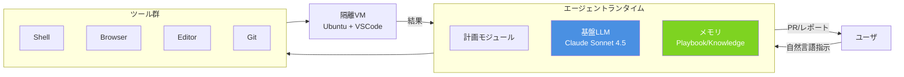

# Q2. DevinはAI？どのAIモデルを使っている？

📚 [トップ索引](../../README.md) ｜ [カテゴリ索引: Devin入門（What/Who）](README.md)

---

> **メタ**: 最終確認日 2026/4/16 ｜ 根拠 https://docs.devin.ai/ / https://cognition.ai/blog ｜ 推定あり

### 結論: **Devinは「AIエージェント」。中核LLMは現行 Claude Sonnet 4.5（Anthropic）**。ただし**Devin自体は単なるLLMではなく、LLM+ツール制御+メモリ+計画エンジンの複合システム**。過去にはGPT-4系も使用経歴あり、用途によって複数モデルを使い分ける可能性あり

### Devin ≠ LLM そのもの

よくある誤解: 「DevinはLLM（ChatGPT的なもの）」

**実際**:
```
Devin = LLM + エージェントランタイム + ツール群 + メモリ + 計画モジュール
```

| 層 | 役割 |
|---|---|
| **基盤LLM**（Claude Sonnet 4.5） | 言語理解・コード生成・推論 |
| **エージェントランタイム** | LLMを制御するオーケストレーション層 |
| **ツール実行** | シェル/ブラウザ/Git/エディタの呼び出し |
| **メモリ**（Playbook/Knowledge） | 過去の学習と反復改善 |
| **計画・監視** | 長時間タスクの計画立案・進捗追跡 |
| **マシン環境** | 隔離VM（Ubuntu + VSCode + CDP等） |

→ **LLMはDevinの一部分**に過ぎない。

### Devinの内部アーキテクチャ



### 現行の基盤LLM（2026年春時点）

### 2025年9月〜: Claude Sonnet 4.5 (Anthropic) ⭐
**公式発表**: https://cognition.ai/blog/devin-sonnet-4-5-lessons-and-challenges

- **2倍高速化**（旧版比）
- **12%改善**（Junior Developer Eval）
- **より長いコンテキスト**での一貫性向上
- **Tool Use精度向上**

### 過去の経歴

| 時期 | 基盤LLM | 根拠 |
|---|---|---|
| 2024年3月（初公開） | 当時の最高モデル（GPT-4 Turbo 等と推測） | **推定**（当時のブログ・デモでの言及ベース、公式一次ソース未特定） |
| 2024年中盤 | Claude 3.5 Sonnet 系に移行 | **推定**（Cognition/Anthropic パートナーシップ告知ベース、時期は推測） |
| 2025年春 | Claude 3.7 Sonnet 系 | **推定**（モデル世代からの推測） |
| 2025年秋〜 | **Claude Sonnet 4.5** | **公式発表**（docs.devin.ai / Cognition ブログ） |
| 将来 | Claude 5 系 / GPT-5 / Gemini 3 等へ切替の可能性 | **予測**（Cognition は「常に最先端モデル採用」方針を表明） |

### なぜClaude系を選ぶか

Cognitionのブログより読み取れる理由:
1. **Tool Use（ツール呼び出し）の精度**が高い
2. **長いコンテキストでの一貫性**（エージェントは長時間稼働するため）
3. **コード生成品質**がソフトウェアエンジニアリング用途で優れる
4. **推論能力**（計画立案・デバッグ）
5. **安全性（Anthropic Constitutional AI）**

### 他のLLMも使う？

### 可能性1: 用途別に複数LLMを併用
- **メイン対話**: Claude Sonnet 4.5
- **埋め込み生成**（検索・Knowledge）: OpenAI / Voyage等の埋め込みモデル
- **簡易判定**: 軽量モデル（Haiku系等）
- **画像解析**: **Claude Sonnet 4.5 Vision**（現行はメインLLMのマルチモーダル機能で統合済み。過去にはGPT-4V等の併用もあり得たが、2025/9以降はClaude側に一元化されていると推定）

### 可能性2: エンタープライズで独自モデル指定
- Dedicated SaaS契約では顧客の希望モデルが使えるケースあり
- Azure OpenAI / Bedrock / 自社Anthropic契約等

### 可能性3: 将来のフォールバック
- 主LLMのAPIダウン時に副LLMへフェイルオーバー

### Devin独自の技術要素

### 1. エージェントループ設計
「Don't Build Multi-Agents」ブログに示された **シングルエージェント思想**:
- 複数エージェントの合議より、**単一エージェントが長時間計画的に動く**方が効率的
- コンテキストを失わない
- デバッグ可能性が高い

### 2. コンテキスト管理
- 長時間セッションで**重要情報を圧縮・抽出**
- **Playbook/Knowledgeで外部化**
- **Summarization**で古い情報を要約

### 3. ツール統合
- **シェル実行**（bash）
- **ブラウザ操作**（Playwright/CDP）
- **エディタ操作**（VSCode内）
- **Git操作**（gitコマンド直接）
- **MCP経由の外部ツール**
- **ブラウザ拡張実行**

### 4. 隔離環境
- 各セッション専用の**仮想マシン**（Ubuntu）
- **サンドボックス化**されたファイルシステム
- **ネットワーク制御**（Enterprise: VPC内）

### AIモデルの「見え方」

### セッション中
- 応答速度から**Claude Sonnet系のレイテンシ**に近い
- 日本語応答品質も**Claude系の特徴**（自然で丁寧）
- 推論過程が**Claude特有の「ステップバイステップ」思考**

### 開示情報の範囲
- Cognitionは**基盤LLMを公式ブログで随時開示**
- **完全に独自LLM**ではなく、**Anthropic/OpenAI等の既存LLMを活用**する姿勢

### 「Devinに聞けばどのモデルか答える？」

実験的に: Devinに「あなたはどのAIモデル？」と聞くと:
- 基本的に「**Devin by Cognition AI**」と答える（モデル名を明かさない設定）
- 「Claude Sonnet 4.5」とは**自発的に答えない**（システムプロンプト指示）
- 外部公表の範囲でCognitionが明かしている情報以上は出ない

### LLM以外の AI 要素

Devinには以下のAI関連技術も含まれる:

| 技術 | 役割 |
|---|---|
| **埋め込み（Embeddings）** | Knowledge/コードベース検索 |
| **Retrieval (RAG)** | 大規模リポ内のコンテキスト取得 |
| **コードインデクシング** | DeepWiki的な構造把握 |
| **ランキングモデル** | 検索結果の並び替え |
| **Classifier（分類器）** | タスク分類、完了判定 |
| **Vision（画像認識）** | スクリーンショット理解、UIデバッグ |
| **OCR** | PDF/画像からのテキスト抽出 |

→ 「エージェント全体としてのAIシステム」はLLM単体より広範。

### よくある質問

### Q: GPTは使ってる？
- **過去には使っていた**、現在はClaude Sonnet 4.5が主
- 補助的にOpenAI API（埋め込み等）を使う可能性は否定できない

### Q: 独自LLMを持ってる？
- **専用の独自LLMは公表されていない**
- 既存LLMへのファインチューニング/プロンプトエンジニアリングが中心

### Q: モデルが変わるとDevinが変わる？
- **Yes**、基盤LLM変更時は性能・振る舞いが大きく変化
- 2025年9月のSonnet 4.5移行で「2倍速・12%精度向上」報告

### Q: オフライン/オンプレLLMで動く？
- **標準構成では不可**、Anthropic APIがクラウド前提
- **Enterprise契約でAzure/Bedrock経由のClaude**は可能
- **完全オンプレ版**は2026年春時点で公式提供なし

### Q: AIの説明可能性（Explainability）は？
- Devinはセッション中に**計画と推論過程**を表示
- ただし**LLM内部の判断根拠**は完全には開示不能（LLMの限界）

### Q: ハルシネーションは？
- **あり**、LLM一般の課題
- Devin側の対策: **実行検証**（コード動かして確認）、**ツール使用**、**Playbook/Knowledge**で減衰
- **人間レビュー必須**

### 将来の可能性

| シナリオ | 可能性 |
|---|---|
| **Claude 5移行** | 高（2026年後半以降） |
| **OpenAI GPT-5併用** | 中（用途次第） |
| **Gemini系採用** | 低〜中（Google Cloud Enterprise顧客向け） |
| **Cognition独自LLM** | 低（基盤モデル開発は高コスト） |
| **マルチLLM並行** | 中（用途別に適材適所） |

### まとめ

| 観点 | 結論 |
|---|---|
| Devinは AIか | **Yes、AIエージェント**（LLM+ツール+メモリ+計画） |
| 現行基盤LLM | **Claude Sonnet 4.5**（Anthropic、2025年9月〜） |
| 過去経歴 | **GPT-4系 → Claude 3.5/3.7 → Claude 4.5** |
| 独自LLM | **なし**（既存LLM + 独自エージェント層） |
| 他AI要素 | **埋め込み / RAG / Vision / OCR / Classifier** |
| オンプレ対応 | **標準は不可**、**Azure/Bedrock経由**でEnterprise可 |
| ハルシネーション | **あり**、**レビュー必須**、Playbookで低減 |
| 強み | **エージェント設計** / **ツール制御** / **メモリ管理** |

**核心**: Devinは「AIエージェント」で、中核LLMはAnthropicのClaude Sonnet 4.5。ただし**Devinの本体価値はLLMそのものではなく、LLMを**「どう制御して長時間タスクをこなさせるか」**のエージェント設計にある。LLMは今後Claude 5やGPT-5に入れ替わっていくが、**エージェント設計ノウハウこそCognitionの核**。

---

[← Q1. Devinとは？](q01-devin-overview.md) ｜ [Q3. Devinはどんな人向け？（想定ユーザ像） →](q03-target-users.md)
