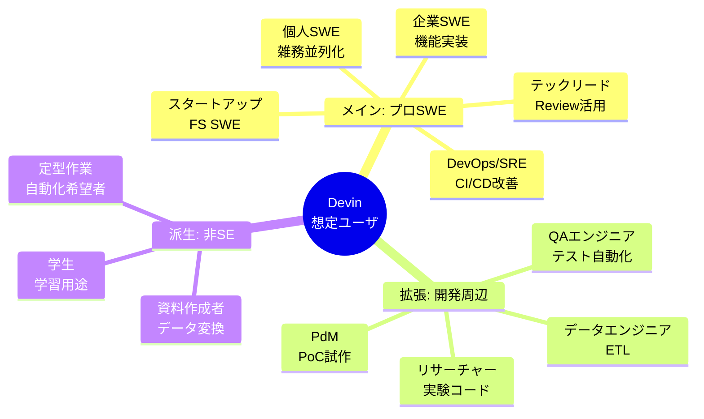

# Q3. Devinはどんな人向け？（想定ユーザ像）

📚 [トップ索引](../../README.md) ｜ [カテゴリ索引: Devin入門（What/Who）](README.md)

---

> **メタ**: 最終確認日 2026/4/16 ｜ 根拠 運用観察ベース ｜ 推定なし

### 結論: **メインターゲットは「ソフトウェアエンジニア（個人〜企業チーム）」**だが、**非SEでも定型的な作業（データ処理・資料作成・スクレイピング等）を自動化したい人**も十分想定内

### 想定ユーザ像マインドマップ

### ターゲットユーザ層（公式・実利用観察から）

### 第1階層（メインターゲット）: プロのSWE

| 人物像 | 用途 |
|---|---|
| **個人の経験豊富なSWE** | 雑務・並列タスク・プロトタイプ |
| **スタートアップのフルスタックSWE** | 同時並行で機能実装を回す |
| **企業のバックエンド/フロントエンドSWE** | 既存コード修正、テスト追加、CIデバッグ |
| **テックリード・アーキテクト** | レビュー・設計検証、Devin Review活用 |
| **DevOps / SRE** | CI/CD改善、インフラコード、ログ解析補助 |

### 第2階層（拡張ターゲット）: 開発周辺の職種

| 人物像 | 用途 |
|---|---|
| **QAエンジニア** | テスト自動化、E2Eテスト生成 |
| **データエンジニア** | ETL、SQL、データ変換スクリプト |
| **セキュリティエンジニア** | Devin Reviewでの脆弱性チェック補助 |
| **技術ライター** | ドキュメント整備、API Reference生成 |

### 第3階層（新興ターゲット）: 非SE・ビジネス側

> ⚠️ **注記**: 以下の第3階層は**技術的には可能**だが、**GitHubアカウント・SCM前提の運用・月額料金・AI出力のレビュー責任**を踏まえると、**第1/第2階層と同等の生産性は期待しづらい**。むしろ**社内の技術サポートがある前提**、もしくは**個人学習・スモールプロジェクト用途**として検討するのが現実的。

| 人物像 | 用途 | 注意点 |
|---|---|---|
| **PM / プロダクトマネージャ** | プロトタイプ作成、仕様の実装検証 | 技術的な伴走者が望ましい |
| **デザイナー** | Figma → コード変換、静的サイト実装 | SCM基礎が必要 |
| **データアナリスト** | Pythonスクリプトでデータ処理、可視化 | Pythonの読み書きは必要 |
| **中小企業経営者** | 社内ツール（注文管理、簡易CRM）の自作 | 本格運用には開発者のサポート推奨 |
| **マーケ・広報** | 定型データ集計、レポート自動生成 | 定型タスクに限定、機密データ扱い要注意 |
| **研究者・学生** | 実験コード、論文用スクリプト | Freeプラン＋個人学習用途として適 |

→ **ChatGPTで「コード書いて」と言っているような層**もDevinユーザに含まれる（ただし**SCM運用とレビュー責任の理解が前提**）。

### 企業規模別

| 規模 | 主な活用 |
|---|---|
| **個人（Freeプラン）** | 学習、副業、プロトタイプ、学生プロジェクト |
| **スタートアップ（Pro/Max）** | 少人数で大量PRを回す、MVP高速開発 |
| **中規模企業（Teams）** | チームでの共有リポ開発、レビュー、Playbook化 |
| **エンタープライズ（Enterprise）** | 大規模マイグレーション、セキュアな専用環境、組織ポリシー準拠 |

### 国・地域の傾向（2026年時点）

- **米国**: 個人SWE・スタートアップ中心
- **欧州**: 企業のDevOps/品質改善用途
- **日本**: **大企業の業務自動化・レガシーマイグレーション**用途が目立つ
- **インド/東南アジア**: 受託開発会社・フリーランスが主
- **中国**: 競合サービス（Manus等）が強く、Devinシェアは限定的

### 「Devinを使いこなせる人」のマインドセット

### 必須マインド
- **Delegation（委任）の発想**: 「自分でやる」より「Devinに頼む」で考える
- **仕様の言語化**: 曖昧な依頼は曖昧な結果を招く
- **レビュー責任**: AIの出力を検証する責任は人間側
- **失敗許容**: 一発でうまくいかないのが普通、反復で育てる

### あると便利なマインド
- **並列思考**: 複数タスクを同時に動かす心構え
- **ROI思考**: 何をDevinに任せ何を自分でやるかの見極め
- **改善ループ**: Playbook/Knowledge/AGENTS.mdで知見を蓄積

### 「Devinに向かない人」

| 人物像 | 理由 |
|---|---|
| **「AI = 魔法」と期待する人** | ハルシネーションあり、レビュー必須 |
| **仕様を明文化したくない人** | 曖昧指示では動けない |
| **すべて自分で制御したい人** | エージェント委任が性に合わない |
| **SCM（GitHub等）を使えない/使いたくない人** | 前提インフラが整わない |
| **1行の微修正ばかりする人** | ローカルIDE補完の方が速い |

### 非SEでもDevinを使える代表的シナリオ

### シナリオA: データ処理（非SEに多い用途）
- Excel/CSVをアップロード → 「集計してレポートにして」
- スクレイピングスクリプト「このサイトから毎日データ取ってきて」
- データ変換「このJSONをCSVに直して」

### シナリオB: 社内ツール自作
- 「発注管理の簡単なWebアプリ作って、ログインとDB付きで」
- 「Slackで定時に在庫通知するbot作って」

### シナリオC: 資料生成
- 「このログを解析して経営報告用スライドにして」
- 「README.md書いて、図も含めて」

### シナリオD: 学習補助
- 「このコードを解説して、サンプル改造案も」
- 「TypeScript初学者向けのハンズオン作って」

### よくある質問

### Q: プログラミングが全くできなくても使える？
- **部分的にYes**: 簡単なデータ処理や定型作業は可能。ただし**生成されたコードの妥当性判断**が難しいと不向き。PMや学生がプロトを作る用途は現実的。

### Q: 逆にシニアSWEがDevinを使う意味は？
- **大いにある**: 雑務・定型作業・テスト追加・調査系をDevinに任せ、自分は設計・レビュー・意思決定に集中できる。ROIは経験者ほど大きい。

### Q: 日本語対応は？
- **完全対応**: 日本語での指示・レポートが可能。Devinのシステムプロンプトも多言語対応。

### まとめ

| 観点 | 結論 |
|---|---|
| メイン層 | **プロのSWE**（個人〜企業チーム） |
| 拡張層 | **QA / DevOps / SRE / データエンジニア / PM / デザイナー** |
| 新興層 | **非SE**（PM・マーケ・研究者・経営者）**も定型自動化で十分対象** |
| マインド | **委任・仕様言語化・レビュー責任・失敗許容** |
| 不向き | **AI魔法期待者 / SCM不使用者 / 微修正中心の人 / 全て手で握りたい人** |
| 非SE用途 | **データ処理・社内ツール・資料生成・学習補助** |

**核心**: Devinの想定ユーザは「**自分の作業を委任できる人**」。プロSWEが本命だが、**「仕様をきちんと言葉にできて、出力を検証できる人」であれば非SEでも十分活用可能**。逆に言えば、職種よりも「**委任マインド・言語化スキル・レビュー責任感**」の3つが決定的。

---

[← Q2. DevinはAI？どのAIモデルを使っている？](q02-devin-ai-model.md) ｜ [Q4. Devinユーザに必要な知識・経験は？（必須 / 推奨） →](q04-required-knowledge.md)
