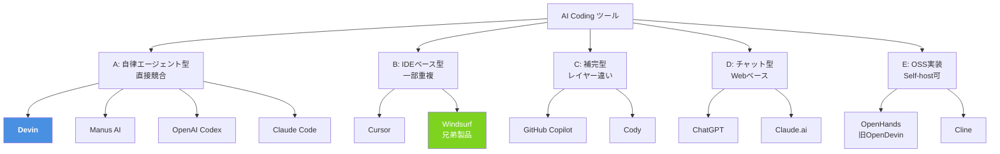

# Q6. Devinの競合サービスやソフトウェアは何？

📚 [トップ索引](../../README.md) ｜ [カテゴリ索引: Devin入門（What/Who）](README.md)

---

> **メタ**: 最終確認日 2026/4/16 ｜ 根拠 各社公式サイト・運用観察 ｜ 推定あり

### 結論: **カテゴリ別に分類すると、(1) 自律エージェント系 (Devin直接競合) (2) IDEベース型AI (Cursor/Windsurf) (3) 補完型 (Copilot/Cody) (4) チャット型 (ChatGPT/Claude.ai) (5) OSS実装**の5カテゴリ。**直接競合はManus AI, OpenAI Codex Agent, Anthropic Claude Code 等**（※Windsurfは2025/7にCognitionが買収済みでDevinの兄弟製品、SWE-1/SWE-1.5はそのWindsurf上のモデル）

### 競合カテゴリマップ

### カテゴリA: 自律エージェント型（Devinの直接競合）

| サービス | 提供元 | 特徴 |
|---|---|---|
| **Devin** ⭐ | Cognition AI | 本項の主題、シングルエージェント哲学 |
| **Manus AI** | Butterfly Effect (中国発・Singapore登記) | 汎用AIエージェント、アジア圏で急成長 |
| **OpenAI Codex（Agent）** | OpenAI | 2025年新Agentとして再登場 |
| **Anthropic Claude Code** | Anthropic | CLI中心のコーディングエージェント（2025年一般公開） |
| **Factory AI (Droids)** | Factory | エンタープライズ向け |
| **AutoDev / AutoGen Studio** | Microsoft Research | マルチエージェント研究 |
| **Magic.dev** | Magic | 長コンテキスト特化 |

> **Windsurf / SWE-1 / SWE-1.5について**: WindsurfはCognitionが2025年7月に買収済みのAI IDEで、**Devinの兄弟製品**。WindsurfがCerebras連携で2025年5月にSWE-1、10月にSWE-1.5を発表したが、いずれも**Cognition系列のモデル**であり、Anthropic / Claude Codeとは無関係。

### カテゴリB: IDEベース型AI（一部重複）

| サービス | 提供元 | 特徴 |
|---|---|---|
| **Cursor** | Anysphere | VSCodeフォーク、エージェントモードあり |
| **Windsurf**（Cognition傘下・2025/7買収） | Cognition（元Codeium 社→Windsurf 社） | Cascade機能でエージェント寄り。**Devinと同社の兄弟製品**、専用モデルSWE-1/SWE-1.5搭載 |
| **Zed** | Zed Industries | 高速エディタ、AI統合強化中 |
| **VSCode + Copilot Agent** | Microsoft | 2025年後半にAgent mode追加 |

### カテゴリC: 補完型（カテゴリ違いだが競合と見なされる）

| サービス | 提供元 | 特徴 |
|---|---|---|
| **GitHub Copilot** | GitHub/Microsoft | 最大シェア、Chat/Agent化進行 |
| **Cody** | Sourcegraph | リポ全体検索に強い |
| **Tabnine** | Tabnine | プライバシー特化 |
| **Amazon Q Developer** | AWS | AWS統合強化 |
| **Codeium (Classic)** | Codeium | 無料枠厚い |
| **Replit Agent** | Replit | ブラウザ内完結、教育向け |

### カテゴリD: 汎用チャット型（部分競合）

| サービス | 提供元 | 特徴 |
|---|---|---|
| **ChatGPT + Canvas** | OpenAI | 対話ベース、Codex併用 |
| **Claude.ai + Artifacts** | Anthropic | Claude Code SDKと連携 |
| **Gemini Code Assist** | Google | Workspace統合 |
| **Perplexity** | Perplexity | 調査寄り |

### カテゴリE: OSS / セルフホスト

| ソフトウェア | 特徴 |
|---|---|
| **OpenDevin / OpenHands** | Devinに触発されたOSS AI 開発エージェント（All-Hands-AIコミュニティ運営、Graham Neubig 氏（CMU）らが中心、MIT License） |
| **Aider** | CLI対話型、シンプル・軽量 |
| **AutoGPT** | 初期の自律エージェント、今も改善中 |
| **BabyAGI** | シンプル自律ループ |
| **GPT Engineer** | プロジェクト骨格生成に特化 |
| **Devika** | Devin模倣OSS、学生向け |
| **Cline (旧 Claude Dev)** | VSCode拡張、Anthropic Claude API 等を利用する独立OSS（2024/10にClaude DevからClineへ改名） |
| **Continue.dev** | OSS VSCode拡張、任意LLM使用可 |
| **Plandex** | CLI型、plan駆動 |

### 機能・価格マトリクス（主要サービス）

> ⚠️ **料金情報の注意**: 下表は**2026年4月時点**の概略値。**Devinは2026/4/16料金改定**でSelf-serveが**Free/Pro($20)/Max($200)/Teams($80〜)**の5段階となり、**Enterpriseは「カスタム契約」で下限は非公開**（旧Team $500/月は新Teams $80〜に下方改定済）。詳細はQ7参照。

| 機能 | Devin | Cursor | Copilot | Manus | OpenDevin |
|---|---|---|---|---|---|
| **形態** | クラウドAgent | IDE | IDE拡張 | クラウドAgent | OSS/セルフ |
| **シェル実行** | ✅ | △ | ❌ | ✅ | ✅ |
| **ブラウザ操作** | ✅ | ❌ | ❌ | ✅ | ✅ |
| **並列タスク** | ✅ | ❌ | ❌ | △ | △ |
| **PR作成** | ✅ | △ | ❌ | ✅ | ✅ |
| **CIデバッグ** | ✅ | ❌ | ❌ | ✅ | △ |
| **Playbook/Memory** | ✅ | △ | ❌ | ✅ | △ |
| **SCM連携** | ✅ | △ | ✅ | ✅ | ✅ |
| **Mobile/Slack連携** | ✅ | ❌ | △ | ✅ | ❌ |
| **エンタープライズ（SOC2等）** | ✅ | ✅ | ✅ | △ | (自己責任) |
| **無料枠** | ✅ | △ | △ | ❌ | ✅ (全OSS) |
| **料金（個人最小）** | $0（Free） | Pro $20/月 | Pro $10/月 | 要確認 | $0 |
| **料金（チーム/エンタープライズ）** | Teams $80/月〜 / **Enterpriseはカスタム（下限非公開）** | Teams $40/user/月・Enterprise Custom | Business $19/user/月・Enterprise $39/user/月 | 非公開 | (自己負担) |

### 特徴で比較

### Devin vs Cursor
- **Devin**: クラウドで自律稼働、**タスク委任型**
- **Cursor**: ローカル高速、**対話型IDE**、手元で集中編集
- **併用パターン**: Cursorで対話的に編集 + 大物タスクはDevinへ投げる

### Devin vs Copilot
- **Devin**: エージェント（タスク単位）
- **Copilot**: 補完（行単位・Chat化進行中）
- **レイヤー違い**: 両方使える（Copilotで行補完、Devinで大タスク）

### Devin vs Manus AI
- **Devin**: 米国発（Cognition）、Claude Sonnet 4.5基盤、SOC 2 Type II 取得済
- **Manus**: 中国系スタートアップ（Butterfly Effect 社）提供、Singapore 登記、汎用AIエージェント志向（創業者個人名は一次ソース未確認のため本 FAQ では記載せず）
- **違い**: データ保管地・規制準拠・得意領域（Devinはコード・SCM寄り、Manusは汎用タスク寄り）
- **日本市場**: Devinが優勢、Manusは一部で検討される程度

### Devin vs OpenAI Codex Agent
- **Devin**: Cognition独自のエージェントアーキテクチャ
- **Codex**: OpenAI公式、GPT系モデル
- **2026年の拮抗**: 両方が「ターミナル + ブラウザ + Git」のエージェントとして機能拡充中

### Devin vs Anthropic Claude Code
- **Devin**: Webapp中心、Session型、Playbook/Knowledge整備済
- **Claude Code**: CLI中心、ローカルセッション、Anthropic純正エージェント
- **棲み分け**: Claude Codeは**手元のターミナルで対話**、Devinは**クラウドで自律長時間**
- **補完関係**: 両方使う企業は増加中

### Devin vs OpenDevin / OpenHands
- **Devin**: 商用、SaaS、サポートあり
- **OpenDevin**: OSS、セルフホスト、カスタマイズ自由
- **選択基準**: セキュリティ要件厳しい企業はOSSを社内環境で、それ以外はDevinでサポート込み

### 選定の観点

### 技術者個人視点

| 用途 | 推奨 |
|---|---|
| 学習・実験 | **Devin Free / Cursor** |
| 日常業務の生産性UP | **Cursor + Copilot** がコアに、**Devin**で雑務並列 |
| 個人プロジェクト大量並列 | **Devin Pro** |
| 深いコード対話 | **Claude Code + Cursor** |

### 企業視点

| 規模・要件 | 推奨 |
|---|---|
| スタートアップ | **Devin Pro** + **Cursor**併用 |
| 中堅企業 | **Devin Teams** + **Copilot Enterprise** |
| 大企業・厳格セキュリティ | **Devin Enterprise (Dedicated SaaS)** または **OpenDevinセルフホスト** |
| 中国市場対応 | **Manus AI併用** |
| オンプレ必須 | **OpenHands (OSS)** + 社内LLM |

### 2026年時点の勢力図

| 領域 | リーダー |
|---|---|
| **補完市場** | **Copilot**（MS力で圧倒的シェア） |
| **IDE AI市場** | **Cursor**（シェア・ブランド） |
| **自律エージェント市場** | **Devin** が先頭、**Claude Code / Codex Agent**が猛追 |
| **OSS市場** | **OpenHands** が最大 |
| **アジア市場** | **Manus**が中国で強い、日本・インドはDevin |

### 競合選定時の失敗パターン

| 失敗 | 原因 | 対処 |
|---|---|---|
| Cursorで全部やろうとする | エージェント用途には軽量すぎ | 大タスクはDevinへ |
| Copilotに自律タスクを期待 | カテゴリ違い | Copilot Agent mode または Devinへ |
| OpenDevinをノー運用で導入 | セルフホストの負担大 | 小さく始めるか商用選ぶ |
| Manusを安いからと大規模導入 | データ保管地の問題 | Devinとの比較必須 |
| 全部入り契約で無駄増 | 重複機能 | レイヤー別に1つ選ぶ |

### よくある質問

### Q: Devinより安い代替は？
- **Cursor/Copilotが安い**が、**用途が違う**。自律タスクが本当に必要ならDevin一択
- **OpenHands（OSS）**はインフラ自前で賄えば料金なし（ただし運用工数大）

### Q: 日本語対応で選ぶなら？
- **Devin / Cursor / Copilot / Claude** すべて日本語対応
- 差別化要因は日本語ではなく**機能・料金・セキュリティ**

### Q: セキュリティで選ぶなら？
- 商用: **Devin (SOC 2 Type 2)**、**Copilot Enterprise**
- 自社データ完全制御: **OpenHands** セルフホスト

### Q: 将来、Devinが負ける可能性は？
- Claude Code / OpenAI Codex Agentが同等機能＋基盤LLM提供元の強みを活かすと脅威
- ただし**Devinはエージェント設計のノウハウ（Playbook/Knowledge/Session管理）**が蓄積されており、差別化要因あり

### まとめ

| カテゴリ | 主要競合 |
|---|---|
| **直接競合（自律エージェント）** | **Manus AI, OpenAI Codex Agent, Claude Code, Factory AI** |
| **IDE型AI** | **Cursor, Windsurf, Zed, VSCode Copilot Agent** |
| **補完型** | **GitHub Copilot, Cody, Tabnine, Amazon Q, Replit Agent** |
| **チャット型（部分競合）** | **ChatGPT, Claude.ai, Gemini** |
| **OSS** | **OpenHands/OpenDevin, Aider, Continue, Cline, Plandex** |
| **Devinの強み** | **シングルエージェント設計 / Playbook+Knowledge / Mobile+Slack / SOC 2 / Cloud常駐** |
| **選定軸** | **用途（補完 vs エージェント）/ 規模（個人 vs 企業）/ 規制（オンプレ必須？）/ LLM嗜好** |

**核心**: Devinと真っ向競合なのは「**自律型エージェントカテゴリ**」（Manus, Codex Agent, Claude Code）。Cursor/Copilotはレイヤーが違うので**併用が合理的**。OSS派はOpenHandsが事実上の標準。選定は**用途・規模・規制**の3軸で行う。

---

[← Q5. Devin入門者が最初に読むべきドキュメント・書籍は？](q05-getting-started-docs.md) ｜ [Q7. Devinの料金体系は？（2026/4/16の改定） →](../02-pricing/q07-devin-pricing.md)
