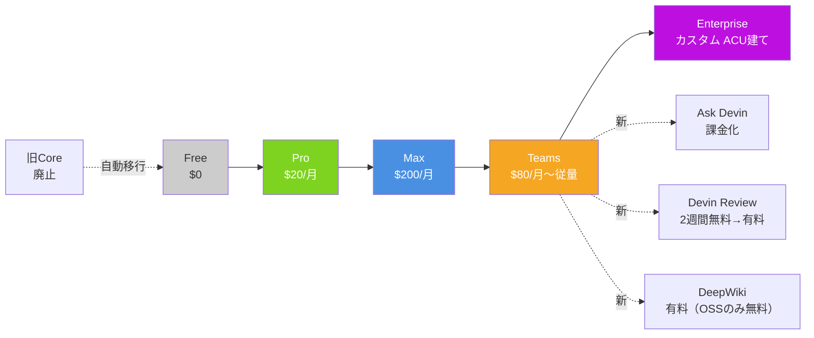

# Q7. Devinの料金体系は？（2026/4/16の改定）

📚 [トップ索引](../../README.md) ｜ [カテゴリ索引: 料金・プラン](README.md)

---

> **メタ**: 最終確認日 2026/4/16 ｜ 根拠 https://cognition.ai/pricing / https://cognition.ai/blog/new-self-serve-plans-for-devin ｜ 推定あり

### 結論: **2026/4/16施行で Free/Pro/Max/Teams/Enterprise の5プラン体系に刷新**。Self-serveはドル建て、Enterpriseは引き続きACU建て。**Ask Devin / Devin Review / DeepWikiも課金対象化**（OSS repoのみ無料継続）

> ⚠️ **本 FAQ の料金情報は執筆時点（本FAQ最終更新 2026/4/16）のスナップショット**。料金は変動するため、**最新情報は必ず公式価格ページ [cognition.ai/pricing](https://cognition.ai/pricing) と公式ブログで確認**すること。本 FAQ の他 Q（Q29/Q43/Q44/Q58 等）で料金に言及する際も、Q7 と公式ページを唯一の根拠とする。

Cognition公式発表（**2026/4/14付ブログで予告・2026/4/16施行**）で、セルフサーブの料金体系が大幅に変更された。
出典: https://cognition.ai/blog/new-self-serve-plans-for-devin（一次ソース URL は公開時点のもの。**アクセス不可の場合は [cognition.ai/blog](https://cognition.ai/blog) からタイトル検索**）

### プラン体系の刷新

**旧プラン**: Core / Team の2段階
**新プラン**: **Free / Pro / Max / Teams / Enterprise** の5段階

| プラン | 価格 | メンバー数 | 同時並行Session | 想定ユーザー | 旧プランからの移行 |
|---|---|---|---|---|---|
| **Free** | 無料 | 1 | 限定 | 試用・軽いお試し | 旧Coreユーザーは自動移行 |
| **Pro** | $20/月 | 1 | 最大10 | 個人で継続的に使う | Freeで物足りない個人 |
| **Max** | $200/月 | 1 | 最大10 | ヘビーな個人利用 | ガッツリ使う個人 |
| **Teams** | **$80/組織/月〜**（使用量ベース課金、最低料金 $80/組織/月） | 無制限 | 無制限 | チーム利用（課金一元化・管理者制御あり） | 旧Teamユーザーは自動移行（旧 $500/組織/月 → 新 $80/組織/月〜に下方修正） |
| **Enterprise** | カスタム | 無制限 | 無制限 | 大規模組織 | 変更なし（既存契約継続） |

> 📎 **Windsurf プランとの関係**: 2026/3 に [Windsurf 側も Free/Pro/Max/Teams/Enterprise 体系に改定](https://windsurf.com/pricing)。**プラン名と Pro/Max の価格が揃っているのは買収後のブランド統一の結果**で、Devin と Windsurf は**別契約・別課金**。詳細は [Q70](q70-devin-vs-windsurf-plans.md) を参照。

### プラン階段図

### 課金単位の変更

- **Self-serve（Free/Pro/Max/Teams）**:
  - プラン内はクォータ制
  - **超過分は「ドル建て」で課金**（ACU単位ではなくなる）
- **Enterprise**:
  - 従来通り **ACU建て**のまま

### 🆕 これまで無料だったプロダクトが**課金対象化**

以下のプロダクトも、実際の計算資源コストを反映する形で課金対象になった:

| プロダクト | 新しい扱い |
|---|---|
| **Ask Devin** | **使用量ベース課金**（エージェント作業と同じ考え方） |
| **Devin Review** | 2週間の無料トライアル → その後は使用量ベース課金。1レビューあたり **$2〜3** が目安。OSS repoは無料のまま |
| **DeepWiki** | 使用量ベース課金。OSS repoは無料のまま |

### Devin Reviewの実行タイミング制御

従来は「毎コミットで自動実行」がデフォルトだったが、コストが予測可能になるよう実行モードを選べるようになる:
- Manual only（手動のみ）
- Run when a PR is first opened（PR作成時のみ）
- Run on every commit（毎コミット、従来の挙動）

### 既存ユーザーへの影響

| 現在のプラン | 移行先 | 注意点 |
|---|---|---|
| Core | Free | 旧Coreの「最低金額なしPAYG」構造は消える。継続利用したいならPro以上へ |
| Team | Teams | エントリー価格が$500/月 → $80/月〜に下がる（下方改定） |
| Enterprise | Enterprise | 変更なし |

### コスト管理のポイント（改定後）

1. **Ask Devinも「只」ではなくなった**ので、軽い調査でも費用が発生することを意識する
2. **Devin Reviewは実行頻度を絞る**（毎コミット → PR作成時のみ、等）
3. **OSS repoで試すなら DeepWiki / Devin Reviewは引き続き無料**
4. **self-serveプランは**超過分がドル建てなのでACUの概念を気にしなくて良くなった（反面、クォータ超過が直接請求に跳ねる）
5. **Enterprise はACU建てのまま**なので既存のACU運用ノウハウは引き続き有効

### このFAQへの影響

料金改定を踏まえて、以下の記述は読み替えが必要:
- 「**Ask Devinはセッションを消費しない/無料**」→ **有料（使用量ベース）**
- 「**ACU ○○**」という表現 → self-serveではドル建て、Enterpriseのみ引き続きACU
- 「**Devin Review / DeepWikiは無料**」→ **OSS repoのみ無料、それ以外は有料**

### まとめ

- 2026/4/16付けで施行され、**Free/Pro/Max/Teams/Enterprise** の5プラン体系に刷新
- **Ask Devin / Devin Review / DeepWikiが課金対象化**（OSS repoのDeepWiki / Devin Reviewは無料継続）
- Self-serveはドル建て、Enterpriseは引き続きACU建て
- 旧Teamユーザーは **エントリー価格が$500 → $80/月〜に下がる**のでむしろ安くなる
- 旧Coreの「最低金額なしPAYG」が無くなる点は要注意

**核心**: **2026/4/16改定で「Free / Pro / Max / Teams / Enterprise」の5プラン体系に刷新、Ask Devin 含め使用量ベース課金化が進行、組織利用は Teams 以上が基本**。

---

[← Q6. Devinの競合サービスやソフトウェアは何？](../01-introduction/q06-competitors.md) ｜ [Q8. Ask DevinとSessionの違いは？ →](../03-basic-operations/q08-ask-vs-session.md)
