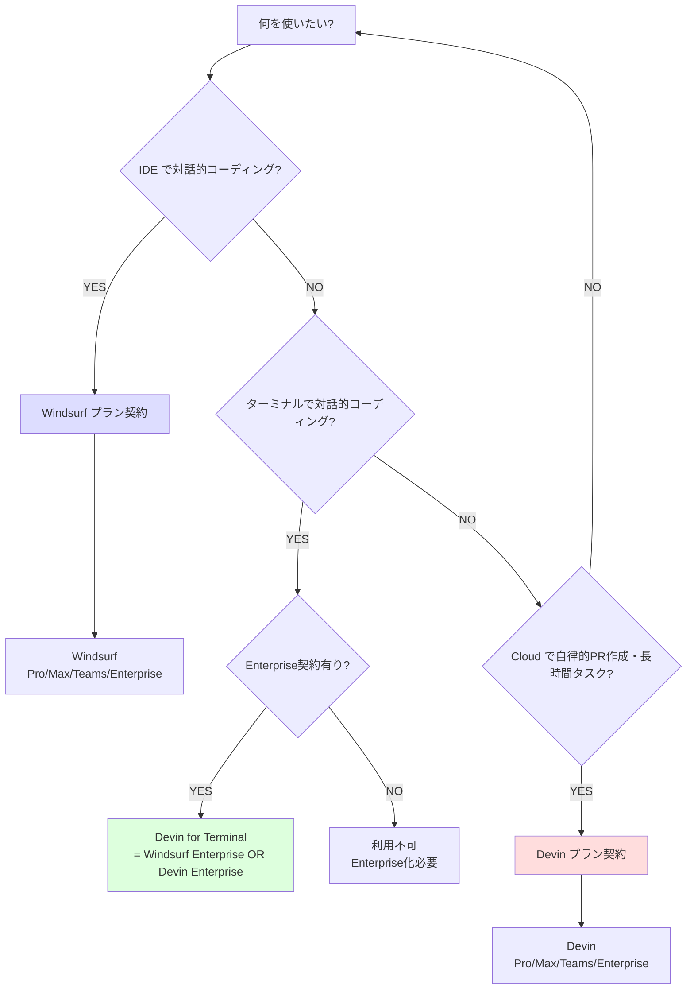
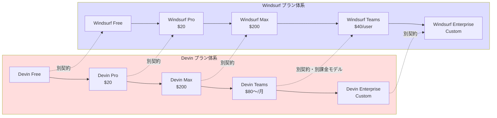

# Q70. Devin と Windsurf のプランは別物？同名の Pro/Max は同じ？

📚 [トップ索引](../../README.md) ｜ [カテゴリ索引: 料金・プラン](README.md)

---

> **メタ**: 最終確認日 2026/4/17 ｜ 根拠 https://devin.ai/pricing / https://windsurf.com/pricing / https://cognition.ai/blog/windsurf ｜ 推定なし

### 結論: **プランは完全に別物**。両者は **Cognition 傘下の別サブスクリプション**で、**プラン名（Free / Pro / Max / Teams / Enterprise）が一致しているのは買収後のブランド統一の結果**。**契約・課金・適用範囲は独立**しており、片方の契約で両方使えるのは **Devin for Terminal だけ**（Enterprise 限定）。

### 経緯: なぜプラン名が揃っているか

[Cognition's acquisition of Windsurf](https://cognition.ai/blog/windsurf)（2025年7月、約 $250M）以降、両製品の料金体系が段階的に統一された:

| 時期 | 出来事 |
|---|---|
| 2025/7 | **Cognition が Windsurf を買収**（IDE製品として継続） |
| 2026/3 | [Windsurf 料金改定](https://windsurf.com/blog/windsurf-pricing-plans): クレジット制 → クォータ制、**Free / Pro / Max / Teams / Enterprise** に改定 |
| 2026/4/14 | Cognition が Devin の新料金体系を発表 |
| 2026/4/16 | **Devin 料金改定施行**: Core/Team 廃止 → **Free / Pro / Max / Teams / Enterprise** へ |

→ **2026/3 の Windsurf 改定 → 2026/4/16 の Devin 改定でプラン命名規則を揃えた**。これは買収後の **ブランド統一** の表れであり、内容まで同一になったわけではない。

### プラン構造比較（2026/4 時点）

#### Devin プラン（[devin.ai/pricing](https://devin.ai/pricing/)）

| プラン | 価格 | メンバー数 | 同時並行Session | 主な対象 |
|---|---|---|---|---|
| **Free** | $0 | 1 | 限定 | 試用 |
| **Pro** | **$20/月** | 1 | 最大10 | 個人継続利用 |
| **Max** | **$200/月** | 1 | 最大10 | ヘビー個人利用 |
| **Teams** | **$80/月**〜（使用量ベース） | 無制限 | 無制限 | チーム利用 |
| **Enterprise** | Custom | 無制限 | 無制限 | 大規模組織 |

主な提供機能: Devin (Cloud agent) / Ask Devin / DeepWiki / Devin API / Advanced Capabilities (Managed Devins/Playbook/Knowledge) / SCM 連携 (GitHub/GitLab/Bitbucket) / Slack・Teams・Linear・Jira 統合 / VPC 展開 (Enterprise) / SAML SSO (Enterprise)

#### Windsurf プラン（[windsurf.com/pricing](https://windsurf.com/pricing)）

| プラン | 価格 | Cascade 利用枠 | プレミアムモデル | SWE-1.5 |
|---|---|---|---|---|
| **Free** | $0 | Light | — | ✅ |
| **Pro** | **$20/月** | Standard（API価格で追加課金） | ✅ | ✅ |
| **Max** | **$200/月** | Heavy | ✅ | ✅ |
| **Teams** | **$40/user/月** | Standard | ✅ | ✅ |
| **Enterprise** | Custom | Custom | ✅ | ✅ |

主な提供機能: Cascade（IDE-native agent）/ Tab autocomplete / プレミアム LLM 群（Claude / GPT / Gemini 等）/ Devin Cloud delegation 機能（"Devin in Windsurf"）/ Knowledge base / SSO / RBAC / Hybrid deployment / SWE-1.5 (Windsurf 自社モデル)

### 同名プランの「同じ点」と「違う点」

#### 同じ点

| 項目 | 内容 |
|---|---|
| プラン名 | Free / Pro / Max / Teams / Enterprise（完全一致） |
| Pro / Max 価格 | $20 / $200（完全一致） |
| 運営会社 | Cognition AI |
| 認証基盤 | Cognition アカウント（共通） |

#### 違う点（重要）

| 観点 | Devin の Pro | Windsurf の Pro |
|---|---|---|
| **対象製品** | Devin (Cloud agent) / Ask / Wiki / API | Windsurf IDE / Cascade |
| **動作場所** | Cloud VM | ローカル PC（IDE） |
| **主要エージェント** | Devin (Cloud agent) | Cascade |
| **課金単位** | クォータ + ドル建て従量課金（旧 ACU） | Cascade ユーザクォータ |
| **付帯機能** | Playbook / Secrets / Knowledge / Wiki / Schedule | Tab autocomplete / Codemaps / プレミアムモデル |
| **典型ユースケース** | 自律的な PR 作成・長時間タスク | IDE 内での対話的コーディング |
| **契約は独立** | はい | はい |
| **片方契約で両方使える？** | ❌ 使えない | ❌ 使えない |
| **Teams 価格** | $80/月（チーム単位、使用量ベース） | $40/user/月（ユーザ単位） |

### Teams プランの価格モデルが違う点に注意

| プラン | 価格モデル | 5人チームの月額目安 |
|---|---|---|
| **Devin Teams** | $80/組織/月〜（使用量ベース、メンバー無制限・コラボ用） | **$80〜**（最低料金、使用量により増加） |
| **Windsurf Teams** | $40/user/月（人数比例） | **$200**（$40 × 5人） |

→ **同じ "Teams" でも課金モデルが完全に違う**。Devin は組織単位の従量制（旧 ACU 文化の延長）、Windsurf は座席制（IDE 製品の標準的な座席課金）。

### 「両方欲しい場合」の費用感

**「Devin Cloud（自律 PR）+ Windsurf IDE（対話的コーディング）」両方使いたい場合**:

| ケース | Devin 側 | Windsurf 側 | 合計 |
|---|---|---|---|
| 個人 (Pro × Pro) | $20 | $20 | **$40/月** |
| 個人 (Max × Max) | $200 | $200 | **$400/月** |
| 個人 (Pro × Max) | $20 | $200 | **$220/月** |
| 5人チーム (Teams × Teams) | $80〜 | $200 | **$280〜/月** |
| Enterprise（推定） | Custom | Custom | Custom |

→ **両方契約しても割引や統合特典は（2026/4 現在）明示されていない**。それぞれの製品契約として独立して支払う。

### 「Devin for Terminal」だけは例外的に共通

[Devin for Terminal Quickstart](https://cli.devin.ai/docs):

> Devin for Terminal is available for **Windsurf Enterprise and Devin Enterprise** customers.

→ **Devin for Terminal は「Windsurf Enterprise または Devin Enterprise のどちらかでも利用可」**という例外的扱い。買収後のブランド統合の象徴的施策で、「Cognition のローカル CLI ツールは両方の Enterprise 契約者にとって共通の特典」となっている。

ただし **Pro / Max / Teams ではこの相互利用はない**。Pro 契約で Devin for Terminal を使おうとすると弾かれる。

詳細は [Q69](../05-ide-cli/q69-devin-cli-modes.md) を参照。

### 利用判断のフロー

### プラン比較フロー（同名プランの判別）

### よくある誤解

| ❌ 誤解 | ✅ 実態 |
|---|---|
| 「Devin Pro と Windsurf Pro は同じプラン」 | 別製品の別プラン。名前と価格が一致しているだけ |
| 「Devin Pro 契約すれば Windsurf も使える」 | ❌ 別契約。個別にサブスク必要 |
| 「Windsurf Max なら Cloud Devin も使い放題」 | ❌ Windsurf 内から Cloud Devin に delegation する機能（"Devin in Windsurf"）はあるが、ACU は別途 Devin プラン側で消費（または Windsurf 内で別計上） |
| 「Cognition 1社だから契約も1つでOK」 | 製品ごとに別契約・別課金（Enterprise の "Devin for Terminal" 共通利用は例外） |
| 「Pro/Max/Teams/Enterprise は Cognition 共通の階層」 | ブランド統一されたが、**契約は製品ごと独立** |
| 「Teams プランは両者同額」 | 違う。Devin $80/月（組織固定〜）、Windsurf $40/user/月（人数比例） |
| 「Enterprise だけは統合プラン」 | Enterprise も別契約。ただし Devin for Terminal は両者の Enterprise で共通利用可（特典） |

### 注意点

1. **企業導入時は両方の契約が必要なケース多い**: Cloud delegation 重視 → Devin、IDE 中心 → Windsurf、両方欲しい → 両方契約
2. **個人で両方契約すると月額がそれなりに増える**: $40〜$400/月。用途が定まってない場合は Free で評価から
3. **Enterprise 契約者は Devin for Terminal が共通利用可**（一定の統合メリット）
4. **将来的に統合プランが出る可能性はある**（買収後のブランド統一の流れから推測）が、2026/4 現在は別契約
5. **Teams プランの課金モデル差で大規模チームの試算結果が変わる**: Devin Teams は使用量ベース、Windsurf Teams は座席数ベース。同じ「10人チーム」でも見積もりが大きく異なる
6. **Cognition アカウントは共通**だが**サブスクは独立**。アカウント1個で両方の契約を一元管理できるが、課金は2系統

### 過渡期に注意したい混同パターン

| パターン | 起きやすい混同 | 対策 |
|---|---|---|
| 経費申請時 | 「Cognition Pro 月額 $20」と書くと、どちらか不明瞭 | 「**Devin Pro**」「**Windsurf Pro**」と明示 |
| 社内導入提案 | 「Devin Teams を導入します」と言って Windsurf Teams 機能を期待される | 機能比較表（本Q）を提示、IDE機能は Windsurf Teams が必要と明示 |
| 営業折衝 | 「貴社は Pro でいいんですよね？」がどちらの Pro かで噛み合わない | 製品名 + プラン名で表記 |
| 公式ドキュメント参照 | docs.devin.ai と docs.windsurf.com を取り違える | URL を都度確認、ブクマ管理 |

### Tips

| Tips | 内容 |
|---|---|
| **両方とも Free から評価** | リスクなく両方触れる。Free → 必要な方を Pro/Teams に昇格 |
| **個人で IDE 重視 → Windsurf Pro 単独** | $20/月で Cascade + プレミアムモデルが触れる、Devin Cloud は不要なケース多い |
| **個人で自律 PR 重視 → Devin Pro 単独** | $20/月で Cloud Devin が使える、IDE は VSCode/JetBrains 等を継続 |
| **Enterprise 検討時は Devin for Terminal の共通利用を活用** | どちらの Enterprise 契約でも CLI が使える、移行コスト低減 |
| **チーム見積もりは課金モデル差を認識** | Devin Teams は使用量変動、Windsurf Teams は人数固定。予算管理の安定性が異なる |
| **両者契約時は経費コードを分ける** | サブスクが2系統なので、会計上の混在を避けるために別コード推奨 |

### アンチパターン

| アンチパターン | 問題 |
|---|---|
| Devin プラン契約者が Windsurf 機能を期待 | Windsurf を別途契約しないと IDE/Cascade は使えない |
| Windsurf プラン契約者が「Cloud Devin に delegation すれば使える」と過信 | Windsurf 内 delegation は限定的。本格運用なら Devin プラン契約必要 |
| 「Cognition 1契約で全部使える」と社内で説明 | 後で経費精算時に矛盾発覚、信用失墜 |
| Teams プランを「人数 × 単価」と一律計算 | Devin Teams は使用量ベースなので人数だけでは決まらない |
| プラン名だけで契約 | 製品名（Devin/Windsurf）を明示しないと社内で取り違え発生 |
| 改定前の旧プラン名（Core/Team）で発注 | 既に廃止。新名称（Pro/Max/Teams）で改めて発注 |

### 関連 FAQ

- [Q7. Devinの料金体系は？](q07-devin-pricing.md) — Devin 側の詳細料金
- [Q18. DevinのIDEはWindsurf？VSCode？](../05-ide-cli/q18-windsurf-vs-vscode.md) — Windsurf と Devin IDE の関係
- [Q66. セッションの可視性は？](../12-security-governance/q66-session-visibility-teams.md) — Teams プランの可視性RBAC
- [Q67. 個人プランで登録した GitHub リポジトリは企業プランから使える？](../04-github-scm/q67-personal-vs-org-resources.md) — Org 単位のリソース分離
- [Q69. Devin CLI とは？VM作成？ローカル動作？両方？](../05-ide-cli/q69-devin-cli-modes.md) — Devin for Terminal は Enterprise 限定で両プランから利用可

### まとめ

- **Devin と Windsurf は同じ Cognition 傘下だが、契約・課金・利用範囲は独立した別サブスクリプション**
- **同名プラン (Pro/Max/Teams/Enterprise) は買収後のブランド統一の結果**で、中身は別物
- **Pro $20 / Max $200 は両者で価格一致**だが、**Teams は課金モデルが違う**（Devin $80/組織〜従量 / Windsurf $40×人数）
- **片方の契約で両方使えるのは Devin for Terminal だけ**（Enterprise 限定）
- **両方使いたい場合は両方契約が必要**（バンドル割引は明示されていない）
- **経費申請・社内提案・営業折衝では「Devin の Pro」「Windsurf の Pro」と製品名を明示**

**核心**: **「Pro/Max/Teams/Enterprise」のラベルは買収後のブランド統一だが、Devin と Windsurf は別製品・別契約・別課金**。同名プランを「同じもの」と捉えると経費見積もり・契約管理で混乱する。**製品名を必ず先頭に付けて表記**するのが運用上の鉄則。

---

[← Q69. Devin CLI を使う場合、Devin セッションの仮想マシンは作成される？CLI を実行している PC で作業？両方可能？](../05-ide-cli/q69-devin-cli-modes.md)
