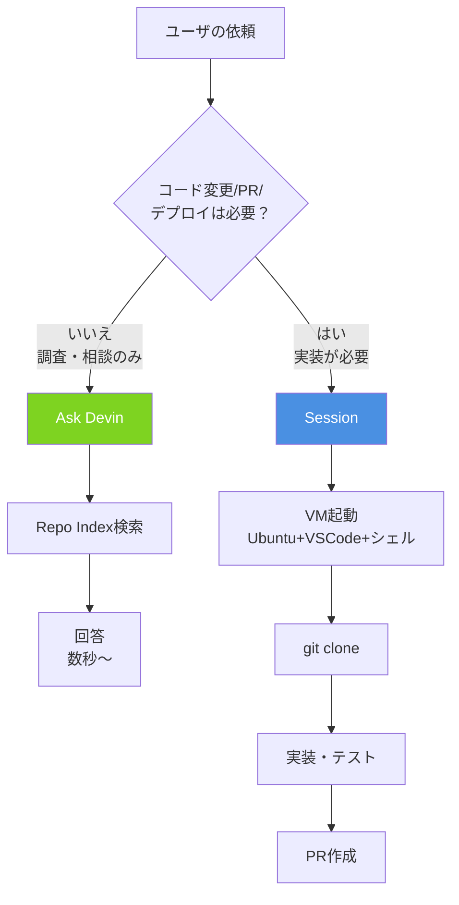

# Q8. Ask DevinとSessionの違いは？

📚 [トップ索引](../../README.md) ｜ [カテゴリ索引: 基本操作・セッション](README.md)

---

> **メタ**: 最終確認日 2026/4/16 ｜ 根拠 https://docs.devin.ai/work-with-devin/ask-devin ｜ 推定なし

### 結論: **Ask Devinは「相談・調査」の軽量モード（VM起動なし、コード変更/PR不可）**、**Sessionは「作業」モード（VM起動して実装・PR作成・デプロイまで実行）**

> ⚠️ **重要（2026/4/16施行の料金改定）**: 以前は「Ask Devinは実質無料」と案内していたが、料金改定により **Ask Devinも使用量ベースで課金対象** になった。本回答の「コスト」欄とまとめを最新化済み。詳細は [Q7](../02-pricing/q07-devin-pricing.md)を参照。

Sessionは VM（仮想マシン）を起動してシェル・ブラウザ・ファイル編集ツールを持った状態で動く。Ask Devinは **VMを起動せず**、コードベースを読むだけの軽量モード。

### Ask Devin vs Sessionのフロー分岐



### 比較表

| 観点 | **Ask Devin** | **Session** |
|---|---|---|
| 目的 | 質問・調査・設計相談・コード理解 | 実装・修正・PR作成・デプロイ |
| VM（仮想マシン） | **起動しない** | **起動する** |
| コード変更 | できない | できる |
| PR作成 | できない | できる |
| ブランチ操作 | できない | できる |
| CI実行 | できない | できる |
| 外部API/ツール呼び出し | 限定的（読み取り系のみ） | フル（インストール・実行・認証可） |
| コスト | **使用量ベースで課金**（2026/4/16改定以降）。Sessionより軽量だが有料。 | 通常どおり（使用量/ACUベース） |
| 応答速度 | 速い（数秒〜） | 遅い（分〜時間） |
| コンテキスト | リポジトリをインデックス検索して回答 | リポジトリを clone して実際に触る |
| 起動場所 | Slack / Webapp / IDE拡張 / API | Webapp / Slack / API |
| 並列実行 | いくらでも可 | ACU枠の範囲内 |

### それぞれの得意分野

**Ask Devinが向いている用途**
- 「このリポジトリの認証処理ってどこに書かれてる？」
- 「このバグの原因を先に調査したい」
- 「新機能を追加する前に設計を壁打ちしたい」
- 「PRレビュー前に変更内容を要約してほしい」
- 「技術選定の比較表を作って」
- 「Devinに投げるタスクの粒度を一緒に整理したい」
- **Sessionを開く前の準備全般**

参考: https://docs.devin.ai/work-with-devin/ask-devin

**Sessionが向いている用途**
- 「API エンドポイントを実装してPRを出して」
- 「CIが落ちてるから直して」
- 「このライブラリをアップグレードして、壊れたところを全部直して」
- 「E2E テストを書いて実行して」
- 「Vercelにデプロイして」
- **実際に変更をリポジトリに反映させる作業すべて**

### 使い分けの黄金パターン

```
Ask Devin で調査・設計
    ↓
合意できた計画を持って
    ↓
Session を開いて実装（← プロンプトが具体的になるので精度UP・ACU節約）
```

この流れに乗せると:
- Session 側で Devinが「そもそも何を作るか」を迷わなくなる
- 失敗したときのやり直しコスト（ACU）が小さい
- 巨大な PRになりにくい

### よくある勘違い

| 勘違い | 実際 |
|---|---|
| 「Ask Devinは軽量版 Sessionでしょ？」 | **別物**。Askは読み取り専用、Sessionは書き込み可 |
| 「Ask Devinで PR 作れる？」 | **作れない**。必ず Sessionを開く必要がある |
| 「質問だけなら Sessionでも良くない？」 | 良いが**Sessionの方がコストが高い**。質問だけならAsk Devinが軽量（ただしAskも2026/4〜有料化されたので完全無料ではない） |
| 「Ask Devinは会話履歴が残らない？」 | 残る（スレッド単位で保持される） |
| 「Session 中に Ask Devinは呼べる？」 | 今のセッション内でのやり取りが Ask 相当の役割を果たす |

### まとめ

- **読むだけ / 考えるだけ** → Ask Devin
- **書く / 動かす / 出す** → Session
- 迷ったら「ファイル編集・PR作成が必要か？」で判断

**核心**: **調査・相談だけなら Ask Devin（VM起動なし・軽量）、実装が絡むなら Session（VM起動・課金対象）で使い分ける**。

---

[← Q7. Devinの料金体系は？（2026/4/16の改定）](../02-pricing/q07-devin-pricing.md) ｜ [Q9. Sessionが待ち状態か判断するには？（アイコンの色で迷った） →](q09-session-status.md)
