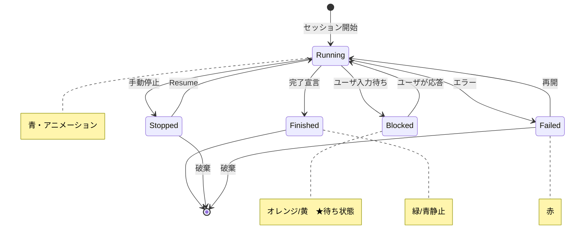

# Q9. Sessionが待ち状態か判断するには？（アイコンの色で迷った）

📚 [トップ索引](../../README.md) ｜ [カテゴリ索引: 基本操作・セッション](README.md)

---

> **メタ**: 最終確認日 2026/4/16 ｜ 根拠 https://docs.devin.ai/work-with-devin/sessions ｜ 推定なし

### 結論: **アイコンの色だけで判断せず、「ステータスラベル」と「最後のメッセージ」を見るのが確実**

「オレンジ = 待ち」は**部分的には正しい**が、Devinのステータス表示は複数の状態が色分けされていて、**「青 = 動いている/完了」の両方**に解釈しうるため、**色だけでは不十分**。

### Devinの主なセッションステータス

| ステータス | 表示の特徴 | 意味 | ユーザの行動 |
|---|---|---|---|
| **Running / Working** | **青系・アニメーション（脈打つ/スピナー）** | Devinが作業中 | 待つだけでOK |
| **Blocked** | **オレンジ/黄系・停止状態** | **ユーザ入力待ち**（質問・承認） | メッセージを返す |
| **Finished / Completed** | **緑/青系（静止）・チェックマーク** | Devinが完了宣言 | 次の指示 or 終了 |
| **Stopped / Paused** | **灰色** | 手動停止・一時停止 | Resume or破棄 |
| **Failed / Error** | **赤系** | エラーで中断 | 原因確認・再開 |

### Session ステータス遷移図



#### ⚠️ 「青」の罠
- **青でアニメーションしている** → 作業中（待つ）
- **青で静止・チェックマーク付き** → 完了（青が完了色の場合もあり）
- UIのテーマやアップデートで微妙に変わる

→ **色だけでは作業中/完了の区別が難しい場合がある**。

### ⭐ 確実な判断方法（推奨）

#### 1. **ステータスラベル（テキスト）を見る**
セッション一覧や詳細画面で、アイコン横の**テキスト**を確認:
- `Running` / `Working` / `In progress` → 作業中
- `Blocked` / `Awaiting user` → 待ち状態
- `Finished` / `Completed` / `Done` → 完了
- `Stopped` / `Paused` → 停止中

#### 2. **最後のメッセージを読む**
- Devinの最新メッセージが**質問形式で終わっている**（`?` や選択肢） → 待ち状態
- 「完了しました」「PR作成しました」などの**報告** → 完了
- 「次の作業を進めています…」系 → 作業中

#### 3. **入力欄が活性化しているか**
- 入力ボックスが**すぐ入力可能**になっていたら **人間の番**（待ち or 完了）
- 入力ボックスが薄い/ロック状態 → Devin作業中

#### 4. **通知とプッシュ**
- **Email / Slack / ブラウザ通知**をオンにしていれば、「Blocked」「Finished」で自動通知される
- 色で毎回目視確認するより、**通知に頼る**のが楽

### よくある混乱ケース

#### ケース1: 「青だったのに完了」
- **青 = Running**だと思っていたが、実は**完了のチェック色**だった
- 対策: **ステータスラベル（テキスト）**をまず見る

#### ケース2: 「オレンジだったのに待ってくれない」
- **オレンジ = Blocked** だが、古い Blocked 状態がキャッシュで残っていた
- 対策: **画面をリロード**、**最新メッセージ**を確認

#### ケース3: 「動いてるように見えて実は止まっている」
- 長時間 Runningのまま → 実はタイムアウト直前、または内部エラー
- 対策: **最後のメッセージ時刻** を見る（数十分更新なしなら要確認）

### 推奨の確認フロー

```
セッションの状態を知りたい
   ↓
1) 画面右上/リスト上の**ステータスラベル**（テキスト）を見る
   ↓
2) 最新メッセージを読む（？ で終わる or 報告か）
   ↓
3) 入力欄が使える状態か確認
   ↓
4) 不明なら「ステータス教えて」とDevinにメッセージ
```

### Session Status in Browser Tab（2026/3月導入）

最近のアップデートでブラウザのタブタイトルに**セッションステータスが表示**されるようになった:
- タブを見るだけで **Running / Blocked / Finished** が分かる
- 複数タブ開いていても、ユーザ待ちのタブがすぐ見つかる

参考: https://docs.devin.ai/release-notes/2026

### 通知設定で「待ち」を見逃さない

#### Email通知
- **Settings > Notifications > Email**
- Blocked時・Finished時に送信
- 放置事故を防ぐ最も確実な方法

#### Slack連携
- Slackに**Blocked / Finished時にメンション**
- `@you Devin is waiting for you on session XXX` の形式
- **作業中でも気付ける**

#### ブラウザ通知
- ブラウザの通知許可をON
- タブを閉じていても待ち状態になったら通知

### Blockedになるパターン（色がオレンジになる典型）

| パターン | 例 |
|---|---|
| **質問** | 「このライブラリでいいですか？」 |
| **選択肢** | 3案提示でどれにするか |
| **承認待ち** | 「このコード変更を適用してよいですか？」 |
| **Secrets要求** | 「AWS_KEYが必要です」 |
| **PRレビュー依頼** | 「PR作りました、テストどうする？」 |
| **再試行要求** | 「3回失敗しました、続けますか？」 |

→ これらは**オレンジ表示 + 入力欄活性化 + 最新メッセージが質問**の3点セットで現れる。

### まとめ

| 観点 | 結論 |
|---|---|
| 色だけで判断できるか | **不可**、特に青は複数状態を表しうる |
| 確実な判断方法 | **ステータスラベル（テキスト）** + **最新メッセージ内容** + **入力欄の活性状態** |
| 「オレンジ = 待ち」は | **部分的に正しい**が、色の認識差異があるため絶対ではない |
| 見逃し防止 | **Email / Slack / ブラウザ通知**をオンに |
| 新機能 | **タブタイトル表示**（2026/3〜）で複数タブでも把握容易 |
| 迷ったら | 「**ステータスを教えて**」とDevinに送れば答える |

**実用的な覚え方**:
1. **ステータス文字列を読む**（色ではなく文字）
2. **通知を頼りにする**（色を毎回見なくてよくなる）
3. **最新メッセージを読む**（Devinの意図が明確）

**核心**: **Session の状態判断は色だけでなく、「ステータスラベル（テキスト）」と「最新メッセージ内容」「入力欄の活性」の3点で確認する**。色はUIテーマや更新で揺れるため、Email/Slack/ブラウザ通知も併用して見逃しを防ぐ。

---

[← Q8. Ask DevinとSessionの違いは？](q08-ask-vs-session.md) ｜ [Q10. セッションの分割粒度はフェーズ単位？もっと細かく？ →](q10-session-granularity.md)
