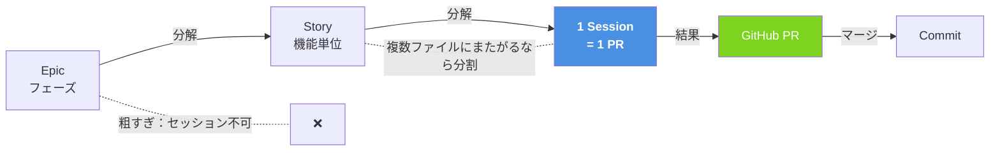

# Q10. セッションの分割粒度はフェーズ単位？もっと細かく？

📚 [トップ索引](../../README.md) ｜ [カテゴリ索引: 基本操作・セッション](README.md)

---

> **メタ**: 最終確認日 2026/4/16 ｜ 根拠 運用観察・公式ガイドベース ｜ 推定なし

### 結論: **フェーズ単位は粗すぎる**。もっと細かく、**1セッション = 1 PR = 1 マージ可能な変更** を基本とする

### 基本原則

Devinのセッションは **ACU消費・コンテキスト長・精度** の3点から、**短く切って並べる**のが最適。

### タスク粒度の階段図

| 観点 | 長いセッション | 短いセッション |
|---|---|---|
| ACU効率 | 悪い（同じコンテキストを何度も読む） | 良い |
| 精度 | 後半になるほど劣化 | 高い状態を維持 |
| レビュー | 巨大 PRになり負担大 | 小 PRでレビューしやすい |
| やり直し | 全部ロールバック | 該当セッションだけ切り直し |

### フェーズ別の推奨粒度

**フェーズ0（準備）**
- セッション不要。人間が整理する作業
- 壁打ち相手が欲しければ **Ask Devin** を使う
  - ⚠️ **2026/4/16の料金改定以降、Ask Devinも課金対象（使用量ベース）** になった。以前のように「実質無料」ではない点に注意。Sessionよりは軽量だが、コストは発生する。詳細はQ7参照。
- 参考: https://docs.devin.ai/work-with-devin/ask-devin

**フェーズ1（スキャフォールディング）**
- 2〜3セッションに分ける
  1. `/plan` で設計だけ合意（実装なし、PRなし）
  2. バックエンド雛形 + CI → 1 PR
  3. フロントエンド雛形 + バックエンドと疎通 → 1 PR
- PRが500行を超えそうなら分ける

**フェーズ2（Knowledge / Playbook 登録）**
- セッションというより運用作業
- Knowledgeは都度 Suggested Knowledgeを承認する形で溜める
- Playbookは Devin Webappの UIから作成（セッション不要）

**フェーズ3（反復開発）← ここが本番**

**1 ユーザーストーリー = 1 セッション** が基本:

| 粒度 | OK / NG | 例 |
|---|---|---|
| 画面1つ追加 | OK | 「ユーザー一覧画面を追加」 |
| API 1エンドポイント追加 | OK | `POST /api/users` を追加 |
| CRUD 一式（画面+API+DB） | 判断 | 小さければOK、大きければ分割 |
| 認証基盤の導入 | NG（分割必須） | JWT発行→ミドルウェア→画面側 の3セッション |
| 「ユーザー管理機能を作って」 | NG | 曖昧すぎる。5〜10セッションに分解 |

**1セッションあたりの具体的な目安**:
- ACU消費: **5〜20 ACU**
- 変更ファイル数: **5〜15ファイル**
- PR行数: **200〜800行**（テスト込み）
- 実時間: **30分〜2時間**

### セッションを分ける境界線

以下のいずれかに該当したら **別セッションにする**:

1. PRを別にしたい単位（レビューしやすさ）
2. 依存関係の境界（A完了後でないとBが始められない）
3. ロールバック単位（この機能だけ戻したい、がありうる）
4. コンテキストの性質が違う（バックエンド作業 vs インフラ設定など）
5. 人間のレビュー待ち時間が発生する（先に別作業を並列で進めたい）

### 逆に「分けすぎ」な例

- 1関数だけの追加 → 小さすぎて ACU 効率悪い（まとめる）
- typo 修正1箇所 → GitHubで直接修正した方が早い
- フォーマット修正のみ → Devin不要

### 並列セッションの活用（1対1でも並列可）

ユーザ1人でも、**独立したタスクは並列セッションで同時進行**できます:
- セッションA: バックエンドのAPI追加
- セッションB: フロントの別画面のスタイル修正
- セッションC: ドキュメント更新

並列数の目安はユーザの**レビュー処理能力**で決まる。実質 2〜3並列が人間側の限界なことが多い。

### まとめ

- フェーズ単位は粗すぎる → 1PR単位まで落とす
- 反復開発期は **1ストーリー = 1セッション = 1PR** が黄金比
- ACU 5〜20 / 変更 200〜800行 / 30分〜2時間 を目安に
- 分けすぎる必要はない（typo修正は手でやる）
- 並列セッションで作業スループットを上げる

**核心**: **1 Session = 1 PRが原則**。Epic や Story を Sessionに丸ごと入れず、**機能単位で分割**してから Devinに渡すのが成功の鍵。

---

[← Q9. Sessionが待ち状態か判断するには？（アイコンの色で迷った）](q09-session-status.md) ｜ [Q11. Devinでフルスクラッチ開発する場合の推奨手順は？（1人 × Devin 1対1） →](q11-fullscratch-flow.md)
