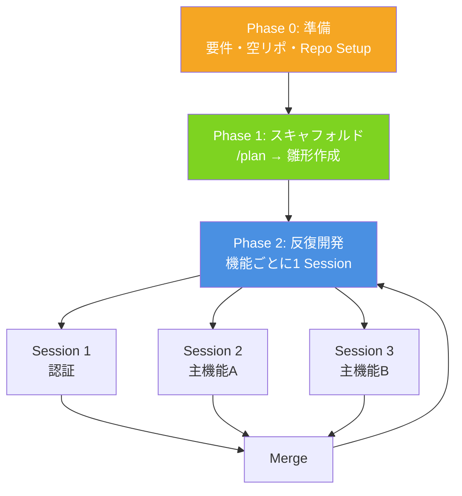

# Q11. Devinでフルスクラッチ開発する場合の推奨手順は？（1人 × Devin 1対1）

📚 [トップ索引](../../README.md) ｜ [カテゴリ索引: 基本操作・セッション](README.md)

---

> **メタ**: 最終確認日 2026/4/16 ｜ 根拠 運用観察ベース ｜ 推定あり

### 結論: **準備 → スキャフォールド → 反復開発** の3段階で進める。前提知識のない新規プロジェクトこそ、**最初に"土台"（要件定義・空リポ・Repo Setup）を作ってから反復開発に入る**のが鉄則

フルスクラッチ（新規プロジェクト）は、既存リポジトリがない分「前提となる知識」をDevinに渡しにくいので、**最初に"土台"を作ってから反復開発に入る**のがコツ。

### フルスクラッチ開発の基本フロー



### フェーズ0: 準備（セッションを開く前）

1. **要件を箇条書きで整理**
   - 作るもの（例: 「FastAPI + Reactの ToDo アプリ」）
   - 技術スタック（言語/FW/DB/デプロイ先）を明示
   - 非機能要件（認証有無、対応ブラウザ、i18nなど）
   - 完成の定義（Definition of Done）
   - 曖昧なまま投げると Devinは推測で進めるため、**技術選定は先に人間が決めておく**のが最重要

2. **空リポジトリを用意**
   - GitHub 上で空の repoを作り、README.mdだけ commit しておく
   - Devin Settings > Integrationsで GitHubを連携
   - Devin Settings > Reposで対象 repoを Onboard（Repo Setupを実行）

### フェーズ1: スキャフォールディング（最初の1セッション）

3. **`/plan` モードで設計セッションを開始**
   - いきなり実装させず、`/plan` スラッシュコマンドで Plan モードに入る
   - プロジェクト構成（ディレクトリ構造、主要モジュール、API スキーマ、DB スキーマ）を Devinに提案させる
   - ここで**人間がレビューして修正指示を出す**。数回やりとりして合意する
   - 参考: https://docs.devin.ai/work-with-devin/slash-commands

4. **最小動作する雛形（Hello World レベル）を作らせる**
   - 「フロント起動 → API 叩く → DB に1レコード入る」が通る最小構成
   - この段階で `npm run dev` / `pytest` / `docker compose up` などが動くことを確認
   - **セットアップ用スクリプト（Makefileや scripts/setup.sh）を Devinに作らせる**のがポイント
   - この PRがマージされたら、Repo Setupを再実行して「この repoのセットアップ手順」を Devinに覚えさせる

### フェーズ2: Knowledgeと Playbookの登録（超重要）

5. **Knowledgeを整備**
   - アーキテクチャ概要、命名規則、ブランチ戦略、使って良い/悪いライブラリ、テストの書き方など
   - Devinが提案する Knowledge（Suggested Knowledge）を承認するだけでも十分
   - 参考: https://docs.devin.ai/onboard-devin/knowledge-onboarding

6. **Playbookを作る**
   - 繰り返し使うワークフローをテンプレ化（例: 「新しい API エンドポイントを追加する」「画面を1つ追加する」）
   - フルスクラッチ期は**機能追加パターンが毎回似る**ので、Playbook 化の効果が大きい
   - 参考: https://docs.devin.ai/product-guides/using-playbooks

### フェーズ3: 反復開発（1機能 = 1セッション）

7. **1 セッション = 1 PR = 1 機能** を守る
   - セッションを長引かせると ACU 消費が増え、Devinの精度も落ちる
   - 目安: 1セッションあたり **2〜4時間 / 10〜30 ACU** で収まる粒度に分割
   - 複数機能を並列で進めたい場合は、**別セッションを同時に開く**（1対1といっても並列は可）

8. **良いプロンプトの型**
   ```
   【目的】何を達成したいか
   【前提】参照すべきファイル/仕様（file パスを明示）
   【要件】やること（箇条書き）
   【やらないこと】スコープ外
   【受け入れ基準】動作確認方法、テストの通し方
   ```
   - 参考: https://docs.devin.ai/essential-guidelines/instructing-devin-effectively

9. **PR レビューはこまめに**
   - Devinは PRを出してから CIを待つ。**レビューコメントは GitHub 上に書く**と Devinがそのまま拾って直してくれる
   - 大きな方針変更が必要なら、一度セッションを閉じて新しいセッションで作り直す方が早い

### フェーズ4: 品質と運用

10. **テストと CIを早期に入れる**
    - フェーズ1の雛形の時点で最低限の CI（lint + 1個のテスト）を通しておく
    - Devinは CIが通るまで直すので、**CIがあるほど品質が自動で担保される**

11. **定期的に Knowledgeを見直す**
    - 同じミスを繰り返す → Knowledgeが不足しているサイン
    - Devinに「今回の学びを Knowledgeに追加して」と頼むと Suggested Knowledgeを出してくれる

### よくある失敗パターンと回避策

| 失敗 | 回避策 |
|---|---|
| 最初から「全部作って」と丸投げ | フェーズ1で雛形だけに絞る |
| 技術選定を Devin 任せ | 人間が事前に決める |
| 1セッションで複数機能を詰め込む | 1セッション=1PR=1機能 |
| Knowledge / Playbookを作らない | フェーズ2を必ず通す |
| CI なしで進める | 雛形時点で CIを入れる |

### まとめ

| 観点 | 回答 |
|---|---|
| 推奨手順 | フェーズ0（環境整備）→ 1（雛形）→ 2（リソース整備）→ 3（機能開発反復）→ 4（テスト/CI強化）→ 5（リリース） |
| 1セッションの粒度 | **1機能 = 1 PR**、複数機能を詰め込まない |
| 最重要成果物 | AGENTS.md / Knowledge / Playbook / Repo Setup |
| 人間の責務 | 要件定義、技術選定、最終レビュー、PR マージ判断 |

**核心**: **フルスクラッチは「雛形を1回で大きく作る」のではなく、「最小雛形→リソース整備→機能ごとに反復」でDevinと歩調を合わせるのが成功の鍵**。

---

[← Q10. セッションの分割粒度はフェーズ単位？もっと細かく？](q10-session-granularity.md) ｜ [Q12. DevinはGitHub等のSCM前提か？1対1ならVMストレージだけで十分？ →](../04-github-scm/q12-scm-prerequisite.md)
