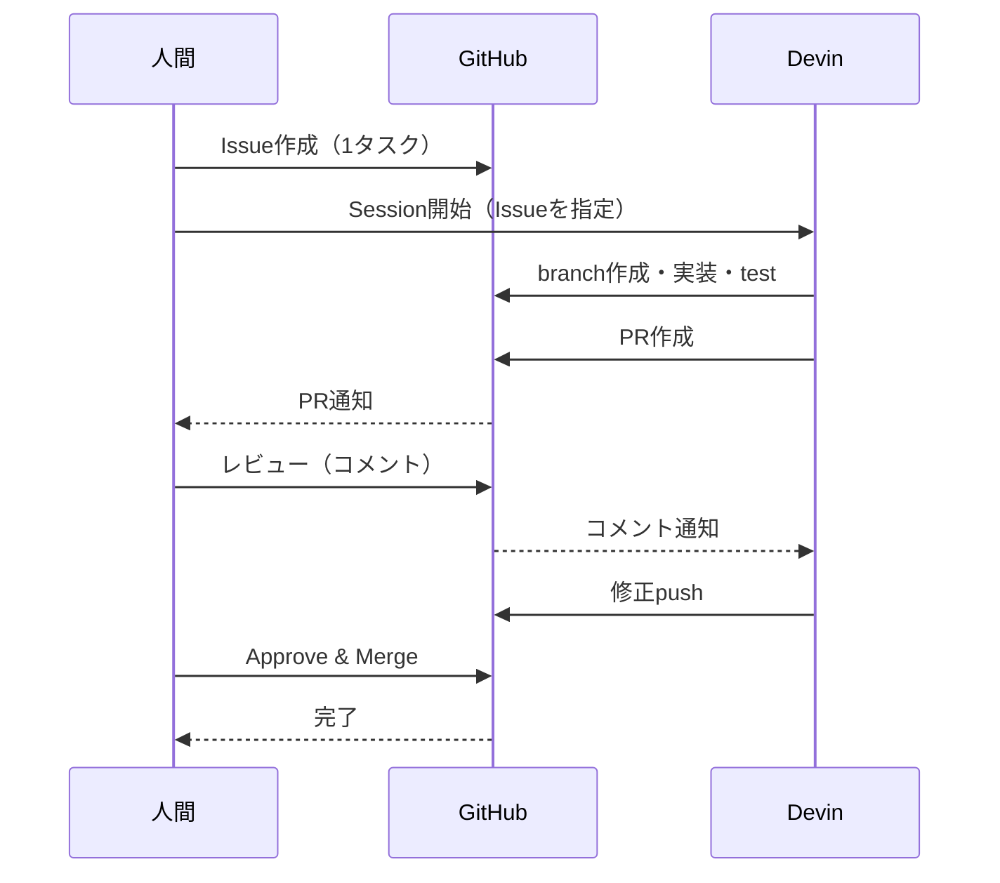

# Q14. 開発者とDevinはGitHubをどう使い分ける？（フルスクラッチの一般ケース）

📚 [トップ索引](../../README.md) ｜ [カテゴリ索引: GitHub・SCM連携](README.md)

---

> **メタ**: 最終確認日 2026/4/16 ｜ 根拠 https://docs.devin.ai/integrations/github ｜ 推定なし

### 結論: **Issueで作業を定義 → 人間がDevinに投げる → DevinがPR作成 → 人間がレビュー → マージ** を繰り返す。人間は「定義・レビュー・承認」、Devinは「実装・テスト・PR作成」に分担する

### 全体フロー

```
[Issue] → [人間がDevinに指示] → [Devinが実装・PR作成]
   ↓                                      ↓
   └── (#番号で自動クローズ) ←── [人間レビュー → Approve → Merge]
```

### Issueの使い方（Devinへの指示書）

**Issueに書くべき内容**:
```markdown
## 目的
何を達成したいか（ユーザー価値ベースで）

## 要件
- やること（箇条書き）
- やらないこと（スコープ外）

## 参照
- 関連ファイル: `src/api/users.ts`
- 関連ドキュメント: docs/auth.md
- 関連Issue: #10, #11

## 受け入れ基準
- [ ] API `POST /api/users` が動作する
- [ ] バリデーションエラーが適切に返る
- [ ] テストが追加されている
- [ ] ドキュメントが更新されている
```

**Issueの粒度**:
- 1 Issue = 1 PR = 1 セッション が原則
- 大きなエピックは親Issue + 子Issueで分解
- ラベルで管理: `epic`, `story`, `bug`, `devin-ready`など

**作り方のコツ**:
1. 人間が書く（最初はDevinに書かせない）
2. 曖昧表現を避ける（「いい感じに」「ちゃんと」はNG）
3. 完了条件（Definition of Done）を必ず書く
4. 関連ファイルのパスを明示

### Devinへの投げ方

- **パターンA**: Webapp / Slackで Issue URLを渡す
- **パターンB**: Ask Devinで設計を詰めてから Sessionに昇格
- **パターンC**: Slackで `@Devin issue #12 を対応して` とメンション

### PRは誰がいつ作るか

**原則: DevinがPRを作る**（人間は作らない）

| 誰 | いつ | 何を |
|---|---|---|
| Devin | セッション完了時 | PRを自動で作る |
| Devin | レビューコメントがついたとき | PRに追加コミットで対応 |
| 人間 | 緊急のhotfix等 | 直接PRを作ることも可（例外） |

**PR作成時のDevinの動き**:
1. 作業ブランチを作る（`devin/1234567890-add-users-api`など）
2. 変更をコミット → `origin` にpush
3. PRを作成（タイトル・本文・Issue参照を自動生成）
4. PR本文に**セッションURL**と**リクエスト者**が自動で付与される
5. CIの完了を待ち、失敗したら自動で修正を試みる
6. ユーザにPRリンクを報告

**PR本文の記法**:
- タイトル: 動詞始まり（`feat: add users API endpoint`）
- `Closes #12` / `Fixes #12` でIssueを自動クローズ

### レビューと修正のサイクル

| フェーズ | 担当 | 内容 |
|---|---|---|
| 1. 自動チェック | CI（GitHub Actions等） | Lint / テスト / ビルド |
| 2. 一次レビュー | 人間（Issue起票者or担当者） | ロジック・設計・UX |
| 3. （任意）二次レビュー | Devin Review または他メンバー | セキュリティ・パフォーマンス |
| 4. Approve | 人間 | 最終判断（責任は人間） |
| 5. Merge | 人間 | mainへ反映 |

**Devinにレビューを反映させる方法**:
- PRのインラインコメント → Devinが対応コミットを追加
- PR全体コメント → Devinが全体方針を直す
- レビュー修正要求 → Devinがセッションを再開して対応
- セッションを新しく開く必要なし。**既存セッションが継続して対応**

### マージ戦略

**推奨: Squash and Merge**
- Devinのコミットは細かい試行錯誤が混ざりがち
- 1 PR = 1 機能なので「1機能1コミット」に圧縮する方が綺麗
- `Closes #12` によるIssue自動クローズが機能する

**マージは人間がやる**
- 自動マージ（`auto-merge`）は使えるが、最初は手動推奨
- 慣れてきたら「CI通過 + Approve 1人」で自動マージに移行

### ブランチ戦略

**推奨: GitHub Flow（シンプル）**
```
main
 ├── devin/1234567890-add-users-api   ← Devinが作成
 ├── devin/1234567891-fix-login-bug   ← Devinが作成
 └── feature/manual-refactor          ← 人間が作成
```

- `main` を常にデプロイ可能状態に保つ
- 作業ブランチはPRマージ後すぐ削除
- Git Flowのような複雑なブランチ運用は**Devinと相性が悪い**

### GitHub側の推奨設定

**Branch Protection Rule（`main`ブランチ）**
- [x] PRを必須にする
- [x] CIのPass必須
- [x] 最低1人のApprove必須
- [x] stale reviewを自動dismiss
- [x] 管理者にも適用
- [x] Force push禁止
- [x] ブランチ削除禁止

**リポジトリ設定**
- [x] Squash mergingのみ許可
- [x] マージ後にブランチを自動削除
- [x] PRテンプレート（`.github/pull_request_template.md`）
- [x] Issueテンプレート（`.github/ISSUE_TEMPLATE/`）
- [x] CODEOWNERS（レビュー担当者の自動割当）

### 典型的な1日の流れ（1対1運用）

```
09:00  Issueを3つ起票（朝の設計タイム）
09:30  Issue #12 を Devin に投げる（セッションA）
09:35  Issue #13 を Devin に投げる（セッションB 並列）
10:00  セッションAがPR作成 → レビュー → コメント
10:30  セッションBがPR作成 → レビュー → コメント
11:00  セッションAが修正完了 → Approve → Merge
11:15  セッションBが修正完了 → Approve → Merge
11:30  Issue #14 を Devin に投げる（セッションC）
```

### Issue→Devin→PRの循環フロー



### まとめ

- **Issue = Devinへの指示書**（1 Issue = 1 PR = 1 セッション）
- **PRはDevinが作る**、人間はレビューとマージに集中
- **レビューはGitHub上のコメント**で行う（Devinが拾って対応）
- **マージは人間の責任**（Squash merge推奨）
- **ブランチ戦略はGitHub Flow**（シンプルが最強）
- **Branch Protectionで品質ガード**を自動化

**核心**: **Issue → Devin → PR → レビュー → Mergeの循環が基本形**。人間は「要件定義」「マージ判断」に集中し、実装は Devinに委ねる。

---

[← Q13. Devinを使う開発者はGitHubアカウント + Gitの知識・経験が必要？](q13-developer-git-knowledge.md) ｜ [Q15. DevinはGitHubでどこまで操作できる？Permissionsに依存する？ →](q15-github-permissions.md)
