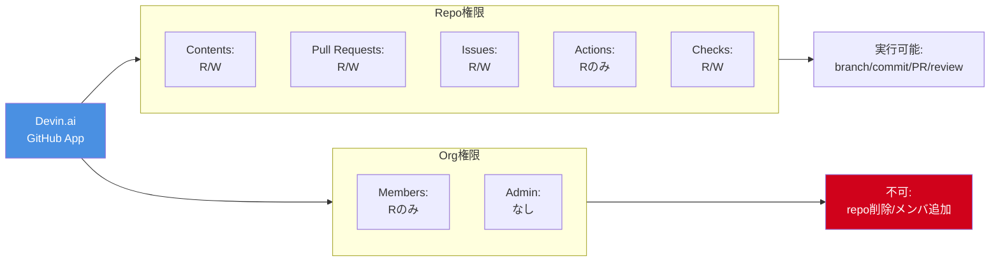

# Q15. DevinはGitHubでどこまで操作できる？Permissionsに依存する？

📚 [トップ索引](../../README.md) ｜ [カテゴリ索引: GitHub・SCM連携](README.md)

---

> **メタ**: 最終確認日 2026/4/16 ｜ 根拠 https://docs.devin.ai/integrations/github ｜ 推定なし

### 結論: **Yes、GitHub Appに付与されたPermissionsで決まる**。ただし個別PATではなく、**Devin.ai GitHub App**として組織インストール時に権限セットが決まる

### GitHub Permissionsマトリクス



参考: https://docs.devin.ai/integrations/gh

### 認証方式: GitHub App（GHESではPATも可）

- **SaaS版GitHub**: Devin.ai GitHub Appを組織にインストール
  - 組織管理者が承認・インストール
  - インストール時に**リポジトリ範囲**（全部 or 選択）を指定
  - **Devinボット名義**でcommit/PR作成（`devin-ai-integration[bot]`）
- **GitHub Enterprise Server (GHES)**: PATも使用可
  - PATのscopeがDevinの権限の上限になる
  - 参考: https://docs.devin.ai/enterprise/integrations/github-enterprise-server

### Devin.ai GitHub Appの権限一覧

**Read-only（読み取り専用）**:

| Permission | 用途 |
|---|---|
| `dependabot alerts` | Dependabotアラート解消 |
| `actions` | GitHub Actions設定・CI状況理解 |
| `deployments` | デプロイバージョン把握 |
| `metadata` | repoの基本情報 |
| `packages` | パッケージ配信状況 |
| `pages` | GitHub Pagesドキュメント参照 |
| `repository security advisories` | セキュリティアドバイザリ |
| `members` | 組織メンバー確認（read-only） |
| `webhooks` | webhook設定確認（read-only） |

**Read & Write（読み書き両方）**:

| Permission | 何ができるか |
|---|---|
| **`contents`** | コード貢献（commit, push, branch作成） |
| **`pull requests`** | PR作成・更新・コメント |
| **`issues`** | Issue作成・コメント |
| **`checks`** | CI結果の参照・報告 |
| **`commit statuses`** | コミットステータス設定 |
| **`workflows`** | GitHub Actions ワークフロー編集 |
| **`projects`** | GitHub Projects参照・管理 |
| **`discussions`** | Discussions投稿 |

### Devinができること ✅

| カテゴリ | 具体操作 |
|---|---|
| **コード** | clone, branch作成, commit, push, `--force-with-lease` |
| **PR** | 作成、本文編集、コメント、レビュー対応、マージ（設定次第） |
| **Issue** | 新規作成、コメント、クローズ、ラベル付与 |
| **CI** | Actions実行結果参照、commit status設定 |
| **Projects** | カード作成・移動、ステータス更新 |
| **Discussions** | 投稿、コメント |
| **Workflows** | `.github/workflows/*.yml` 編集 |
| **Dependabot** | アラート確認、依存更新PR作成 |

### Devinができないこと ❌（権限上の制限）

| カテゴリ | 理由 |
|---|---|
| repo削除 | `administration`権限なし |
| repo設定変更（Branch Protection等） | `administration`権限なし |
| Teams管理・メンバー追加/削除 | `members`はread-only |
| Webhookの追加/削除 | `webhooks`はread-only |
| **Secretsの読取・設定** | Actionsの `secrets` 権限なし（意図的） |
| Environmentsの変更 | 権限なし |
| 組織設定の変更 | 組織レベル管理権限なし |
| デプロイキー・SSH鍵管理 | 対応権限なし |

### 「Permissionsに依存する」の3層構造

**1. GitHub App レベル**（Cognition側で固定）
- 上記の権限セットは**固定**（部分的に減らすことは不可）
- 組織は「承認する/しない」の二択

**2. リポジトリ範囲レベル**（組織管理者が制御）
- 全repo vs 特定repoのみ
- `https://github.com/organizations/<org>/settings/installations` で変更可

**3. Devin側の権限**（Devin Webapp）
- Enterprise版: `Settings > Repository Permissions` でrepoごとに利用組織制限
- IdPグループ連携で細かい制御

### Branch Protectionは必須（安全網）

Devinは`contents: write`を持つので理論上はmainに直pushできる → **Branch Protectionで強制的にPR経由に誘導**:

```
main ブランチ:
  ✅ Require pull request before merging
  ✅ Require approvals (1人以上)
  ✅ Require status checks to pass
  ✅ Do not allow bypassing  ← 重要
  ✅ Restrict who can push
```

### Bot attribution

- commit/PRは `devin-ai-integration[bot]` 名義で記録
- GitHub Suggested Changesも同じbot名義
- 人間の作業と明確に区別 → 監査トレイル取得可

参考: https://docs.devin.ai/work-with-devin/devin-review#commit-&-comment-attribution

### GHES（PAT方式）の注意点

**推奨Classic PAT scope**: `repo`, `workflow`, `read:org`, `read:user`
**Fine-grained PAT**: Contents/PR/Issues/Checksを Read & Write、期限付き

**注意**:
- ユーザー退職でDevinが止まる → **サービスアカウント**推奨
- ユーザーの他OAuthスコープと切り離すため**専用アカウント**を作る

### 実務運用のチェックリスト

- [ ] GitHub App版（SaaS）か PAT版（GHES）かを確認
- [ ] **Select repositories**で開始（全repo許可は段階的に広げる）
- [ ] `main`にBranch Protection Rule設定
- [ ] CODEOWNERS設定（レビュー担当者の自動割当）
- [ ] DevinボットをCODEOWNERSから**除外**（自分を承認できないように）
- [ ] 最初の1週間は全PRを厳密レビュー

### アクセス範囲の設計指針

| リポジトリ種別 | Devin許可？ |
|---|---|
| 本番アプリケーションコード | ✅ 許可（PR経由で安全） |
| インフラ（Terraform等） | △ 慎重に |
| Secrets管理repo | ❌ 許可しない |
| デプロイ設定（k8s manifest等） | △ 慎重に |
| ドキュメントrepo | ✅ 許可 |
| ライブラリ/SDK | ✅ 許可 |

### まとめ

- Devinは**Devin.ai GitHub App**として認証（GHESはPATも可）
- 権限は**Cognition側で固定された権限セット**（個別調整不可）
- 権限制御の3層: **Appの権限セット** × **repo範囲** × **Devin側のユーザー権限**
- コード/PR/Issue/CI/Projects操作は**ほぼ全部可能**
- repo削除/Secrets読取/組織管理は**不可**（意図的）
- 実運用では **Branch Protection + CODEOWNERS + repo範囲限定**が必須
- GHES環境では**PATのscope**が直接Devinの権限になる

**核心**: **GitHub App/OAuth 両方式対応、repo 単位で最小権限を付与**。Org 管理者が粒度を制御する。

---

[← Q14. 開発者とDevinはGitHubをどう使い分ける？（フルスクラッチの一般ケース）](q14-developer-vs-devin-github.md) ｜ [Q16. Issue 1つ = Kanbanボードのタスク1つ？ →](q16-issue-as-task.md)
