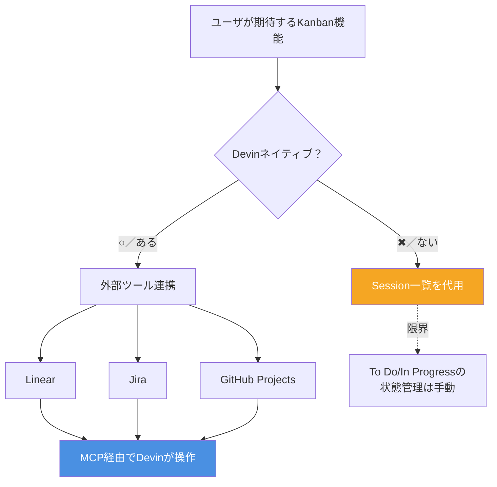

# Q17. DevinにKanban相当の機能はある？

📚 [トップ索引](../../README.md) ｜ [カテゴリ索引: GitHub・SCM連携](README.md)

---

> **メタ**: 最終確認日 2026/4/16 ｜ 根拠 https://docs.devin.ai/integrations/ ｜ 推定なし

### 結論: **Devin単体に"Kanbanボード"という専用機能はない**。ただし **「セッション一覧」が実質的なタスク管理として使える**ほか、**Kanban専用ツール（Linear / Jira / GitHub Projects等）と連携する形**で機能を補う

### Kanban機能のマッピング



### Devin本体にあるもの（Kanban的に使える機能）

**1. Sessions 一覧（Webapp）**
- 各セッションがカード風に表示される
- ステータス: `Running` / `Blocked` / `Completed` / `Archived`など
- フィルタ: リポジトリ、ブランチ、作成者、ステータスで絞り込み可能
- 1セッション = 1タスク と捉えれば、**"In Progress"レーン相当**として機能
- 参考: https://docs.devin.ai/work-with-devin/advanced-capabilities#session-management

ただし以下は**ない**:
- ドラッグ&ドロップでステータス移動
- カスタムレーン定義
- Backlog / To Do 相当の"まだ着手してない"状態
- スプリント管理
- 優先度・見積もり・担当者の管理

**2. Schedules（スケジュール機能）**
- 定期実行（cron風）でセッションを自動起動
- Kanbanというより「定期リマインダー + 自動実行」

**3. Playbooks**
- 再利用可能なワークフロー定義（タスクテンプレート的）
- Kanbanカードの雛形として使える発想はあるが、ボード機能ではない

**4. Ask Devin スレッド**
- 会話履歴一覧が一種の"相談中タスク一覧"として機能

### Devinには無いもの

- ❌ ネイティブのKanbanボードUI
- ❌ カスタムレーン / カスタムフィールド
- ❌ スプリント / イテレーション管理
- ❌ ガントチャート / バーンダウン
- ❌ タスク間の依存関係グラフ
- ❌ WIP制限

### その代わり: 強力なIntegration

Devinは **「自社でタスク管理機能を作らない代わりに、既存のKanbanツールと深く連携する」** 方針。

**公式Integration済み（ネイティブ連携）**:

| ツール | できること |
|---|---|
| **Linear** | チケット→Devinセッション自動起動、双方向同期 |
| **Jira** | 同上、エンタープライズ向け |
| **GitHub Issues/Projects** | Issue URL指定でDevinが動く |
| **Slack** | メッセージから直接セッション起動、通知受信 |

**Linear連携の具体例**:
- Linear側でチケットに `@Devin` を付ける、または特定ラベルを貼る
- Devinが自動でセッションを起動してチケットの内容を実装
- 進捗がLinearのステータスに自動反映（In Progress → In Review → Done）
- PR作成・マージ状況がLinearチケットに自動リンク

参考: https://docs.devin.ai/use-cases/examples/clear-engineering-backlogs

### 実務的な組み合わせパターン

**パターン1: GitHub Projects + Devin（シンプル）**
```
GitHub Projects (Kanbanボード)
    ↓ label:devin-ready を付与
GitHub Issue
    ↓ URLをDevinに渡す
Devin Session
    ↓ PR作成
GitHub PR
    ↓ マージ
Done
```
- 無料で始められる。小規模チーム・個人向け

**パターン2: Linear + Devin（開発特化・洗練された体験）**
- 最も連携が洗練されている
- エンジニアリング特化のチーム向け

**パターン3: Jira + Devin（エンタープライズ）**
- 大企業・規制業界向け
- 既存のJira資産を活かせる

**パターン4: Devin のSessions一覧だけで運用（最小構成）**
- 超小規模（個人開発）でタスクが5〜10個までならこれで十分
- Kanbanという形式にこだわらなければOK

### 「Devinにもっと良いタスク管理UIが欲しい」と思ったら

Cognition（Devinの開発元）の方針として、独自のプロジェクト管理ツールを作るより既存ツールとの統合を深める方向。選択肢:

1. **GitHub Projects** を使う（無料、十分な機能）
2. **Linear** に移行する（開発者体験が良い）
3. 自組織でカスタムダッシュボードを作る（Devin APIでセッション情報を取得可能）
   - `list_sessions` API → 自作のKanbanビューに表示

### まとめ

- Devin単体にKanban機能はない
- Sessions一覧 + Playbooks + 強力なIntegrationでカバー
- 実務では **GitHub Projects / Linear / Jiraと組み合わせる** のが王道
- 1対1の小規模運用なら **GitHub Issues + Projects** で十分
- 本格運用なら **Linearとの連携** が最も洗練されている

**核心**: **Devin 自身には Kanban 機能はない**。Jira / Linear / GitHub Projects 等を MCP・ネイティブ連携で扱う。

---

[← Q16. Issue 1つ = Kanbanボードのタスク1つ？](q16-issue-as-task.md) ｜ [Q18. DevinのIDEはWindsurf？VSCode？ →](../05-ide-cli/q18-windsurf-vs-vscode.md)
