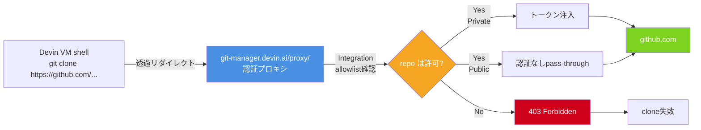
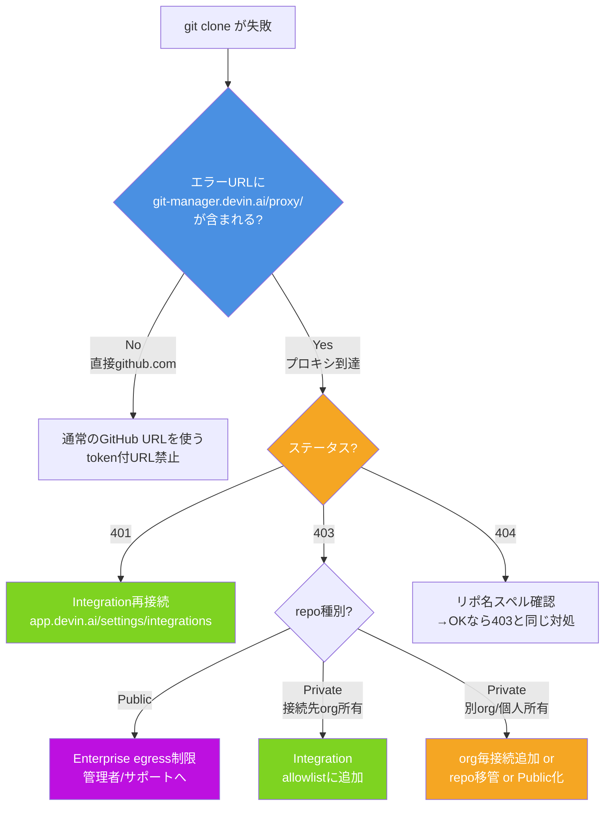

# Q64. Devinシェルで `git clone` が失敗するのはなぜ？（git-manager.devin.ai/proxy と認証プロキシ／403切り分け）

📚 [トップ索引](../../README.md) ｜ [カテゴリ索引: GitHub・SCM連携](README.md)

---

> **メタ**: 最終確認日 2026/4/17 ｜ 根拠 https://docs.devin.ai/integrations/gh / https://docs.devin.ai/onboard-devin/repo-setup / https://docs.devin.ai/admin/common-issues ｜ 推定あり

### 結論: Devinシェルの `git clone` は**全て `git-manager.devin.ai/proxy/` 経由**で走る。未登録 repo が失敗するのは**プロキシが Integration のスコープ外を拒否**するため。エラーコード（401/403/404）で原因が分かれる。**Public repo は原則通る**が、**Private repo は Integration 登録必須**、**個人アカウント所有の Private repo は Devin の接続先と一致していない限り不可**。

### 認証プロキシの仕組み



- Devin シェルの git HTTPS リクエストは全て `git-manager.devin.ai/proxy/<host>/<owner>/<repo>` に書き換えられる
- プロキシは **Integration（Settings > Integrations）で接続した SCM とその許可 repo 一覧**を参照
- Private repo には Devin の保持するトークンを注入して転送
- Public repo は認証不要のため許可リスト外でも原則 pass-through
- 許可範囲外の Private repo は 403 で拒否

**重要**: URL に `git-manager.devin.ai/proxy/` が出ている時点で **プロキシまでは到達している**。その先で拒否されているだけ。プロキシをバイパスする `https://<token>@github.com/...` 形式は**Devin環境で動作しない**ため禁止（公式 skill 明記）。

### エラーコード別切り分け

| HTTPステータス | 意味 | 典型原因 | 一次対処 |
|---|---|---|---|
| **401 Unauthorized** | 資格情報が欠落/無効 | トークン期限切れ、Integration 再接続必要 | `app.devin.ai/settings/integrations` で GitHub を再接続 |
| **403 Forbidden** | プロキシは認識したが**この repo へのアクセス拒否** | **Integration の allowlist 外** | Integration に repo 追加 |
| **404 Not Found** | 存在しないか隠す挙動（Private 未認可含む） | リポ名タイポ or Private 未認可 | スペル確認→ダメなら 403 と同じ対処 |
| **タイムアウト/接続不可** | プロキシ未経由（直接 github.com 指定など） | Devin 環境から GitHub 直接到達不可 | プロキシ経由に戻す（通常の URL を使う） |

### エラーメッセージ実例

```bash
# 403 の典型
$ git clone https://github.com/owner-a/private-sample.git
fatal: unable to access 'https://git-manager.devin.ai/proxy/github.com/owner-a/private-sample/':
  The requested URL returned error: 403
```
```bash
# 401 の典型
$ git clone https://github.com/my-org/configured-repo.git
remote: Support for password authentication was removed...
fatal: Authentication failed for 'https://git-manager.devin.ai/proxy/github.com/my-org/configured-repo/'
```
```bash
# 404 の典型
$ git clone https://github.com/my-org/typo-repo.git
remote: Repository not found.
fatal: repository 'https://git-manager.devin.ai/proxy/github.com/my-org/typo-repo.git/' not found
```

### Public/Private × Integration 接続状態マトリクス

| repo種別 | 所有者 | Integration登録 | 挙動 | 備考 |
|---|---|---|---|---|
| **Public** | 任意 | 不要 | ✅ clone 可 | プロキシがpass-through |
| **Public（接続 org）** | Devin接続先 org | 不要 | ✅ clone 可 | 同上 |
| **Private** | Devin接続先 org | **要登録** | ✅ clone 可 | `All` or `Select` で含まれていること |
| **Private** | Devin接続先 org | 未登録 | ❌ 403 | Integration に追加すれば可 |
| **Private** | 未接続 org | — | ❌ 403 | その org ごと Devin に接続追加が必要 |
| **Private** | 個人アカウント<br/>（Devin未接続） | — | ❌ 403 | Devin の接続先を個人にするか、repo を接続先 org に移管 |
| **Public**（Enterprise厳格） | 任意 | 不要 | ⚠️ 403 の可能性 | Enterprise の egress allowlist 設定次第 |

### ケース別の失敗パターンと対処

#### ケースA: 会社 org 連携中に個人 Private repo へアクセスしたい

```
[会社 GitHub org (acme-corp)]       [個人アカウント owner-a]
    │                                     │
    ├─ acme-corp/backend ✅               ├─ owner-a/private-sample ❌
    ├─ acme-corp/frontend ✅              └─ owner-a/other-private ❌
    └─ (Devin.ai GitHub App installed)
                ↑
     Devin Org (company-X) がここに接続
```

**症状**: 会社 repo は clone 可、個人 repo は 403
**原因**: Devin Integration は原則**1接続 = 1 GitHub account/org** 範囲
**対処**:
1. 個人 repo を会社 org へ移管（同じスコープ内に入る）
2. または個人用に Devin 個人プランを別途契約して接続
3. または Public 化できるなら Public に変更（内容レビュー要）

#### ケースB: 個人 Devin + 個人 Private repo

個人で Devin を使い、個人 Private repo に接続する正攻法:

1. `github.com/settings/installations` を開く
2. Devin.ai があるか確認（なければ Devin 側から接続を追加）
3. Devin.ai → **Configure**
4. **Repository access**:
   - `Only select repositories` → **Select repositories** で対象 repo（例: `owner-a/private-sample`）を追加
   - または `All repositories`（影響範囲に注意、個人 Private 全公開になる）
5. **Save**
6. Devin シェルで再 clone

#### ケースC: GitHub App 権限不足

Devin.ai App の付与権限が最小化されすぎている場合に clone 失敗。通常 Devin が要求する `Contents: Read` 以上があれば問題ないが、Custom install で外されていないか確認。

#### ケースD: GitHub org の Third-party access restriction

owner の GitHub org が Third-party applications を制限している場合、App install 後も**個別承認**が必要。対処: org の Settings → Third-party Access → Devin.ai を **Approve**。

#### ケースE: SAML/SSO 強制 org

owner org が SAML SSO を強制している場合、App install 時の SSO 認可がタイムアウトで切れた可能性。GitHub 側で再認可（`github.com/settings/installations` → Configure → Re-authorize）。

#### ケースF: Enterprise 契約で egress allowlist 厳格

Enterprise で外部 IP/host が制限されている場合、Public repo でも 403 になることがある。対処: Devin 管理者または `support@cognition.ai` へ「allowlist に対象 host 追加可否」を相談。

### 切り分けフロー



### 対処コマンドサンプル

#### Integration 追加後に clone 再試行

```bash
# 正攻法: Integration に追加後、通常のURLで
git clone https://github.com/my-org/configured-repo.git
# プロキシが自動的に git-manager.devin.ai/proxy/ 経由にリダイレクト
```

#### 診断: プロキシが通るかの切り分け

```bash
# 既知の安全な public repo で疎通確認
git clone --depth 1 https://github.com/torvalds/linux.git /tmp/proxy-test
# 成功 → プロキシは生きている、対象repo固有の問題
# 失敗 → Enterprise egress制限の可能性、管理者へ
```

#### Repo Setup（スナップショット）で事前 clone 済みにする

接続先 org 内の repo なら、`app.devin.ai/machine` で事前 clone させておくと、セッション起動時に `/home/ubuntu/repos/` 配下に既に存在する。シェルで clone する必要がなくなる。
- 公式: https://docs.devin.ai/onboard-devin/repo-setup

### アンチパターン

| アンチパターン | なぜ駄目か |
|---|---|
| `git clone https://$TOKEN@github.com/...` | **プロキシをバイパス**。Devin環境から直接 github.com に到達不可で失敗。トークンがチャット履歴に漏洩するリスクも |
| PAT を Secrets に入れて毎回 clone 時に使う | Org 規程違反の可能性、PAT管理の手間、Integration 正攻法で解決すべき |
| Private repo を突然 Public 化して回避 | 履歴含め完全公開になる。秘匿情報・secret漏洩リスク。事前レビュー必須 |
| 403 を見てすぐ「バグだ」と Cognition サポート | ほとんどが Integration 設定の問題。まず allowlist を確認 |
| repo を複数 fork して回避 | 最新同期が煩雑、所有権も曖昧。正規ルートで接続すべき |

### Tips

- **エラー URL に `git-manager.devin.ai/proxy/` が見えたら「Integration の問題」に即断**
- **401 → 再接続、403 → allowlist 追加、404 → タイポ確認 → ダメなら allowlist 追加**
- **Public repo は基本動く。動かなければ Enterprise 制限を疑う**
- **個人 Private repo は Devin の接続先と一致している必要**あり
- **セッション起動時に既に clone 済みの状態**が最速 → Repo Setup 活用
- **Org 管理者権限なし**で未登録 repo にアクセスしたい時は、管理者依頼が正道

### まとめ

| 観点 | 要点 |
|---|---|
| 仕組み | 全 git HTTPS は `git-manager.devin.ai/proxy/` 経由 |
| 403 の意味 | Integration allowlist 外 |
| Public repo | 原則 clone 可（Enterprise厳格設定時は例外） |
| Private repo | **Integration 登録必須** |
| 個人 Private | Devin の接続先が個人アカウントである必要 |
| 正攻法 | `app.devin.ai/settings/integrations` で repo 追加 |
| 禁止 | `https://<token>@github.com/...` 直接指定（プロキシバイパス） |

**核心**: Devin シェルの git HTTPS は **`git-manager.devin.ai/proxy/` 経由の認証プロキシ**が必須。**403 は Integration allowlist 外**を意味し、**401 は再接続、404 はタイポ/未認可**。Public repo は原則通り、Private repo は**Integration への明示登録**が必要で、**個人 Private は Devin の接続先と一致**していないと届かない。**`<token>@github.com` 形式のバイパスは動作しない**ため、解決は常に **Integration 設定の正規化**。

---

[← Q63. セッション操作履歴からユーザ＆Devinの開発生産性を計測できる？（応答時間・思考時間の取得）](../15-organization-ops/q63-productivity-metrics.md) ｜ [Q65. 「Devin went to sleep due to session usage settings」と表示されて止まるのはなぜ？対処方法は？ →](../16-session-recovery/q65-session-sleep.md)
