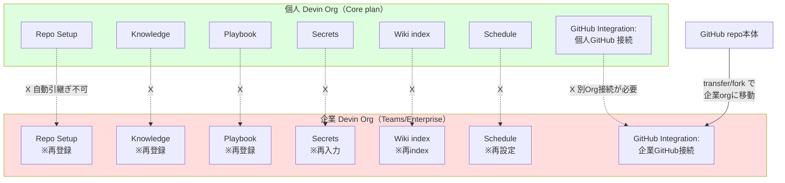

# Q67. 個人プランで登録した GitHub リポジトリや Knowledge / Playbook / Secrets は、企業プランからも使える？

📚 [トップ索引](../../README.md) ｜ [カテゴリ索引: GitHub・SCM連携](README.md)

---

> **メタ**: 最終確認日 2026/4/17 ｜ 根拠 https://docs.devin.ai/product-guides/invite-team / https://docs.devin.ai/enterprise/security-access/custom-roles / https://docs.devin.ai/admin/integrations / https://docs.devin.ai/product-guides/secrets ｜ 推定あり

### 結論: **使えません**。Devin の各種リソースは **Devin Org 単位** で管理されており、個人プランの Devin Org と企業プランの Devin Org は**完全に独立**。Repo Setup・Knowledge・Playbook・Secrets・Wiki・Schedule のすべてが **Org スコープに閉じている**ため、個人で登録したものは企業プランから見えません。**GitHub repo そのもの**は、企業 GitHub org への transfer/fork で企業プラン側に持ち込めますが、**Devin 内のリソースは再登録が必要**です。

### Devin Org スコープのリソース一覧（引継ぎ可否）

| リソース | 個人 Devin Org からの引継ぎ | 移行方法 | 工数 |
|---|---|---|---|
| **GitHub Integration / Repo allowlist** | ❌ 不可（Org単位で別接続） | 企業 Devin Org で再接続 | 数分 |
| **Repo Setup（Machine Configuration）** | ❌ 不可 | スクリプトをコピーして再登録 | 数分 |
| **Knowledge** | ❌ 不可 | 内容を export → 企業 Org に再登録 | 件数次第 |
| **Playbook** | ❌ 不可 | YAML/Markdown を export → 再登録 | 件数次第 |
| **Secrets（Org/Personal両スコープ）** | ❌ 不可 | **値を再入力**（API経由でも export 不可） | 件数次第 |
| **Devin Wiki（学習済みリポ知識）** | ❌ 不可 | 企業 Org 側で再 index | 数時間（自動） |
| **Schedule** | ❌ 不可 | 設定を再作成 | 数分 |
| **Skills** | ❌ 不可 | repo 内の `.devin/skills/` で管理可なら自動引継ぎ | repo 移管のみ |
| **過去のセッション履歴・成果物** | ❌ 不可 | 個人 Org に残存（参照のみ） | — |
| **GitHub repo 本体** | △ 条件付き可 | GitHub 側で transfer/fork（後述） | 数分〜数時間 |

→ **すべての Devin リソースが Org に閉じている**。「個人プランで先行検証 → 企業展開」する場合、**Devin 内のリソースは原則すべて再構築**が必要。

### 公式ドキュメントの根拠

#### ① Integration は Devin Org 単位
[Integrations docs](https://docs.devin.ai/admin/integrations) より:
- "Connect your team's GitHub, Slack, Linear, Jira... at the **organization level**"
- 接続権限は Org Admin が管理
- **個人 Devin Org と企業 Devin Org は別 Organization** として扱われる

#### ② Secrets の Org / Personal スコープも「同一 Org 内」が前提
[Secrets docs](https://docs.devin.ai/product-guides/secrets) より:
- **Org-scoped secrets**: 同一 Devin Org のメンバ全員が利用可
- **Personal secrets**: 自分のみ利用可
- どちらも **「Devin Org をまたいだ共有」は設計外**

#### ③ Teams プランの招待・ロール
[Invite your Team](https://docs.devin.ai/product-guides/invite-team) より:
- ユーザは **複数の Devin Org に所属可能**
- ただし **Org をまたいだリソース共有はサポートされない**

#### ④ Enterprise の Account / Org 階層
[Custom Roles](https://docs.devin.ai/enterprise/security-access/custom-roles) より:
- Enterprise は **Account（複数 Org の親）→ Org（個別組織）** の2階層
- **Account 配下の複数 Org 間でも、リソースは Org 単位に閉じる**のが基本（Account-level Custom Roles で例外的に横断可視化は可能だが、リソースの実体は Org 内にある）

### GitHub repo を企業プラン側に持ち込む3つのアプローチ

#### ① repo を企業 GitHub org に transfer（推奨・正攻法）

```
github.com/owner-a/private-sample
        ↓ Settings → Danger Zone → Transfer ownership
github.com/acme-corp/private-sample
```

**メリット**:
- コミット履歴・Issue・PR がすべて移行
- 旧URLからのリダイレクトが GitHub 側で自動設定
- 企業 GitHub org 配下なので企業 Devin Org の Integration から可視に

**注意**:
- 個人所有権を完全に手放す → 退職等で repo にアクセスできなくなる
- 企業 GitHub org の管理者の **承認・受け入れ設定**が必要
- ライセンス・知的財産権の整理（業務時間外で個人として作ったコードなど）

#### ② Fork / Mirror して企業 org に複製

```bash
# bare clone → push --mirror（履歴含む完全複製）
git clone --bare https://github.com/owner-a/private-sample.git
cd private-sample.git
git push --mirror https://github.com/acme-corp/private-sample.git
```

**メリット**: 個人 repo は残しつつ企業側にも置ける
**注意**: 双方向同期は煩雑（変更が分岐すると merge 地獄）。原則「個人側は freeze、企業側を本流」運用が現実的

#### ③ 企業 Devin Org に個人 GitHub アカウントを別接続（非推奨）

理論上、企業 Devin Org の `Settings → Integrations → GitHub` で個人 GitHub アカウントを **追加接続**できる場合がある。しかし:
- **Enterprise の SAML/SSO 強制 org**では外部 GitHub アカウント連携が禁止されているケース多数
- **企業契約の業務利用ポリシー違反**になる可能性大（個人資産を企業契約で扱う形）
- 多くの企業契約は **「企業 Devin Org ↔ 企業 GitHub org」1対1接続のみ**を前提に設計
- **Devin Org Admin の承認**が必要で、組織のセキュリティ・コンプライアンス担当に却下されやすい

→ **実質的に推奨されないルート**。

### 移行コスト早見表（Devin リソース）

| リソース | 移行手順 | 推定工数（10件想定） |
|---|---|---|
| **Repo Setup** | 個人 Org の Machine Config 画面からスクリプトをコピペ → 企業 Org に貼り付け | 30分〜1時間 |
| **Knowledge** | `app.devin.ai/settings/knowledge` から1件ずつコピペ（export機能なし） | 1〜2時間 |
| **Playbook** | Playbook YAML をコピペ → 企業 Org で `app.devin.ai/playbooks` から作成 | 1〜2時間 |
| **Secrets** | **値を再入力**（export不可、メモから再投入） | 30分〜1時間（パスワード管理ツールから取り出す前提） |
| **Schedule** | Schedule 設定をコピペ | 30分 |
| **Devin Wiki** | 企業 Org で対象 repo を Wiki 登録 → 自動 index 待ち | 数分の操作 + 数時間の待ち |

→ **個人プランで「ある程度検証してから企業展開」を計画する場合、移行コストを最初から見込んでおく**のが安全。



### 個人と企業を併用する場合の運用パターン

| パターン | 用途 | 注意点 |
|---|---|---|
| **個人 = 私的学習・OSS貢献 / 企業 = 業務** | 完全分離 | 両 Org 間でコード・Knowledge を持ち込まない |
| **個人で先行検証 → 企業に移行** | 新技術/新ツールの個人検証後、社内展開 | 移行コストを見込む（前述の表） |
| **個人 = 機微情報を扱わないバックアップ用** | Q66 のプライバシー対策 | 業務情報を入れないルールを徹底 |
| **個人プランは解約、企業に集約** | 二重契約コスト削減 | 過去セッション参照は個人 Org に残るのみ |

### よくある誤解

| ❌ 誤解 | ✅ 実態 |
|---|---|
| 「同じ GitHub アカウントなら個人 Devin と企業 Devin で repo を共有できる」 | Devin Org が違えば Integration は別接続。GitHub 側のアカウントが同じでも自動共有はされない |
| 「Knowledge は GitHub 上に保存されているので Org をまたいでも見える」 | Knowledge は Devin の DB に保存される（Devin Org スコープ）。GitHub には保存されない |
| 「Personal Secrets は個人プランから企業プランに引き継がれる」 | Personal Secrets は **同一 Devin Org 内の個人スコープ**。Org が違えば別物 |
| 「Devin Wiki の index 結果は再利用される」 | Wiki index は Devin Org 単位。企業 Org では再 index が必要 |
| 「個人プランの Playbook を YAML で export して企業 Org にimport できる」 | UI からの直接 export/import 機能は限定的。**コピペで移行**が現実的 |

### 関連 FAQ

- **Q15**: GitHub Permissions と Integration の関係
- **Q26〜Q30**: Repo Setup / Knowledge / Playbook / Wiki / Schedule の各役割
- **Q31**: Secrets の Org/Personal スコープ
- **Q64**: git clone 失敗の切り分け（Integration allowlist の影響）
- **Q66**: Devin Org 内のセッション可視性

### Tips

- **個人で先行検証する場合は「捨てる前提」**: 重要な成果物（コード）は GitHub に push して残し、Devin 内のリソースは「再構築する想定」で進める
- **Knowledge / Playbook の社内展開を見越すなら、最初から Markdown / YAML で外部管理**: Devin UI に直接書くのではなく、repo 内の `.devin/` 配下に置けば移植しやすい
- **Skills は repo 内 `.devin/skills/` 管理が基本**: repo を transfer すれば Skills もついてくる（Devin Org 設定ではなく repo 設定）
- **企業 Devin Org に SSO 強制**がある場合、個人 GitHub の連携は最初から諦める
- **過去のセッション URL** は個人 Org の URL のまま参照可能（個人プランを解約しなければ）

### アンチパターン

| NG | 理由 | 正しい対応 |
|---|---|---|
| 個人プランで開発した repo を企業プランで触ろうとして「なぜか403」と悩む | Integration が Org スコープ | 企業 Devin Org に repo 接続を追加するか、repo を企業 GitHub org に transfer |
| Knowledge を企業 Org に大量手作業コピー後、最新化を放置 | 二重管理は腐る | repo 内 `.devin/knowledge/` に集約して repo の transfer で済ませる |
| 個人 GitHub アカウントを企業 Devin Org に追加接続して業務利用 | 業務利用ポリシー違反・SAML/SSO 違反 | 企業 GitHub org に repo を移管 |
| 個人プランで先行検証 → そのまま本番運用に流用 | Org 違いでリソース可視性が破綻 | 検証段階で「移行コスト」を見込み、本番は企業 Org で再構築 |
| 「同じ Cognition のサービスだから引き継がれるはず」と思い込む | Org スコープが基本設計 | Devin Org 単位で完結する前提で運用 |

### まとめ

- **Devin の各種リソースは Org スコープ。個人 Devin Org → 企業 Devin Org への自動引継ぎはない**
- **GitHub repo 本体**は transfer/fork で企業側に持ち込み可能（GitHub の機能）
- **Repo Setup / Knowledge / Playbook / Secrets / Wiki / Schedule** はすべて**再登録**が必要
- **個人で先行検証する場合は移行コストを最初から見込む**
- **企業展開の最短ルート**: 最初から企業 Devin Org のサンドボックス repo で検証する

**核心**: Devin は **「同じユーザでも所属する Devin Org が違えば全リソースが分離」** が原則設計。「個人プランで作ったものを企業プランで使いたい」は **GitHub repo 本体は移管可、Devin 内のリソースは再構築必須**。**「移行コスト」を理解した上で個人プラン併用するか、最初から企業 Org で構築するかの判断が必要**。最も安全な運用は、**個人 = 私的・企業 = 業務の完全分離**であり、両者間で資産を持ち込まないルール徹底。

---

[← Q66. Teamsプランで Usage History に他メンバのセッションが見える。自分の作業は丸見え？アーカイブで隠せる？](../12-security-governance/q66-session-visibility-teams.md) ｜ [Q68. Devin Wiki に未登録のリポジトリを Devin セッションの VM 上に `git clone` して開発に使える？ →](q68-clone-without-wiki.md)
