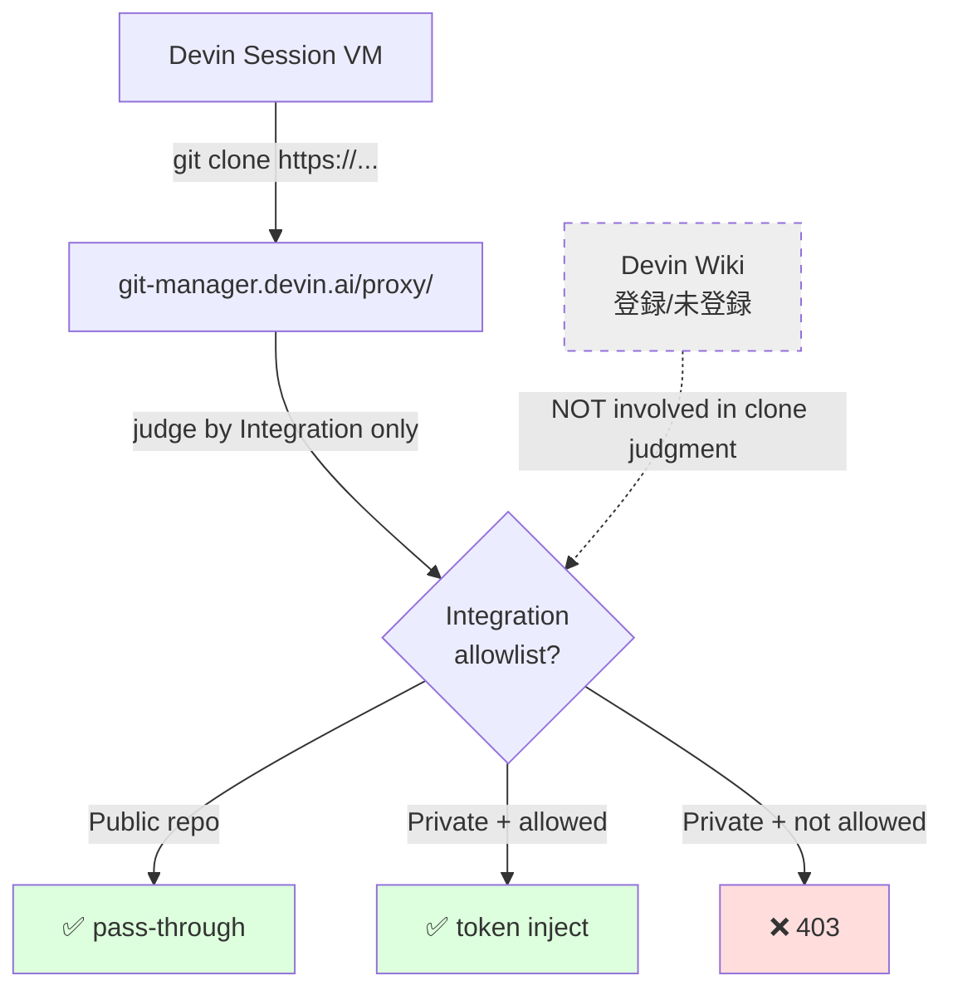

# Q68. Devin Wiki に未登録のリポジトリを Devin セッションの VM 上に `git clone` して開発に使える？

📚 [トップ索引](../../README.md) ｜ [カテゴリ索引: GitHub・SCM連携](README.md)

---

> **メタ**: 最終確認日 2026/4/17 ｜ 根拠 https://docs.devin.ai/product-guides/devin-wiki / https://docs.devin.ai/admin/integrations / https://docs.devin.ai/api-reference/v1/sessions/create-a-new-devin-session ｜ 推定あり

### 結論: **使えます**。Wiki への登録は **Ask Devin / 横断検索の対象にする** ためのオプションであり、**セッション内で `git clone` してコードを編集・ビルド・テスト・PR作成する**ためには **Wiki 登録は不要**。clone 可否は **Wiki ではなく Integration（GitHub接続/Repo allowlist）** で決まる。Public repo は Integration 登録なしでも clone 可、Private repo は Integration 登録が必要（Q64 と同じ判定基準）。

### Wiki と Integration の役割分離

**Devin で repo を扱う2つの仕組み**は、目的が異なります。

| 機能 | 仕組み | 目的 | 登録場所 |
|---|---|---|---|
| **Devin Wiki** | リポを事前 index → ベクトルDB化 | **Ask Devin / 横断検索 / 自然言語Q&A** | `app.devin.ai/wiki` |
| **GitHub Integration** | プロキシ経由のトークン注入 | **VM での clone / push / PR作成** | `app.devin.ai/settings/integrations` |

→ **完全に独立した機能**。Wiki に未登録でも Integration が許可していれば clone は通る。逆に Wiki に登録していても Integration がなければ clone は失敗する（ただし通常、Wiki登録時に Integration 経由でアクセスするため、通常は両方揃う）。

### Wiki 登録の有無による違い

| 観点 | Wiki **未登録** clone | Wiki **登録済み** clone |
|---|---|---|
| Devin VM 上での `git clone` | ✅ できる（Integration許可があれば） | ✅ できる |
| ファイル編集・ビルド・テスト | ✅ 通常通り | ✅ 通常通り |
| `git commit` / `git push` / PR作成 | ✅ 通常通り | ✅ 通常通り |
| **Ask Devin で自然言語質問**（"あのrepoの〜") | ❌ できない（リポ知識なし） | ✅ できる（RAG が効く） |
| **横断的なコード検索** | ❌ grep / find / `cat` を明示指示 | ✅ Ask Devin で意味検索 |
| **Wiki UI でドキュメント化された閲覧** | ❌ 見られない | ✅ ブラウザで構造化閲覧 |
| **session間の知識共有** | ❌ 毎回 clone から | ✅ Wiki 経由で常に最新 |
| 初回コスト | 0（cloneのみ） | index に時間（自動、数十分〜数時間） |
| 継続コスト | 0 | 定期的な再 index（自動） |

→ **Wiki = "事前 index で Ask Devin から検索可能にする" オプション**。**clone と編集に Wiki は不要**。

### clone 可否は Integration で決まる（Q64 のおさらい）

| repo 種別 | Wiki登録 | Integration登録 | clone 可否 |
|---|---|---|---|
| **Public（任意のowner）** | 不要 | 不要 | ✅ 可（proxyがpass-through） |
| **Private（接続済 org の repo, allowlist内）** | 不要 | 要 | ✅ 可（proxyがtoken注入） |
| **Private（接続済 org の repo, allowlist外）** | 不要 | **要追加** | ❌ 403 |
| **Private（未接続 org / 個人アカウント）** | 不要 | 接続自体が必要 | ❌ 403 |

→ **Wiki 登録は clone 可否に影響しない**。詳細は Q64 参照。



### 具体例

#### ① Public repo を一時的に clone して参照（Wiki不要、最も簡単）

```bash
# OSS の依存ライブラリのソースを読みたい
git clone https://github.com/torvalds/linux.git /tmp/linux --depth 1
grep -rn "scheduler" /tmp/linux/kernel/sched/ | head
# Wiki登録なしでも問題なく動く
```

#### ② Private repo を clone して開発（Integration必要、Wiki不要）

```bash
# 前提: my-org/configured-repo は企業 Devin Org の Integration に登録済
cd /home/ubuntu/repos
git clone https://github.com/my-org/configured-repo.git
cd configured-repo
git checkout -b devin/$(date +%s)-feature
# 編集・テスト
npm test
# commit & push & PR作成も通常通り
git push origin HEAD
```

#### ③ 別 repo の依存をビルドのために clone（参照用ライブラリ）

```bash
# メインプロジェクトの隣に参照用ライブラリを置く
cd /home/ubuntu/repos/main-project
git clone https://github.com/acme-corp/shared-lib.git ../shared-lib
# pyproject.toml に path 依存を一時的に書いて検証など
```

#### ④ 大規模モノレポの一部だけ取得（sparse checkout）

```bash
# Wiki登録すると全体index で時間がかかるが、一部だけなら sparse でOK
mkdir my-monorepo && cd my-monorepo
git init
git remote add origin https://github.com/acme-corp/big-monorepo.git
git config core.sparseCheckout true
echo "services/auth/" > .git/info/sparse-checkout
git pull --depth 1 origin main
```

### ユースケース別の使い分け

| やりたいこと | Wiki登録 | 理由 |
|---|---|---|
| OSS のソースを読みながら開発 | 不要 | `git clone --depth 1` で十分 |
| 自社メインリポでの本番開発 | 推奨 | 複数セッションで Ask Devin が効率化 |
| 一時的な fork 検証 | 不要 | 使い捨ての clone でOK |
| 監査・コードレビュー | 推奨 | Ask Devin で意味検索が効率的 |
| 依存ライブラリのバグ調査 | 不要 | clone して grep / cat |
| 大規模モノレポの一部だけ触る | sparse + 部分Wiki | 全体index は重いので部分のみ |
| **GitLab / Bitbucket repo** | 不可 | Wiki は GitHub 中心。Integration あれば clone は可 |
| 機微情報を含む短期検証 | 不可 | Wiki に index されるとUI閲覧で見える可能性。clone のみで一時利用 |

### Wiki 未登録 clone の利点

| 利点 | 詳細 |
|---|---|
| **準備コストゼロ** | Wiki index 完了を待たずに即作業開始 |
| **session ごとに使い捨て可能** | clone → 作業 → terminate でVM ごと消える |
| **GitLab/Bitbucket 等 Wiki 非対応 SCM でも使える** | Integration があれば clone は通る |
| **機微情報を扱う短期作業に向く** | Wiki に永続index されない（VM内のみ、session終了で消える） |
| **大量のサンプルrepoを試すのに最適** | 個別にWiki登録すると重い |

### Wiki 未登録 clone の制約

| 制約 | 回避策 |
|---|---|
| **Ask Devin が「あのrepoの〜」と類推してくれない** | セッション内で `cd /home/ubuntu/repos/<repo> && grep -rn '...'` のように**明示的に指示** |
| **横断的な意味検索ができない** | `find` / `grep` / `rg` を駆使 |
| **session 終了後は知識が残らない** | 重要な知見は **commit + Knowledge登録** で永続化 |
| **VM の disk 容量を圧迫**（大規模repo） | `--depth 1` / sparse checkout / 不要なら作業後 `rm -rf` |
| **Devin が初回 clone 時にコンテキストを必要とする** | 1〜2 ACU 程度は readme/structure 把握に消費 |

### 注意点

#### 1. Private repo は Integration が必須

Wiki に未登録でも、**Integration の Repo allowlist には入れる必要がある**（Q64 参照）。403 になる場合は Integration を確認。

#### 2. clone 先の filesystem 配置

| 配置先 | 永続性 | 用途 |
|---|---|---|
| `/home/ubuntu/repos/<repo>/` | system restart で保全（Q65参照） | 通常の開発作業 |
| `/tmp/<repo>/` | restart で消える可能性 | 短期検証・使い捨て |
| `/home/ubuntu/<repo>/` | 保全 | repos 配下推奨だが任意配置可 |

#### 3. サブモジュールがあるrepo

```bash
# Submodule がある場合は --recurse-submodules
git clone --recurse-submodules https://github.com/acme-corp/main-with-subs.git
```

各サブモジュールも **Integration allowlist** の対象。サブモジュールが Private なら個別に登録が必要。

#### 4. LFS で管理されたファイル

```bash
# git-lfs が必要
git lfs install
git clone https://github.com/acme-corp/lfs-repo.git
# LFS サーバへの認証は GitHub credentials に紐づくので Integration があれば OK
```

#### 5. Wiki 登録 ≠ 自動 clone

Wiki に登録しても、**セッション開始時に自動 clone されるわけではない**（session 開始時に clone するのは Repo Setup の対象 repo のみ）。Wiki 登録 repo を VM で触りたい場合は**改めて `git clone` する必要がある**。

### よくある誤解

| ❌ 誤解 | ✅ 実態 |
|---|---|
| 「Wiki に登録しないと clone できない」 | Wiki 登録は clone 可否に無関係。Integration が判断主体 |
| 「Wiki 登録した repo はセッション開始時に自動 clone される」 | 自動 clone は Repo Setup 対象のみ。Wiki 登録 repo は手動 clone |
| 「Wiki 未登録なら何も Devin 機能が使えない」 | clone・編集・PR・Skills・Secrets はすべて使える。**Ask Devin の RAG だけ**が制限される |
| 「公開された OSS は全部 Wiki 登録すべき」 | 必要に応じて。一時的参照なら clone のみで十分 |
| 「Private repo を clone するなら Wiki 必須」 | 不要。Integration があれば clone は通る |

### Tips

- **「Wiki 登録の判断軸」は "Ask Devin で何度も意味検索したいか"**: YES → 登録、NO → cloneのみ
- **OSS の参照は `--depth 1` でVM容量を節約**
- **使い捨ての clone は `/tmp` に置く**（system restart で消えてもOKなら）
- **`/home/ubuntu/repos/` 配下に複数 repo を置くのが慣例**（Devin 自身もここを repos directory として認識）
- **Wiki 登録は後付け可能**: cloneで作業した後に「これは横断検索で使いたい」と思ったら Wiki に追加すればよい
- **GitLab/Bitbucket repo の作業も全く問題なし**（Wiki 非対応だが Integration が対応していれば clone 可）

### アンチパターン

| NG | 理由 | 正しい対応 |
|---|---|---|
| Wiki に登録しないと使えないと誤解して全部登録 | Wiki index は重い、不要な repo を登録するとノイズ | 必要なものだけ登録 |
| Wiki 登録だけで clone 不要と誤解 | Wiki 登録はあくまで index、VM 上で触るには clone が要る | 作業前に clone する |
| 「Wiki 未登録 = 制限がある」と思い込む | clone・編集・PR は完全に使える | 制約は Ask Devin の RAG のみ |
| Public OSS を頻繁に Wiki 登録 → ノイズ増 | Ask Devin の検索精度が落ちる | 自社中核 repo のみ Wiki 登録 |
| 機微情報を含む repo を試しに Wiki 登録 | Wiki UI で他メンバから閲覧されうる（Q66参照） | clone のみで一時利用 |

### 関連 FAQ

- **Q26**: Repo Setup（Machine Configuration）と clone の関係
- **Q29**: Devin Wiki の詳細
- **Q64**: git clone 失敗の切り分け（Integration allowlist）
- **Q66**: Wiki 登録 repo のセッション可視性

### まとめ

| 項目 | 結論 |
|---|---|
| Wiki 未登録 repo を VM 上に clone | **可能** |
| Wiki 未登録 repo の編集・ビルド・テスト | **可能** |
| Wiki 未登録 repo の commit・push・PR作成 | **可能** |
| Wiki 未登録 repo を Ask Devin で意味検索 | **不可**（grep等で代替） |
| clone 可否を決める要因 | **Integration（Repo allowlist）のみ** |
| Wiki 登録の判断軸 | 「Ask Devin で何度も意味検索したいか」 |

**核心**: **Wiki ≠ clone可否**。Wiki は **Ask Devin で自然言語検索を可能にするオプション機能**であって、**VM上で `git clone` してコードを触ること**とは独立。**clone は Integration（Repo allowlist）が判定主体**であり、Public は不問・Private は要登録（Q64参照）。**Wiki 未登録 repo でも clone・編集・commit・push・PR作成のすべてが通常通り使える**。Wiki 登録の判断軸は**「Ask Devin で何度も意味検索したいか」**——一時参照や使い捨て検証なら Wiki 不要、自社中核 repo の継続利用なら Wiki 登録推奨。

---

[← Q67. 個人プランで登録した GitHub リポジトリや Knowledge / Playbook / Secrets は、企業プランからも使える？](q67-personal-vs-org-resources.md) ｜ [Q69. Devin CLI を使う場合、Devin セッションの仮想マシンは作成される？CLI を実行している PC で作業？両方可能？ →](../05-ide-cli/q69-devin-cli-modes.md)
