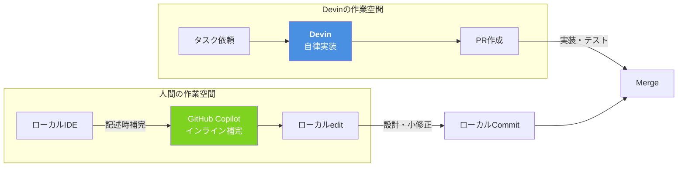

# Q20. GitHub Copilotと併用すべき？フルスクラッチでの役割分担は？

📚 [トップ索引](../../README.md) ｜ [カテゴリ索引: IDE・エディタ・CLI](README.md)

---

> **メタ**: 最終確認日 2026/4/16 ｜ 根拠 運用観察ベース ｜ 推定なし

### 結論: **まずはDevin単独（1:1）を推奨。Copilot併用は上級者向けの応用形**

### Devin + Copilot 役割分担図



本FAQの基本方針である「**ユーザ1人 × Devin 1対1**」の原則どおり、**Devin単独運用を標準**として推奨する。理由:

- **1ツールを深く使い込むほうがROIが高い**（Skills/Knowledge/Playbooksが育つ、運用の勘所が身につく）
- 併用は**判断疲れ・学習コスト・ノウハウ分散・レビュー騒音**といったデメリットが大きい（詳細はQ21）
- 2025年以降、Copilot cloud agentが登場して機能は似てきたが、**Devinには独自の強み**（ブラウザ/GUI操作、SCM中立性、Ask Devin + DeepWiki、Skill Suggestions等）があり、**Devin単独でフルスクラッチ開発は十分完結する**

**初心者〜中級者の推奨**: Copilotを持っていても **IDE補完（Code Completion）のみ** に限定して使い、Issue割当・PR作成などのエージェント機能は**Devinに一本化**するのが最もシンプル。

以降の内容は、**上級者が併用パターンを検討する際の参考情報**として読んでください。

---

### （以下は上級者向け参考情報）2025年以降のGitHub Copilotの変化

Copilotは単なるIDE補完ツールではなく、**Copilot cloud agent**（2025/9 GA）によりDevinと**直接競合するエージェント機能**を備えるようになった。両者は機能的に大きく重なるため、**併用するなら**「作業レイヤー分離」ではなく**「得意領域での棲み分け」+「被る機能は1つに寄せる」**が正解。

### 2025-2026年時点のGitHub Copilotの全貌

Copilotは**複数プロダクトを束ねたブランド**:

| レイヤー | 機能 | Devinとの関係 |
|---|---|---|
| IDE補完 | Code Completion | ⭕ Devinにない |
| IDE Chat | Copilot Chat | ⭕ ほぼDevinにない |
| IDE Agent Mode | IDE内の自動編集 | △ 一部被る |
| Copilot CLI | ターミナル操作 | △ 一部被る |
| Copilot Spaces | 文脈キュレーション | ≒ Knowledge相当 |
| Copilot Code Review | PR自動レビュー | ≒ Devin Review相当 |
| **🌟 Copilot cloud agent** | **Issue割当→PR自動作成** | 🔥 **Devinと直接競合** |
| Copilot Memory（preview） | 永続記憶 | ≒ Skill Suggestions相当 |
| Copilot Extensions / MCP | 外部ツール連携 | △ Devinもintegration+MCPあり |

### Copilot cloud agentでできること

2025/5 発表、2025/9 GA、2025/10に`@copilot`で既存PR修正も可:

- Issueに**Copilotをassignee指定** → 自動でPR作成
- Issue/PR/コメントで **`@copilot` メンション** → その場で着手
- 既存PRに`@copilot`コメント → **別PRをベースブランチに重ねて作る**
- Repo調査 → 実装計画 → ブランチ作業 → レビュー依頼
- ephemeralサンドボックス（GitHub Actionsベース）
- 自動テスト・lint実行、フィードバック対応
- カスタム指示: `.github/copilot-instructions.md`、**AGENTS.md**、Copilot Memory
- **MCP連携**、Azure Boards / Jira / Linear / Slack / Teams統合

出典:
- https://docs.github.com/en/copilot/concepts/agents/coding-agent/about-coding-agent
- https://github.blog/changelog/2025-09-25-copilot-coding-agent-is-now-generally-available/
- https://github.blog/changelog/2025-10-28-ask-copilot-coding-agent-to-make-changes-in-any-pull-request-with-copilot/

### 機能比較: DevinとCopilot cloud agent

| 機能 | Devin | Copilot cloud agent |
|---|---|---|
| Issue割当でPR自動作成 | ✅ | ✅ |
| 非同期・クラウド実行 | ✅ | ✅（GitHub Actions） |
| PRコメント対応 | ✅ | ✅ |
| `@mention`で起動 | ✅ | ✅ |
| 複数セッション並列 | ✅ | ✅ |
| 計画→実装の分離 | ✅（Ask Devin + Session） | ✅（agent panel） |
| カスタム指示 | Knowledge/SKILL.md/Playbook | copilot-instructions.md/AGENTS.md |
| 永続記憶 | Knowledge / Skill Suggestions | Copilot Memory |
| 外部ツール連携 | Integrations + MCP | Integrations + MCP |
| PRレビュー自動化 | Devin Review | Copilot Code Review |
| Linear/Jira/Slack連携 | ✅ | ✅ |

**機能だけで見れば両者はほぼ同等**。

### 本当の違い（2026年時点）

#### 1. 実行環境の自由度

| 観点 | Copilot cloud agent | Devin |
|---|---|---|
| 基盤 | GitHub Actions sandbox（制約付き） | 独立VM（自由） |
| 実行時間 | Actions分数依存 | セッション単位 |
| カスタム環境 | Dockerイメージ指定 | VMを自由構成 |
| **ブラウザ操作** | ❌ 基本不可 | ✅ **可能**（Test Mode, Computer Use） |
| デスクトップ操作 | ❌ | ✅ |

→ **GUI操作・ブラウザテスト必要ならDevin**

#### 2. 生態系ロックイン度

| 観点 | Copilot cloud agent | Devin |
|---|---|---|
| SCM前提 | GitHub限定（GHES可） | GitHub/GitLab/Bitbucket |
| CI前提 | GitHub Actions前提 | 任意のCI |
| 請求統合 | GitHub/Microsoft請求 | 独立請求 |
| 他ツール移植性 | 低（GitHub依存強） | 高（SCM中立） |

→ **GitHub一本化ならCopilot、マルチSCM/中立性ならDevin**

#### 3. 深い調査・計画

| 観点 | Copilot cloud agent | Devin |
|---|---|---|
| コード探索の深さ | ◎ | ◎ |
| 計画モード | ✅ agent panel | ✅ Ask Devin Plan mode |
| **非実装調査** | △（PR作成前提） | ✅ **読み取り専用のAsk Devin** |
| ドキュメント自動生成 | △ | ✅ DeepWiki |

→ **調査・設計が重い案件はDevin優位**

#### 4. 料金モデル

| 観点 | Copilot | Devin |
|---|---|---|
| ベース | ユーザ席+プラン | プラン+使用量 |
| Pro | $10/月 | $20/月〜 |
| Pro+ | $39/月 | — |
| Business | $19/月 | — |
| Enterprise | $39/月 | — |
| cloud agent実行 | **Premium Requests消費** | ACU/ドル |

- **既にCopilot契約済なら限界費用低** → まずCopilot cloud agentを試すのが合理的
- Devinは独立契約なので追加コストが顕在化

#### 5. ガバナンス

| 観点 | Copilot cloud agent | Devin |
|---|---|---|
| 権限制御 | GitHub App + Actions policy | Devin GitHub App + Devin側権限 |
| 監査ログ | GitHub audit log統合 | Devin側 + GitHub（分散） |
| データ保管 | Microsoft/Azure | AWS |
| モデル選択 | GPT/Claude/Gemini等選択可 | Devin側最適化 |

→ **既存のMicrosoft/GitHub統制に載せやすいのはCopilot**

### 併用のベストプラクティス（上級者向け）

基本方針: **「被る機能は1つに寄せる、補完的な機能は両方使う」**

#### ⭐ ケース0（推奨デフォルト）: Devin主力、CopilotはIDE補完のみ

**本FAQの推奨パターン**。初心者〜中級者、そして多くの上級者にとっても最もシンプル:

```
日常: Devin
  ├ Issue/PR → Devinセッション
  ├ 並列実行でスループット
  ├ Devin Review
  └ Skills / Knowledge / Playbooks を育てる

Copilotは:
  ├ IDE Code Completion のみ（タイピング補助）
  └ cloud agentは無効化（Issue割当等はDevinに一本化）
```

理由:
- 判断疲れが生じない（エージェント作業は全部Devin）
- ノウハウが`.agents/skills/`とKnowledgeに集約される
- PRレビューも1つ（Devin Review）で騒音なし
- マルチSCM・ブラウザ操作・DeepWiki調査などDevinの強みを活かせる

#### ケース1: GitHub中心組織でCopilot既契約 → Copilot優位、Devinはピンポイント

組織がGitHub一本でCopilot Enterpriseを全員契約済みなど、**Copilotの限界費用が極めて低い**場合:

```
日常: Copilot
  ├ IDE補完・Chat
  ├ Issue → cloud agent（軽〜中タスク）
  ├ @copilot でPR修正依頼
  └ Copilot Code Review

Devinを残すケース:
  ├ ブラウザ/E2Eテスト（Test Mode）
  ├ マルチSCM案件
  ├ 重い調査フェーズ（Ask Devin + DeepWiki）
  └ 非GitHubツール深連携
```

#### ケース2: 大規模エンタープライズ → 重量別に役割分担

```
Copilot cloud agent:
  ├ 軽量タスク（typo修正、依存更新、テスト追加）
  ├ ラベル: copilot-task

Devin:
  ├ 重量タスク（新機能、リファクタ、E2E込み）
  ├ ラベル: devin-ready
  ├ ブラウザ/デスクトップ必要な案件

棲み分けルール:
  ├ GitHub完結 → Copilot
  └ GitHub外の操作が絡む → Devin
```

### Devin単独運用でのフェーズ推奨（推奨デフォルト）

**Phase 0-1: 準備**
- **Devin主体**: Ask Devinで調査、Sessionで初期スキャフォールディング、AGENTS.md/SKILL.md整備
- Copilotは IDE補完のみ（手書き時のタイピング補助）

**Phase 2: コア実装**
- **Devin主力**でIssue単位に並列実行
- 人間はPRレビューと設計判断に集中

**Phase 3: 品質向上**
- テスト追加・リファクタ・E2E → すべてDevin
- Devin Reviewで自動レビュー

**Phase 4: 運用**
- Devin Schedulesで定期メンテ
- 依存関係更新もDevinで対応

### （上級者向け）判断フロー

もし併用を検討する場合の判断基準:

```
タスクはGitHub内で完結？
  Yes → Copilot cloud agent も選択肢
  No  → Devin

複数SCMが絡む？
  Yes → Devin一択
  No  → Copilot検討可

E2E・ブラウザテスト必要？
  Yes → Devin一択
  No  → Copilot検討可
```

※ 判断自体がコストなので、**基本はDevin一択**で運用してこの判断フローを省くのが最もシンプル。

### 併用する場合の必須ルール（上級者向け）

- [ ] Copilot cloud agentと Devinを同時にrepoで動かすか決める
- [ ] 同時運用なら**ラベル棲み分け**ルールを明文化
- [ ] PRレビューは**1つに寄せる**
- [ ] カスタム指示は **AGENTS.md一本化**（二重管理回避）
- [ ] コスト測定: Copilot Premium枠 vs Devin使用量を月次で比較
- [ ] セキュリティ: 両者の権限を揃える

### まとめ

1. **基本方針: Devin単独（1:1）を推奨**、CopilotはIDE補完のみに限定
2. 理由: 判断疲れ・学習コスト・ノウハウ分散・レビュー騒音を避ける
3. Copilot cloud agentが2025/9にGAし機能は重なったが、**Devin単独で十分**
4. Devinが優位なのは: **ブラウザ/GUI操作・SCM中立性・Ask Devin/DeepWiki・Skill Suggestions**
5. 併用が有力なのは**Copilot Enterprise全員契約済のGitHub中心組織**などに限られる
6. 迷ったら **Devin一本に寄せる** のが最もシンプルで、ROIも高い

**核心**: **Devin と Copilotは役割が重ならない**。Copilotはキーストローク補完、Devin は PR 完結の非同期タスク処理。

---

[← Q19. 最新のVSCodeはGitHub Copilot Chatが標準でついてくるが、Devinもそうなる？](q19-vscode-copilot-bundled.md) ｜ [Q21. Devin + Copilot併用は初心者向きではない？ →](q21-beginner-fitness.md)
