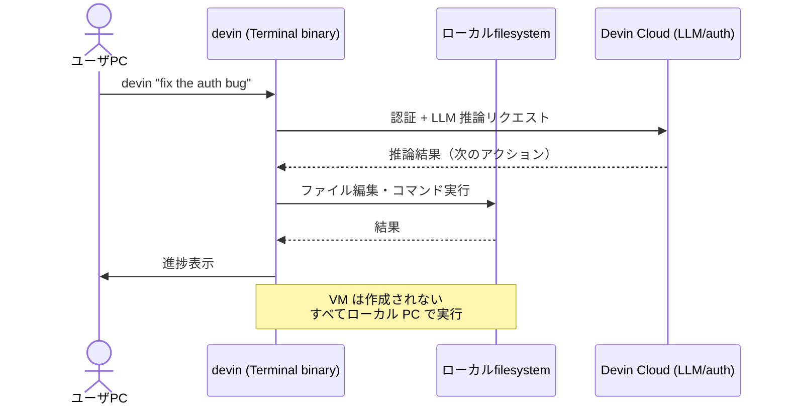
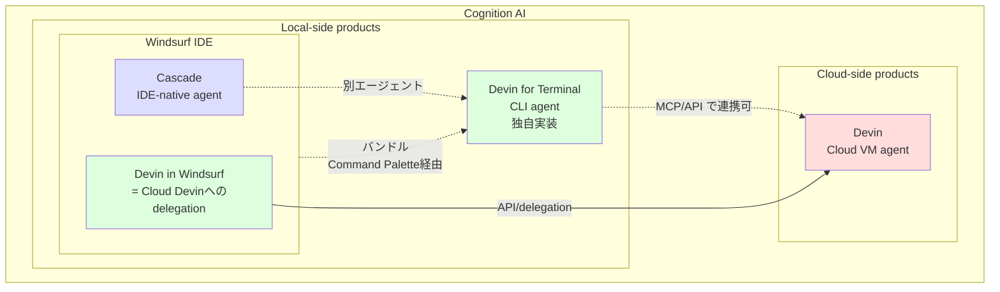
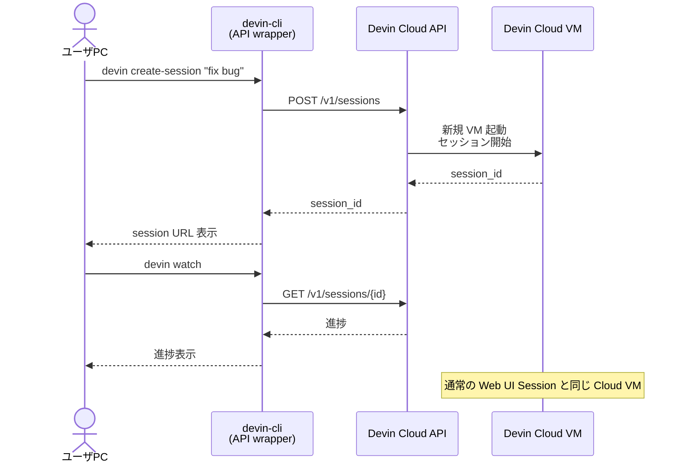
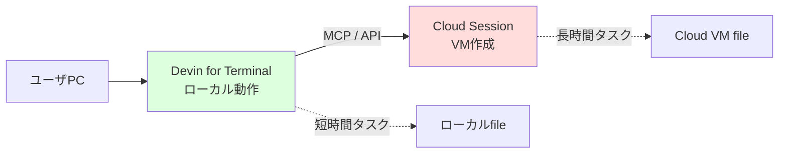

# Q69. Devin CLI を使う場合、Devin セッションの仮想マシンは作成される？CLI を実行している PC で作業？両方可能？

📚 [トップ索引](../../README.md) ｜ [カテゴリ索引: IDE・エディタ・CLI](README.md)

---

> **メタ**: 最終確認日 2026/4/17 ｜ 根拠 https://cli.devin.ai/docs / https://docs.devin.ai/api-reference/v1/sessions/create-a-new-devin-session / https://docs.devin.ai/work-with-devin/devin-mcp ｜ 推定あり

### 結論: **「Devin CLI」と呼ばれるものには 2 系統あり、動作モードが正反対**。一般に "Devin CLI" と言うと公式の **"Devin for Terminal"** を指し、こちらは **CLI 実行 PC のローカルで動作（VM は作成されない）**。一方、**API ラッパー型のサードパーティ CLI（`devin-cli` on PyPI 等）や API 直接呼び出し**は **Devin Cloud の VM セッションを作成して制御**。**両者を組み合わせたハイブリッド構成も可能**（公式 CLI から MCP / API 経由で別途 Cloud session を起動）。

### 区別すべき "Devin CLI" の3系統

| 種類 | 名称 | 提供元 | 動作場所 | VM作成 | 主な用途 |
|---|---|---|---|---|---|
| **①** | **Devin for Terminal**（[cli.devin.ai/docs](https://cli.devin.ai/docs)） | **Cognition公式** | **ローカルPC** | ❌ 作成されない | ローカルファイル編集・対話的コーディング |
| **②** | **devin-cli (PyPI)** ほか API ラッパー | サードパーティ非公式 | ローカルから API 呼び出し | ✅ Cloud VM 作成 | 既存 Devin Cloud session を CLI から操作 |
| **③** | 公式 Devin API を直接 `curl` / `httpie` 等で叩く | ユーザ自作スクリプト | ローカルから API 呼び出し | ✅ Cloud VM 作成 | CI/CD連携・自動化 |

→ **「Devin CLI を使う = ローカル動作」と決めつけずに、どの CLI かを最初に確認**するのがポイント。

### ① Devin for Terminal（公式・ローカル動作）

[公式ドキュメント](https://cli.devin.ai/docs) の明文（原文）:

> **Devin for Terminal** is a **local coding agent** that runs **directly in your terminal**. It **works with your local files and environment**, giving you fast, interactive assistance right where you code.
>
> **Devin** is our **cloud-based AI software engineer** that runs **in a virtual machine**. It includes features like Playbooks, Secrets, Knowledge, and other capabilities that are **not available in Devin for Terminal**.

つまり**「Devin for Terminal」と「Devin（Cloud）」は別ツール**として明確に位置付けられている。

#### 動作フロー



#### 特徴

| 項目 | 内容 |
|---|---|
| **動作場所** | ユーザ PC のターミナル |
| **VM作成** | なし |
| **ファイル編集対象** | ローカルファイル（cwd 配下） |
| **コマンド実行** | ローカルシェル |
| **インストール** | `curl -fsSL https://cli.devin.ai/install.sh | bash`（macOS/Linux/WSL）<br/>`irm https://static.devin.ai/cli/setup.ps1 | iex`（Windows PowerShell）<br/>Windsurf 1.9577.24 以降にはバンドル |
| **対象プラン** | **Windsurf Enterprise / Devin Enterprise のみ**（Core/Teams は不可） |
| **認証** | Devin / Windsurf Enterprise アカウント |
| **使えない機能** | Knowledge / Playbook / Secrets（**対応予定**と明記あり） |
| **使える機能** | Subagents（foreground/background）、Skills、Rules（AGENTS.md）、MCP、Hooks、カスタム Subagent profile |
| **Models** | 設定で切替可（[Models docs](https://cli.devin.ai/docs/models)） |
| **インターネット** | LLM 推論で必須（オフライン動作不可） |

#### Subagents（並列タスク実行）

Devin for Terminal は **Subagents** をサポートし、メインエージェントから独立した worker を foreground/background でspawn可能（[Subagents docs](https://cli.devin.ai/docs/subagents)）。

| プロファイル | 用途 | ツール権限 |
|---|---|---|
| `subagent_explore` | 読み取り専用のコード探索 | 読み取り系のみ |
| `subagent_general` | 汎用（コード変更含む） | foreground=フル、background=事前承認済のみ |

→ **ローカル PC 上でも並列処理が可能**な設計（CPU/メモリはローカルマシンを使う）。

### ①' Devin for Terminal と Windsurf の関係（"CLI版Windsurf"ではない）

「Devin for Terminal は Windsurf の CLI 版か？」という質問はよくあるが、**厳密には誤り**。両者は **Cognition 傘下の "兄弟製品（sister product）"** であり、**Windsurf に Devin for Terminal が（インストーラ経由で）バンドル**されているが、**バイナリも実装も別物**。

#### 経緯（買収と再編）

[Cognition's acquisition of Windsurf](https://cognition.ai/blog/windsurf)（2025年7月）より:
- 2025年7月、**Cognition AI が Windsurf を約 $250M で買収**
- Windsurf の IP・ブランド・人材（210名のエンジニア）が Cognition に統合
- 買収後も **Windsurf ブランドは IDE 製品として継続**

買収後の Cognition のローカル動作系プロダクト:

| 製品 | 形態 | 内蔵エージェント | 由来 |
|---|---|---|---|
| **Windsurf** | IDE（GUI） | **Cascade**（IDE-native agent） | 元 Windsurf 社（買収で取得） |
| **Devin for Terminal** | CLI | **Devin Terminal agent**（独自実装） | Cognition ネイティブ |

→ **同じ親会社の "兄弟" ではあるが、エージェントの中身は別物**。

#### Windsurf と Devin for Terminal の比較

| 観点 | Windsurf（IDE） | Devin for Terminal（CLI） |
|---|---|---|
| **製品形態** | IDE（GUI） | CLI（任意ターミナル） |
| **内蔵エージェント** | **Cascade**（Windsurf独自） | **Devin Terminal agent**（独自実装） |
| **インストール** | 単独IDEとしてダウンロード | `devin` バイナリを PATH に追加 |
| **動作場所** | ローカル（IDE内） | ローカル（任意ターミナル） |
| **特徴的機能** | Codemaps、Cascade、IDE機能 | Subagents、Skills、Rules、MCP、Hooks |
| **対応プラン** | Windsurf Enterprise / Devin Enterprise | Windsurf Enterprise / Devin Enterprise |
| **ブランド由来** | 元 Windsurf 社の独立製品（買収後継続） | Cognition ネイティブ |
| **Devin Cloud との連携** | 「Devin in Windsurf」機能で delegation 可 | MCP/API 経由で delegation 可 |

#### バンドル関係（同梱されている事実）

[Devin for Terminal Quickstart](https://cli.devin.ai/docs) より、**Windsurf 1.9577.24 以降には Devin for Terminal のインストーラが同梱**:

> **Devin for Terminal is bundled with Windsurf starting with version 1.9577.24.**
>
> User installation:
> 1. Open Windsurf (version 1.9577.24 or later)
> 2. Open the Command Palette with `Cmd+Shift+P` (macOS) or `Ctrl+Shift+P` (Windows/Linux)
> 3. Search for and run **Install Devin for Terminal**
>
> This adds the `devin` binary to your PATH so you can use it from any terminal.

つまり:
- **Windsurf は単に "Devin for Terminal を簡単にインストールできる入口" を提供しているだけ**
- インストール後は **Windsurf を起動していなくても `devin` コマンドは独立して動く**
- iTerm / Windows Terminal / Git Bash 等、**任意のターミナル**で使える

→ **「同梱されているが本体は独立」**。Windsurf は CLI 版ではなく、**Devin for Terminal の配布チャネルの一つ**。

#### Cognition のエージェント3系統（並行展開）

[Cognition Buys Windsurf 解説](https://sdd.sh/2026/03/cognition-buys-windsurf-the-ai-coding-market-is-consolidating/) によれば、Cascade Agent は **conceptually similar to Devin だが、IDE-native experience として作られた別実装**。Cognition は以下の **3系統のエージェントを並行展開**している。

| エージェント | 形態 | 用途 |
|---|---|---|
| **Devin (Cloud)** | サーバサイド・自律型 | 長時間自律実行・PR自動作成 |
| **Cascade** | IDE内（Windsurf）・対話的 | IDE で対話的にコーディング（買収で取得） |
| **Devin for Terminal** | CLI・対話的 | ターミナルで対話的にコーディング（自社開発） |

→ **用途が違うため別実装**。Cognition は買収後も **Windsurf ブランドを温存**し、CLI は **Devin ブランド** で別途展開。

#### 関係図



#### よくある混同への補正

| ❌ 誤解 | ✅ 実態 |
|---|---|
| 「Devin Terminal = Windsurf を CLI にしたもの」 | 別実装の別バイナリ。Cognition の "兄弟製品" |
| 「Devin Terminal を入れれば Windsurf も入る」 | Devin Terminal だけ単体インストール可 |
| 「Windsurf を入れれば Devin Terminal も使える」 | △ Command Palette で別途インストール手順が必要（ただし1クリック） |
| 「Cascade と Devin Terminal は同じエージェント」 | 別実装。Cascade は IDE-native、Devin Terminal は CLI-native |
| 「両者は連動して動く」 | 独立して使うのが基本（双方とも Devin Cloud と連携可） |
| 「Cognition の傘下にある "兄弟製品"」 | これが最も正確 |

#### 適切なアナロジー

| 誤解しやすい比喩 | より正確な比喩 |
|---|---|
| 「VSCode と VSCode CLI のような関係」 | **VS Code と Cursor のような "別ブランドの兄弟" 関係**（共通の系譜だが別実装） |
| 「同じバイナリの GUI/CLI 切替」 | **別バイナリ・別実装。共通の認証・統合のみ共有** |
| 「IDE vs IDE-less の同じエージェント」 | **IDE系（Cascade）と CLI系（Devin Terminal）で別エージェント** |

#### 用途別の使い分け

| やりたいこと | 推奨 |
|---|---|
| GUI で対話的にコーディング | **Windsurf**（Cascade内蔵） |
| ターミナルで対話的にコーディング | **Devin for Terminal** |
| Windsurf 内から Cloud Devin に delegation | **Devin in Windsurf** 機能 |
| 長時間の自律実行 | **Devin (Cloud) Web UI** |
| ローカル + Cloud のハイブリッド | **Devin for Terminal + MCP/API で Cloud delegate** |
| 全部使い分け | **Windsurf + Devin for Terminal + Cloud Devin** 併用（Enterprise契約者） |

#### つまり、最も正確な表現

> **Windsurf は Cognition の IDE 製品（Cascade エージェント内蔵）、Devin for Terminal は同じく Cognition のローカル CLI 製品（独自エージェント）。同じ親会社・同じエンタープライズ枠・同じ Devin Cloud 統合を持つ "兄弟製品" で、Windsurf にインストーラが同梱されているが、本体は独立したバイナリ**。

「CLI 版 Windsurf」ではなく、**「Cognition がローカル開発体験のために用意した、IDE系（Windsurf＋Cascade）と CLI系（Devin for Terminal）の2本立て」** が正確。

### ② devin-cli (PyPI 非公式) - Cloud VM を作成

[devin-cli on PyPI](https://pypi.org/project/devin-cli/) は **Devin の Public API をラップ**しただけのサードパーティ CLI。

#### 動作フロー



#### 特徴

| 項目 | 内容 |
|---|---|
| **動作場所** | Cloud VM（リモート） |
| **VM作成** | あり（通常の Devin Web Session と同じ） |
| **ローカル PC の役割** | API クライアント / 進捗監視のみ |
| **インストール** | `pip install devin-cli` / `brew install devin-cli`（unofficial tap） |
| **対象プラン** | API が有効化されている全プラン |
| **認証** | API キー（`apk_...` / `cog_...`） |
| **使える機能** | 通常の Cloud Session と同等（Knowledge / Playbook / Secrets / Wiki すべて使える） |
| **公式サポート** | ❌ なし（ベンダーリスク有） |

### ③ API 直接呼び出し（curl / 自作スクリプト）

[Create a new session API](https://docs.devin.ai/api-reference/v1/sessions/create-a-new-devin-session) を `curl` で直接叩けば、CLI ラッパーなしで Cloud Session を作成可能:

```bash
curl -X POST https://api.devin.ai/v1/sessions \
  -H "Authorization: Bearer $DEVIN_API_KEY" \
  -H "Content-Type: application/json" \
  -d '{
    "prompt": "fix the auth bug in /api/login",
    "playbook_id": "playbook-uuid",
    "secrets": ["AWS_KEY"]
  }'
```

→ **VM 作成あり**。CI/CD（GitHub Actions、Jenkins 等）から自動的に Devin セッションを起動する場合の典型パターン。

### 「両方可能」のパターン

質問の「両方が可能か？」の答え: **YES、技術的に可能**。代表的なハイブリッド構成:

#### パターン A: ローカル CLI + 必要時に Cloud session を delegate



- 用途: ローカルでクイックに対話 → 長時間/重いタスクは Cloud に delegation
- 公式 Devin for Terminal は **MCP server** を扱える設計（[MCP Overview](https://cli.devin.ai/docs/extensibility/mcp/overview)）
- [Devin MCP server](https://docs.devin.ai/work-with-devin/devin-mcp) を経由して Cloud session を起動・操作できる

#### パターン B: ローカル CLI + Web UI 並行作業

- 同じ repo に対して、ローカル CLI（`devin` で対話） と Web UI Session（Cloud VM）を併用
- **ファイル衝突に注意**: 同じファイルを両方が同時に編集すると上書き事故
- 推奨: 役割分担（ローカル=ad-hoc 修正、Cloud=長時間タスク）

#### パターン C: CI/CD から API、ローカルで CLI

- 夜間バッチ等で API 経由で Cloud Session を起動 → 朝は Devin for Terminal でローカル続き
- ハンドオフは GitHub commit / PR 経由

### 比較早見表

| 観点 | ① Devin for Terminal（公式） | ② devin-cli / ③ API（Cloud） | Web UI Session |
|---|---|---|---|
| 動作場所 | **ユーザの PC** | **Cloud VM** | **Cloud VM** |
| VM作成 | なし | あり | あり |
| ファイル編集対象 | ローカルファイル | Cloud VM 上の git clone 後ファイル | 同左 |
| Knowledge | ❌ 未対応（予定） | ✅ | ✅ |
| Playbook | ❌ 未対応（予定） | ✅ | ✅ |
| Secrets | ❌ 未対応（予定） | ✅ | ✅ |
| Wiki | ❌ ローカル動作のため間接利用 | ✅ | ✅ |
| ACU消費 | Enterprise契約に紐づく | あり（通常Sessionと同じ） | あり |
| サブエージェント | foreground/background 対応 | API 経由で複数session起動可 | 並列session 機能あり |
| 利用可能プラン | **Windsurf/Devin Enterprise のみ** | API有効化された全プラン | 全プラン |
| 認証 | Devin/Windsurf アカウント | API キー（`apk_` / `cog_`） | アカウント |
| インターネット必須 | ✅（LLM推論） | ✅ | ✅ |
| ローカル開発環境への影響 | **直接書き換え** | なし | なし |
| MCP 拡張 | ✅ | ❌（CLI側にMCP機能なし） | ✅ |
| Skills（`.devin/skills/`） | ✅ | ❌ | ✅ |
| Rules（`AGENTS.md`） | ✅ | ❌ | ✅ |

### ユースケース別の使い分け

| やりたいこと | 推奨 |
|---|---|
| ローカル PC のファイルをサクッと編集 | ① Devin for Terminal |
| 機微情報をクラウドに出したくない | ① Devin for Terminal（ローカル動作） |
| 長時間の自動実行（数時間〜） | ② or ③（Cloud Session） |
| CI/CD から自動セッション起動 | ③ API直接 |
| Knowledge / Playbook / Secrets を活用 | ② or Web UI（① は未対応） |
| Enterprise契約がない / Core/Teams プラン | ② or ③（① は使えない） |
| 並列で多数のタスクを走らせたい | ③ API（複数Session同時起動）+ Subagents 併用 |
| ローカル + Cloud のハイブリッド | ① + MCP/API でCloud delegate |

### よくある誤解

| ❌ 誤解 | ✅ 実態 |
|---|---|
| 「Devin CLI を使えば必ず VM が作られる」 | 公式 Devin for Terminal は VM を作らない（ローカル動作） |
| 「Devin CLI = Cloud Session の操作端末」 | それは API ラッパー型。公式 CLI はローカル動作 |
| 「ローカル CLI は Knowledge も Playbook も使える」 | 公式 Devin for Terminal は現時点で未対応（対応予定） |
| 「Devin for Terminal は誰でも使える」 | Windsurf/Devin **Enterprise 限定**（Core/Teams 不可） |
| 「公式 CLI と非公式 CLI は同じもの」 | 全く別物。動作場所も機能も異なる |
| 「ローカル動作だから ACU 消費しない」 | LLM 推論は Cloud で実行されるため、Enterprise の利用枠に応じた消費はある |
| 「devin-cli は Cognition 公式」 | PyPI の `devin-cli` はサードパーティ非公式 |

### Tips

- **「Devin CLI」と社内で呼ぶ際は必ず "公式の Devin for Terminal なのか、API ラッパーなのか" を明示**
- **Enterprise 契約者は公式 Devin for Terminal の評価から始める**のが筋
- **Core/Teams プランで CLI を使いたいなら API ラッパー型 (`devin-cli`) か API 直接**
- **Devin for Terminal は機能拡張中**: Knowledge/Playbook/Secrets が将来サポートされる予定なので、現時点の機能不足は時限的
- **ハイブリッド構成は ハンドオフを丁寧に設計**: ローカル↔Cloud のファイル受け渡しは git commit / PR を介するのが安全
- **ローカル動作のリスク**: マシン環境（Node/Pythonバージョン等）の差異が問題になる場合は Cloud VM の方が再現性高い

### アンチパターン

| NG | 理由 | 正しい対応 |
|---|---|---|
| 公式 Devin for Terminal で「Cloud Session が作られない」と困惑して問い合わせ | 仕様通り。CLI はローカル動作 | API ラッパー or Web UI を使う |
| 同じ repo にローカル CLI と Web UI Session で同時に編集 | ファイル衝突 | 役割分担を明確化、git commit を介してハンドオフ |
| API キーをコミット | 漏洩リスク大 | `.env` / Secrets 管理ツールに保管 |
| Enterprise 契約なしで `cli.devin.ai/install.sh` を試して動かないと文句 | Enterprise 限定 | 契約状況を管理者に確認 |
| 非公式 `devin-cli` を信頼しきって本番運用 | サポート対象外、ベンダーリスク | 公式 API 直接 or 公式 Devin for Terminal を選択 |
| Devin for Terminal で Playbook が使えないと「壊れている」と思う | 現時点で未対応（仕様） | Web UI / API ルートを使う |

### 関連 FAQ

- **Q18**: Devin の IDE は Windsurf / VSCode（Devin for Terminal は Windsurf にバンドル）
- **Q22 / Q23**: Skills（Devin for Terminal でも `.devin/skills/` 形式で利用可）
- **Q24 / Q25**: スラッシュコマンド（Devin for Terminal も対応）
- **Q31**: Secrets の使い方（CLI ② ③ では使えるが、① は未対応）
- **Q32 / Q33**: Devin API（CLI ② ③ の基盤）

### まとめ

| 質問 | 答え |
|---|---|
| Devin CLI を使うと VM は作成される？ | **公式 Devin for Terminal なら NO（ローカル動作）。API ラッパー型なら YES（Cloud VM 作成）** |
| CLI 実行 PC で作業する？ | **公式なら YES（ローカルファイル直接編集）。API ラッパー型なら NO（Cloud VM 上で作業）** |
| 両方可能？ | **YES、ハイブリッド構成可能**（ローカル CLI から MCP/API 経由で Cloud session を delegate） |

**核心**: **「Devin CLI」は呼び方の混乱が大きい**。実体は **(1) Cognition公式の Devin for Terminal（ローカル動作・VM不要・Enterprise限定）** と **(2) サードパーティ API ラッパーや API 直接呼び出し（Cloud VM 作成・通常Sessionと同等）** の **2系統**で、動作場所が真逆。**両方を組み合わせたハイブリッド構成**（ローカルで対話 → 重いタスクは Cloud に delegate）も技術的に可能で、これが Devin の柔軟な利用形態の一つ。導入時は **「Devin CLI = どっちを指すか」を最初に明確化**するのが鉄則。

---

[← Q68. Devin Wiki に未登録のリポジトリを Devin セッションの VM 上に `git clone` して開発に使える？](../04-github-scm/q68-clone-without-wiki.md) ｜ [Q70. Devin と Windsurf のプランは別物？同名の Pro/Max は同じ？ →](../02-pricing/q70-devin-vs-windsurf-plans.md)
