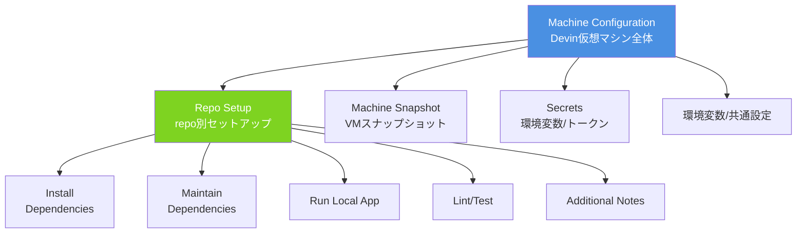

# Q26. Machine Configurationは Repo Setupのこと？言語別のDevin向きリポ構成は？

📚 [トップ索引](../../README.md) ｜ [カテゴリ索引: Devinリソース](README.md)

---

> **メタ**: 最終確認日 2026/4/16 ｜ 根拠 https://docs.devin.ai/onboard-devin/machine-configuration ｜ 推定なし

### 結論(1): Machine Configuration = **Repo Setupを含む、もう一段広い概念**。「Repo Setup + Machine Snapshot + Secrets + 環境全体の設定」を指す

### Machine Configurationの包含関係



| 用語 | 指す範囲 |
|---|---|
| **Repo Setup** | **8ステップの環境構築スクリプト**（Install / Maintain / Lint / Test / Run / Notes 等） |
| **Machine Snapshot** | Repo Setup 完了後のVMディスクイメージ（高速起動用） |
| **Machine Configuration** | 上記2つに加え、**Secrets・ネットワーク（VPN）・リソース上限**を含むDevin's Machine全体の設定 |
| **Devin's Machine** | 実行ランタイム（VM + 上記設定がセットになった単位） |

→ **「Repo Setup」は Machine Configurationの中核要素**。Webappでは`Settings > Devin's Machine > Modify repo setup` からアクセス。

参考:
- https://docs.devin.ai/onboard-devin/repo-setup
- https://docs.devin.ai/product-guides/session-insights

### Machine Configurationを成立させるための repo 側の責務

Devin's Machineが「最小の設定で動く」ためには、**リポジトリ側が標準化されている**必要がある。

#### 必須要件（全言語共通）
1. **依存関係をマニフェストファイルで宣言**（package.json / requirements.txt 等）
2. **ロックファイルをcommit**（再現性担保）
3. **ビルド・テスト・lint・起動のコマンドが明確**（READMEまたはMakefileで標準化）
4. **環境変数は`.env.example`で雛形提供**（実値はSecretsで）
5. **`.gitignore`の整備**（node_modules, `.env`, venv等）
6. **CI設定**（GitHub Actions等、ローカルと同じコマンドで動く）

#### Devin向けの追加要件（推奨）
7. **`AGENTS.md`**（プロジェクト憲法、Devin向けガイド）
8. **`.agents/skills/`**（繰り返しタスクの手順書）
9. **`README.md`のセットアップセクション**（Devinが読んで Repo Setupに写せる）
10. **プリコミットフック / lint自動修正**（品質の自動担保）

### ⭐ 言語別: Devin向きリポジトリ構成例

#### 📘 Node.js / TypeScript

```
my-app/
├── .agents/skills/
├── .github/workflows/
├── src/
├── tests/
├── .env.example
├── .gitignore
├── .nvmrc                    # Node.jsバージョン固定
├── .eslintrc.json
├── .prettierrc
├── AGENTS.md
├── README.md
├── package.json
├── package-lock.json         # ⭐ commit必須
├── tsconfig.json
└── vitest.config.ts
```

**Repo Setup例**:
```bash
# Install Dependencies
nvm install && nvm use
npm ci

# Set up Tests
npm test -- --run

# Set up Lint
npm run lint

# Run Local App
npm run dev &
```

**package.jsonのポイント**:
```json
{
  "scripts": {
    "dev": "vite",
    "build": "tsc && vite build",
    "test": "vitest",
    "lint": "eslint . --fix",
    "typecheck": "tsc --noEmit"
  },
  "engines": { "node": ">=20.0.0" }
}
```

#### 🐍 Python

```
my-app/
├── .agents/skills/
├── .github/workflows/
├── src/my_app/
├── tests/
├── .env.example
├── .gitignore
├── .python-version
├── AGENTS.md
├── README.md
├── pyproject.toml
├── uv.lock                   # ⭐ commit必須
├── ruff.toml
└── Makefile
```

**Repo Setup例**（uv推奨）:
```bash
# Install Dependencies
curl -LsSf https://astral.sh/uv/install.sh | sh
uv sync --all-extras

# Set up Tests
uv run pytest -q

# Set up Lint
uv run ruff check .
uv run mypy src/

# Run Local App
uv run python -m my_app.main &
```

**pyproject.tomlのポイント**:
```toml
[project]
name = "my-app"
version = "0.1.0"
requires-python = ">=3.11"
dependencies = ["fastapi>=0.110", "pydantic>=2.6"]

[project.optional-dependencies]
dev = ["pytest>=8.0", "ruff>=0.3", "mypy>=1.9"]

[tool.ruff]
line-length = 100
target-version = "py311"
```

#### ☕ Java

```
my-app/
├── .agents/skills/
├── .github/workflows/
├── src/main/java/... src/test/java/...
├── .java-version
├── AGENTS.md
├── pom.xml                  # Maven
└── Makefile
```

または Gradle:
```
├── build.gradle.kts
├── settings.gradle.kts
├── gradle/wrapper/
├── gradlew
└── src/...
```

**Repo Setup例（Maven）**:
```bash
# Install Dependencies
sdk install java 21.0.2-tem
sdk use java 21.0.2-tem
mvn dependency:go-offline -B

# Set up Tests
mvn test

# Set up Lint
mvn spotless:check

# Run Local App
mvn spring-boot:run &
```

**Repo Setup例（Gradle）**:
```bash
sdk install java 21.0.2-tem
./gradlew build --no-daemon -x test
./gradlew test
./gradlew check
./gradlew bootRun &
```

#### 🔧 C / C++

```
my-app/
├── .agents/skills/
├── .github/workflows/
├── src/
├── include/
├── tests/
├── third_party/
├── cmake/
├── .clang-format
├── .clang-tidy
├── AGENTS.md
├── CMakeLists.txt
├── conanfile.txt or vcpkg.json
└── Makefile
```

**Repo Setup例**（CMake + Conan）:
```bash
# Install Dependencies
apt-get update
apt-get install -y build-essential cmake ninja-build clang-format clang-tidy
pip install conan
conan profile detect --force
conan install . --output-folder=build --build=missing

# Build
cmake --preset=conan-release
cmake --build build --parallel

# Set up Tests
ctest --test-dir build --output-on-failure

# Set up Lint
clang-format --dry-run --Werror $(find src include tests -name "*.c" -o -name "*.h")
clang-tidy $(find src -name "*.c") -p build/

# Run Local App
./build/myapp &
```

**CMakeLists.txtの最低限**:
```cmake
cmake_minimum_required(VERSION 3.25)
project(myapp LANGUAGES C CXX)
set(CMAKE_C_STANDARD 11)
set(CMAKE_CXX_STANDARD 20)
set(CMAKE_EXPORT_COMPILE_COMMANDS ON)
enable_testing()
add_subdirectory(src)
add_subdirectory(tests)
```

### 🏆 全言語共通のDevinフレンドリー実装パターン

#### 1. Makefileで統一インタフェース（強く推奨）

```makefile
.PHONY: install test lint run dev build fmt

install:
	<言語別のコマンド>
test:
	<言語別のコマンド>
lint:
	<言語別のコマンド>
fmt:
	<言語別のコマンド>
run:
	<言語別のコマンド>
dev:
	<言語別のコマンド>
build:
	<言語別のコマンド>
ci: install lint test build
```

→ Repo Setupに `make install` `make test` `make run` と書くだけで済む。

#### 2. AGENTS.mdのテンプレ

```markdown
# AGENTS.md

## プロジェクト概要
## 技術スタック
## 主要コマンド
- `make install`: 依存インストール
- `make test`: テスト実行
- `make lint`: Lintチェック
- `make fmt`: フォーマット
- `make run`: アプリ起動
## ディレクトリ
## 規約
## 禁止事項
## 参照先
```

#### 3. ロックファイルの扱い

| 言語 | ロックファイル | commit |
|---|---|---|
| Node.js | `package-lock.json` / `pnpm-lock.yaml` / `yarn.lock` | 必須 |
| Python | `uv.lock` / `poetry.lock` | 必須 |
| Java | なし（Maven/Gradle）or `gradle.lockfile` | バージョンpin必須 |
| Rust | `Cargo.lock` | 必須 |
| Go | `go.sum` | 必須 |
| C/C++ | `conan.lock` / `vcpkg.json` | 必須 |

#### 4. CI/CDとローカルの一貫性

```yaml
# .github/workflows/ci.yml
jobs:
  ci:
    runs-on: ubuntu-latest
    steps:
      - uses: actions/checkout@v4
      - run: make install
      - run: make lint
      - run: make test
      - run: make build
```

#### 5. Docker Composeで外部依存

```yaml
services:
  db:
    image: postgres:16
    environment:
      POSTGRES_USER: dev
      POSTGRES_PASSWORD: dev
      POSTGRES_DB: mydb
    ports: ["5432:5432"]
    healthcheck:
      test: ["CMD", "pg_isready", "-U", "dev"]
      interval: 5s
```

### Devin向きリポ構成の⭐設計原則

| # | 原則 | 効果 |
|---|---|---|
| 1 | 依存は1コマンドで入る | Repo Setupが安定 |
| 2 | ロックファイルcommit | VMごとの再現性確保 |
| 3 | Makefile等で統一コマンド | 言語差異を吸収 |
| 4 | AGENTS.md 完備 | プロジェクト憲法をDevinに渡す |
| 5 | `.env.example` 必須 | 環境変数の雛形明示 |
| 6 | `.agents/skills/` 完備 | 繰り返しタスクの手順書 |
| 7 | CI = ローカル = Repo Setup | 一貫性 |
| 8 | pre-commit hook | 品質を自動担保 |
| 9 | docker-compose | 外部依存の標準化 |
| 10 | README.mdにセットアップ節 | Devinが Repo Setupに写せる |
| 11 | `.gitignore` しっかり | 不要物を持ち込まない |
| 12 | テストが常に通る | Devin変更後の検証軸 |

### まとめ

| 観点 | 結論 |
|---|---|
| Machine Configuration = Repo Setup？ | Repo Setupを含む、もう一段広い概念（+Snapshot + Secrets + ネットワーク） |
| 言語共通の要件 | ロックファイル / 統一コマンド / AGENTS.md / `.env.example` / CI一貫性 |
| Node.js | `.nvmrc` + `package-lock.json` + `npm ci` |
| Python | `.python-version` + `uv.lock` + `uv sync` |
| Java | Maven/Gradle Wrapper + `./mvnw` / `./gradlew` + JDK固定 |
| C/C++ | CMake + Conan/vcpkg + `clang-format/tidy` + CTest |
| Devinフレンドリー化の肝 | Makefile統一 + AGENTS.md + ロック + `.env.example` + CI一貫性 |

**核心**: **「Devinが何も知らなくても `make install && make test && make run` で立ち上がる」**状態をリポ側で作るのが、Machine Configurationの成功条件。言語差異は Makefileで吸収し、プロジェクト固有の文脈は AGENTS.mdで渡す。

---

[← Q25. カスタムスラッシュコマンドとスキルの違いは「管理場所」だけ？](../06-commands-skills/q25-slash-vs-skill.md) ｜ [Q27. Playbookとは？開発環境構築にしか使っていなかったが、本来の用途と違う？ →](q27-playbook.md)
