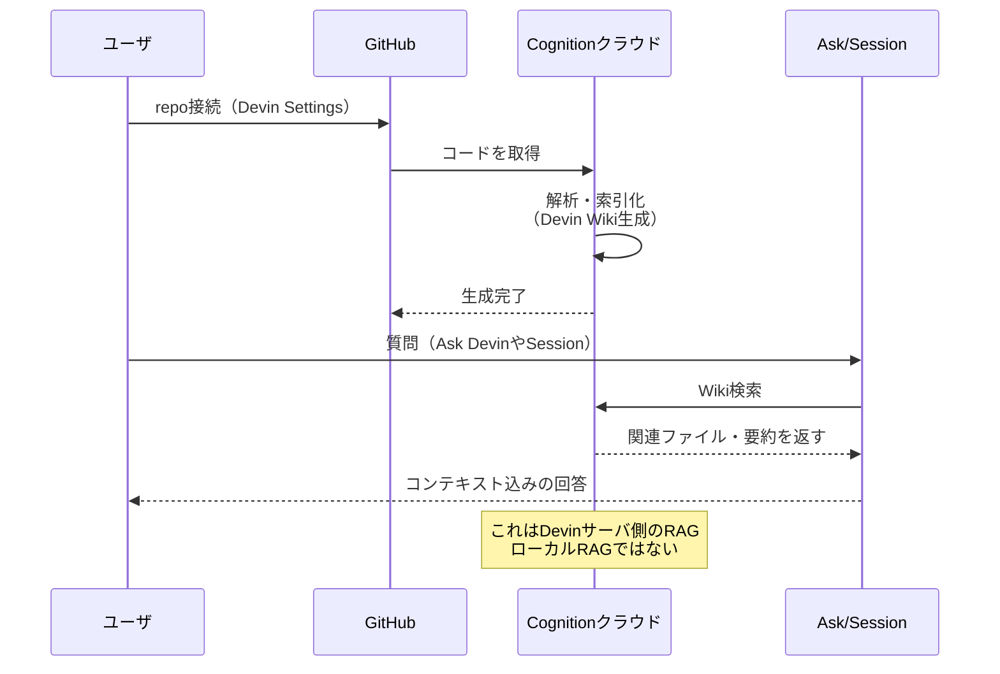

# Q29. Devin Wikiとは？Codex CLI/Claude CodeのようなローカルRAGか？Ask/Sessionで問い合わせるrepoは事前登録が必要？

📚 [トップ索引](../../README.md) ｜ [カテゴリ索引: Devinリソース](README.md)

---

> **メタ**: 最終確認日 2026/4/16 ｜ 根拠 https://docs.devin.ai/work-with-devin/deepwiki / https://deepwiki.com ｜ 推定なし

### 結論: **Devin Wiki ≒ DeepWiki**。リポジトリ接続時に**自動生成される**サーバ側索引型の"生きたドキュメント"

### Devin Wikiの生成・参照フロー



- **事前登録は必要**（Settings > Repositoriesで `Index repo` をクリック、数分で完了）
- ただしオンボーディング時に接続したrepoは**自動でindex**されるので多くの場合ユーザの明示操作は不要
- **Codex CLI / Claude CodeのローカルRAGとは別物**:
  - Codex CLI等: **自PCのcloneをローカルで検索**（ツール起動時に都度解析、個人のローカル資産）
  - Devin Wiki: **Devinクラウドが事前にindex + 構造化ドキュメント化**（組織で共有される資産）

参考:
- https://docs.devin.ai/work-with-devin/deepwiki
- https://docs.devin.ai/onboard-devin/index-repo
- https://docs.devin.ai/work-with-devin/ask-devin

### Devin Wiki = DeepWikiの実体

Devin Webapp左サイドバーの「Wiki」はDeepWikiそのもの → https://app.devin.ai/wiki

自動生成される内容:
- **アーキテクチャ図**（Mermaid等）
- 主要モジュール/ディレクトリのサマリ
- コードへのディープリンク
- 構造化されたページ階層（人間が読めるWiki形式）
- Q&Aの土台（Ask DevinがこのWikiを参照して回答精度を上げる）

### Codex CLI / Claude Codeとの違い

| 観点 | Codex CLI / Claude Code | **Devin Wiki (DeepWiki)** |
|---|---|---|
| 索引の場所 | **ローカルPC**（cloneしたrepo） | **Devinクラウド**（サーバ側で索引化） |
| 索引タイミング | ツール起動時 / 都度 | **リポジトリ接続時に自動**・以降は差分更新 |
| 形式 | 内部的なベクタ検索（不可視） | **人間も読めるWiki形式**（アーキ図、ページ構造） |
| 共有 | 個人のローカル | **組織内で共有**（一度作れば全員が恩恵） |
| 公開Wiki | なし | **deepwiki.com** で公開repo版を無料公開 |
| MCP連携 | 独自プロトコル | **DeepWiki MCP**で他ツールから参照可 |
| 役割 | 実装時のコード検索 | **組織のコードベース理解層**（ドキュメント資産） |

**使い分けの比喩**:
- Codex CLI / Claude Code = **個人のデスクにある検索可能な本棚**
- Devin Wiki = **社内の図書館 + 整理された社内Wiki**（全員が参照・編集指示できる）

### 事前登録（index）は必要？

#### Session / Ask Devin / DeepWiki / Devin Reviewとの関係

| 機能 | indexが必要？ | 理由 |
|---|---|---|
| **Session**（実装作業） | **必須ではない**（VMで都度cloneするから動く） | index済なら計画の精度が上がる |
| **Ask Devin**（読み取り調査） | **実質必須** | indexされていないrepoは対象にできない |
| **DeepWiki 閲覧** | **index = 生成トリガー** | indexすると自動でWikiが生成される |
| **Devin Review** | **index推奨** | repo理解の精度に影響 |

#### 手順

```
Settings → Repositories → 対象repoの "Index repo" をクリック
  → ブランチ選択（複数可）
  → 数分で完了
  → DeepWikiが自動生成される
  → Ask Devin で質問できるようになる
```

**オンボーディング時に接続したrepoは自動index → Wiki生成**されるので、多くの場合ユーザが明示的に登録する必要はない。

ただし手動操作が必要なケース:
- 新規追加repo → 手動でindex
- 新ブランチもWiki対象にしたい → Manageから手動でブランチ追加

### セッション / Askで問い合わせるrepoは先にWikiに登録が必要？

| 問い合わせ方法 | 事前index必要？ |
|---|---|
| **Ask Devin** | **YES**（未indexなrepoは対象外） |
| **Session** | **NO**（未indexでもVMにcloneして作業できる）。ただしindex済なら初動が早く精度が高い |
| **Devin Review** | **NO**（PRのdiffベースで動く）。index済ならレビュー精度が上がる |

つまり **"Ask Devinを使いたいrepoは事前index必須"**、Sessionは必須ではないが**index推奨**。

### Repo Setupと Index Repoは別物

混同しやすいので注意:

| 概念 | 内容 | 用途 |
|---|---|---|
| **Repo Setup** | Devin VMでの**開発環境構築**（依存インストール、ビルド、lintコマンド等） | Sessionでコードを動かすための準備 |
| **Index Repo** | Devinクラウドでの**コードベース索引化** | Ask Devin / DeepWikiを使うための準備 |

→ **両方やっておくのが理想**。Repo SetupはSession用、Index RepoはAsk Devin / Wiki用。

### Wiki生成をコントロールする: `.devin/wiki.json`

大規模repoで「一部しかWikiに反映されない」問題を避けるため、repo rootに`.devin/wiki.json`を置いて**生成内容を明示指示**できる:

```json
{
  "repo_notes": [
    {
      "content": "UI components は cui/ フォルダに集約、優先的にドキュメント化",
      "author": "Team Lead"
    }
  ],
  "pages": [
    {
      "title": "Architecture Overview",
      "purpose": "全体構成の俯瞰"
    },
    {
      "title": "Authentication",
      "purpose": "認証フローとコンポーネント"
    },
    {
      "title": "Login Components",
      "purpose": "ログイン関連UIコンポーネント",
      "parent": "Authentication"
    }
  ]
}
```

制限:
- 最大30ページ（Enterpriseは80）
- 1ノート最大10,000文字
- 合計ノート100まで

### Public版: deepwiki.com

- **公開GitHubリポジトリのWikiを無料で閲覧可能**
- React / TensorFlow / LangChain など主要OSSが既に索引済
- 自分の公開repoを投稿して索引化することも可能
- **DeepWiki MCP** で他ツール（Claude Code, Cursor等）からも参照できる
- 公開repoの閲覧自体は無料。ただし**Ask DevinでQ&Aする際は2026/4/16料金改定以降は使用量ベースで課金**される（Q8/Q7参照）

→ https://deepwiki.com

### 料金（2026/4/16以降）

| 対象 | DeepWiki |
|---|---|
| 公開repo（deepwiki.com） | **無料** |
| プライベートrepo | **使用量課金**（Pro/Max/Teams/Enterpriseのプラン枠内で消費） |

詳細はQ7参照。

### 実務的な運用推奨

#### 初期オンボーディング時
- 開発で扱う主要repoは**すべてindex**しておく
- 対象ブランチは `main` / `develop` / 長命featureブランチ など必要に応じて追加

#### 大規模repoの場合
- `.devin/wiki.json` を作成して重要モジュールを明示
- `repo_notes`に「このディレクトリが中核」「このフォルダは生成コードなので除外」等を記述
- PRでWiki生成制御を継続的に改善

#### 新メンバーのオンボーディング
- Devin WikiのURLを新メンバーに共有（コードを読ませる前にWikiを読ませる）
- Ask Devinで「このrepoは何をしているか」「認証フローは？」等を質問させる
- → 人間のsenior engineerの時間を節約できる

### まとめ

1. **Devin Wiki = DeepWiki**（Webapp左サイドバーの「Wiki」）
2. **リポジトリ接続時に自動生成**される、組織共有のコードベース文書
3. Codex CLI / Claude Codeのような**ローカル索引ではなく、クラウド側で索引化**された資産型
4. **Ask Devinは事前indexが実質必須**、Sessionは必須でないが推奨
5. **Repo Setup（環境構築）とIndex Repo（索引化）は別物**、両方やるのが理想
6. `.devin/wiki.json` で生成内容を制御できる（大規模repo向け）
7. 公開repoは **deepwiki.com** で無料閲覧可
8. 一度indexすれば**組織全員が恩恵**を受ける → 「1人がcloneして検索」ではなく「組織の共有知識」として運用できるのがDevinの強み

**核心**: **Wiki / DeepWiki は repo 全体の自動要約**。PR レビューやコード理解のコンテキスト補強として活用する。

---

[← Q28. Repo Setup / Knowledge / Playbookの違いは？（表で整理）](q28-resource-comparison.md) ｜ [Q30. Schedule機能とはCronのようなもの？指示はテキスト？使い方・制約・注意点 →](q30-schedule.md)
