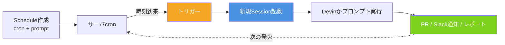

# Q30. Schedule機能とはCronのようなもの？指示はテキスト？使い方・制約・注意点

📚 [トップ索引](../../README.md) ｜ [カテゴリ索引: Devinリソース](README.md)

---

> **メタ**: 最終確認日 2026/4/16 ｜ 根拠 https://docs.devin.ai/product-guides/schedule ｜ 推定あり

### 結論: **「指示文（プロンプト）をcronスケジュールで自動起動する仕組み」**。単なるコマンド実行ではなく、**指定した時刻になったらDevinが新しいセッションを起こしてプロンプトに従って自律的に動く**

### Scheduleのライフサイクル



- cron式も使える（Custom mode）が、**Visual mode（毎時/毎日/毎週）** が標準
- **指示はテキスト**（通常のSessionと同じプロンプト）
- **Playbookもアタッチ可能**（推奨）
- 2種類: **Recurring（繰り返し）** / **One-time（1回だけ）**

参考: https://docs.devin.ai/product-guides/scheduled-sessions

### Cronとの違い（似て非なるもの）

| 観点 | Cron | **Devin Schedule** |
|---|---|---|
| 実行対象 | シェルコマンド / スクリプト | **Devinセッション**（エージェント起動） |
| 実行結果 | コマンドの終了コード | **自律的な作業結果**（PR / レポート / コメント） |
| 指示 | 固定コマンド | **自然言語プロンプト**（毎回同じ内容をDevinが解釈） |
| 実行環境 | cron対象ホスト | **新しいDevin VM**（Machine Snapshotから復元） |
| 結果の形 | ログファイル | **セッション履歴 + PR + Slack/Email通知** |
| 動的判断 | 不可 | **Devinがその時の状況で判断して動く** |

→ **「毎週月曜9時にDevinに『今週の依存関係update状況を調べてPRを作って』と頼む」**という仕組み。

### 作成方法（2ルート）

#### 方法A: 入力ボックスから
1. ホーム画面の入力ボックスにプロンプトを書く
2. 右端の **︙メニュー → Schedule Devin** を選択
3. スケジュール作成ページへ遷移（プロンプト引き継ぎ済み）

#### 方法B: Settings > Schedulesから
1. サイドバー `Settings > Schedules`
2. **Create schedule**
3. 全項目を入力

### 設定項目（全8項目）

| 項目 | 内容 | 備考 |
|---|---|---|
| **Name** | スケジュール名（識別用） | 例: "Daily CI Report" |
| **Schedule type** | Recurring / One-time | デフォルト: Recurring |
| **Agent** | Devin / Data Analyst / Advanced | 通常はDevin |
| **Playbook** | アタッチするPlaybook（任意） | 毎回適用されるので**推奨** |
| **Repositories** | 作業対象のrepo（任意） | プロンプトにヒントとして付与 |
| **Frequency** | 周期（Recurring時） | Visual/Custom cron |
| **Run at** | 実行日時（One-time時） | ローカルtz → UTC自動変換 |
| **Email / Slack通知** | 実行後の通知 | 失敗時のみ / 常時 / なし |
| **Run as** | 実行ユーザ | 通知先と課金帰属 |
| **Prompt** | Devinへの指示文 | 通常セッションと同じ自然言語 |

### Frequency（周期）の書き方

#### Visual mode（推奨、初心者向け）
- **Hourly**: N時間ごと（例: 6時間ごと）
- **Daily**: 毎日 HH:MM
- **Weekly**: 毎週の指定曜日 HH:MM

→ **ローカルタイムゾーンで入力**、内部でUTC変換。

#### Custom mode（cron式）
標準cron書式:
```
分 時 日 月 曜日
0  9  *  *  1-5    ← 平日9時(UTC)
0  */6 * * *       ← 6時間ごと
30 3  1  *  *      ← 毎月1日3:30(UTC)
0  0  *  *  0      ← 毎週日曜0時(UTC)
```

⚠️ **Custom modeの時刻はUTC基準**（Visualと違ってローカル→UTC変換なし、自分で計算）。

### Prompt（指示テキスト）の書き方

通常のSessionと同じ自然言語で書く:

#### 例1: 定期回帰テスト
```
以下のrepoで毎日の回帰テストを実行してください:
1. `main` ブランチの最新コミットをcheckout
2. npm ci && npm run test:e2e を実行
3. 失敗があればIssue起票（タイトル: "E2E regression YYYY-MM-DD"）
4. 失敗が多い場合はSlack #alerts に投稿
5. 成功時はログのみ、PR作成不要
```

#### 例2: 週次依存関係レポート
```
毎週月曜に以下を実施:
1. `npm outdated --json` で依存確認
2. patch版のみを更新するPR作成（ブランチ: `chore/weekly-deps-YYYY-WW`）
3. minor/major は別Issueに起票して人間判断を仰ぐ
4. CIが通ったらレビュー依頼コメント
```

#### 例3: データクオリティチェック（One-time）
```
2026/06/15 09:00 JSTに1回だけ実施:
1. 本番DBのスナップショット（読取専用アクセス）から集計
2. データ異常値を検出してレポート
3. 結果をmarkdownで Slack #data-quality にポスト
```

### Playbookとの組み合わせ（⭐推奨）

Playbookをアタッチしておくと、**毎回同じ手順で動く**:

```
Schedule設定:
  Playbook: "Weekly Dependency Upgrade"
  Prompt: "このrepo: coolerking/mfg_drone で週次依存関係更新を実施"

→ Playbook内のProcedure/Specifications/Forbidden Actions が毎回適用される
→ 結果の一貫性が担保される
```

**Playbookなしでプロンプトだけ** にすると、実行毎に微妙に動作が変わる可能性がある。定期実行は**Playbookで手順を固定するのがセオリー**。

### 典型的なユースケース

| ユースケース | 周期 | Playbook例 |
|---|---|---|
| 夜間回帰テスト | Daily 03:00 | "Run regression + triage failures" |
| 週次依存更新 | Weekly 月曜09:00 | "Weekly dependency upgrade" |
| 月次セキュリティスキャン | Monthly 1日 | "Run Snyk + create fix PRs" |
| 日次ログ集計 | Daily 08:00 | "Aggregate yesterday's logs + report" |
| Slack日報 | Weekdays 18:00 | "Summarize today's PRs + post to Slack" |
| ドキュメント更新 | Weekly 金曜17:00 | "Regenerate API docs from OpenAPI" |
| Stale PR reminder | Daily 10:00 | "List PRs open >7 days + nudge authors" |
| データ整合性チェック | Daily 02:00 | "Run data quality checks on staging DB" |
| 障害検知 | Hourly | "Check error rate from Sentry + alert" |
| リリースノート | Weekly 月曜10:00 | "Draft release notes from last week's merges" |

### 通知設定

#### Email
- **Always**: 毎回通知
- **On failure only**（デフォルト）: 失敗時のみ
- **Never**: 無通知

#### Slack
- 組織のSlack連携が必要
- チャンネルを指定して結果ポスト
- **失敗時のみポスト**等の設定はSlack側のフィルタで

### 制約・注意事項

#### 💰 コスト面
- **実行のたびに新しいSessionが生まれる = その分の課金が発生**
- **Max/Teamsプラン等の従量課金** に直接響く
- **Cronの頻度を安易に高くしない**（毎分実行→月4万回のSession起動は爆死コース）
- 目安: **1日1〜数回、週次、月次**が現実的

#### ⏰ タイムゾーン
- **Visual mode**: ローカルtz入力 → UTC自動変換
- **Custom cron mode**: **UTC基準**で書く必要あり（要手動変換）
- サマータイムの国ならずれに注意

#### 🤖 Agentの独立性
- 各実行は**完全に独立した新VM**
- セッション間で状態は**引き継がれない**（前回の作業結果を使いたいなら**Knowledge更新** or **PR作成** で残す）
- **前回の続き** をやらせたいなら、プロンプトに「git log / GitHub Issuesから前回の状況を確認して」と明示

#### 🔀 並行実行
- 実行タイミングが重なった場合、**別々のVMで並行実行**される
- 同じrepoを触るスケジュールが被ると**PRコンフリクト**の可能性あり
- 対策: 周期をずらす、ロック的な挙動はCI側で制御

#### 🧠 プロンプトの曖昧さ
- **通常Sessionより厳密にプロンプトを書く**必要あり
- 人間のフォローが入らないので、**要件と完了条件を明確化**
- Playbookで**Forbidden Actions**を書いて暴走防止

#### 🔒 権限・認証
- **実行者（Run as）の権限**で動く
- Secrets、Knowledge、repo access はRun as userのものを使う
- **退職者のアカウントでSchedule放置はリスク**（Run asを他の人に移す）

#### 📊 失敗時の扱い
- スケジュール実行が失敗しても**自動リトライはない**
- Email/Slack通知で気付く → 手動で再実行 or 原因調査
- **しつこい失敗**はコスト浪費の元、調査・停止を迅速に

#### 🌐 社内LAN/外部リソース
- **セッションVMは外部ネットワーク側**（Q41参照）
- 社内LANにアクセスするスケジュールは**Tailscale等のセットアップ**が必須

#### 🎯 Repositoriesの扱い
- 指定するとDevinにヒントとして渡される
- 未指定だとプロンプトから推測
- **複数repo指定**も可（1セッション多リポ運用時）

### One-time scheduleの特徴

- **指定日時に1回だけ実行**、その後自動無効化
- スケジュールと実行履歴は**監査のため保持**される（削除されない）
- 未来の時刻しか指定不可
- 使い所:
  - リリース日の特定時刻に作業を走らせたい
  - 開発者不在の夜間/休日に決まった作業
  - データ集計の締めタイミング

### Recurring scheduleの特徴

- cron basedで**継続的に繰り返し**
- 無効化するまで止まらない（**放置すると永久に動き続ける**）
- 無効化・削除は `Settings > Schedules`から
- **Soft delete**（履歴は残る）

### Scheduleの管理

`Settings > Schedules` で一覧確認:

- 各スケジュールを **有効/無効** 切替
- **編集**（時間、プロンプト、Playbook変更）
- **実行履歴**から過去の実行セッションに飛べる
- **削除**（soft delete、履歴は保持）

### API経由での管理

Enterprise向けにAPIで操作可能:
- `POST /v3/organizations/schedules` で作成
- `PATCH /v3/organizations/schedules/{id}` で更新
- `DELETE` で削除

→ IaC的に**Terraform / スクリプトで管理**することも可能。

### よくある落とし穴

#### 1. 頻度を上げすぎて課金爆発
- 「毎分チェック」等は絶対NG
- 必要な頻度まで落とす、または**Webhookや通常のCI**で代替

#### 2. Schedule内Sessionが勝手にmainにpush
- プロンプトで「PRのみ、直接push禁止」と明記
- PlaybookのForbidden Actionsに書く

#### 3. タイムゾーンずれでバッチが動かない
- Custom cronはUTC基準を忘れる → 日本時間と9時間ずれる
- Visual modeの利用を推奨

#### 4. 前回結果を引き継げない
- Schedule間のVM独立を忘れる
- 対策: KnowledgeやIssueに結果を残す指示を入れる

#### 5. 失敗に気付かない
- 通知をOffにしたまま → 数週間気付かずに全失敗
- **最低でも「失敗時通知」はオン**に

#### 6. 退職者のRun asが残る
- 退職者アカウントが無効化されるとSchedule全停止
- 定期的にRun as棚卸し

#### 7. Playbookなしで一貫性欠如
- プロンプトだけだと実行毎に微妙に違う動き
- **定期実行は必ずPlaybookで手順固定**

### 推奨セットアップ手順

1. **Playbookを先に作る**（手順を固定化）
2. **Schedule作成**でそのPlaybookをアタッチ
3. 最初は **頻度を低めに**（週1など）でテスト運用
4. **失敗時Email通知オン**
5. 数回の実行結果を見て微調整(プロンプト、Playbook)
6. 問題なければ頻度を適正化
7. **実行ログと結果PR/Issueを定期レビュー**
8. 不要になったら**必ず無効化/削除**（放置コスト注意）

### Devinでの機能組み合わせ表

| 機能 | Scheduleでの役割 |
|---|---|
| **Prompt** | Devinへの指示（自然言語） |
| **Playbook** | ⭐ 手順を固定、一貫性確保 |
| **Repositories** | 作業対象repoのヒント |
| **Knowledge** | プロジェクト文脈を自動注入 |
| **Repo Setup** | 実行時の環境構築を自動化 |
| **Secrets** | 認証情報を安全に注入 |
| **Slack連携** | 結果のチーム共有 |
| **Email通知** | 失敗検知 |

### まとめ

| 観点 | 結論 |
|---|---|
| Cronか？ | **概念は似ている、だが実行対象は「シェル」ではなく「Devinエージェント」** |
| 指示方法 | **自然言語プロンプト**（通常Sessionと同じ）+ Playbook（推奨） |
| 周期指定 | Visual mode（毎時/日/週）or Custom cron（UTC基準） |
| 種類 | **Recurring**（繰り返し）/ **One-time**（1回） |
| 通知 | Email（失敗時デフォルト）/ Slack |
| コスト | **実行毎にSession課金**、頻度は慎重に |
| 制約 | VM独立・UTC注意・失敗リトライなし・並行実行注意 |
| 推奨 | **Playbookで手順固定**、**低頻度でテスト→適正化**、**失敗通知は必ずオン** |

**核心メッセージ**: Scheduleは「**Devinに定期的に自然言語で依頼を投げる仕組み**」。cronの便利さ + エージェントの自律性 = **定型業務の自動化に強力**。ただし**コスト・一貫性・失敗検知**の3点だけは確実に設計する。初心者は**1つのPlaybook × 週次Scheduleから**始めるのが安全です。

**核心**: **Schedule 機能で定期実行が可能**。Cron 式 + Playbookの組み合わせでバッチ処理を自動化できる。

---

[← Q29. Devin Wikiとは？Codex CLI/Claude CodeのようなローカルRAGか？Ask/Sessionで問い合わせるrepoは事前登録が必要？](q29-devin-wiki.md) ｜ [Q31. Secretsの使い方は？（Org/Personalスコープ・同一キー重複時の挙動） →](../08-secrets-api/q31-secrets.md)
