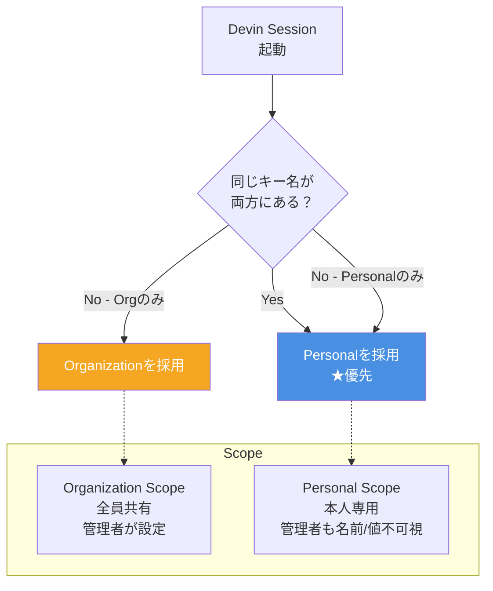
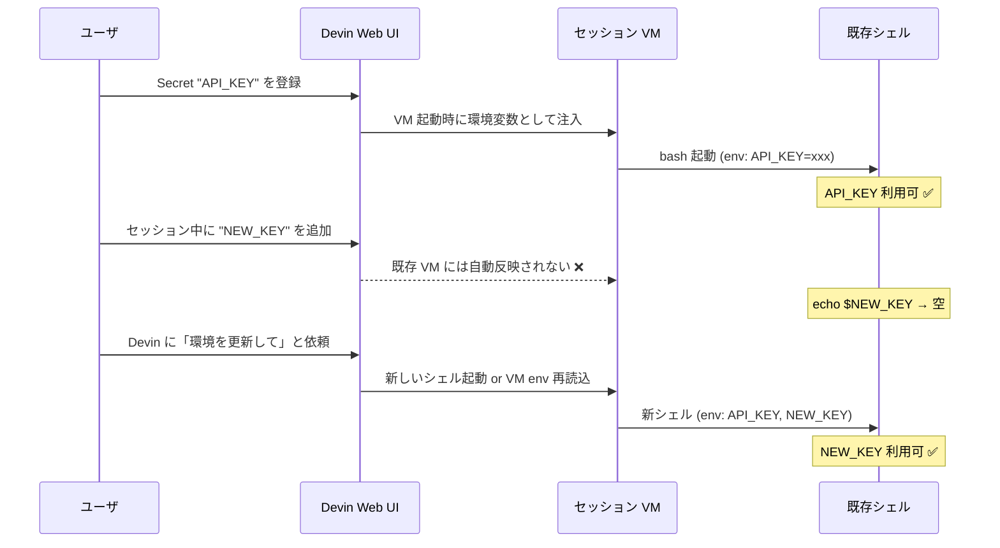

# Q31. Secretsの使い方は？（Org/Personalスコープ・同一キー重複時の挙動）

📚 [トップ索引](../../README.md) ｜ [カテゴリ索引: Secrets・API](README.md)

---

> **メタ**: 最終確認日 2026/4/16 ｜ 根拠 https://docs.devin.ai/product-guides/secrets ｜ 推定あり

### 結論: **一般的には「Devin専用アカウントのログイン情報」「APIキー」「2FA」の3系統**。スコープは **Organization（全員共有）** と **Personal（自分専用）** の2段階。**同一キーが両方にある場合は Personalが優先**（上書き）される挙動が仕様

### Secrets スコープと優先順



参考: https://docs.devin.ai/product-guides/secrets

### 一般的な使い方（カテゴリ別）

| カテゴリ | 具体例 | 用途 |
|---|---|---|
| **ログイン情報** | `GITHUB_USERNAME` + `GITHUB_PASSWORD` | Webサイト/ツールへのログイン |
| **APIキー** | `OPENAI_API_KEY` / `STRIPE_SECRET_KEY` | 外部API呼び出し |
| **SSH鍵** | `AWS_SSH_PRIVATE_KEY` | サーバ接続 |
| **DBクレデンシャル** | `DB_PASSWORD` / `DATABASE_URL` | ステージングDB接続 |
| **トークン** | `NPM_TOKEN` / `SENTRY_TOKEN` / `DOCKER_HUB_TOKEN` | CI系サービス |
| **VPN/トンネル** | `TAILSCALE_AUTH_KEY` / `CLOUDFLARE_TUNNEL_TOKEN` | 社内LAN接続 |
| **Site Cookies** | Amazon / Linkedin等のセッションcookie | ブラウザ自動ログイン |
| **TOTP (2FA)** | Google / AWS等の2FA | 2要素認証対応 |

#### 推奨: **Devin専用アカウントを作る**
- 個人アカウントの認証情報を渡すと**権限過多 + 監査困難**
- 例: `devin@company.com` というGitHub/Slack/AWSアカウントを作ってDevin専用に
- 最小権限で運用、ログイン履歴も分離できる

#### Secret Types（4種類）

| 種類 | 用途 |
|---|---|
| **Raw Secret** | 一般的な単一値（APIキー/パスワード等） |
| **Site Cookies** | ブラウザログイン状態をそのまま持ち込む |
| **TOTP** | 2FAのワンタイムパスワード |
| Key-Value Secrets | **廃止済み**（複数値なら Rawを複数作る） |

### Organization vs Personal スコープ

| 観点 | **Organization**（Global） | **Personal** |
|---|---|---|
| 利用可能範囲 | **組織全員**のセッション | **自分だけ**のセッション |
| 閲覧・編集 | **管理者のみ** | **本人のみ** |
| 他メンバーへの露出 | ◯（使える） | ❌（存在も見えない） |
| 用途 | チーム共通のAPIキー等 | 個人アカウント紐付け・テスト値 |
| 登録場所 | Secretsページで **Organizationスコープ**を選択 | Secretsページで **Personalスコープ**を選択 |

#### ポイント
- **全員共有するもの**（チームのStripe本番キー、Devin専用アカウント） → **Organization**
- **個人アカウントに紐付くもの**（自分のGitHub個人トークン、自分のSlack個人2FA） → **Personal**
- **テスト目的の使い捨て** → **Personal**（他メンバーに見えない）

### ⭐ 同一キーが両方にある場合

#### 結論: **同名Secretは「連番付きの別ENV変数」として両方注入される（上書きしない）**

[公式ドキュメント](https://docs.devin.ai/product-guides/secrets)の "Working With Secrets" によれば、Devinは同名Secretが複数ある場合、**ENV変数化する際に `_2`, `_3` のような連番を末尾に付けて別変数にする**。

> If you have two secrets with the same name, Devin will add a counter to the end. For example, if you have two secrets named MY_SECRET you would end up with two ENV variables named MY_SECRET and MY_SECRET_2 and so on.

したがって「Personalが Organization を上書きする」という単純な優先順位は**公式には明記されていない**。どちらが `MY_SECRET` でどちらが `MY_SECRET_2` になるか、Personal参加時の挙動がスコープ横断でどうなるかは公式ドキュメントに記述がなく、**実運用ではアプリから期待通りのキーが読めない事故リスクがある**。

#### 挙動イメージ（公式記述に基づく）

```
Org Secret:      OPENAI_API_KEY = sk-org-prod-XXXX
Personal Secret: OPENAI_API_KEY = sk-personal-dev-YYYY

→ セッション環境変数:
   OPENAI_API_KEY   = （どちらかが割当、順序は公式非明記）
   OPENAI_API_KEY_2 = （残る片方）
```

#### 注意事項（重要）
- **「Personalが優先」は公式に明記されていない**ため、これに依存した設計は避ける
- **同じ名前は絶対に避ける**（連番で別変数になり、アプリ側で読み違える）
- **Personal scope は「個人テスト用の別名キー」**と位置付け、Orgと衝突しない命名を徹底する
- **厳密な挙動が必要なら小さなテストセッションで実環境の挙動を確認**する

#### ベストプラクティス: 命名を分ける（必須に近い推奨）
```
Org:       OPENAI_API_KEY_PROD
Personal:  OPENAI_API_KEY_DEV_MYACCOUNT

→ どちらがどのセッションで使われるか名前で即判別可能
→ 連番付け替え事故が起きない
```

### Secretsの使い方Tips

#### 1. Noteを必ず書く
登録時の「Note」欄に**用途・有効期限・所有者**を書く:
- 「本番のみ、staging/devでは使わない」
- 「us-west-2のRDS用」
- 「Q3/2025で廃止予定」
- 「30日毎に自動ローテ、SecOpsに連絡」
- 「`devin@company.com` アカウント紐付け」

→ **他メンバー（とDevin自身）が誤用を防げる**。

#### 2. 最小権限で作る
- **読み取り専用アカウント**を作る
- **本番アクセスは別Secret・別アカウント**で管理
- IAMポリシー / スコープトークン で絞る

#### 3. Secret名は大文字スネーク
- `STRIPE_API_KEY`（推奨）
- `stripe_api_key`や `StripeKey` は避ける（環境変数として注入される）

#### 4. 定期ローテ
- 3〜6ヶ月で期限切れ/ローテ
- Noteに次回ローテ予定日を書く

#### 5. ログ漏洩対策
- SecretsはDevinのログに**出力されない**（暗号化保存）
- ただし、**Devinが作るコードにベタ書きさせない**よう指示を徹底

#### 6. 本番情報はなるべく入れない
- 本番DBパスワード / 本番AWS Adminキー等は**Devinに渡さない方針が無難**
- どうしても必要なら**踏み台サーバ経由**（Q41参照）で間接アクセス

### セッション単位 / リポ単位のSecret

Secretsページの他に、**セッション内で一時的に渡す**こともできる:
- セッション開始時の入力で「この値を使って」と渡す → **そのセッションのみ**
- **リポ単位のSecret**（repo-specific）も指定可（一部プラン）

### APIで管理

Enterpriseでは**APIでSecretの作成/一覧/削除**が可能:
- `POST /v3/organizations/secrets`
- `GET /v3/organizations/secrets`
- `DELETE /v3/organizations/secrets/{id}`

→ **Terraform / IaC でSecretsを管理**も可能。

### よくある落とし穴

#### 1. 重複キーで意図しない値が使われる
→ **命名を分ける**、両スコープの一覧を定期確認

#### 2. Personal Secretが組織に見えないため、他メンバーが困る
→ チーム用は**必ずOrganization**、個人用だけPersonal

#### 3. 本番情報を気軽にPersonalに入れる
→ **監査ログから漏れる可能性**、本番は極力Orgで管理して権限者を制限

#### 4. Secret名が被って上書きされた
→ **命名規則**（`_PROD` / `_DEV` サフィックスなど）

#### 5. Noteが空で、次の担当者が用途不明
→ **Noteを必須運用**にする

#### 6. ローテを忘れて有効期限切れ
→ Noteに期限記載、カレンダーリマインダー

### セッション中にSecretを追加した場合、即時反映されるか

#### 結論: **原則として即時反映されない**

**Secretsは VM 起動時に環境変数として一括注入される**仕組みのため、**セッション開始後に追加/変更した Secret は既存のシェルプロセスには自動で反映されない**（Linux の環境変数は子プロセス継承時のみ反映される仕様上の制約）。



#### 挙動パターン

| タイミング | 既存シェル | 新規シェル | 新規セッション |
|---|---|---|---|
| セッション開始**前**に追加 | ✅ 使える | ✅ | ✅ |
| **セッション中に追加** | ❌ 使えない | △ 環境依存 | ✅ 使える |
| セッション中に**値を変更** | ❌ 古い値のまま | △ 環境依存 | ✅ 新しい値 |
| セッション中に**削除** | ❌ 古い値が残存 | △ 環境依存 | ✅ 反映 |

> **注**: 「新規シェル」の△は、Devin の VM がどのタイミングで env を再取得するか（プロセス親子関係・envファイル再読込の仕組み）に依存する。確実なのは**新規セッション開始**。

#### 反映させる具体手順（推奨順）

##### 🅰️ 新規セッション開始（最も確実）
1. 現セッションで作業中のコードを PR 化するか、途中状態をコミット/Knowledge 化
2. Devin Web UI 上部の **「New Session」** または **「Start New Session」** をクリック
3. 同じリポジトリ・Playbook を指定して新セッション開始
4. 新 VM 起動時に**最新の Secrets 一式が注入される**
5. 検証: Devin に「`echo $NEW_KEY` を実行して」と依頼し、値が入っていることを確認

##### 🅱️ 既存セッションで Devin に「環境更新」を依頼（簡便）
1. Devin Web UI の Secrets ページで新しい Secret を追加（例: `STRIPE_API_KEY`）
2. **同じセッションのチャットに戻り**、以下のように依頼:

   ```
   Secrets に STRIPE_API_KEY を追加したので、新しいシェルで環境変数を確認して。
   使えない場合はセッション再起動を検討してください。
   ```

3. Devin は**新しいシェル（新しい `exec` セッション）を開いて** `echo $STRIPE_API_KEY` を実行
4. **値が取れれば成功**。空なら 🅰️ (新規セッション) にフォールバック
5. ⚠️ **注**: この手順は**公式にドキュメント化された「Reload Secrets」ではない**（執筆時点では公式に専用ボタン無し、動作観察ベース）

##### 🅲 一時的にチャットで値を渡す（非推奨）
1. チャットで「今回だけ `TEMP_TOKEN=xxx` として使って」と直接伝える
2. Devin はセッション内の一時変数として利用
3. ⚠️ **リスク**: **値がセッション履歴に平文で残る**ため、本番キーには絶対使わない。短期の検証/デバッグのみ

##### 🅳 アプリ側で Secret Manager から都度取得（根本解決）
1. Devin Secrets には**Secret Manager 用の認証情報のみ**登録（例: AWS Access Key）
2. アプリコード側で `boto3.client('secretsmanager').get_secret_value(...)` で都度取得
3. Secret のローテ/追加時に Devin セッションを再起動する必要**なし**（Secret Manager 側を更新すれば反映）
4. ⭐ **本番運用の推奨パターン**

#### API Key（Devin API）の追加時は？
Devin API 経由でセッション制御するための API Key 自体を新規発行した場合も**同様**。既存セッション内で `DEVIN_API_KEY` を使う予定があれば、新規セッション開始が最も確実。

#### トラブルシューティング

| 症状 | 原因 | 対処 |
|---|---|---|
| `echo $NEW_KEY` が空 | 既存シェルに反映されていない | 新しいシェル/新セッションで再試行 |
| 新セッションでも空 | Secret の**スコープ違い**（Personal/Org）・タイポ | Secrets ページで名前とスコープを再確認 |
| 古い値のまま | 既存シェルの環境変数がキャッシュされている | 新セッション起動（🅰️） |
| 複数の同名 Secret が `_2`, `_3` で入る | Org/Personal の両方に同名登録 | 片方削除、または連番 ENV を参照 |

> **注**: 公式ドキュメント（https://docs.devin.ai/product-guides/secrets ）に「即時反映される」「再起動不要」の明記は**執筆時点で確認できず**、上記は実運用観察ベース。厳密な仕様確認が必要なら Cognition サポートへ。

### まとめ

| 観点 | 結論 |
|---|---|
| 一般的な使い方 | **Devin専用アカウント / APIキー / トークン / 2FA / Cookie** を保存 |
| スコープ | **Organization（全員）** と **Personal（自分のみ）** の2段階 |
| 同一キーが両方ある場合 | **Personalが優先**（組織値を上書き） |
| 推奨 | **Devin専用アカウント**、**最小権限**、**Note必須**、**命名規則で重複回避** |
| 注意 | **本番情報は極力避ける**、**Personal/Organの優先順位を意識**、**ローテ管理** |

**核心**: Secretsは「**Devinに認証情報を安全に渡すための一元管理**」。スコープ設計（Org/Personal）と命名規則、Note運用を整えれば混乱しない。

---

[← Q30. Schedule機能とはCronのようなもの？指示はテキスト？使い方・制約・注意点](../07-devin-resources/q30-schedule.md) ｜ [Q32. Devin API Keyの使い方は？（API操作・MCP・Skill経由） →](q32-api-key.md)
