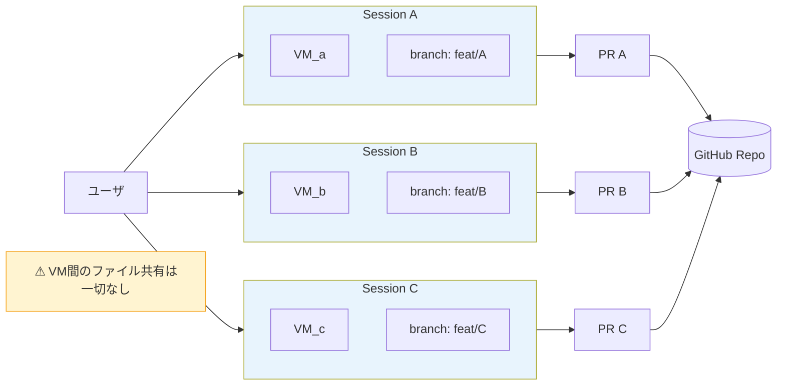

# Q34. 別々のセッションで並行作業している場合、それぞれのスコープはブランチ/ワークツリーか？

📚 [トップ索引](../../README.md) ｜ [カテゴリ索引: マルチセッション・複数リポ](README.md)

---

> **メタ**: 最終確認日 2026/4/16 ｜ 根拠 https://docs.devin.ai/work-with-devin/sessions ｜ 推定あり

### 結論: **各セッション = 独立したVM + 独立したブランチ**。並行セッション間でファイルシステムは一切共有されない

### マルチセッションの独立性



Devinのセッションは**クラウド上の独立したVM（サンドボックス）** 上で走る。同じrepoに対して3セッション並行で動いていたら、**VMが3台別々に立ち上がっている**。

```
Session A (VM_a)                Session B (VM_b)                Session C (VM_c)
  ├ /home/ubuntu/repo             ├ /home/ubuntu/repo             ├ /home/ubuntu/repo
  │    branch: devin/1234-auth    │    branch: devin/1235-db       │    branch: devin/1236-ui
  ├ 独自の環境変数                  ├ 独自の環境変数                  ├ 独自の環境変数
  ├ 独自のプロセス・シェル            ├ 独自のプロセス・シェル            ├ 独自のプロセス・シェル
  └ 独自のブラウザ                   └ 独自のブラウザ                   └ 独自のブラウザ
```

→ **ワークツリーは完全分離**、ローカルでのファイル競合は発生しない。

### セッション間で共有されるもの / されないもの

#### 共有されない（完全分離）
- ✅ ファイルシステム（`/home/ubuntu/...`）
- ✅ 実行中のプロセス（dev server、DB、テストランナー等）
- ✅ 環境変数・シェル状態
- ✅ ブラウザのセッション・Cookie
- ✅ ワーキングディレクトリ内の変更（commit前）
- ✅ VM上のパッケージキャッシュ（npm/pip）

#### 共有される（repo or Devin組織レベル）
- ⚠️ **リモートリポジトリ（origin）**: 全セッションが同じGitHub repoをpushする
- ⚠️ **AGENTS.md / `.agents/skills/` / Playbook**: repo内にあるので全セッションが同じ内容を読む
- ⚠️ **Knowledge**: Devin組織レベルで共有、全セッションに注入される
- ⚠️ **Secrets**: Devin組織レベル、全セッションから参照可
- ⚠️ **外部サービス**: Slack / Linear / Jira等は実体が1つなので競合しうる
- ⚠️ **課金メータ**: ACU/Premium Requestsの消費は組織枠を共有

### ブランチ戦略（自動で衝突回避される仕組み）

Devinは自動で**ユニークなブランチ名**を切る:

```
devin/<unix_timestamp>-<short-description>

例:
  Session A: devin/1713312000-add-user-auth
  Session B: devin/1713312120-refactor-db-layer
  Session C: devin/1713312240-update-ui-header
```

→ timestampが違うので**セッション間でブランチ名が被ることはない**。

### よくある誤解と注意点

#### 誤解1: 「同じファイルを2セッションが触ったら壊れる」
→ 壊れません。別VM・別ブランチなので、ファイルシステムレベルで分離されている。
**衝突はPRマージ時に発生**する（通常のGitコンフリクトと同じ）。

#### 誤解2: 「1つのセッションが入れたdependencyが他のセッションでも使える」
→ 使えません。VM別なので `npm install` の結果も別々。
→ 対策: **AGENTS.md / Skill / Repo Setup** に「このrepoは `npm ci` で起動」等を書いておくと、各セッションが独立に同じセットアップをする。

#### 誤解3: 「外部リソース（DB/Slack/デプロイ先）も分離されている」
→ されていない。**本物のSlack/DB/デプロイ先は1つ**なので:
- **同じIssueに2セッションが割当てられないよう**運用でロックをかける（ラベル、assignee等）
- **共有DB**を触らせる設計は避ける（セッション毎にテスト用DBを立てる）
- **Slack通知が重複**しないようラベルで統制

### 実務での並行セッション運用のコツ

#### 良いパターン ✅

1. **Issue単位で分割されたタスクを並行実行**
   - Session A: Issue #12（認証API実装）
   - Session B: Issue #13（DBスキーマ定義）
   - Session C: Issue #14（フロントUI）
   - → ファイルもブランチも独立、PRも独立

2. **読み取り調査（Ask Devin）と実装（Session）の並走**
   - Ask Devinで調査しながら別セッションで実装
   - 調査結果はKnowledgeに蓄積 → 次の実装セッションが自動参照

3. **PRレビュー対応の並行**
   - 1つのセッションでPR Aのレビュー対応、別セッションでPR Bのレビュー対応
   - 別ブランチなので干渉なし

#### 避けるべきパターン ❌

1. **同じファイルを大きく変更する複数セッションの並行**
   - マージコンフリクトが頻発する
   - → 順次実行に切り替える or タスクを細かく分ける

2. **同じIssueに複数セッションを割当**
   - 同じブランチに同じ内容を2重でcommitする可能性
   - → **1 Issue = 1 Session** のルールを徹底

3. **共有リソースへの破壊的操作**
   - 本番DB migration、本番デプロイ等を並行セッションで叩く
   - → 運用ルールで制限、Branch Protectionで本番反映をガード

### セッション間の依存関係をどう扱うか

**問題**: Session Bが Session Aの成果物（例: 新しい型定義）に依存する場合

**解決策**:

| パターン | 方法 |
|---|---|
| **直列化** | Session A完了後にSession Bを開始（最もシンプル） |
| **ベースブランチ切り替え** | Session BのベースをSession Aのブランチに設定（Aのマージ前でも試せる） |
| **Knowledge経由の情報共有** | Session Aが決めた命名規約などをKnowledgeに登録 → Session Bが参照 |
| **中間マージ** | Session AをmainにマージしてからSession Bを走らせる |

### まとめ

| 観点 | スコープ |
|---|---|
| **VM（ファイルシステム・プロセス・ブラウザ）** | **セッション単位で完全分離** |
| **ブランチ** | **セッション毎に自動でユニーク**（`devin/<timestamp>-...`） |
| **リモートrepo** | 組織で共有（マージ時にコンフリクト発生しうる） |
| **Knowledge / Skills / Playbooks** | **組織/repoで共有**（全セッション参照） |
| **Secrets** | 組織で共有 |
| **外部サービス（Slack/DB/デプロイ）** | 実体が1つ、運用で制御 |

**設計指針**: 並行セッションはVM＋ブランチで完全分離されるので**大胆に並列化してOK**。ただし**同じファイルを大きく触るタスクの並行は避ける**（マージコンフリクト対策）。**1 Issue = 1 PR = 1 Session** の原則を守れば基本的に問題は起きない。

**核心**: **各セッション = 独立 VM + 独立ブランチ**。VM 間のファイル共有はなく、衝突は PR マージ時にのみ発生する。

---

[← Q33. API Keyタブの「Legacy」は今後なくなる？変更される？](../08-secrets-api/q33-api-legacy.md) ｜ [Q35. フロント/バックなど複数リポを1セッションで管理できる？ →](q35-multi-repo.md)
