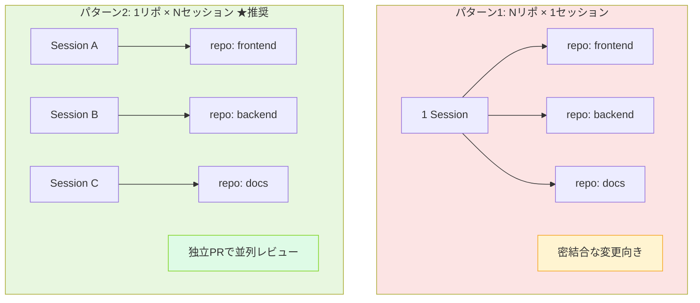

# Q35. フロント/バックなど複数リポを1セッションで管理できる？

📚 [トップ索引](../../README.md) ｜ [カテゴリ索引: マルチセッション・複数リポ](README.md)

---

> **メタ**: 最終確認日 2026/4/16 ｜ 根拠 運用観察ベース ｜ 推定あり

### 結論: **技術的には可能**。ただし**原則は「1セッション = 1リポ = 1PR」**、複数リポを1セッションで扱うのは**密結合な変更を同時に出したい時の限定運用**

### マルチリポ运用の2パターン



Devinの仕様上、**Devin's Machineに登録された全リポは全セッションのVMにcloneされる**ため、1セッションで複数リポにまたがる作業ができる。ただし初心者には**モノリポ化 or 1リポずつのセッション分割**を推奨する。

### 技術的な仕組み

#### Devin's Machineは複数リポを保持

```
Devin's Machine（Snapshot）
  └ /home/ubuntu/repos/
       ├ myapp-frontend/    ← cloneされる
       ├ myapp-backend/     ← cloneされる
       └ myapp-shared/      ← cloneされる

Session開始時:
  Snapshotから復元 → 全repoがすぐ使える
  各repoに対して独自の Repo Setup が適用される
```

参考: https://docs.devin.ai/onboard-devin/repo-setup

- 各リポは**個別にRepo Setupを定義**
- セッション開始時に **git pull** が各リポで実行される
- Devinはどのリポで作業するか自律的に判断 / 指示で誘導可能

#### 1セッションでの複数PR作成

1つのセッション内で:
```
Session VM:
  ├ myapp-frontend: feature/new-auth ブランチで編集 → PR_A 作成
  └ myapp-backend:  feature/new-auth ブランチで編集 → PR_B 作成
```

→ **複数のPRが同じセッションから生まれる**。PR description同士を相互リンクさせて「このFEはこのBEとセット」と明示するのが定石。

### ⭐ 推奨される運用パターン

#### パターン1（初心者推奨）: **1リポ = 1セッション**

```
Task: ログイン機能追加
  ├ Session A → backend repo で API 追加 → PR_A
  └ Session B → frontend repo で UI 追加 → PR_B
```

**メリット**:
- **思考がシンプル**（1セッション = 1つの関心事）
- PRレビューが独立（FEレビュアーとBEレビュアーに分けやすい）
- 失敗時のリカバリが容易
- 並行実行可能（VMは独立）

**デメリット**:
- API契約の同期が難しい（先に片方をマージできない）
- **対策**: backend先行マージ → frontendが追従、またはOpenAPI schemaを共有リポで管理

#### パターン2: 密結合変更の**1セッション多リポ**

```
Task: 破壊的API変更（/v1/users → /v2/users）
  └ Session A:
       ├ backend repo を編集 → PR_A（新API追加、旧API廃止予定）
       └ frontend repo を編集 → PR_B（新API参照に切り替え）
       → 2つのPRを相互リンク、同時マージ
```

**向くケース**:
- APIスキーマの破壊的変更
- 型定義を共有する TypeScript monorepo 的構成
- テストが両方揃わないと通らない変更

**注意点**:
- Devinへの指示を「両方のrepoを見て、整合性をとって」と明示
- PR descriptionに相互リンク
- マージ順序とロールバック手順を明記

#### パターン3: **モノリポ化**（最も楽）

```
myapp-monorepo/
  ├ apps/
  │   ├ frontend/
  │   └ backend/
  ├ packages/shared/
  └ turbo.json / nx.json
```

→ **1リポだからDevinも扱いやすい**、PR 1本で整合性確保。
初心者のチーム新設プロジェクトなら**最初からモノリポを選ぶ**のが最も簡単。

### 複数リポ運用のベストプラクティス

#### 1. Devin's Machineに両方登録

```
Settings > Devin's Machine > Add repository
  → myapp-frontend
  → myapp-backend
```

両方とも**Repo Setup（install / build / test）を完成**させる。片方が未設定だと、そのリポに入った瞬間に環境構築で時間を食う。

#### 2. リポ間連携の手順をSkillに書く

`.agents/skills/`を**どちらかのリポ**に置いて、両方で参照:

例: `.agents/skills/cross-repo-api-change/SKILL.md`
```yaml
---
name: cross-repo-api-change
description: FE/BE両方のrepoにまたがるAPI変更の手順
---

## 前提
- backend: /home/ubuntu/repos/myapp-backend
- frontend: /home/ubuntu/repos/myapp-frontend

## 手順
1. backend で OpenAPI schema を更新
2. backend で実装（新API追加・旧API残す）
3. backend テスト実行
4. frontend で OpenAPI から型再生成（`npm run codegen`）
5. frontend で新APIに切り替え
6. frontend テスト実行
7. 2つのPRを作成し相互リンク
```

#### 3. Knowledgeに全体の文脈を登録

```
Knowledge: myapp プロジェクト構成
- Frontend: myapp-frontend (Next.js, /api経由でBackendを叩く)
- Backend: myapp-backend (FastAPI)
- 共有の型定義は myapp-backend の OpenAPI schema から生成
- 破壊的変更時は必ず両方同時にPR
```

→ セッションに自動注入され、Devinが複数リポ構成を前提に動ける。

#### 4. ローカル連動テスト

```bash
# 1セッション内で FE+BE を同時起動
cd /home/ubuntu/repos/myapp-backend && docker compose up -d db && uvicorn main:app --port 8000 &
cd /home/ubuntu/repos/myapp-frontend && npm run dev &

# ブラウザで localhost:3000 にアクセスして動作確認
```

→ **1 VM内で完結したE2Eテストが可能**。Test Modeと組み合わせれば動画証跡も取れる。

#### 5. Secretsの共有

- FE/BE両方が使う `JWT_SECRET` などは**Devin Secrets**に1度登録すれば両リポから参照可
- リポ個別のsecretsは各リポのRepo Setupで設定

### 避けるべきパターン ❌

#### 1. 大規模な複数リポ変更を1セッションに詰め込みすぎ
- FE/BE/Infra/Docs 4リポに渡る大改修を1セッションで
- → **1セッションが長時間・高コスト**化、失敗時のリカバリが大変
- **対策**: リポごとにセッション分割、または段階的に進める

#### 2. Repo Setupが片方しか整備されていない
- BEは整備済、FEは未整備 → Devinが FEで詰まる
- **対策**: 扱う可能性があるリポは**全部** Repo Setupを完成させる

#### 3. ブランチ名が両リポで別々
- backend: `devin/1234-auth`、frontend: `feat/auth-new`
- → 関連が視認しにくい
- **対策**: 両リポで**同じブランチ名**（例: `devin/1234-auth`）に揃える

#### 4. PR descriptionに相互リンクなし
- 片方だけマージされて片方取り残される事故
- **対策**: 両PRに `Related: owner/otherrepo#NN` を必ず記載、Devinに明示的に依頼

### 料金への影響

- **VM稼働時間はセッション単位**なので、1セッションに詰め込むと**そのセッションが長時間化**する
- **複数セッション並行**にした方が総時間は短い（VMは独立課金だが、壁時計時間は短い）
- 変更の性質で判断:
  - 独立した変更 → セッション分割
  - 密結合な変更 → 1セッションでまとめて

### 実務フロー例

#### 例1: 「FEに新しいページを追加、BEに新しいエンドポイントを追加」

**推奨**: パターン2（1セッション多リポ）
```
Devinへの指示:
「新しい `/dashboard` ページを追加します。
 - backend (myapp-backend) に GET /api/dashboard/stats を実装
 - frontend (myapp-frontend) にページ追加、そのAPIを叩く
 両方のrepoでブランチ名は devin/1713-dashboard に揃え、
 2つのPRを相互リンクしてください」
```

#### 例2: 「バグ修正（FEのみ）」

**推奨**: パターン1（1リポ1セッション）
```
frontend repo だけ指定してセッション起動、PR 1本。
```

#### 例3: 「共通ライブラリのバージョン更新（3リポ影響）」

**推奨**: 段階的セッション分割
```
Session A: shared-lib のバージョン更新 → PR → マージ
Session B: backend で shared-lib 更新 → PR → マージ
Session C: frontend で shared-lib 更新 → PR → マージ
```

### まとめ

| 観点 | 結論 |
|---|---|
| **技術的に可能か** | ✅ 可能。Devin's Machineに登録すれば全リポが1 VMにcloneされる |
| **初心者への推奨** | **1リポ=1セッション**が原則、複数リポは例外運用 |
| **密結合変更の場合** | 1セッション多リポで**同時PR作成 + 相互リンク** |
| **最も楽な構成** | **モノリポ化**してしまう |
| **重要な前提整備** | 扱うリポ全てで **Repo Setup 完成** + Knowledge登録 + Skill化 |
| **セッション設計原則** | **1セッション = まとめてマージすべき変更の単位** |

**beginners向け一言**: 「最初は1セッションで1リポだけ触る」。FE/BEが絡む変更は**backend → frontendの順**にセッションを分けて進めるのが事故が少ない。慣れてから複数リポ同時運用に踏み込む。

**核心**: **原則「1 リポ × N セッション」を推奨**。複数リポを 1 セッションで扱うのは密結合な変更が必要な時のみ。

---

[← Q34. 別々のセッションで並行作業している場合、それぞれのスコープはブランチ/ワークツリーか？](q34-parallel-sessions.md) ｜ [Q36. DBを持つシステムだと、DB用VMと開発用VMを分けて開発する？ →](../10-database-test-quality/q36-database.md)
