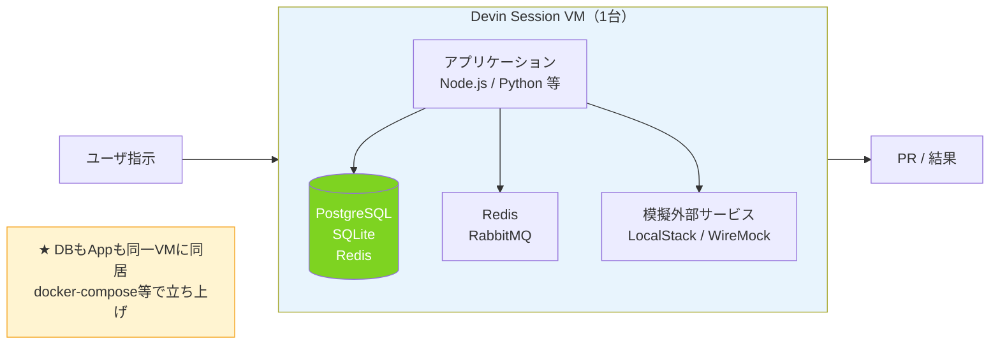

# Q36. DBを持つシステムだと、DB用VMと開発用VMを分けて開発する？

📚 [トップ索引](../../README.md) ｜ [カテゴリ索引: DB・テスト・品質・Review](README.md)

---

> **メタ**: 最終確認日 2026/4/16 ｜ 根拠 運用観察ベース ｜ 推定なし

### 結論: **1セッション = 1 VM**。DB用に別VMを立てたりしない。DBは**そのセッションVM内にローカル構築**するのが基本

### DB付きシステムの単一VM構成



Devinのセッションは**VM 1台**で完結する設計で、DBサーバを別VMに分離する仕組みは**ない**。DB必須のシステムで開発する場合は、次のいずれかのパターンを採る。

### パターン1: セッションVM内にDBをローカル起動（最も一般的）

```
Session VM (1台)
  ├ /home/ubuntu/repo          ← コード
  ├ docker compose up -d db    ← Postgres/MySQL等をVM内で起動
  ├ npm run migrate            ← マイグレーション
  ├ npm test                   ← アプリ + DBをローカルで結合テスト
  └ git commit / push
```

**推奨理由**:
- セッション間で完全分離される（他セッションのDBを壊さない）
- セッション終了時にVMごと破棄されるので、**テストデータが残らない**
- 本番DBを汚染するリスクがゼロ

**実装**:
- `docker-compose.yml`で DB コンテナ定義
- repo 内の **Repo Setup** に「`docker compose up -d db` → `npm run migrate`」を登録
- Devinはセッション開始時に自動でDBを立ち上げる

### パターン2: 開発用の共有DBに接続（外部DB）

```
Session VM_A ─┐
Session VM_B ─┼──→ 共有開発DB (RDS/Cloud SQL/etc)
Session VM_C ─┘
```

**使いどころ**:
- 本番相当の大規模データを使いたい
- 複数セッション横断でデータを共有したい
- 本物のマネージドDB（RDS/Spanner等）の挙動を確認したい

**注意点（超重要）**:
- ⚠️ **複数セッションが同じDBを壊しあうリスク**
- → セッション毎に**別schema / 別prefix**を使う（Session IDをテーブル名に含める等）
- → または**読み取り専用**で接続
- → ⚠️ **本番DBは絶対に接続しない**（Secrets管理で物理的に分離）

**実装**:
- Devin Secretsに `DATABASE_URL` を登録
- AGENTS.mdに「DBへの破壊的操作は禁止、テストは別schemaで」と明記

### パターン3: セッション毎にエフェメラルDB（理想形）

```
Session VM (1台)
  ├ docker run -d postgres:15 ← 毎セッション新規起動
  ├ schema init
  ├ seed data
  ├ テスト実行
  └ セッション終了と同時に消滅
```

- セッション毎に真っ新なDBが用意される
- **完全分離**・**再現性100%**・**副作用なし**
- フルスクラッチ開発では**これが最適解**

### パターン比較表

| 観点 | パターン1<br>ローカルDB | パターン2<br>共有DB | パターン3<br>エフェメラル |
|---|---|---|---|
| 分離度 | ◎ | × | ◎ |
| データ永続性 | △（セッション終了で消滅） | ◎ | ×（都度消滅） |
| 本番データ類似 | △ | ◎ | △ |
| 並行セッション安全 | ◎ | △（設計要） | ◎ |
| セットアップ速度 | ◯ | ◎ | △（都度起動） |
| 本番汚染リスク | なし | **あり**⚠️ | なし |
| **推奨度** | ⭐⭐⭐ | △（限定用途） | ⭐⭐⭐⭐ |

### Devin推奨: 「アプリ + DB を1 VM内にDocker Composeで立てる」

Devin開発の定番パターン:

```yaml
# docker-compose.yml
services:
  db:
    image: postgres:15
    environment:
      POSTGRES_DB: app_dev
      POSTGRES_PASSWORD: devpass
    ports: ["5432:5432"]

  redis:
    image: redis:7
    ports: ["6379:6379"]

  # アプリケーションはnpm run dev等でホストから起動
```

**Repo Setupに登録するコマンド**:
```bash
docker compose up -d db redis
npm ci
npm run migrate
npm run seed
```

→ セッション開始時に自動実行、Devinはすぐテストできる状態から作業開始できる。

### データベースマイグレーション作業の注意点

Devinにマイグレーションを書かせる際の運用:

#### 良いパターン ✅
- **ローカルDB（パターン1/3）で試行錯誤**
- マイグレーションファイルをPRに含める
- **本番DBへの適用は人間が手動で実行**（または承認後のCI経由）

#### 避けるべきパターン ❌
- 開発DB（パターン2の共有DB）で破壊的マイグレーションを直接実行
- 本番DBへの接続情報をDevin Secretsに保存

### 本番DB・ステージングDBの扱い（セキュリティ）

| DB | Devinから接続？ |
|---|---|
| ローカル開発DB（docker compose） | ✅ OK（セッションVM内で完結） |
| 個人開発用DB（個人のRDS等） | ✅ OK（ただし読み取り推奨） |
| チーム共有開発DB | △ 読み取りのみ推奨、書き込みはschema分離 |
| ステージングDB | ❌ 原則接続させない |
| **本番DB** | ❌❌❌ **絶対接続させない**（Secretsに入れない） |

### 具体的なシステム別構成例

#### Webアプリ（Rails / Django / Next.js + Postgres）

```
Session VM:
  ├ Postgres (docker compose)
  ├ Redis (docker compose)
  ├ アプリケーションサーバ (npm run dev / rails s)
  └ テストDB（別schema）
```

#### マイクロサービス（複数API + 共通DB）

```
Session VM:
  ├ Postgres (1つ、schema分離で複数サービス共存)
  ├ Kafka / RabbitMQ (docker compose)
  ├ 各サービスをローカルで起動
  └ E2Eテストを同VM内で完結
```

#### データ処理系（Spark / BigQuery相当）

- BigQueryなどの**本物のクラウドDB**はDevinからは読み取り専用接続
- 加工ロジックのテストはローカルのサンプルデータ（CSVやSQLite）で実施
- 本物のクラウドDBへの書き込みは人間の手動実行

### 並行セッションでDBがどうなるか

Q34で述べたとおり、**各セッションは独立したVM**なので:

```
Session A のVM:
  ├ Postgres (localhost:5432) ← A専用
  └ アプリA

Session B のVM:
  ├ Postgres (localhost:5432) ← B専用（別VM・別プロセス）
  └ アプリB
```

**同じ `localhost:5432` でも別VM上なので完全に別インスタンス**。ポート競合も発生しない。

### まとめ

1. **Devinは1セッション=1VM構成**、DB専用VMは立てない
2. **DBはセッションVM内にローカル起動**（docker compose推奨）
3. 並行セッションは**VMごと分離**なので**DB同士も完全分離**される
4. 共有DBを使うなら**schema分離**、本番DBは**絶対接続しない**
5. Repo Setupに「`docker compose up -d db && migrate && seed`」を書いておけば各セッションが自動で環境準備
6. エフェメラルDB（都度起動・都度破棄）が**フルスクラッチ開発では理想**

**核心**: **DBは基本「セッション VM 内に docker-compose 等で同居」**。別 VM 構成は取らず、VM ごとリセットできる設計にする。

---

[← Q35. フロント/バックなど複数リポを1セッションで管理できる？](../09-multi-session-repo/q35-multi-repo.md) ｜ [Q37. 繰り返しテストでDBを初期状態に戻すのに有効なDevin機能は？ →](q37-db-fixture-reset.md)
