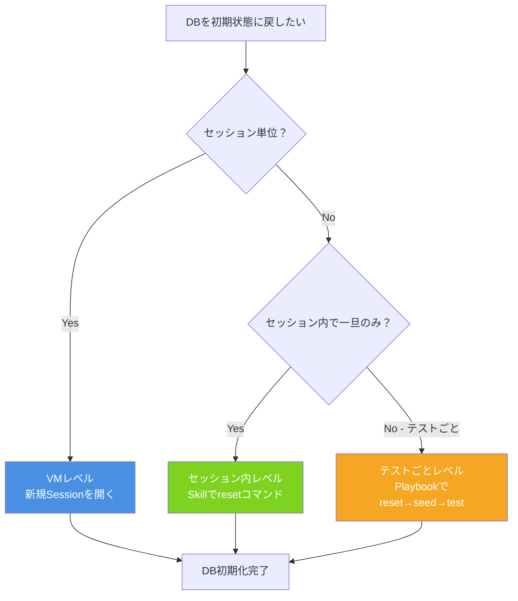

# Q37. 繰り返しテストでDBを初期状態に戻すのに有効なDevin機能は？

📚 [トップ索引](../../README.md) ｜ [カテゴリ索引: DB・テスト・品質・Review](README.md)

---

> **メタ**: 最終確認日 2026/4/16 ｜ 根拠 運用観察ベース ｜ 推定なし

### 結論: **3つのレイヤーで対処できる**

1. **VMレベル**: 新しいセッションを開けば**VMごと新品**（Machine Snapshotから復元）→ DBも自動で初期化
2. **セッション内レベル**: **Repo Setupの「Maintain Dependencies」＋リセットコマンド**をSkillに書く
3. **反復テストレベル**: **Playbook** に「reset → seed → test → assert」のサイクルを定義

### DBリセットの3レイヤ



### Devin特有の便利機能

#### ⭐ 1. Machine Snapshot（本命機能）

Devinは**VMの完全なスナップショットを持っていて、各セッションの開始時にそこから復元**される。

参考: https://docs.devin.ai/onboard-devin/repo-setup

```
Machine Snapshot（Repo Setupで定義）
  ├ OS + 依存ライブラリ（npm/pip等）
  ├ 初期化済みDB（postgres + スキーマ + シードデータ）
  └ 各種ツール

Session開始 → Snapshotから復元 → 常に同じ初期状態
```

- 新しいセッションを開けば**DBも自動でリセット**される（Snapshot時点の状態）
- 長時間セッション内で何度もテストする場合は、明示的なリセットコマンドが必要
- **Machine Version History**: スナップショット履歴を保持、破壊的変更があっても以前の状態に戻せる
  → `Settings > Devin's Machine > Version History` から復元可能

#### 2. Repo Setupの活用（セッション内のリセット）

Repo Setupには8ステップあり、DB関連で特に有用なのは:

| ステップ | DBリセットでの使い方 |
|---|---|
| **Install Dependencies** | 初回VMセットアップで DB init（docker compose up、初期スキーマ、seed） |
| **Maintain Dependencies** | セッション開始時に毎回実行 → ここでDBリセットを書ける |
| **Run Local App** | アプリ起動前のDB状態保証 |
| **Set up Tests** | `npm test` 等の実行コマンド |
| **Additional Notes** | 「各テスト前にDBをリセットする手順」を明記 |

**例: Maintain Dependenciesに書く**
```bash
docker compose down -v   # DBボリューム削除
docker compose up -d db
npm run migrate
npm run seed
```

#### 3. Skills / Playbooksでリセット手順を再利用可能に

##### Skill: DB Reset Skill（`.agents/skills/db-reset/SKILL.md`）
```yaml
---
name: db-reset
description: テスト前にDBを初期状態に戻す
---

## DB リセット手順

1. `docker compose down -v`（ボリューム削除）
2. `docker compose up -d postgres`
3. `npx prisma migrate reset --force`
4. `npm run seed:test`
5. 健全性チェック: `psql -c "SELECT COUNT(*) FROM users;"` が期待値か確認
```

→ Devinが「DBリセット」の話になると自動でこのSkillを参照する

##### Playbook: テストサイクル自動化
```
名前: DB backed test cycle
内容:
  1. db-reset Skillを実行
  2. npm test を実行
  3. 失敗したらDB状態をスナップショット保存
  4. 修正 → Step 1へ戻る
```

→ Playbookを起動すれば**reset → test → verify** のループを自動化

#### 4. Playwright / E2E テスト用のフィクスチャ

Devinが**Playwrightテストを書かせる際**に、各テスト前のDB初期化フックを組み込むのが定石:

```typescript
// tests/e2e/fixtures/db.ts
beforeEach(async () => {
  await execSync('npm run db:reset');
  await execSync('npm run db:seed:test');
});
```

→ Test Modeでも同じパターンが使える。

### 実装パターン別の比較

#### パターンA: docker composeでエフェメラルDB（最推奨）

```bash
# 毎セッション or 毎テスト前
docker compose down -v  # ボリューム含めて削除
docker compose up -d db
npm run migrate
npm run seed
```

**メリット**: 完全にクリーン、再現性100%
**デメリット**: 起動に数秒〜数十秒
**向き**: ほぼすべてのケース

#### パターンB: DBのトランザクションロールバック

```typescript
beforeEach(async () => {
  await db.query('BEGIN');
});
afterEach(async () => {
  await db.query('ROLLBACK');
});
```

**メリット**: 非常に高速
**デメリット**: 並列テスト困難、migration変更は反映しにくい
**向き**: ユニット/結合テストで1 tx内に収まるケース

#### パターンC: TRUNCATE + Seed（軽量リセット）

```bash
psql -c "TRUNCATE TABLE users, orders, products CASCADE;"
npm run seed
```

**メリット**: dockerの再起動より速い
**デメリット**: スキーマ変更は反映されない
**向き**: テーブル構造は固定で、データだけ戻したい時

#### パターンD: DB snapshot / dump & restore

```bash
# 初回のみ
pg_dump -Fc testdb > /tmp/seed.dump

# 各リセット時
dropdb testdb && createdb testdb
pg_restore -d testdb /tmp/seed.dump
```

**メリット**: 大量seedデータでも高速
**デメリット**: セットアップが複雑
**向き**: seedデータが数十万行ある場合

### Devinに依頼する時の指示例

#### ✅ 良い指示
- 「tests/e2e/ 配下のテストを走らせて。各テスト前に `npm run db:reset && npm run db:seed` を実行してください。失敗したテストは3回まで再実行して、なお失敗するなら詳細レポート」
- 「ログインフローのE2Eを5回繰り返し実行。毎回DBをクリーンにしてから。動画は最後の1回だけでOK」
- 「db-reset Skillを使ってリセットしてから、checkout flow を3パターンでテスト」

#### ❌ 悪い指示
- 「テスト回して」（リセット指示なし）
- 「DBを綺麗にして」（どう綺麗にするか不明確）

### Test Modeとの組み合わせ

Test Modeは**PRを作った後の1回のE2E検証**が主目的だが、Test Mode中に:
- 「5パターンのデータで同じフローを試して」と依頼 → Devinがリセット→テストを繰り返す
- 失敗パターンが見つかったら修正 → もう1度 Test Modeで検証

### 運用のベストプラクティス

#### 1. DB リセットを標準手順に
- **Repo Setupの Maintain Dependencies にDBリセット**を組み込む
- 新しいセッション = 新しいDBという前提を全員で共有

#### 2. Skillに手順を書く
- `.agents/skills/db-reset/SKILL.md` に定型化
- チーム全員・Devin全員が参照できる

#### 3. Playbookでサイクルを自動化
- 「reset → seed → test → assert」の繰り返しをPlaybook化
- スケジュール実行で夜間に繰り返し回帰テストも可能

#### 4. Seed スクリプトを整備
- `db:seed` / `db:seed:test` を明確に分ける
- テスト用の最小データは`db:seed:test`にまとめる

#### 5. 本番DBと物理的に分離
- リセット対象のDBは**絶対にテスト専用**
- Secretsにも本番接続情報は入れない

### まとめ

| 機能 | DBリセットでの役割 |
|---|---|
| **Machine Snapshot** | 新セッション起動で自動的にクリーン初期状態へ |
| **Repo Setupの Maintain Dependencies** | セッション内で毎回DB再初期化を自動実行 |
| **Skill（.agents/skills/db-reset/）** | DBリセット手順を定型化して全セッション共有 |
| **Playbook** | reset→test→assertサイクルを1コマンドで実行 |
| **Secrets** | テスト専用DBの接続情報を安全に共有 |
| **Test Mode + Skill連携** | Phase 1 SetupでDBリセットを自動実行 |
| **Machine Version History** | 破壊的変更後に以前のスナップショットへ復元 |

**推奨構成**:
1. `docker-compose.yml` にテスト用DB定義
2. `package.json`に `db:reset` / `db:seed` スクリプト
3. **Repo Setup** にリセットコマンド登録
4. **`.agents/skills/db-reset/SKILL.md`** を作成
5. 反復テストは **Playbook** 化
6. Test Modeで検証

→ これで **「テスト前のDBリセット」が標準化**され、Devinは毎回正しい初期状態からテストできる。

**核心**: **DB リセットは VM レベル / セッション内レベル / テストごとレベルの3段階**。用途に応じて使い分ける。

---

[← Q36. DBを持つシステムだと、DB用VMと開発用VMを分けて開発する？](q36-database.md) ｜ [Q38. テスターとしてDevinを扱う場合、結合テスト以降は外部テスト環境を立てるべき？ →](q38-integration-test-env.md)
