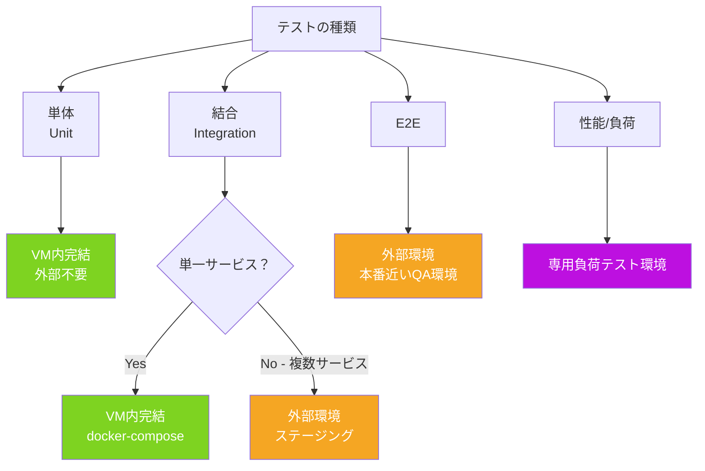

# Q38. テスターとしてDevinを扱う場合、結合テスト以降は外部テスト環境を立てるべき？

📚 [トップ索引](../../README.md) ｜ [カテゴリ索引: DB・テスト・品質・Review](README.md)

---

> **メタ**: 最終確認日 2026/4/16 ｜ 根拠 運用観察ベース ｜ 推定なし

### 結論: **テストの種類によって使い分ける**。「結合テスト = 外部必須」ではなく、**単一サービスで閉じるなら全部VM内でOK**、**複数サービスが絡む結合/E2E以降は外部テスト環境が有利**

### テストスコープ別の環境分離



「結合テスト以降は外部」と一律に決めるのではなく、**テスト対象のスコープ**で判断する。

### テスト種別ごとの推奨環境

| テスト種別 | スコープ | Devin VM内で完結可能？ | 外部テスト環境が有利？ |
|---|---|---|---|
| ユニットテスト | 1関数/1クラス | ◎ 完全にVM内 | 不要 |
| コンポーネントテスト | 1モジュール | ◎ VM内 | 不要 |
| **結合テスト（単一サービス）** | アプリ + DB + Redis | **◎ VM内でdocker compose** | **不要** |
| **結合テスト（マルチサービス）** | 複数マイクロサービス | △ VM内でも可（重い） | ◯ 外部が楽 |
| E2Eテスト（UI操作） | ブラウザ + アプリ + DB | ◎ VM内Playwright | △ 状況次第 |
| **システム間結合テスト** | 他チームのサービスと連動 | ✕ VM内では無理 | ◎ **外部必須** |
| 契約テスト（Contract） | APIスキーマ検証 | ◎ Pactなら分離で可 | △ |
| パフォーマンス/負荷テスト | 実環境相当の負荷 | ✕ VMスペックで制約 | ◎ **外部必須** |
| セキュリティ/脆弱性テスト | 本番類似環境 | △ | ◎ **外部必須** |
| 互換性テスト（ブラウザ等） | 複数OS/ブラウザ | ✕ | ◎ BrowserStack等 |
| 本番リリース前のスモーク | ステージング環境 | ✕ | ◎ **ステージング環境必須** |

### 「結合テスト」を区別する

「結合テスト」という言葉は広いので、**どこまで結合するか**で判断:

#### ✅ VM内で十分なケース（単一サービス結合）

```
Session VM:
  ├ アプリ本体 (npm run dev)
  ├ Postgres (docker compose)
  ├ Redis (docker compose)
  └ Playwright で E2E テスト
```

- アプリ + DB + Redis + ブラウザが全部VM内
- フルスクラッチWebアプリなら**ほぼ全テストがここで完結**
- Devinの**Test Mode**や**Computer Use**でブラウザ操作も可能

#### ⚠️ 外部環境が必要なケース（システム間結合・本番類似テスト）

```
外部テスト環境:
  ├ 自社サービスA（コンテナ）
  ├ 他チームサービスB（コンテナ）
  ├ 他社SaaS（モックまたは本物のサンドボックス）
  ├ マネージドキュー（SQS/PubSub）
  └ マネージドDB（RDS）

Session VM:
  └ テストコードを実行して外部環境を叩く
```

**外部環境が必要になる典型**:
- 他チーム/他社が提供するサービスとの連携
- マネージドサービス（SQS/Kafka/BigQuery等）の本物の挙動
- 本番相当の負荷・データ量
- 複数リージョン・ネットワーク経路の検証

### Devinでの推奨テスト戦略（フェーズ別）

#### Phase 0-1: ユニット + 単一サービス結合
- **全部VM内で完結**
- docker composeでDB/Redis立ち上げ
- Playwrightでブラウザ操作テスト
- 外部環境は不要

#### Phase 2: マルチサービス結合が入ってきたら
**選択肢**:
1. **VM内でマルチコンテナ**: docker composeで全サービスを1VMに載せる（軽量なら可）
2. **外部ステージング環境**: 各サービスがデプロイ済みの環境にDevinが接続してテスト

#### Phase 3: 本番類似テスト（E2E・性能・互換性）
- **外部環境必須**
- Devinは**テストシナリオの作成・実行・結果解析**を担当
- 環境自体は別で管理（Terraform / k8s / AWS CDKなど）

#### Phase 4: 運用テスト（継続的なテスト）
- ステージング環境でDevin Schedulesが定期実行
- 結果をDevin Reviewで分析

### 外部テスト環境へのDevinからのアクセス方法

#### 1. 接続情報をDevin Secretsに登録
```
STAGING_DB_URL=postgres://...
STAGING_API_ENDPOINT=https://staging.example.com
STAGING_API_TOKEN=...
```

#### 2. AGENTS.mdに使い方を明記
```
## テスト環境
- Staging: https://staging.example.com
- Test user: test+devin@example.com / (Secret: STAGING_TEST_USER_PASSWORD)
- **本番環境には絶対接続しないこと**
```

#### 3. テストシナリオをrepoに記述
```
tests/integration/
  ├ staging.spec.ts  ← ステージング向けE2E
  └ ...
```

### 避けるべきパターン ❌

#### 1. 本番環境にDevinから接続
- 本番API / 本番DBへの接続情報を **Devin Secretsに入れない**
- 誤操作による本番事故を物理的に防ぐ

#### 2. テスト環境の本番汚染
- 「テスト用」と言いつつ他チームも使う共有環境を破壊テストに使う
- → **Devin専用のテスト環境**を用意する

#### 3. VM内に全部詰め込みすぎ
- 10+ マイクロサービスを1VMに詰めるとメモリ不足で不安定
- → 重いケースは**外部環境**に寄せる

### 具体的な判断フロー

```
テスト対象は1サービス内で閉じる？
  Yes → VM内docker composeで完結
  No ↓

複数サービスがあるが、全部docker composeで軽量に立つ？
  Yes → VM内でマルチコンテナ
  No ↓

他チーム/他社のサービスが絡む？
  Yes → 外部ステージング環境必須
  No ↓

本番相当の負荷・データ・ネットワーク条件が必要？
  Yes → 外部環境必須
  No → VM内で工夫可能
```

### Devin Test Modeとの関係

Devinには**Test Mode**（UI/アプリの動作検証）機能があり、実行中のアプリをブラウザで操作して検証できる:

- **VM内で立ち上げたアプリ** → Test Modeで即テスト可能
- **外部ステージング環境のアプリ** → URLを指定してTest Modeで検証可能
- 結果は動画/スクリーンショット付きで保存

→ **テスト対象の場所がVM内か外部かによらず、Devinの検証能力は使える**

### まとめ

1. 「結合テスト以降は外部」と一律に決める必要はない
2. **単一サービスの結合テストは VM内docker composeで十分**
3. 外部テスト環境が必要になるのは:
   - **マルチサービス/システム間結合テスト**
   - **本番類似の負荷/データ量テスト**
   - **他チーム/他社サービスとの連携テスト**
   - **本番前の最終検証（ステージング）**
4. **本番環境へのDevin接続は絶対にNG**（Secrets管理で物理分離）
5. テスト環境接続情報は**Devin Secrets**に、使い方は**AGENTS.md**に明記
6. Devinの**Test Mode**は内部/外部問わずアプリを検証できる

**核心**: **単体・単一サービスの結合テストは VM 内で完結、複数サービス結合や E2Eは外部環境に切り出す**。

---

[← Q37. 繰り返しテストでDBを初期状態に戻すのに有効なDevin機能は？](q37-db-fixture-reset.md) ｜ [Q39. Devin Test Modeとは？何ができて、通常とはどう違ってどうすればTest Modeになる？ →](q39-test-mode.md)
