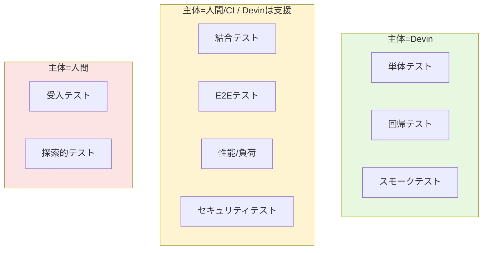

# Q40. テストの種類ごとに使い方が変わる？（単体〜回帰・負荷・総合）

📚 [トップ索引](../../README.md) ｜ [カテゴリ索引: DB・テスト・品質・Review](README.md)

---

> **メタ**: 最終確認日 2026/4/16 ｜ 根拠 運用観察ベース ｜ 推定なし

### 結論: **大きく変わる**。テスト種別ごとに「Devinが主体で回すか、Devinは設計・実行支援で人間/CIが主体か」「VM内で完結するか、外部環境が必要か」を使い分ける

### テスト種別 × 主体の分担図



### テスト種別 × Devin活用の早見表

| テスト種別 | Devinの主な役割 | 実行場所 | 推奨Devin機能 |
|---|---|---|---|
| **単体テスト** | テスト作成・実行・修正 | VM内 | Session、Repo Setup（`npm test`）、Skill |
| **結合テスト（単一サービス）** | テスト作成・実行・修正 | VM内 docker compose | Session、Repo Setup、Skill（DB reset）、Playbook |
| **結合テスト（マルチサービス）** | テスト作成支援・実行連携 | 外部 or VM内（軽量なら） | Session + Secrets + Knowledge |
| **E2E / UIテスト** | シナリオ作成・ブラウザ操作・動画証跡 | VM内 Playwright + Computer Use | **Test Mode**、Skill、Playwright連携 |
| **本番相当総合テスト** | シナリオ設計・実行トリガ・結果分析 | **外部ステージング環境** | Session + Secrets + Scheduled Runs |
| **負荷・性能テスト** | シナリオ作成・結果解析 | **外部（k6/JMeter/Locust等）** | Session（スクリプト作成）、**実行本体はCI/外部** |
| **セキュリティ・脆弱性テスト** | スキャン設定・結果トリアージ | 外部専用環境 | Session + Secrets + Knowledge |
| **契約テスト（Contract）** | Pact等のテスト作成・実行 | VM内 | Session + Skill |
| **互換性テスト（複数OS/ブラウザ）** | シナリオ作成 | **外部（BrowserStack等）** | Session + Secrets |
| **回帰テスト（Regression）** | 全テストのCIパイプライン整備・失敗トリアージ・修正 | **CI主体**、Devinは分析・修正 | **Devin Review**、Scheduled Runs、Session |
| **リリース前スモークテスト** | 最小フロー確認 | ステージング | Test Mode + Secrets |

### 種別ごとの使い方詳細

#### 1. 単体テスト（Unit Test）
- **Devinの使い方**: フル活用。テスト作成・実行・修正まで自律
- **実行**: Session VM内（`npm test` / `pytest` / `go test`）
- **設定**:
  - Repo Setupの「Set up Tests」にコマンド登録
  - `.agents/skills/write-unit-tests/SKILL.md` にカバレッジ目標・命名規則を記述
- **依頼例**: 「`src/utils/` 配下の関数にユニットテストを追加、カバレッジ80%以上」

#### 2. 結合テスト（単一サービス、DB/Redis込み）
- **Devinの使い方**: フル活用
- **実行**: Session VM内、docker composeでDBを起動
- **設定**:
  - `docker-compose.yml` にテスト用DB定義
  - Q37の「DB reset Skill」を活用
  - Repo Setupの「Maintain Dependencies」にDB起動・migration・seedを書く
- **依頼例**: 「API + DBの結合テストを作成、テスト前にDBリセット」

#### 3. 結合テスト（マルチサービス）
- **Devinの使い方**: シナリオ作成、可能なら実行も
- **実行場所の判断**:
  - 軽量（≤5サービス）→ VM内 docker composeで完結可能
  - 重い・マネージドサービス依存 → 外部テスト環境
- **設定**:
  - 外部環境の接続情報をSecretsに登録
  - Knowledgeにサービス構成図を書く

#### 4. E2E / UIテスト
- **Devinの使い方**: ⭐ **最強の使いどころ**。Test Modeで動画証跡まで取れる
- **実行**: VM内 Playwright + Computer Use
- **設定**:
  - Desktop mode 有効化
  - `.agents/skills/testing-frontend/SKILL.md` に起動手順
  - Secretsにテストユーザ認証情報
- **依頼例**: 「checkout flowをE2Eでテスト、動画送って」→ Test Modeで自動実行

#### 5. 本番相当総合テスト（System Integration Test）
- **Devinの使い方**: シナリオ設計 + 実行トリガ + 結果分析
- **実行**: **必ず外部ステージング環境**
- **重要**:
  - Devinから**本番DBには絶対接続しない**
  - ステージング専用Secretsで環境を物理分離
- **Scheduled Runs**で夜間定期実行も可能
- **依頼例**: 「ステージング環境（https://staging.example.com）で主要シナリオ5本を実行、失敗したらPR作成」

#### 6. 負荷・性能テスト
- **Devinの使い方**: **スクリプト作成**と**結果解析**が主、**実行本体はCIや専用環境**
- **理由**: Devin VMのリソースは負荷源としては不十分、本物の負荷環境は別で管理
- **推奨構成**:
  - k6 / Locust / JMeter スクリプトをrepoに格納、Devinが作成・調整
  - 実行は GitHub Actions / 専用負荷テストクラスタ
  - **結果レポートをDevinに分析させる**（p99低下の原因特定など）
- **依頼例**: 「k6スクリプトで100req/sの負荷シナリオ作成、レポートテンプレも用意」

#### 7. セキュリティ・脆弱性テスト
- **Devinの使い方**: 設定・トリアージ・修正
- **ツール連携**: Dependabot / Snyk / Semgrepの結果をDevinに読ませる
- **依頼例**: 「Snykで報告された脆弱性5件をPR化して修正」
- **注意**: 本番類似環境でのペネトレは専用環境・人手管理で

#### 8. 契約テスト（Contract Test / Pact等）
- **Devinの使い方**: フル活用。Pactファイル作成、Broker連携、検証
- **実行**: VM内
- **設定**: Pact Brokerの接続情報をSecretsに

#### 9. 互換性テスト
- **Devinの使い方**: **シナリオ作成**が主、**実行は外部（BrowserStack / Sauce Labs / LambdaTest）**
- **理由**: Devin VMは単一Linux、複数OS/ブラウザ環境は持てない
- **設定**: BrowserStack等のAPIキーをSecretsに

#### 10. 回帰テスト（Regression Test）
- **Devinの使い方**: CI整備と**失敗時の分析・修正**が主戦場
- **実行**: CI（GitHub Actions等）主体
- **Devinの強み**:
  - **Devin Review**: PR毎に全テストを走らせてフラッキーテスト検出
  - **Scheduled Runs**: 夜間に全リグレッションを走らせて朝レポート
  - **失敗トリアージ**: 失敗ログからパッチPR自動作成
- **依頼例**: 「夜間3時に全E2Eを実行、失敗があれば朝までにレポートとPR」

#### 11. リリース前スモークテスト
- **Devinの使い方**: 最小限の主要フロー確認
- **実行**: ステージング環境で Test Mode
- **依頼例**: 「本番デプロイ前にステージングでログイン→注文→決済の3ステップ確認、動画送って」

### テスト種別別の「Devin機能組み合わせ表」

| 機能 | 単体 | 単一結合 | マルチ結合 | E2E | 総合 | 負荷 | 回帰 |
|---|---|---|---|---|---|---|---|
| **Session** | ◎ | ◎ | ◎ | ◎ | ◎ | ◎ | ◎ |
| **Repo Setup（test command）** | ◎ | ◎ | ◯ | ◯ | ◯ | ◯ | ◎ |
| **Skill** | ◎ | ◎ | ◎ | ◎ | ◎ | ◯ | ◎ |
| **Playbook** | ◯ | ◎ | ◎ | ◎ | ◎ | ◯ | ◎ |
| **Secrets** | △ | ◯ | ◎ | ◎ | ◎ | ◎ | ◯ |
| **Knowledge** | ◯ | ◯ | ◎ | ◎ | ◎ | ◎ | ◯ |
| **Test Mode** | − | △ | △ | ◎ | ◎ | − | △ |
| **Computer Use** | − | − | − | ◎ | ◎ | − | △ |
| **Devin Review** | ◯ | ◯ | ◯ | ◯ | ◯ | ◯ | ◎ |
| **Scheduled Runs** | − | △ | △ | ◯ | ◎ | ◎ | ◎ |
| **外部環境（Secrets経由）** | − | − | ◯ | ◯ | ◎ | ◎ | ◯ |

◎推奨 / ◯有用 / △限定的 / −不要

### 実行場所（VM内 vs 外部）の判断フロー

```
テスト対象は1サービス内で閉じる？
  Yes → VM内 docker compose（Session + Skill）
  No ↓

全サービスを docker compose で軽量に立てられる？（5個以下程度）
  Yes → VM内マルチコンテナ（Session + Skill + DB reset）
  No ↓

本物のマネージドサービス / 他チームのサービスが絡む？
  Yes → 外部ステージング環境（Secrets経由で接続）
  No ↓

本番相当の負荷・データ量が必要？
  Yes → 外部環境必須
  No → 工夫すればVM内可
```

### 運用ルール（初心者向け）

1. **まず単体・単一結合テストを Session + Repo Setupで完成**
2. **E2Eは Test Modeに任せる**（主要フロー1本から）
3. **回帰テストは CI + Devin Review** に分担
4. **外部環境が必要になるまで VM内で頑張る**（コスト・速度で有利）
5. **本番DBへのDevin接続は絶対NG**
6. **テスト種別ごとにSkillを分割** して育てる
   - `.agents/skills/write-unit-tests/`
   - `.agents/skills/run-integration-tests/`
   - `.agents/skills/e2e-test/`
   - `.agents/skills/load-test/`

### まとめ

| テスト種別 | Devinの主役度 | 実行場所 | 主戦場機能 |
|---|---|---|---|
| 単体 | ★★★ | VM内 | Session / Repo Setup |
| 単一結合 | ★★★ | VM内 | Session / Skill / docker compose |
| マルチ結合 | ★★ | 外部 or VM内 | Session / Secrets / Knowledge |
| E2E | ★★★ | VM内 | **Test Mode** / Computer Use |
| 総合（本番相当） | ★★ | 外部ステージング | Session / Secrets / Scheduled Runs |
| 負荷 | ★ | 外部 | Session（スクリプト作成のみ） |
| 回帰 | ★★ | CI主体 | **Devin Review** / Scheduled Runs |
| スモーク | ★★★ | ステージング | Test Mode |

**核心**: Devinは**「書く・実行する・分析する・修正する」の全工程を自律化できる**が、**実行環境の選択**（VM内か外部か）と**実行主体の選択**（Devinか CIか）がテスト種別で変わる。初心者はまず**単体〜E2EをVM内で完結**させ、慣れてから**外部環境連携・Scheduled Runs・Devin Reviewによる回帰**へ段階的に拡張するのが王道。

---

[← Q39. Devin Test Modeとは？何ができて、通常とはどう違ってどうすればTest Modeになる？](q39-test-mode.md) ｜ [Q41. 社内LAN内のサーバにDevinからテストできる？SaaS風のP2Pプローブ方式は？ →](q41-internal-network-test.md)
