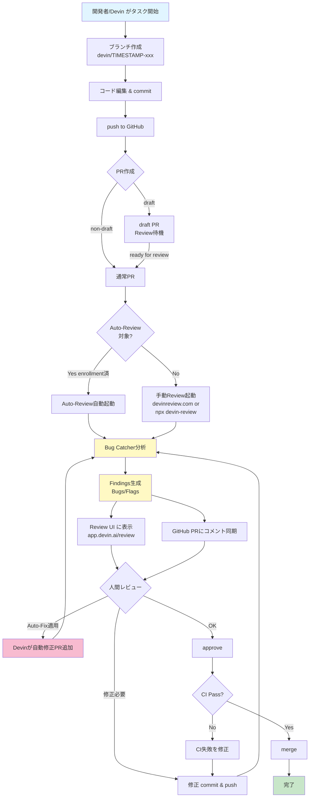
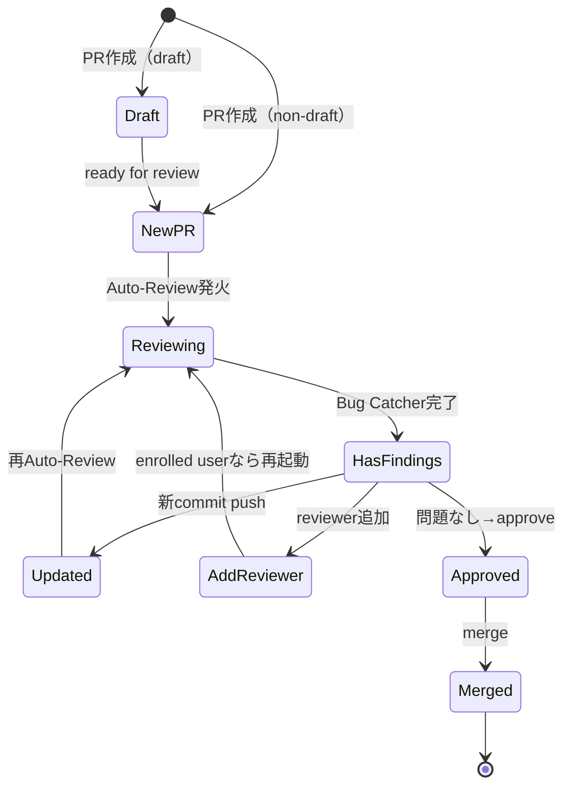
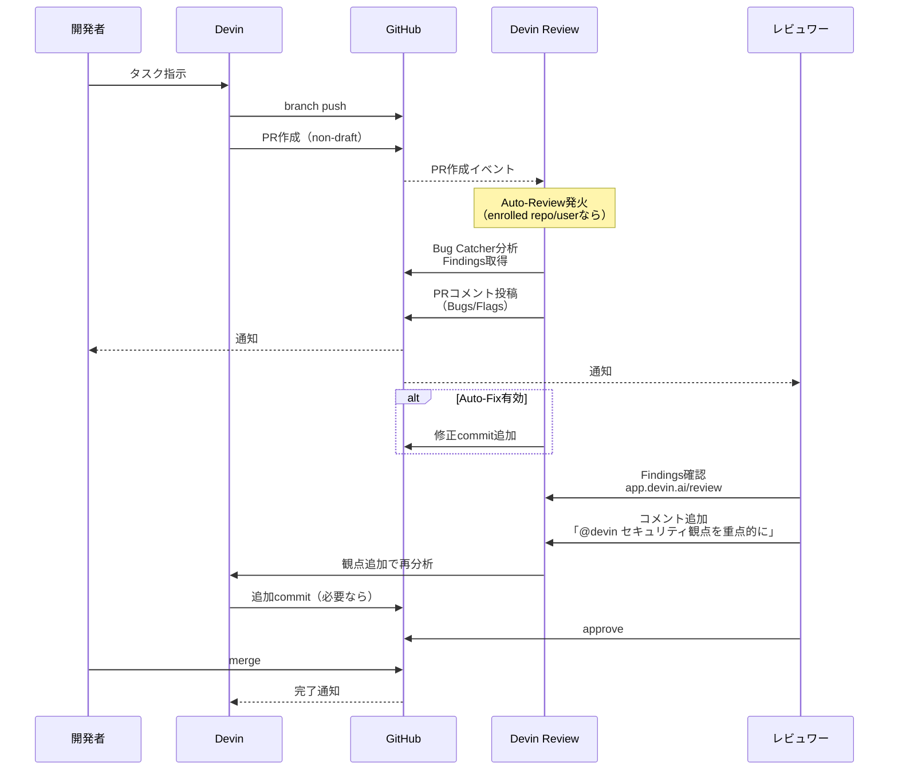

# Q43. Reviewタブはどういう機能？使い方・レビュー範囲・観点

📚 [トップ索引](../../README.md) ｜ [カテゴリ索引: DB・テスト・品質・Review](README.md)

---

> **メタ**: 最終確認日 2026/4/16 ｜ 根拠 https://cognition.ai/devin-review / https://docs.devin.ai/integrations/devin-review ｜ 推定なし

### 結論: **Devin Review = GitHub PR用のAIコードレビュープラットフォーム**。**観点は基本的にDevinが自動判断**（Bug Catcher / Flags）するが、**Auto-Review設定・PRテンプレ・コメントから観点カスタマイズ可能**

参考: https://docs.devin.ai/work-with-devin/devin-review

### Devin Reviewとは

> Devin Review is a full-service code review platform within the Devin webapp that turns large, complex GitHub PRs into intuitively organized diffs and precise explanations.

#### 料金・範囲
- **Public PR / OSSリポの閲覧は引き続き無料**（Devinアカウント不要）
- **Private PRのレビュー** → Devinアカウント（or CLI）必要、**2026/4/16の料金改定以降は使用量ベース課金の対象**（プラン別の含まれる使用量内で利用可、詳細は [Q7](../02-pricing/q07-devin-pricing.md) 参照）
- **GitHub Enterprise Server** → 現時点ではサポート対象外

### 主要機能（5大機能）

| 機能 | 内容 |
|---|---|
| **Smart diff organization** | 差分を**論理的にグルーピング** |
| **Copy and move detection** | ファイル移動・コピー検知、delete+insertではなく移動として表示 |
| **Bug catcher** | バグ自動検出、信頼度ラベル付き（Severe / Non-severe） |
| **GitHub compatibility** | コメント・approve・request changesがGitHub同期 |
| **Codebase-aware chat** | PRの質問にリポ全体のコンテキストで回答 |

### 使い方（3ルート）

#### ルート1: Devin Webapp
1. https://app.devin.ai/reviewにアクセス
2. 自分に関係するPR一覧が表示
3. DevinがPRを作ると**オレンジの"Review"ボタン**がチャットに出る

#### ルート2: URLショートカット（最速）
```
https://github.com/owner/repo/pull/123
  ↓ github.com → devinreview.com
https://devinreview.com/owner/repo/pull/123
```

#### ルート3: CLI
```bash
cd path/to/repo
npx devin-review https://github.com/owner/repo/pull/123
```
- **ローカルのgit権限でdiff抽出**
- git worktreeで隔離、作業ブランチに影響なし
- Private repoでも動く

### Auto-Review（自動実行）

#### 発火タイミング
- PRが non-draftで**新規作成**
- PRに**新規コミットpush**
- draft PRが**ready for reviewに変更**
- 登録ユーザが**reviewer/assigneeに追加**

#### 登録方法
1. `Settings > Review`: https://app.devin.ai/settings/review
2. "Add myself (@yourusername)" で自己登録
3. Adminは repo単位や user単位で組織運用設定可能

### ⭐ レビュー観点

#### 結論: 事前定義された「観点テンプレ」はない。**Devinが自動判断**

#### Bug Catcherの出力分類

```
Findings
├─ Bugs（実際に直すべきエラー）
│   ├─ Severe      高信頼・即対応推奨
│   └─ Non-severe  優先度低だが要レビュー
└─ Flags（注釈・情報、修正は任意）
    ├─ Investigate  要調査
    └─ Informational 解説・設計補足
```

#### 具体的にチェックされる観点

| カテゴリ | 具体例 |
|---|---|
| **Null/undefined処理** | 未定義値参照、optional chain抜け |
| **型安全** | as anyで誤魔化し、型と実装の齟齬 |
| **境界値・オフバイワン** | `<` vs `<=`、ループの終端 |
| **並行制御** | race condition、lock忘れ |
| **リソース漏れ** | connection/file handle閉じ忘れ |
| **エラーハンドリング** | 握り潰し、例外伝播 |
| **セキュリティ** ⭐ | SQLi/XSS/CSRF/OSコマンド注入、Secret露出 |
| **依存の脆弱性** | 既知の脆弱性バージョン利用 |
| **API契約** | breaking change、互換性破壊 |
| **パフォーマンス** | N+1、不要ループ、メモリリーク疑い |
| **ロジック矛盾** | 前後の条件矛盾、不到達コード |
| **テスト不足** | 変更に対する未カバー分岐 |
| **命名・可読性** | 誤解招く名前、マジックナンバー |
| **ドキュメント整合性** ⭐ | README/API docとコードの食い違い |
| **設計の一貫性** | プロジェクト既存パターンからの逸脱 |

→ **セキュリティ・ドキュメント整合性も含まれる**（明示的トグルはなく、バグ分類の一種として自動対象）。

#### 観点のユーザ側カスタマイズ

| 方法 | 効果 |
|---|---|
| **AGENTS.md** | プロジェクトの規約を書く → Reviewも参照 |
| **Knowledge** | 事実を登録 → Reviewでも活用 |
| **PRテンプレート** | レビューポイント列挙 → Devinが準拠チェック |
| **PRコメント** | `@devin セキュリティ観点を重点的に` |
| **/review スラッシュコマンド** | セッションから観点を具体指示 |

#### `/review` コマンドの例

```
/review このPRで以下を重点的に確認して:
1. SQLインジェクション対策
2. JWTトークンの有効期限処理
3. 認証バイパスの可能性
4. READMEの使用例とコードの整合性
```

### できるレビュー範囲

#### ✅ できる
- バグ検出（null/型/並行/リソース/ロジック/エラー処理）
- **セキュリティレビュー**（SQLi/XSS/認証/Secret/脆弱性依存）
- **ドキュメント整合性**（コード vs README/docstring/OpenAPI）
- コピー・移動検出
- コードベース横断（影響範囲分析）
- GitHub連携（comment / approve / request changes）
- **Auto-Fix**（バグに対する自動修正提案）
- code owner表示
- **Auto-merge**（2026年〜、設定で有効化可能）

#### ⚠️ 不得手・未対応
- パフォーマンス精密測定（実測ベンチは人間必要）
- UX/デザインレビュー
- ビジネスロジックの正当性（要件一致は人間判断）
- **GitHub Enterprise Server**（現時点で非対応）
- 超大規模PR（数千ファイル級は部分的）
- バイナリファイル

### Auto-Fix（自動修正）

Bug Catcherが見つけたバグに対し、**修正コードを自動提案**:

#### 有効化方法
1. PR Reviewページの設定アイコン → "Enable Autofix"
2. Devinセッション内の埋め込みPR Review設定
3. `Settings > Customization > Pull request settings > Autofix settings`

#### 制約
- **組織adminのみ設定可**
- "No Issues Found"コメントではAuto-Fix走らない

### 観点カスタマイズの推奨実装

#### AGENTS.mdに observer notesを足す
```markdown
## Review Checklist
- 認証・認可: 全APIエンドポイントで権限チェック必須
- ログ: PII（個人情報）をログに残さない
- エラー: stack trace をAPI レスポンスに返さない
- DB: raw SQL は prepared statement のみ
- ドキュメント: `docs/api.md` と実装の一致
- テスト: 新機能には単体＋統合テスト両方
```

#### PRテンプレートに観点を列挙
```markdown
## Review Checklist
- [ ] セキュリティ: 認証・認可・SQLi・XSS
- [ ] パフォーマンス: N+1・不要ループ
- [ ] ドキュメント: README/API doc更新済み
- [ ] テスト: 正常系・異常系・境界値
```

### 図解

#### 図1. PR全体フロー



#### 図2. Auto-Reviewの状態遷移



#### 図3. 関係者シーケンス



#### 図4. 典型的な3パターン

```
┌─────────────────────────────────────────────────────────────┐
│ パターンA: Devin自身がPR作成＆レビュー（完全自動）          │
├─────────────────────────────────────────────────────────────┤
│ ユーザ指示 → Devin実装 → PR → Auto-Review → Auto-Fix       │
│                                          ↓                   │
│                                    人間は承認のみ            │
└─────────────────────────────────────────────────────────────┘

┌─────────────────────────────────────────────────────────────┐
│ パターンB: 人間が書いたPRをDevin Reviewで一次確認           │
├─────────────────────────────────────────────────────────────┤
│ 人間コード → PR → Auto-Review → 人間レビュワーが Findings   │
│                                   を参考に最終判断           │
└─────────────────────────────────────────────────────────────┘

┌─────────────────────────────────────────────────────────────┐
│ パターンC: チーム運用（repo全体でAuto-Review化）            │
├─────────────────────────────────────────────────────────────┤
│ Admin が Settings > Review で repo 登録                     │
│   ↓                                                          │
│ 全PR自動レビュー → 人間は findings を前提にレビュー         │
│   ↓                                                          │
│ Devin Review → GitHub 同期で approve/changes                │
└─────────────────────────────────────────────────────────────┘
```

### まとめ

| 観点 | 結論 |
|---|---|
| Reviewタブの正体 | **GitHub PR用のAIコードレビュープラットフォーム（Devin Review）** |
| レビュー範囲 | **バグ・セキュリティ・ドキュメント整合性・設計・API契約・テスト不足** |
| 観点の決定方法 | **基本はDevinが自動判断**、AGENTS.md / Knowledge / PRテンプレ / コメント / `/review` で影響 |
| セキュリティ | **Bug Catcher内に含まれる** |
| ドキュメント整合性 | **走る**（Flagsで警告） |
| 使い方 | Webapp / devinreview.com URL置換 / CLI |
| 自動化 | Auto-Review（PR作成時） + Auto-Fix |
| 料金 | **OSS/Public PRは無料**、**Private PRのレビューは 2026/4/16 以降使用量ベース課金（[Q7](../02-pricing/q07-devin-pricing.md)参照）**、GitHub Enterprise Serverは非対応 |

**核心**: Devin Reviewは**「PRの一次レビューをAIが肩代わりするプラットフォーム」**。**Public/OSS PRは無料、Private PRは 2026/4/16 以降使用量ベース課金**（[Q7](../02-pricing/q07-devin-pricing.md)参照）。観点は**Devinが自動判断**するが、AGENTS.md/PRテンプレ/`/review`コマンドで**プロジェクト固有の観点注入**可能。セキュリティもドキュメント整合性も**Bug Catcher/Flagsの守備範囲**。

---

[← Q42. テスト駆動開発（TDD）は可能？Devinをどう使えばできる？](q42-tdd.md) ｜ [Q44. 作成中のFAQをDevin Reviewで確認する手順は？ →](q44-faq-review-procedure.md)
