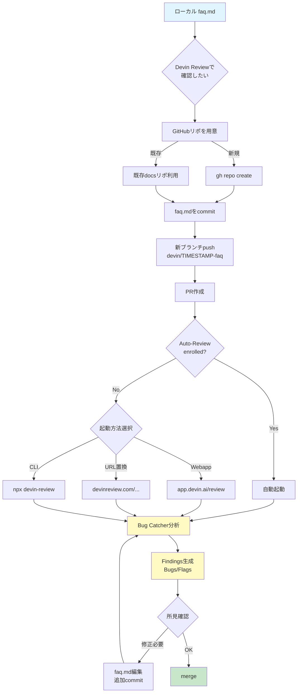
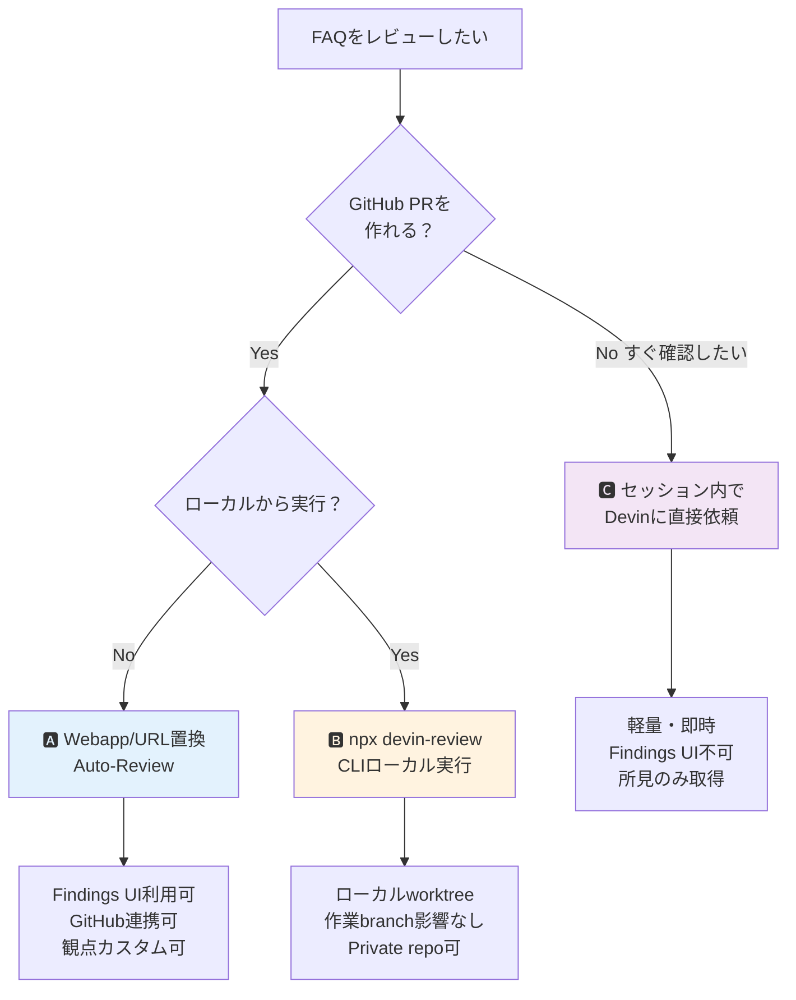

# Q44. 作成中のFAQをDevin Reviewで確認する手順は？

📚 [トップ索引](../../README.md) ｜ [カテゴリ索引: DB・テスト・品質・Review](README.md)

---

> **メタ**: 最終確認日 2026/4/16 ｜ 根拠 https://cognition.ai/devin-review ｜ 推定あり

### 結論: **Devin ReviewはGitHub PRを対象にした機能**。ローカルファイルは直接レビューできないため、**(A) GitHubリポにcommit → PR → Review** か **(B) セッション内でDevinに直接レビュー依頼**（簡易版）

### 現状の整理

| 項目 | 現状 |
|---|---|
| FAQファイル | `/home/ubuntu/faq.md`（ローカルのみ） |
| Git管理 | なし |
| GitHub上 | 未配置 |
| Devin Reviewの適用対象 | **GitHub PRのみ** |

→ **Devin Reviewを使うにはPR化が必要**。

### 操作手順の選択肢

#### 🅰️ パターンA: GitHubリポにPRとして投げてReview（正攻法）

```bash
# 1. リポ準備
git clone https://github.com/<owner>/<repo>.git /tmp/faq-repo
cp /home/ubuntu/faq.md /tmp/faq-repo/docs/faq.md
cd /tmp/faq-repo
git checkout -b devin/$(date +%s)-add-faq
git add docs/faq.md
git commit -m "docs: add Devin usage FAQ"
git push -u origin HEAD

# 2. PR作成
gh pr create --title "Devin FAQ" --body "Devinの使い方FAQをまとめたドキュメント"

# 3. Auto-Reviewが有効なら自動起動
# または github.com → devinreview.com URL置換で手動実行
```

#### 🅱️ パターンB: CLI実行

```bash
cd /tmp/faq-repo
npx devin-review https://github.com/<owner>/<repo>/pull/<N>
```

#### 🅲 パターンC: セッション内で直接Devinにレビュー依頼（簡易版）

- PRを作らず、現セッションで「faq.mdをレビューして」と依頼
- Devinが `read` / `grep` で内容チェック、所見返答
- Devin ReviewタブのFindings UIは使わない
- 軽量・即時

### ⭐ FAQに最適な推奨フロー

#### Step 1: GitHubリポを用意
```bash
gh repo create <owner>/devin-faq --public --description "Devin使い方FAQ"
```

#### Step 2: commit & push
```bash
git clone https://github.com/<owner>/devin-faq.git /tmp/devin-faq
cp /home/ubuntu/faq.md /tmp/devin-faq/FAQ.md
cd /tmp/devin-faq
git checkout -b devin/$(date +%s)-initial-faq
git add FAQ.md
git commit -m "docs: initial FAQ on Devin usage"
git push -u origin HEAD
```

#### Step 3: PR作成
```bash
gh pr create --title "Initial FAQ on Devin usage"
```

#### Step 4: Auto-Review設定
- https://app.devin.ai/settings/review
- 自分をenrollまたはrepoをenroll

#### Step 5: Review確認
- https://devinreview.com/<owner>/devin-faq/pull/1
- Findings パネルで Bugs / Flags 確認

#### Step 6: 修正反映
- 追加commitで再度Auto-Reviewが走る

### 観点を指定したい場合

PRコメントまたは `/review` コマンドで:

```
/review このFAQで以下観点を重点的に:
1. Q間の内容矛盾
2. 公式Devin docsとの記述ズレ
3. 古いUI・廃止機能の参照
4. リンク切れ
5. 日本語用語の統一（Playbook等）
6. 表・コードブロックのフォーマット崩れ
```

### AGENTS.mdに観点を常設化

```markdown
## ドキュメント品質基準（FAQリポ）
- Q間の内容矛盾・重複を検出する
- 公式Devin docs（https://docs.devin.ai/）との整合性を確認
- 廃止機能・古いUI参照を検出（v2 API、Legacy Key等）
- リンクURLが有効か
- 日本語用語の統一: Playbook / Knowledge はカタカナ併記しない
- 表・コードブロックのフォーマット崩れを検出
- 見出し階層（H2/H3）の一貫性
- 「Q番号参照」の一致性
```

### 予想されるReview所見の例（FAQリポの場合）

| 種類 | 例 |
|---|---|
| 内容矛盾 | QごとのRepo Setup説明の微差 |
| 用語ブレ | 「Snapshot」「スナップショット」混在 |
| Flag | Personal Secret > Org Secretの優先順位の根拠が公式doc内で明記されていない |
| typo | 日本語助詞の誤り |
| リンク切れ | URLの404 |
| フォーマット | 表のパイプ位置ずれ、コードブロックの言語指定抜け |

### 図解

#### 図1. FAQをDevin Reviewで確認する処理フロー



#### 図2. 3パターンの選択フロー



#### 図3. 観点の注入経路

```
┌──────────────────────────────────────────────────┐
│ FAQ用の観点カスタマイズ方法                      │
└──────────────────────────────────────────────────┘
     │
     ├─ AGENTS.md（repo直下）
     │   └─ ドキュメント品質基準を常設
     │      ・Q間矛盾
     │      ・用語統一
     │      ・リンク有効性
     │      ・フォーマット整合
     │
     ├─ .github/pull_request_template.md
     │   └─ PRチェックリスト
     │
     ├─ PRコメント（個別PR）
     │   └─ 「@devin この観点を重点的に」
     │
     └─ /review スラッシュコマンド（セッション内）
         └─ 特定観点で深掘り指示
              ↓
     すべて Bug Catcher が参照して Findings 生成
```

#### 図4. URLサイトマップ

```
Devin Review 入口
├── https://app.devin.ai/review
│   └── 自分関連のPR一覧
├── https://devinreview.com/<owner>/<repo>/pull/<N>
│   └── github.com から URL 置換で直接アクセス
├── CLI: npx devin-review <pr-url>
│   └── ローカルgit worktree隔離、Private repo可
└── Settings
    ├── https://app.devin.ai/settings/review
    │   └── 自己enroll / repo enroll
    └── Settings > Customization > Pull request settings
        └── Auto-Fix設定（admin）
```

### 注意事項

| 注意 | 内容 |
|---|---|
| **GitHub Enterprise Server** | Devin Review非対応 |
| **Privateリポ** | Devinアカウント認証必要、ログインなしならCLI利用 |
| **大きなPR** | 1ファイル1万行超は精度低下の可能性 |
| **Markdownもレビュー対象** | コードだけでなくMDも観点適用 |
| **Auto-Fixは慎重に** | MD整形で過剰編集しないか必ず確認 |
| **料金** | **OSS/Public PRは無料**、**Private PRは 2026/4/16 以降使用量ベース課金**（[Q7](../02-pricing/q07-devin-pricing.md)） |

### まとめ

| 観点 | 結論 |
|---|---|
| 今のFAQをDevin Reviewで見る | **そのままは不可**、GitHub PR化が必要 |
| 推奨手順 | **GitHubリポ作成 → commit → PR → Auto-Review or devinreview.com** |
| CLI | `npx devin-review {pr-url}` でローカルから実行可 |
| 観点指定 | **PRコメント or `/review` コマンド**、または **AGENTS.mdに常設** |
| MDファイルもレビュー対象 | **Yes**、内容矛盾・用語ブレ・リンク切れ等も検出 |
| セッション内での簡易レビュー | **可能**（Devinに依頼）、ただしDevin ReviewのUIは使わない |

**核心**: Devin ReviewはGitHub PR前提のため、FAQ.mdを見るなら**まずリポ化してPRを作る**のが正攻法。軽量に済ませたいときは**セッション内でDevinに直接レビュー依頼**する簡易版でも所見は得られます。

---

[← Q43. Reviewタブはどういう機能？使い方・レビュー範囲・観点](q43-review-tab.md) ｜ [Q45. Devinはどんな入力データを認識できる？ →](../11-data-docs/q45-input-data-types.md)
