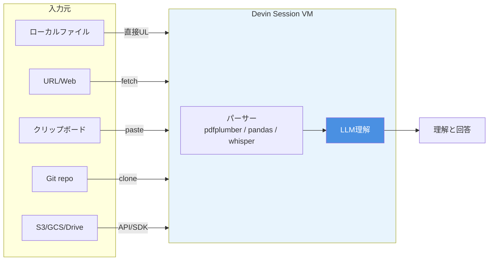

# Q45. Devinはどんな入力データを認識できる？

📚 [トップ索引](../../README.md) ｜ [カテゴリ索引: データ入出力・ドキュメント理解](README.md)

---

> **メタ**: 最終確認日 2026/4/16 ｜ 根拠 https://docs.devin.ai/ ｜ 推定あり

### 結論: **テキスト系はほぼ何でも読める**。**バイナリ系は Devin 内でツール実行して解析**（PDF/画像/音声/動画/アーカイブ）。**文字コードはUTF-8推奨**（CRLF/LFの混在も大半は自動処理）

### 入力データのフロー



### 入力ルート別サマリ

Devinへの入力は大別して以下:

| ルート | 手段 |
|---|---|
| **チャット直入力** | メッセージ欄への日本語/英語テキスト・コードブロック |
| **ファイル添付**（Webapp） | UIの添付ボタン、ドラッグ&ドロップ |
| **API Attachment** | `/v1/attachments` でファイルアップロード → URL参照 |
| **リポジトリ連携** | GitHub/GitLab/BitBucket経由で直接読み込み |
| **URL貼り付け** | Web/docsページの内容取得 |
| **Slack/Linear/Jira** | 連携経由でメッセージ/issue取得 |
| **Mobile/Voice** | 音声入力（モバイルアプリ） |
| **MCP（Model Context Protocol）** | 外部ツール/DBの情報取得 |
| **マウント/シェル** | セッション内で `wget`/`curl`/`scp`/`rclone` 等で取得 |

### データ種別ごとの対応

### 1. テキスト / コード ⭐完全対応

| 形式 | 認識 | 備考 |
|---|---|---|
| `.txt` / `.md` / `.rst` / `.adoc` | ✅ | 基本中の基本 |
| `.html` / `.xml` / `.yaml` / `.toml` / `.json` | ✅ | 構造化テキスト |
| `.py` / `.js` / `.ts` / `.go` / `.rs` / `.java` / `.c` / `.cpp` / 他大半の言語 | ✅ | コードはすべて |
| `.sql` / `.graphql` / `.dockerfile` / `.mk` | ✅ | 設定/スキーマ |
| `.log` / `.csv` / `.tsv` | ✅ | ログ・タブ区切り |
| `.ipynb`（Jupyter） | ✅ | notebookも編集可 |

**容量目安**: 数MB程度までは直接読める、数十MB以上は**tail/head/grep/sed**で必要部分抽出が現実的

### 2. Office / 文書

| 形式 | 認識 | 処理方法 |
|---|---|---|
| **Word (.docx)** | △ | `python-docx`や `pandoc` で変換して読む |
| **Excel (.xlsx / .xls)** | △ | `openpyxl` / `pandas` で読む |
| **PowerPoint (.pptx)** | △ | `python-pptx` で読む |
| **PDF** | ✅ | `pdfplumber` / `PyMuPDF` / `pdftotext` |
| **RTF** | △ | `pandoc`等で変換 |
| **Google Docs / Sheets / Slides** | △ | **直接は不可**、**エクスポート**(.docx/.xlsx)後アップロードが一般的。MCP連携で直接取得する実装もあり |
| **Notion / Confluence** | △ | **MCP / API経由**での取得が可能 |

→ **Office系は「Devinがその場でツールを使って変換・解析」**する形。**必ずしも読みやすくない場合は事前にテキスト化しておくと確実**。

### 3. 静止画像

| 形式 | 認識 | 処理方法 |
|---|---|---|
| **PNG** | ✅ | Vision対応LLM経由 |
| **JPG/JPEG** | ✅ | 同上 |
| **GIF**（静止） | ✅ | 1フレーム目等 |
| **WebP** | ✅ | 同上 |
| **BMP** | ✅ | 同上 |
| **SVG** | ✅ | テキストとして読むかラスタ化 |
| **HEIC/HEIF** | △ | `heif-convert` で変換 |
| **TIFF** | △ | `ImageMagick`で変換 |
| **PSD/AI** | ❌ | 非対応、事前にラスタ化必要 |
| **DICOM**（医療画像） | △ | 専用ライブラリ経由 |

- **ファイルサイズ**: 通常数MB、大きい場合は**縮小してからアップロード**推奨
- **解像度**: 高解像度は**自動リサイズ**される場合あり

### 4. 動画

| 形式 | 認識 | 処理方法 |
|---|---|---|
| **MP4** | △ | **フレーム抽出**（ffmpeg）→ 画像としてVision処理 |
| **MOV** | △ | 同上 |
| **AVI** | △ | 同上 |
| **WebM** | △ | 同上 |
| **MKV** | △ | 同上 |
| **GIF**（動画扱い） | △ | フレーム抽出 |

- **動画を直接「見る」ことはしない**（Cognitionブログ記事の論点）
- **ffmpegで音声/フレーム抽出 → 各々処理**が標準
- **長尺動画は要約困難**（1フレームずつ見ると非現実的）

### 5. 音声

| 形式 | 認識 | 処理方法 |
|---|---|---|
| **MP3 / WAV / M4A / AAC / OGG / FLAC** | △ | **Whisper**等でテキスト文字起こしして処理 |
| **音声メッセージ（Slack等）** | △ | 自動文字起こしを経由 |
| **モバイルアプリの音声入力** | ✅ | **ユーザ入力として直接認識**（STT内蔵） |

- **音声解析**（音色・感情・話者特定等）は基本非対応
- **文字起こし前提**で考える

### 6. 圧縮アーカイブ

| 形式 | 認識 | 処理方法 |
|---|---|---|
| **ZIP** | ✅ | `unzip` コマンドで展開 → 個別ファイル処理 |
| **TAR.GZ / TGZ** | ✅ | `tar xzvf` |
| **TAR.BZ2 / TAR.XZ** | ✅ | `tar xjvf` / `tar xJvf` |
| **7Z** | ✅ | `7z x`（`p7zip-full`インストール） |
| **RAR** | △ | `unrar`インストール必要 |
| **GZ / BZ2 / XZ**（単一ファイル） | ✅ | `gunzip`等 |
| **ISO**（ディスクイメージ） | △ | マウントは権限次第 |
| **DMG**（Mac） | △ | 専用ツール必要 |

- **パスワード付き圧縮**は、パスワードを渡せば展開可能（**Secretsで渡す**）
- **容量上限**は環境依存、数百MB〜数GB級はストリーム処理推奨

### 7. データ科学/特殊形式

| 形式 | 認識 | 処理方法 |
|---|---|---|
| **Parquet / Arrow / Feather** | ✅ | `pandas` / `pyarrow` |
| **HDF5 / NetCDF** | ✅ | `h5py` / `netCDF4` |
| **SQLite (.db/.sqlite)** | ✅ | `sqlite3` コマンド |
| **DuckDB** | ✅ | `duckdb` |
| **Pickle (.pkl)** | ✅ | Python経由 |
| **Protobuf / MessagePack** | ✅ | 対応ライブラリ経由 |
| **Shapefile / GeoJSON / KML** | ✅ | `geopandas`等 |

### 8. マルチメディア・その他

| 形式 | 認識 | 処理方法 |
|---|---|---|
| **EPUB / MOBI**（電子書籍） | △ | `ebook-convert`で変換 |
| **FBX / OBJ / STL**（3D） | ❌ | 非対応 |
| **CAD (.dxf, .dwg)** | ❌ | 非対応 |
| **Email (.eml, .msg)** | △ | Pythonライブラリ経由 |
| **VCF**（連絡先） | ✅ | テキストとして |
| **ICS**（カレンダー） | ✅ | テキストとして |

### 文字コード・改行コード

### 文字コード

| コード | 対応 | 備考 |
|---|---|---|
| **UTF-8**（BOM無し） | ✅ 推奨 | デフォルト |
| **UTF-8 with BOM** | ✅ | 自動処理 |
| **UTF-16 LE/BE** | ✅ | 読める |
| **Shift_JIS (SJIS)** | △ | `iconv`で変換推奨、Windows由来ファイルに多い |
| **EUC-JP** | △ | 変換必要 |
| **ISO-8859-1 (Latin1)** | △ | 変換必要 |
| **GB2312 / GBK / Big5**（中国語） | △ | 変換必要 |

**推奨**: アップロード前に **UTF-8 (no BOM)** に変換しておく

### 改行コード

| 改行 | 対応 | 備考 |
|---|---|---|
| **LF (\n)** | ✅ 推奨 | Unix/Linux/macOS |
| **CRLF (\r\n)** | ✅ | Windows、自動処理 |
| **CR (\r)** | △ | 古いMac、変換推奨 |

- Devinは大半を**自動で吸収**する
- コード管理で混在が問題になる場合は**.gitattributes**で `text=auto eol=lf`等を設定

### サイズ上限・注意点

| 観点 | 目安 |
|---|---|
| **単一ファイル添付（Webapp）** | 数百MB程度（UI経由） |
| **API Attachment** | **明示上限あり**（docs参照、一般に数十MB〜数百MB） |
| **セッション内のファイル扱い** | VMディスク容量内（数十GB） |
| **LLMに投入可能なトークン数** | 現行基盤LLM（執筆時点のSonnet系最新）で数十万トークン程度（モデル更新で変動） |

**大容量は「チャンク分割」「検索併用」が基本**

### 文字化け対処

### よくある事例
- CSVがShift_JISで文字化け → `iconv -f SJIS -t UTF-8 input.csv > output.csv`
- PDFのテキスト抽出でレイアウト崩れ → `pdfplumber`の列抽出モード
- Excelの日本語列名 → `pandas.read_excel(encoding=...)`

### Devinに頼む例
```
data.csvをアップロードしました。Shift_JISの日本語CSVなので、
UTF-8に変換してから処理してください。
```

### セキュリティ上の注意（入力データ）

- **機微情報はSecrets機能経由**で渡す（平文でチャットに貼らない）
- **個人情報は最小限**、学習には使われない（公式保証）
- **ソースコード以外の大型バイナリ**は、必要分だけ分離してアップロードが安全

### 添付ファイルのDevinでの扱いフロー

```
1. ファイルアップロード（UI/API）
   ↓
2. Cognitionのストレージへ保存、URL発行
   ↓
3. URLがセッションコンテキストに渡る
   ↓
4. Devinがセッション内でダウンロード（wget等）
   ↓
5. 該当ツール（pandas/pdfplumber等）で処理
   ↓
6. 必要部分をLLMコンテキストに投入
```

### まとめ

| カテゴリ | 対応 | 備考 |
|---|---|---|
| **テキスト/コード** | ✅ 完全対応 | UTF-8推奨 |
| **PDF** | ✅ | `pdfplumber`/`pdftotext` |
| **Office (Word/Excel/PPT)** | △ | 変換経由、事前にテキスト化推奨 |
| **Google系** | △ | エクスポート経由またはMCP |
| **画像 (PNG/JPG/WebP)** | ✅ | Vision対応 |
| **動画** | △ | フレーム・音声抽出経由 |
| **音声** | △ | 文字起こし経由 |
| **アーカイブ (ZIP/TAR)** | ✅ | 展開コマンドで処理 |
| **特殊形式 (Parquet/HDF5等)** | ✅ | ライブラリ経由 |
| **3D/CAD** | ❌ | 非対応 |
| **文字コード** | UTF-8推奨 | SJIS/EUCは変換 |
| **改行コード** | LF/CRLF 自動吸収 | CRは要変換 |

**核心**: Devinは**テキスト系はそのまま、バイナリ系はセッション内でツール実行して解析**する設計。**UTF-8/LFに揃えておけば基本ハマらない**。Office系とGoogle系は**事前にテキスト化**するか**MCP経由**が確実。機微情報は必ず**Secretsで渡す**。

---

[← Q44. 作成中のFAQをDevin Reviewで確認する手順は？](../10-database-test-quality/q44-faq-review-procedure.md) ｜ [Q46. Devinはどんな出力データを作成できる？ →](q46-output-data-types.md)
