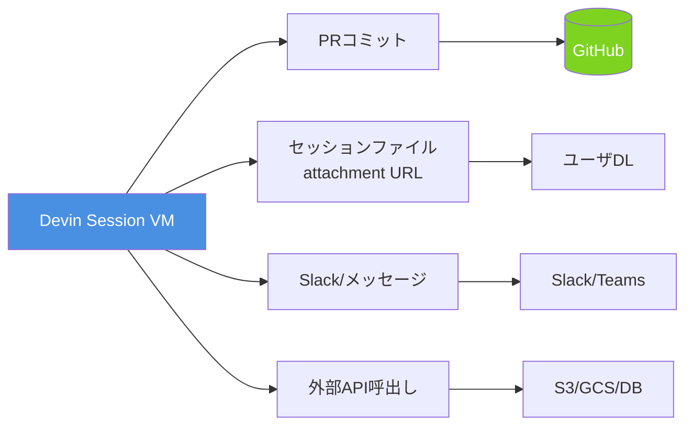

# Q46. Devinはどんな出力データを作成できる？

📚 [トップ索引](../../README.md) ｜ [カテゴリ索引: データ入出力・ドキュメント理解](README.md)

---

> **メタ**: 最終確認日 2026/4/16 ｜ 根拠 https://docs.devin.ai/ ｜ 推定なし

### 結論: **テキスト/コード系は全形式対応**。**バイナリ系もDevinがツール実行して生成可能**（PDF/Excel/画像/動画/音声/アーカイブ）。**生成物はセッション内ファイル、またはPR/コミット経由、またはattachment URL**で受け取る

### 出力データのフロー



### 出力経路

| 経路 | 受け取り方 |
|---|---|
| **チャット応答** | テキスト/コードブロック/表がチャットに表示 |
| **セッション内ファイル** | VM内 `/home/ubuntu/...` に生成、ダウンロードボタンで取得 |
| **PR/コミット** | Git経由でリポジトリに反映 |
| **message_user添付** | ファイル生成後にDevinが添付して送信 |
| **API Attachment URL** | アップロードしてURLで共有 |
| **Deploy出力** | `deploy`ツール経由でフロント/バックエンドURLを取得 |
| **外部連携（Slack/Email等）** | MCP/Webhook経由で送信 |

### データ種別ごとの生成能力

### 1. テキスト / コード ⭐完全対応

| 形式 | 生成 | 備考 |
|---|---|---|
| **`.txt` / `.md`** | ✅ | FAQ, README, 設計書等 |
| **コードファイル**（全言語） | ✅ | Python/JS/TS/Go/Rust/Java等 |
| **設定ファイル**（YAML/JSON/TOML/ini） | ✅ | CI, Dockerfile, config |
| **SQLスクリプト** | ✅ | schema, migration, query |
| **Shellスクリプト** | ✅ | .sh, .bash, .fish等 |
| **Jupyter notebook** | ✅ | .ipynb |
| **HTML/CSS** | ✅ | 静的サイト、メールテンプレ |

### 2. Office / 文書

| 形式 | 生成 | 主な手段 |
|---|---|---|
| **Word (.docx)** | ✅ | `python-docx` / `pandoc` |
| **Excel (.xlsx)** | ✅ | `openpyxl` / `pandas.to_excel()` |
| **PowerPoint (.pptx)** | ✅ | `python-pptx` |
| **PDF** | ✅ | `reportlab` / `weasyprint` / `pandoc` / LaTeX |
| **RTF** | ✅ | pandoc等 |
| **Google Docs/Sheets/Slides** | △ | 直接不可、`.docx/.xlsx`で出力後アップロードか、MCPで書き込み |
| **Notion / Confluence** | △ | MCP/API経由で書き込み |

#### 例: Excelレポート生成
```python
import pandas as pd
df = pd.DataFrame({'部署': [...], '売上': [...]})
with pd.ExcelWriter('report.xlsx', engine='openpyxl') as w:
    df.to_excel(w, sheet_name='売上')
```

#### 例: PDFレポート生成
```python
from reportlab.lib.pagesizes import A4
from reportlab.pdfgen import canvas
c = canvas.Canvas("report.pdf", pagesize=A4)
c.drawString(100, 800, "月次レポート")
c.save()
```

### 3. 静止画像

| 形式 | 生成 | 手段 |
|---|---|---|
| **PNG / JPG / WebP** | ✅ | `Pillow` / `matplotlib` / `plotly` |
| **SVG** | ✅ | テキスト生成 |
| **GIF**（静止） | ✅ | `Pillow` |
| **BMP / TIFF** | ✅ | `Pillow` |
| **HEIC** | △ | 変換経由 |

#### 生成可能なもの
- **グラフ/チャート**（matplotlib/seaborn/plotly）
- **図解・フローチャート**（graphviz / mermaid → レンダリング）
- **簡単な画像合成**（Pillowで文字・図形）
- **AIアート生成**は**標準では不可**（別途画像生成APIとの連携が必要）

### 4. 動画

| 形式 | 生成 | 手段 |
|---|---|---|
| **MP4 / WebM / MOV** | ✅ | `ffmpeg` / `moviepy` |
| **GIFアニメ** | ✅ | `imageio` / `Pillow` |
| **スクリーンレコーディング** | ✅ | セッション録画機能あり |

#### 生成例
- **グラフアニメーション**（matplotlibのFuncAnimation → MP4）
- **画像→動画変換**（複数画像を連結）
- **画像シーケンス + 音声**合成

→ **リアルな動画生成**（Sora的）は**非対応**。

### 5. 音声

| 形式 | 生成 | 手段 |
|---|---|---|
| **MP3 / WAV / OGG** | ✅ | `pydub` / `ffmpeg` |
| **音声合成（TTS）** | △ | 外部API連携必要（OpenAI TTS, ElevenLabs等） |

### 6. 圧縮アーカイブ

| 形式 | 生成 | コマンド |
|---|---|---|
| **ZIP** | ✅ | `zip -r output.zip dir/` |
| **TAR.GZ** | ✅ | `tar czvf` |
| **TAR.BZ2 / XZ** | ✅ | `tar cjvf` / `tar cJvf` |
| **7Z** | ✅ | `7z a` |
| **パスワード付きZIP** | ✅ | `zip -P password` |

### 7. データ分析形式

| 形式 | 生成 | 手段 |
|---|---|---|
| **CSV / TSV** | ✅ | `pandas.to_csv()` |
| **Parquet / Arrow** | ✅ | `pandas.to_parquet()` |
| **HDF5** | ✅ | `h5py` |
| **SQLite** | ✅ | `sqlite3` |
| **JSON Lines** | ✅ | Python標準 |

### 8. その他

| 形式 | 生成 | 手段 |
|---|---|---|
| **EPUB**（電子書籍） | ✅ | `pandoc` |
| **Markdown → HTML変換** | ✅ | pandoc/markdown |
| **Mermaid図 → PNG/SVG** | ✅ | mermaid-cli |
| **PlantUML図** | ✅ | plantuml |
| **QRコード** | ✅ | `qrcode` |
| **バーコード** | ✅ | `python-barcode` |

### 文字コード・改行コード（出力）

### 文字コード
- **デフォルト**: **UTF-8 (no BOM)**
- **指定可能**: 要件を伝えれば `Shift_JIS / UTF-8 with BOM` 等で出力
- **Excel（.xlsx）は内部的にUTF-8 (XML)**

#### 明示指示の例
```
結果のCSVはShift_JISで、Windows Excelで文字化けしないように出力して
```

### 改行コード
- **デフォルト**: **LF**（Unix系）
- **Windows向け**: 指示すれば **CRLF** 出力可
- **Office系ファイル**: 内部的に適切、気にしなくてOK

#### 明示指示の例
```
README.txt は Windows のメモ帳で開けるように CRLF で保存して
```

### 出力サイズの目安

| 種別 | 目安 |
|---|---|
| **チャット応答** | 数千文字程度（超えると分割） |
| **生成ファイル** | VMディスク内（数GB余裕） |
| **API Attachment** | 数百MB程度まで |
| **PR（単一コミット）** | 数MB〜数十MBまで実用的 |

### 具体的な成果物の例

### 業務系
- **日次/週次/月次レポート（Excel/PDF）**
- **ダッシュボードHTML**（Plotly/Dashベース）
- **Pythonスクリプト + requirements.txt + README**
- **Docker Compose環境**（docker-compose.yml + 設定一式）

### 開発系
- **アプリのフルソースコード**（PRとして提出）
- **APIスキーマ（OpenAPI YAML）**
- **CIワークフロー（.github/workflows/*.yml）**
- **Terraformファイル一式**
- **テストコード + カバレッジレポート**

### ドキュメント系
- **README.md / ARCHITECTURE.md / CONTRIBUTING.md**
- **API Reference**（Swagger/Redoc）
- **プレゼン資料（.pptx / Marp）**
- **図解（Mermaid/PlantUML/Excalidraw）**

### データ系
- **データクレンジング後のCSV/Parquet**
- **統計分析レポート（Jupyter → HTML）**
- **可視化画像一式（matplotlib）**
- **SQLite DBファイル**

### メディア系
- **スクリーンショット付きマニュアル**
- **チャート動画（MP4）**
- **QRコード付き名刺画像**

### 成果物の受け取り方法

### 方法1: セッションのダウンロード
- セッション画面でファイルマネージャから直接ダウンロード
- シェルタブで `cat`/`ls`して確認

### 方法2: PR/コミット
- Git管理下のファイルなら**PRとして提出 → mergeで受け取り**
- 最も確実でレビュー可能

### 方法3: メッセージ添付
- Devinが `message_user` で添付ファイルとしてチャットに投稿
- WebappのチャットUIでクリックダウンロード

### 方法4: API Attachment経由で共有
```python
# Devin内で生成した後、attachmentsエンドポイントでアップロード
# → URLが返る → 他システムに共有
```

### 方法5: デプロイ経由
- フロントエンド → `devinapps.com` サブドメイン
- バックエンド → Fly.io 公開URL

### 方法6: 外部連携
- **Slack/Email** へ直接送信（MCP）
- **Google Drive / S3** に書き込み（認証設定後）

### 制限事項

| 制限 | 詳細 |
|---|---|
| **生成ファイル1つの容量** | 数GB程度までは実用可、より大きい場合はストリーム処理 |
| **リアルな動画生成** | 不可（Sora的機能なし） |
| **AIアート画像生成** | 不可（DALL-E/Midjourney的機能なし、連携APIは使える） |
| **3D/CAD生成** | 不可 |
| **暗号化ファイル生成** | 可（対称暗号/PGP等） |

### 要求時のコツ

| 要求のあいまい度 | 出力品質 |
|---|---|
| 「レポート作って」 | ✗ 何形式か不明 |
| 「レポートをExcelで作って」 | △ 内容不明 |
| 「2025年Q4売上レポートをExcelで、3シート（サマリ/詳細/グラフ）構成、Shift_JIS文字化け対策済みで」 | ✅ 明確 |

### まとめ

| カテゴリ | 出力 | 手段 |
|---|---|---|
| **テキスト/コード** | ✅ 全対応 | ネイティブ生成 |
| **Office (Word/Excel/PPT)** | ✅ | python-docx/openpyxl/python-pptx |
| **PDF** | ✅ | reportlab/weasyprint/pandoc |
| **画像 (PNG/JPG/SVG)** | ✅ | Pillow/matplotlib/plotly |
| **動画 (MP4)** | ✅ | ffmpeg/moviepy（アニメ・画像連結） |
| **音声 (MP3/WAV)** | ✅ | pydub/ffmpeg/外部TTS |
| **アーカイブ (ZIP/TAR)** | ✅ | zip/tar |
| **データ形式 (Parquet/HDF5/SQLite)** | ✅ | pandas/h5py/sqlite3 |
| **Mermaid/PlantUML図** | ✅ | mermaid-cli/plantuml |
| **Google Docs直接書き込み** | △ | MCP経由 |
| **AIアート/動画生成** | ❌ | 非対応、外部API連携なら可 |
| **文字コード** | デフォルトUTF-8、指定で切替可 | |
| **改行コード** | デフォルトLF、指定でCRLF可 | |

**核心**: Devinは「**テキスト系は何でも、バイナリ系はツール経由で何でも**」生成可能。受け取りは**PR / セッションダウンロード / message_user添付 / Attachment URL / デプロイ**の5経路。要求時は**形式・構造・文字コード・改行を明示**すると品質が安定。

---

[← Q45. Devinはどんな入力データを認識できる？](q45-input-data-types.md) ｜ [Q47. DevinはExcel上の図、Word・PDF上の図をどのくらい理解できる？ →](q47-image-pdf-diagrams.md)
