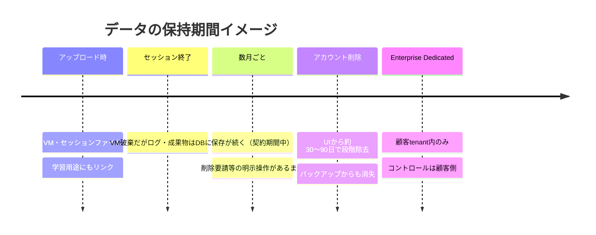

# Q50. Devinに入力/アップロードしたデータはいつまで保存される？

📚 [トップ索引](../../README.md) ｜ [カテゴリ索引: セキュリティ・監査・ガバナンス](README.md)

---

> **メタ**: 最終確認日 2026/4/16 ｜ 根拠 https://docs.devin.ai/enterprise/security / https://trust.cognition.ai ｜ 推定あり

### 結論: **デフォルトでは「契約期間中は保管」**。**Feedback/Usage dataは再学習/改善用途で別途保管**。**Enterprise Dedicated SaaSでは顧客tenantに保管**。**明示的削除なしでは原則消えない**

### データの保存時間軸

参考: https://docs.devin.ai/enterprise/security/enterprise-security

### 公式ポリシー（要約）

### データ保持ポリシー
> Cognition retains data processed through Devin only for the duration of the customer relationship unless specified otherwise.
> Feedback & User Interaction Data may be retained as needed, as determined by Cognition.

**翻訳**:
- **処理されたデータ** は**顧客との契約関係が続く限り保管**
- **フィードバック・ユーザインタラクションデータ**はCognitionの判断で必要に応じ保管

### 学習利用
> By default, Cognition does not train its models on customer data or code.

**デフォルトでは学習に使わない**。

### Enterprise特例
> For Enterprise customers with dedicated SaaS deployments, all customer data is stored within the customer's tenant.

**Enterprise + Dedicated SaaS** では**顧客tenantに保管**（Cognition環境外）。

### データ種別ごとの保持期間（実運用からの推察込み）

| データ | 保持期間 | 備考 |
|---|---|---|
| **セッションのチャット履歴** | 契約期間中 | ユーザ側でセッション削除は可 |
| **セッション内で生成したファイル** | VMのライフサイクル内 + 一定期間のバックアップ | VM終了後にも紐づけられる |
| **添付ファイル（Attachment）** | 契約期間中 | URL参照先に保管 |
| **Playbook** | 明示削除まで | ユーザ管理 |
| **Knowledge** | 明示削除まで | ユーザ管理 |
| **Secrets** | 明示削除まで | ユーザ管理、暗号化保管 |
| **Schedules** | 明示削除まで | ユーザ管理 |
| **ユーザプロフィール情報** | 退会まで | アカウント削除で消える |
| **支払い情報** | 法的要件に準拠 | 会計法等で一定期間保管義務 |
| **監査ログ / アクセスログ** | SOC 2 要件の範囲で保管（通常1年以上） | Enterprise向け開示あり |
| **フィードバック・ユーザインタラクションデータ** | Cognitionの判断 | 改善・サポート用 |

### デフォルト vs Enterprise

| 観点 | 標準プラン | Enterprise（Dedicated SaaS） |
|---|---|---|
| **データ保管場所** | Cognition管理のAWS環境 | **顧客tenant内** |
| **他顧客との分離** | 論理分離 | **物理（テナント）分離** |
| **データ保持期間** | 契約期間中 | **顧客のポリシーに従う** |
| **削除要求対応** | サポート依頼 | **顧客が直接制御** |
| **監査ログ開示** | 限定的 | **詳細開示** |
| **契約解除時** | データ削除（契約書の定め） | **顧客環境で完全制御** |

### 具体的な保持の「体感」

### シナリオ1: 個人Freeプラン
- セッション実行 → 実行後も**チャット履歴は残る**
- Playbook/Knowledge/Secretsは**削除するまで残る**
- アカウント削除すれば**全データ削除（のはず）**

### シナリオ2: 企業Teamsプラン
- セッション履歴は**組織管理下で保管**
- **管理者は全メンバーのセッションを閲覧可能**（設定次第）
- 退職者のアカウント削除で**個人セッションは削除**、組織共有のPlaybook/Knowledgeは残る

### シナリオ3: Enterprise Dedicated SaaS
- 全データが**顧客AWSテナント内**
- **契約期間中保持** + **終了時は顧客のポリシーで削除**
- **監査ログ** / **バックアップ** が顧客のコンプライアンス要件に準拠

### 「なぜ残すのか」の背景

### 背景1: サービス継続
- セッションの再開・履歴参照
- Playbook/Knowledgeの継続利用
- Schedules/Integrationsの動作継続

### 背景2: サポート・デバッグ
- 問い合わせ時のセッション調査
- 障害時の再現・原因分析

### 背景3: 法令遵守
- 会計情報（支払いログ等）の保管義務
- 監査対応（SOC 2要件）

### 背景4: サービス改善（オプトイン時）
- 匿名化された利用パターン分析
- Feedback評価

### 保持期間を短くしたい場合

### 手段1: 定期的に自分でセッションを削除
- 不要になったセッションはこまめに削除
- 月1回のクリーンアップを習慣化

### 手段2: Knowledge/Playbook/Secretsの棚卸し
- 四半期ごとに不要なものを削除

### 手段3: 組織ポリシー（管理者向け）
- 「90日以上活動のないセッションは自動削除」等のルールを設定（**Enterprise機能**）

### 手段4: Dedicated SaaS / オンプレ
- 顧客側で保持ポリシーを完全制御

### 手段5: 契約書でカスタマイズ
- Enterprise契約時に**具体的な保持期間をSLAに明記**
- 例: 「アクセスログは90日、セッション履歴は契約終了後30日で削除」

### 法的観点

### GDPR (欧州)
- **管理者（Controller）と処理者（Processor）の役割分担に注意**
  - Devinを通じて個人データを扱う**顧客組織が Controller**（一次応答義務あり）
  - **Cognition は Processor**（Controllerの指示に従って処理し、削除要請等に協力する立場）
- **Art.17 消去権（Right to erasure / いわゆる「忘れられる権利」）**: データ主体からの消去要請には、まず Controller（顧客）が受理・判断し、Processor（Cognition）はその指示に従ってデータを削除・返却する
- **データ処理契約（DPA）**を Enterprise 契約で締結可（Controller-Processor 間の義務を明確化）

### CCPA (カリフォルニア)
- 削除・非売却リクエスト対応
- Cognitionはprivacy policyで対応宣言

### 個人情報保護法（日本）
- 個人情報の保管・削除基準に準拠
- 委託先監督義務あり

### HIPAA / PCI DSS
- 医療・決済データを扱う場合は**Enterprise契約 + 専用対応必須**

### 削除後の「本当に消えるのか？」

Cognitionの実装詳細は非公開だが、一般的なSaaSの実装では:

- **論理削除（soft delete）** 後、**一定期間（30日程度）で物理削除**
- **バックアップからは最長30〜90日程度で消失**
- **監査ログは別基準**で長期保持（法的要件）

→ 「削除」即「跡形もなく消える」わけではなく、**段階的に削除**される。

### アクセス可能者

| 役割 | 見れるもの |
|---|---|
| **本人** | 自分のセッション・Playbook/Knowledge/Secrets |
| **組織管理者** | 組織メンバーのセッション（Teams/Enterprise） |
| **Cognition従業員** | サポート目的で**限定的にアクセス可能** |
| **Cognition監査** | SOC 2要件に基づきアクセスログ確認 |
| **法執行機関** | 正当な法的要請に基づき開示の可能性 |

### 契約終了時の扱い

### Free → 退会
- **アカウント削除 → データ削除**
- 削除完了までに一定期間

### Paid → 解約
- 契約書記載の猶予期間後、**データ削除**
- 通常30〜90日程度
- エクスポート期間あり

### Enterprise → 契約満了
- 顧客と合意した期限内で**データ削除 or エクスポート**
- Dedicated SaaSなら**顧客tenant内でそのまま残す選択も**

### まとめ

| データ | デフォルト保持期間 |
|---|---|
| **セッション履歴** | **契約期間中** |
| **Playbook / Knowledge / Secrets** | **明示削除まで** |
| **添付ファイル** | **契約期間中** |
| **監査ログ** | **SOC 2要件（通常1年以上）** |
| **支払い情報** | **法令に従う（会計法等）** |
| **学習利用** | **デフォルトでは学習に使わない**（契約・オプトインで変更あり得る） |
| **Enterprise Dedicated** | **顧客tenant内**、顧客ポリシー従属 |

| シナリオ | 実態 |
|---|---|
| 何もしなければ | **契約期間中ずっと残る** |
| セッション削除 | **論理削除 → 段階的物理削除** |
| アカウント削除 | **全データ削除（猶予期間あり）** |
| 契約解除 | **契約書記載の期限で削除** |

**核心**: Devinは「**契約期間中は原則保管**」がデフォルト。**明示的に削除しない限りデータは残る**ので、**定期的な棚卸し**が重要。厳格な保持期間管理が必要なら **Enterprise + Dedicated SaaS** で顧客tenantに保管し、**ポリシーを完全制御**するのが正解。

---

[← Q49. Devinに大量データを連携させるには？](../11-data-docs/q49-bulk-data-handling.md) ｜ [Q51. Devinのセッション/データを削除するには？（Terminate / Archive / 完全削除の3階層） →](q51-terminate-archive-delete.md)
