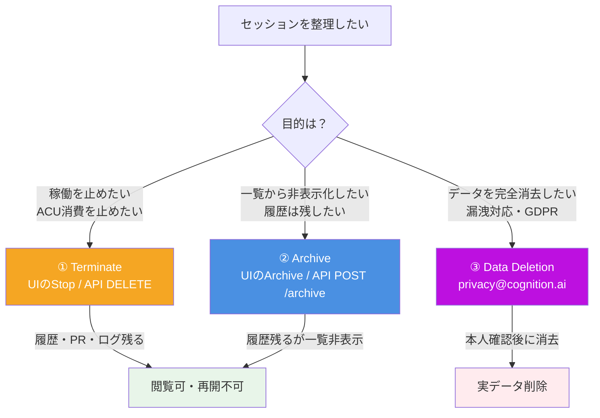

# Q51. Devinのセッション/データを削除するには？（Terminate / Archive / 完全削除の3階層）

📚 [トップ索引](../../README.md) ｜ [カテゴリ索引: セキュリティ・監査・ガバナンス](README.md)

---

> **メタ**: 最終確認日 2026/4/17 ｜ 根拠 https://docs.devin.ai/api-reference/v3/sessions/delete-organizations-sessions / https://docs.devin.ai/api-reference/v3/sessions/post-organizations-sessions-archive ｜ 推定あり

### 結論: Devinの「削除」は**3つの意味**があり使い分けが必要:
- **① Terminate（終了）**: 稼働を停止。履歴・PR・ログは**残る**。UIの「Stop」「End」ボタンまたは `DELETE /v3/.../sessions/{devin_id}`（API名は`Terminate`、⚠️データ削除ではない）
- **② Archive（アーカイブ）**: 終了＋デフォルト一覧から非表示。閲覧は可。UIの「Archive」または `POST /v3/.../sessions/{devin_id}/archive`
- **③ 完全削除（Data Deletion）**: 会話・成果物の実データを消去。**自己操作のAPIなし**、`privacy@cognition.ai` 経由でのみ対応（GDPR/DSR）

ACU稼働を止めるだけなら**①Terminate**、一覧整理なら**②Archive**、機密情報の消去や「忘れられる権利」行使なら**③完全削除依頼**。

### 「削除」の3つの意味（最重要）



| 操作 | 挙動 | データ残存 | 再開可否 | 閲覧可否 | 自己操作で可能？ |
|---|---|---|---|---|---|
| **① Terminate（終了）** | 実行停止、ACU消費停止 | ✅ 残る | ❌ 不可 | ✅ 可 | ✅ UI / API |
| **② Archive（アーカイブ）** | 終了＋一覧非表示 | ✅ 残る | ❌ 不可 | ✅ 可（アーカイブ画面） | ✅ UI / API |
| **③ 完全削除（Data Deletion）** | 会話・ログ・成果物を消去 | ❌ 削除 | ❌ 不可 | ❌ 不可 | ⚠️ **サポート経由のみ**（`privacy@cognition.ai`） |

**重要な落とし穴**: HTTP の `DELETE /v1/sessions/{id}` / `DELETE /v3/.../sessions/{devin_id}` は公式ドキュメント上 **"Terminate Session"** と明記されており、**データ削除ではなく稼働停止**。「REST の DELETE = データ消去」という先入観で使うと誤解する。

### ① Terminate（終了）の手順

#### UIから
1. セッション画面 (`https://app.devin.ai/sessions/<id>`) を開く
2. 右上の **Stop** / **End Session** ボタンをクリック
3. 確認ダイアログで **Confirm**
4. セッションステータスが `terminated` になる（再開不可、履歴は閲覧可）

#### API（v3推奨）から
```bash
curl -X DELETE \
  "https://api.devin.ai/v3/organizations/${ORG_ID}/sessions/${DEVIN_ID}" \
  -H "Authorization: Bearer ${DEVIN_API_KEY}"
# 同時にアーカイブもしたい場合: ?archive=true
```
- 公式: https://docs.devin.ai/api-reference/v3/sessions/delete-organizations-sessions
- 権限: Service User に `ManageOrgSessions`
- **このAPIはTerminateであり、データ削除ではない**

#### v1 API（レガシー）
```bash
curl -X DELETE \
  "https://api.devin.ai/v1/sessions/${SESSION_ID}" \
  -H "Authorization: Bearer ${DEVIN_API_KEY}"
```
- 公式: https://docs.devin.ai/api-reference/v1/sessions/terminate-a-session

### ② Archive（アーカイブ）の手順

アーカイブは「**終了＋デフォルト一覧から非表示化**」。履歴は残したいが一覧を整理したい場合に使う。

#### UIから
1. セッション一覧 or セッション画面のメニュー（⋮）を開く
2. **Archive** を選択
3. 一覧から非表示になる（別途「Archived」フィルタで再表示可）

#### API（v3）から
```bash
curl -X POST \
  "https://api.devin.ai/v3/organizations/${ORG_ID}/sessions/${DEVIN_ID}/archive" \
  -H "Authorization: Bearer ${DEVIN_API_KEY}"
```
- 公式: https://docs.devin.ai/api-reference/v3/sessions/post-organizations-sessions-archive
- 稼働中でもOK（自動的に Sleep 化）
- 公式Notes: *"Archived sessions can still be viewed but cannot be modified or resumed."*

### ③ 完全削除（実データ消去）の手順

**自己操作できる公式APIは存在しない**（2026/4/17時点）。以下のフローでサポート依頼:

#### ステップ
1. **事前準備**: 対象のセッションID・組織ID・削除範囲を特定
2. **メール送信先**: `privacy@cognition.ai`（GDPR / 個人情報保護）または `support@cognition.ai`（一般）
3. **メール本文に記載すべき情報**:
   ```
   Subject: Data deletion request - [Session ID: devin-xxxxx / Org ID: org-xxxxx]
   
   - ユーザID / 組織ID
   - 削除対象の範囲（全アカウント / 特定セッション / 特定ファイル）
   - 法的根拠（GDPR忘れられる権利 / CCPA / 個人情報保護法 等、該当する場合）
   - 緊急度（通常 / 緊急：秘密情報漏洩等）
   - 連絡先
   ```
4. **本人確認**: Cognition から認証メール → 返信
5. **削除実行**: Cognition 側でデータ削除処理（GDPR原則1ヶ月以内、緊急時は数日）
6. **削除完了通知**: メールで受領。Enterprise契約は**削除証明書（Certificate of Destruction）**も取得可

#### 緊急削除（APIキー漏洩など）
1. **即座に Terminate**（UI Stop）→ ACU消費を止める
2. **漏洩した鍵を即ローテーション**（OpenAI/AWS等のコンソールで無効化）
3. **`security@cognition.ai` に緊急メール**
   - 件名: `URGENT: Accidental credential exposure in session <devin-id>`
   - 本文: 影響範囲・鍵の種類・対応状況・発生日時
4. 並行して**社内インシデント報告**（規定次第）
5. **ログ確認**（CloudTrail等で不正利用ないか）

### 削除の段階（時系列）

```mermaid
flowchart TD
    Req[削除要請] --> L1[1. 論理削除（UI/API）<br/>即時]
    L1 --> L2[2. DB上の実削除<br/>数日以内]
    L2 --> L3[3. バックアップから消失<br/>30〜90日]
    L3 --> L4[4. 完全削除保証<br/>Enterprise契約 + 依頼書]
    UI[UI操作 Terminate/Archive] --> Req
    Account[アカウント削除] --> Req
    Support[privacy@cognition.ai 依頼] --> Req
    style L1 fill:#F5A623,color:#fff
    style L2 fill:#4A90E2,color:#fff
    style L3 fill:#7ED321,color:#fff
    style L4 fill:#BD10E0,color:#fff
```

### 削除の5階層

Devinのデータ削除は階層があり、用途により使い分ける:

| レベル | 対象 | 方法 |
|---|---|---|
| **L1: 個別リソース削除** | セッション/Knowledge/Playbook/Secret 1件ずつ | UIから |
| **L2: 組織管理者による一括削除** | チームのリソース、退職者データ | Admin UI |
| **L3: アカウント削除** | ユーザ紐づけ全データ | Settings → Delete account |
| **L4: 契約解除** | 組織全体のデータ | 契約解除手続き |
| **L5: 完全消去依頼** | バックアップ含む完全消去 | サポート / Enterprise契約 |

### L1: 個別リソース削除（Webapp UI）

### セッションの削除（Terminate相当）
1. **Sessions** 画面（https://app.devin.ai/sessions）
2. 対象セッションを右クリック or ⋮メニュー
3. **Stop / End** で稼働停止、または **Archive** で一覧非表示
4. 確認ダイアログで **Confirm**

→ 稼働は停止するが、チャット履歴・添付ファイル・PR記録は**保持される**（閲覧可）。実データ消去が必要な場合は③完全削除の手順へ。

### Knowledgeの削除
1. **Settings → Knowledge**
2. 対象knowledgeの︙メニュー → **Delete**

### Playbookの削除
1. **Settings → Playbooks**
2. 対象playbookの︙メニュー → **Delete**

### Secretsの削除
1. **Settings → Secrets**
2. 対象secretの︙メニュー → **Delete**
3. 即座に環境変数注入から除外される

### Schedulesの削除
1. **Settings → Schedules**
2. 対象scheduleの︙メニュー → **Delete**

### Organizationメンバー削除（管理者のみ）
1. **Settings → Members**
2. メンバー右のアクション → **Remove**

### CLI/APIによる Terminate / Archive（上級）
```bash
# Terminate（稼働停止、データは残る）- v3推奨
curl -X DELETE \
  "https://api.devin.ai/v3/organizations/${ORG_ID}/sessions/${DEVIN_ID}" \
  -H "Authorization: Bearer ${DEVIN_API_KEY}"

# Terminate + Archive を1発で
curl -X DELETE \
  "https://api.devin.ai/v3/organizations/${ORG_ID}/sessions/${DEVIN_ID}?archive=true" \
  -H "Authorization: Bearer ${DEVIN_API_KEY}"

# Archiveのみ（稼働中なら自動Sleep化）
curl -X POST \
  "https://api.devin.ai/v3/organizations/${ORG_ID}/sessions/${DEVIN_ID}/archive" \
  -H "Authorization: Bearer ${DEVIN_API_KEY}"

# v1（レガシー）
curl -X DELETE "https://api.devin.ai/v1/sessions/${SESSION_ID}" \
  -H "Authorization: Bearer ${DEVIN_API_KEY}"
```

**⚠️ 注意**: 上記すべて「Terminate / Archive」であり、**データそのものの削除ではない**。データ消去は③完全削除の手順へ。

### L2: 組織管理者による一括削除

### 対象
- 退職者のセッション
- 過去の未使用リソース
- コンプライアンス監査後の不要データ

### 方法
1. **Admin Dashboard** (https://app.devin.ai/settings)の該当セクション
2. フィルタ（作成日・作成者・タグ等）で対象絞り込み
3. Bulk選択 → **Delete**

### スクリプト化（自動削除）
```python
# 90日以上アクセスのないセッションを一括削除
import requests
from datetime import datetime, timedelta

cutoff = datetime.now() - timedelta(days=90)
resp = requests.get("https://api.devin.ai/v1/sessions", headers={...})
for s in resp.json()["sessions"]:
    if s["last_activity"] < cutoff.isoformat():
        requests.delete(f"https://api.devin.ai/v1/sessions/{s['id']}", ...)
```

### L3: アカウント削除

### 個人アカウント

1. **Settings → Account**
2. **Delete Account** ボタン
3. パスワード確認・理由入力
4. 削除確定
5. **メール確認**で完了

### 削除後の挙動
- **セッション/Knowledge/Playbook/Secrets** → 論理削除、一定期間後物理削除
- **チーム所属データ** → 組織所有のものは管理者に移管 or 削除
- **支払い履歴** → 会計法上の保持義務により、**法定期間は匿名化して保持**される場合あり
- **サポートチケット履歴** → 別システム管理、個別削除依頼が必要な場合あり

### 注意
- **チーム管理者は先にownership移譲** してから退会
- 削除は **取り消し不可**
- **バックアップからの消失**までは数十日程度かかる

### L4: 契約解除（組織全体）

### 手順
1. **契約書記載の解約手続き**（通常はメール通知）
2. Cognitionサポートが**データエクスポート期限**を提示
3. エクスポート期間後、**データ削除**
4. **削除証明書**（Certificate of Destruction）を依頼可能（Enterprise）

### 契約書で事前合意すべき項目
- データ削除の期限（例: 契約終了後30日以内）
- エクスポート形式・期間
- 削除証明書の発行
- 監査ログの扱い
- バックアップからの消失期間

### L5: 完全消去依頼（GDPR等の法的要請）

### 対象となる状況
- **GDPRの右忘れ権（Right to be forgotten）**行使
- **CCPA**の削除リクエスト
- **個人情報保護法**の削除請求
- **誤ってアップロードした秘密情報の緊急削除**
- **退職時の全データ消去**

### 手順
1. **security@cognition.ai** or **support@cognition.ai** にメール
2. 以下を記載:
   - ユーザID / 組織ID
   - 削除対象の範囲（全アカウント / 特定セッション / 特定ファイル）
   - 法的根拠（該当する場合）
   - 連絡先
3. **本人確認**（メール認証等）
4. Cognitionがデータを調査・削除
5. **削除完了通知**を受領

### 期限
- **GDPR**: 原則1ヶ月以内（複雑な場合3ヶ月まで延長可）
- **一般**: 数日〜数週間

### Enterprise契約
- **専用サポート窓口**あり
- **DPA（Data Processing Agreement）**で削除SLAを事前合意
- **削除証明書**の即時発行対応

### 緊急削除（機密情報漏洩時）

### シナリオ: APIキーを誤って貼った等

1. **即座にセッションを削除**
2. **漏洩した鍵を即ローテーション**（OpenAI/AWS等のコンソールで無効化）
3. **Cognitionサポートにメール**で緊急削除依頼
   - 件名: 「URGENT: Accidental credential exposure in session XXX」
   - 内容: 影響範囲・鍵の種類・対応状況
4. **社内インシデント報告**（規定次第）
5. **ログ確認**（CloudTrail等で不正利用ないか）

### 予防策
- **Secretsを使う**（平文禁止）
- **事前チェックリスト**（Q48参照）

### バックアップからの消失

一般的なSaaSの実装パターン:

```
削除操作
  ↓
論理削除（DBフラグ更新）← 即時
  ↓
物理削除（DB行削除）← 7〜30日
  ↓
バックアップからの消失 ← 30〜90日
  ↓
完全消失（監査ログ除く）← 最大90日程度
```

**監査ログは別保持** (SOC 2要件で1年以上)。

### データ別の削除可能性

| データ | 削除可能性 |
|---|---|
| **セッションチャット** | ✅ UI即可能 |
| **添付ファイル** | ✅ セッション削除で連動 |
| **Knowledge / Playbook** | ✅ UI即可能 |
| **Secrets** | ✅ UI即可能 |
| **監査ログ** | △ 法的要件で保持、正当な削除要求で対応 |
| **支払い情報** | △ 会計法で一定期間保持、匿名化は可 |
| **ユーザプロフィール** | ✅ アカウント削除で |
| **SCM連携（GitHub Token）** | ✅ 連携解除で削除 |
| **Cognition側の学習データ** | N/A（デフォルト学習なし） |
| **フィードバックデータ** | △ 明示削除要求で対応 |

### 削除が効かないケース

| ケース | 理由 | 対処 |
|---|---|---|
| 支払い情報 | 会計法の保持義務 | 匿名化依頼 |
| 監査ログ | SOC 2 / 規制要件 | 法定期間後に削除 |
| 共有セッション（組織管理） | 管理者権限で保持 | 管理者に削除依頼 |
| GitHub側のコミット | Git側の履歴 | `git filter-branch`等で自前対応 |
| 他者が引用したknowledge | 引用先の判断 | 引用解除依頼 |

### チェックリスト（完全削除を目指す場合）

```
□ 関連セッションを全て削除
□ Knowledge / Playbook / Schedules を全て削除
□ Secrets を全て削除
□ SCM連携（GitHub/GitLab等）を解除
□ 外部統合（Slack/Linear等）を解除
□ API Keyを全て無効化・削除
□ アカウント削除実行
□ Cognitionに完全削除依頼メール（必要に応じ）
□ バックアップからの消失確認（30〜90日後）
□ 削除証明書取得（Enterprise/法的要請時）
```

### 削除の「確認方法」

### セルフ確認
- 削除直後: UIから消える
- API: 404が返る
- セッションURL: アクセス不可

### Cognitionへの確認依頼
- サポートメールで **「削除が完了したか確認したい」** と問い合わせ
- Enterprise: 担当アカウントチーム経由

### まとめ

| 削除レベル | 手段 | 所要時間 |
|---|---|---|
| **個別リソース** | UI / API | 即時（バックアップは数十日） |
| **アカウント** | Settings → Delete | 即時〜数日 |
| **契約解除** | 契約書手続き | 契約書記載期間 |
| **完全削除依頼** | security@cognition.ai | 数日〜1ヶ月 |
| **緊急削除（漏洩時）** | サポート緊急連絡 | 即〜数日 |
| **監査ログ削除** | 法定期間後 | 1年以上 |

| データ種別 | 削除可否 |
|---|---|
| セッション・Knowledge・Playbook・Secrets | **即削除可** |
| アカウント関連全体 | **退会で削除** |
| 監査ログ・支払い情報 | **法定要件で一定期間保持** |

**核心**: Devin の「削除」は**3階層**（① Terminate＝稼働停止/データ残る、② Archive＝一覧非表示/データ残る、③ 完全削除＝実データ消去・サポート経由のみ）。HTTP の `DELETE` は **"Terminate"** であってデータ消去ではない点に注意。ACU 節約なら①②、機密情報の消去や GDPR 行使なら③ `privacy@cognition.ai` 依頼。漏洩時は**即 Terminate ＋ 鍵ローテーション ＋ `security@cognition.ai` 緊急連絡**。

---

[← Q50. Devinに入力/アップロードしたデータはいつまで保存される？](q50-data-retention.md) ｜ [Q52. 組織契約プランで、管理者は一般ユーザのどこまで把握できる？ →](q52-org-admin-visibility.md)
