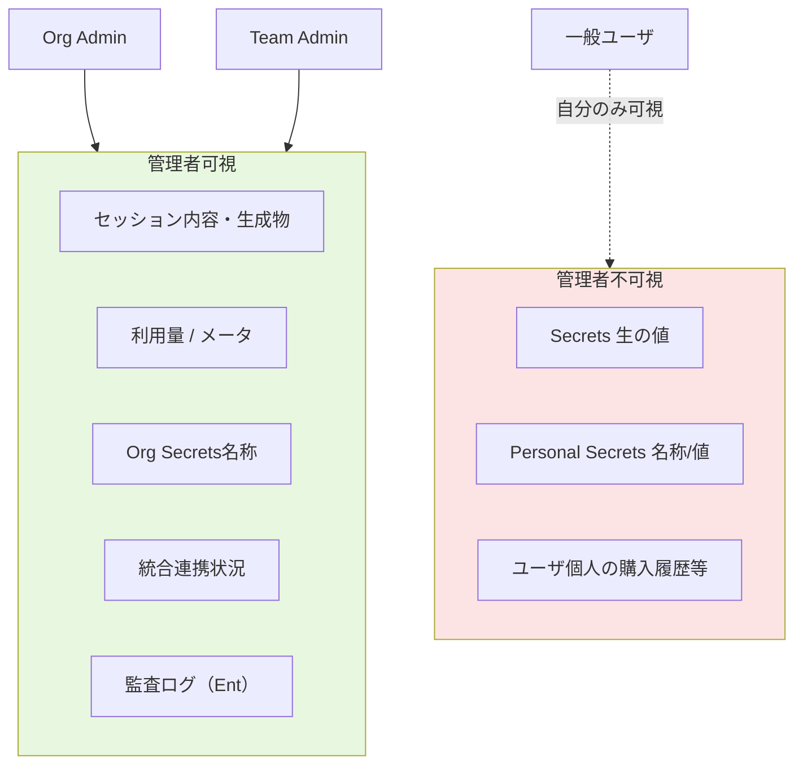

# Q52. 組織契約プランで、管理者は一般ユーザのどこまで把握できる？

📚 [トップ索引](../../README.md) ｜ [カテゴリ索引: セキュリティ・監査・ガバナンス](README.md)

---

> **メタ**: 最終確認日 2026/4/16 ｜ 根拠 https://docs.devin.ai/enterprise/security ｜ 推定あり

### 可視性の階層

### 結論: **Teams/Enterpriseでは管理者は「ユーザのセッション内容・生成物・利用量・Secrets使用状況・統合連携状況」を広範に閲覧可能**。**Secretsの生の値は不可視**。**ユーザの個人アカウント情報は限定的**。**監査ログはEnterpriseで詳細**

### 管理者の可視範囲（プラン別）

### Freeプラン
- **管理者の概念なし**（個人利用）

### Proプラン
- **管理者の概念なし**（個人または少人数）

### Teamsプラン
- **Team Admin** 役割あり
- チーム全体の使用状況・メンバーセッション・組織リソースを管理

### Enterpriseプラン
- **Organization Admin** が最強権限
- **RBAC**（Role-Based Access Control）で細分化可能
- **監査ログ・SSO・SCIM連携**

### 管理者が「見えるもの」（Teams/Enterprise）

### ✅ 閲覧可能

| カテゴリ | 詳細 |
|---|---|
| **組織メンバー一覧** | 全メンバー、役割、参加日、最終アクセス |
| **組織のセッション** | 全メンバーのセッション一覧（設定次第で内容も） |
| **セッション内容** | チャット履歴、コード生成物、添付ファイル |
| **利用量（ACU）** | メンバー別・期間別・リポ別 |
| **統合・連携** | SCM・Slack・Linear等の接続状況 |
| **組織Playbook** | 組織共有のPlaybook |
| **組織Knowledge** | 組織共有のKnowledge |
| **組織Secrets（メタ情報）** | Secret名・スコープ・作成者・最終更新（**値は不可視**） |
| **Scheduling** | 組織スケジュール |
| **API Keys** | 組織API Key（名前・権限・作成日、値は最初の1回のみ） |
| **課金・請求** | 月次請求書、プラン情報 |
| **監査ログ** | ログイン・Secret操作・データアクセス等（Enterprise） |
| **ポリシー設定** | データ保持・セキュリティ・アクセス制御 |

### ❌ 閲覧不可

| カテゴリ | 理由 |
|---|---|
| **Secretsの平文値** | 一度設定後は誰も読めない（書き換え・削除のみ） |
| **ユーザのパスワード** | ハッシュ化・暗号化、管理者にも不可視 |
| **個人のTOTPコード** | 個人端末で生成 |
| **個人のSecrets（Personal scope）** | **名称・値ともに本人以外（管理者・同僚・Cognition従業員）からは不可視**（下の可視性マトリクス参照） |
| **個人のSSO認証トークン** | ユーザセッション内のみ |
| **ユーザのブラウザキャッシュ・ローカルデータ** | Devin管理範囲外 |

### セッション内容の閲覧

### デフォルト動作
- **組織アカウントで作成されたセッションは、管理者が閲覧可能**
- 個人のDMや私的会話とは区別

### 管理者が見られる具体的内容
- **プロンプト（ユーザ入力全文）**
- **Devinの応答全文**
- **添付ファイル**
- **生成されたコード・PR・ドキュメント**
- **実行したコマンド**
- **使用したSecret名**（値は不可視）
- **アクセスしたURL**
- **Session duration（時間）**
- **ACU消費量**

### 制限モード（設定次第）
- Enterpriseでは **セッション内容の閲覧を役割ごとに制限**可
- 例: 「監査役は全社員のメタ情報のみ閲覧可、内容はHRのみ」

### データ可視性のマトリクス

| 見る人 → 見る対象 | 本人 | Team Admin | Org Admin | Cognition従業員 |
|---|---|---|---|---|
| 自分のセッション | ✅ | ✅ (組織内) | ✅ (組織内) | △ (サポート時のみ) |
| 他人のセッション | ❌ | ✅ | ✅ | △ |
| **Personal Secret（名前）** | ✅ | ❌ | ❌ | ❌ |
| **Personal Secret（値）** | ❌ (一度設定後) | ❌ | ❌ | ❌ |
| **Organization Secret（名前）** | ✅ | ✅ | ✅ | △ (サポート時のみ) |
| **Organization Secret（値）** | ❌ | ❌ | ❌ | ❌ |
| 支払い情報 | ❌ | △ | ✅ | ✅ |
| 監査ログ | △ (自分の分) | ✅ | ✅ | ✅ |
| ACU使用量 | ✅ (自分) | ✅ | ✅ | ✅ |

> **注**: **Personal Secret** は本人以外（管理者含む）からは**名前も値も見えない**。**Organization Secret** は管理者が**名前は見えるが値は見えない**（使用ログや注入履歴は監査可能）。

### Secretsの不可視性（重要）

### 仕組み
- Secret登録時に**暗号化して保管**
- 一度設定すると**管理者もCognitionも平文値は読めない**
- 利用時: セッション環境変数として**自動注入**のみ
- 更新: **新しい値で上書き**のみ（古い値は見えない）

### 例外: 作成者のみ確認可能な短い期間
- **作成直後のUI表示**（コピーして控えるよう促される）
- **24時間以内の編集**（操作パターンによる）

### 「誰が使ったか」は見える
- 管理者は **「どのセッションでどのSecretが注入されたか」**は見える
- 悪用検出・監査対応に使える

### 組織の入出力データ管理

### 入力データ
- **SCM連携経由**: Gitリポ→Devinへのデータ流入、管理者可視
- **添付ファイル**: 組織セッションで添付されたファイル、管理者可視
- **外部統合**: Slack/Linear等の連携経由データ、管理者可視
- **個人アカウントのSCM連携**: 混在時は設定次第

### 出力データ
- **PR/コミット**: GitHub等に反映、通常のSCM監査範囲
- **Deploy**: デプロイ先URL・内容、管理者可視
- **生成ファイル**: セッション内、管理者可視
- **送信先（Slack/Email等）**: 送信ログ、管理者可視

### 監査ログ（Enterprise）

### ログされる項目
- **ログイン・ログアウト**（IP、ブラウザ、SSO経由）
- **セッション作成・終了**
- **Secret操作**（作成・更新・削除、値は記録せず）
- **データアクセス**（どのリポ・ファイルにアクセスしたか）
- **統合連携の変更**（SCM・Slack等の接続・切断）
- **課金・設定変更**
- **管理者操作**（メンバー追加・削除・権限変更）
- **APIキー操作**（作成・失効）

### エクスポート形式
- **SIEM連携**（Splunk / Datadog / Sumo Logic等）
- **CSV / JSON エクスポート**
- **API経由での定期取得**

### 個人プライバシーとのバランス

### 現実的な配慮
- **業務利用では「管理者が見る前提」**で運用するのが前提
- **業務関係ないプライベートなやり取りは別アカウント**（Freeプラン等）で
- **機密相談・HR相談等は別経路**（Devinで扱わない）

### 組織の責任
- **運用規定を明文化**（利用目的・監視範囲・ログ保持期間）
- **メンバーに周知**（管理者の可視性を明示）
- **個人情報保護**（プライバシーポリシー準拠）

### プランごとの管理機能比較

| 機能 | Pro | Teams | Enterprise |
|---|---|---|---|
| 管理者ロール | ❌ | ✅ | ✅ (RBAC詳細) |
| メンバーセッション閲覧 | ❌ | ✅ | ✅ |
| 組織Secrets | ❌ | ✅ | ✅ |
| 組織Playbook/Knowledge | ❌ | ✅ | ✅ |
| ACU使用量ダッシュボード | △ | ✅ | ✅ |
| 監査ログ | ❌ | △ (基本) | ✅ (詳細・エクスポート) |
| SSO | ❌ | △ | ✅ (SAML/OIDC) |
| SCIM自動プロビジョニング | ❌ | ❌ | ✅ |
| IP許可リスト | ❌ | ❌ | ✅ |
| DPA | ❌ | △ | ✅ |
| 削除証明書 | ❌ | ❌ | ✅ |
| Dedicated SaaS | ❌ | ❌ | ✅ |

### 管理者運用のベストプラクティス

### 1. 利用規定の明文化
- 使用可能な用途
- 禁止事項（機微データ投入禁止等）
- ログ保持期間
- 監視範囲

### 2. オンボーディング教育
- 新メンバーにSecretsの使い方
- 平文禁止事項
- データ削除リクエストの受付窓口

### 3. 定期レビュー
- 月次: ACU利用ダッシュボード確認
- 四半期: Secrets棚卸し、Playbook棚卸し
- 年次: 利用規定見直し

### 4. インシデント対応プロセス
- 機密漏洩時のエスカレーション経路
- Cognitionサポートへの連絡窓口
- 緊急削除フロー

### 5. 最小権限
- 管理者を複数階層化（View-only / Billing / Security / Admin）
- API Keyは必要最小権限で発行

### よくある質問

### Q: 管理者は個人のSecrets値を見られる？
- **No**。値はCognitionも見られない（暗号化保管）。名前・スコープ・作成者・更新日時のみ。

### Q: 管理者は退職者のセッションを見られる？
- **Yes**（組織所有データとして残す場合）。アカウント削除前にownership移譲するか、管理者が継承。

### Q: プライベートなやり取りも見られる？
- **業務用アカウントなら見られる前提**。プライベート用途はFreeプラン個人アカウントで。

### Q: 管理者からもセッションを秘匿したい
- **通常は不可**。機密案件はEnterprise RBACで「M&A専用プロジェクトは特定管理者のみ閲覧」等の制御を入れる。

### Q: 個人アカウントと会社アカウントを使い分けるには？
- メールアドレスで分離。会社メールはTeamsプラン、個人メールはFree/Proプラン。

### Q: 組織管理者が悪用する可能性は？
- 内部統制の問題、**監査ログで管理者操作も記録**されるのでチェックは可能。

### 法的観点

### GDPR / 個人情報保護法
- **組織が処理するデータの管理責任**
- **従業員への情報開示**（管理者が見る旨）
- **削除要求への対応**

### 労働関連
- **従業員の操作ログ監視**は就業規則で明文化必須
- **国・地域で規制差あり**（欧州は厳しい）

### 企業監査対応
- **Cognitionが提供する監査ログ・SOC 2レポート**を活用
- 必要に応じ **Enterpriseの詳細監査機能**

### まとめ

| 観点 | 管理者の可視性 |
|---|---|
| **セッション内容** | ✅ 組織内セッション全体（Teams/Enterprise） |
| **生成物（コード・PR等）** | ✅ 全て |
| **ACU使用量** | ✅ メンバー別 |
| **Secrets値** | ❌ 誰も不可視、メタ情報のみ |
| **Secretsの使用ログ** | ✅ どのセッションで注入されたか |
| **監査ログ** | ✅ Enterprise詳細、Teamsは基本 |
| **統合・連携** | ✅ 全接続状況 |
| **個人のパスワード・TOTP** | ❌ |
| **組織外の個人セッション** | ❌ |

| 推奨運用 |
|---|
| **利用規定を明文化**、メンバーに周知 |
| **業務専用アカウントで運用**、私用は別アカウント |
| **機密ならEnterprise RBAC**で閲覧制御 |
| **監査ログ定期レビュー** |
| **最小権限の管理者階層**（Billing/Security/Admin分離） |

**核心**: **Teams/Enterpriseの管理者はメンバーのセッション内容・生成物・利用状況を広く閲覧可能**。Secretsの**値だけは誰も見えない**（暗号化）。**業務利用では「管理者が見る前提」**で運用し、**利用規定・最小権限・監査ログ**でガバナンスする。**プライベート用途は分離**。

---

[← Q51. Devinのセッション/データを削除するには？（Terminate / Archive / 完全削除の3階層）](q51-terminate-archive-delete.md) ｜ [Q53. Devinは企業の監査に対応している？（SOC 2/GDPR等） →](q53-compliance-audit.md)
