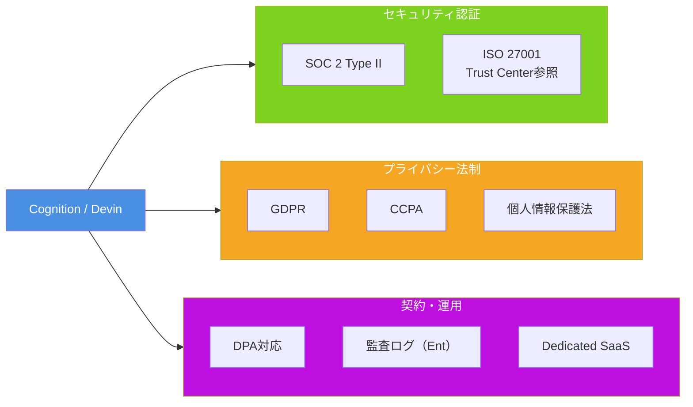

# Q53. Devinは企業の監査に対応している？（SOC 2/GDPR等）

📚 [トップ索引](../../README.md) ｜ [カテゴリ索引: セキュリティ・監査・ガバナンス](README.md)

---

> **メタ**: 最終確認日 2026/4/16 ｜ 根拠 https://trust.cognition.ai / https://docs.devin.ai/enterprise/security ｜ 推定なし

### コンプライアンスマップ



### 結論: **Yes**。**SOC 2 Type II 認証済**（取得時期は Trust Center 参照）、**Trust Center（trust.cognition.ai）で各種レポート公開**、**Enterprise契約でDPA/監査ログ/Dedicated SaaS対応**、**GDPR/CCPA/個人情報保護法の削除要請等も対応**

### Cognitionの監査・コンプライアンス体制

### 🏅 取得認証

| 認証 | 時期 | 意義 |
|---|---|---|
| **SOC 2 Type II** | **取得済**（具体的な認証日は Trust Center レポートで確認） | 運用的な有効性監査、継続審査 |
| **SOC 2 Type I** | （Type IIの前提） | 設計監査 |
| **その他（ISO 27001/HIPAA等）** | **2026年時点は要問合せ** | 企業次第、Enterprise契約で個別対応 |

### SOC 2 Type II の対象範囲について

SOC 2 Type II は **採用する Trust Services Criteria（TSC）の範囲** についてのみ独立監査人が意見を表明するものであり、5カテゴリ（Security / Availability / Processing Integrity / Confidentiality / Privacy）すべてを必ず網羅するわけではない。以下は**5つのTSCの一般的な説明**であり、Cognition の実監査範囲は異なる場合がある。

- **Security**（共通基準、ほぼ常に対象）: 物理/論理アクセス制御、暗号化、脆弱性管理
- **Availability**: 稼働率、DR
- **Processing Integrity**: データ処理の完全性
- **Confidentiality**: データの機密性
- **Privacy**: 個人情報保護

> ⚠️ **Cognitionの実際の監査対象カテゴリ**は https://trust.cognition.ai/ の SOC 2 Type II レポートで確認すること（NDA後に開示）。本FAQでは対象範囲を断定しない。

### Trust Center
**URL**: https://trust.cognition.ai/

アクセスできるリソース（NDA署名後）:
- **SOC 2 Type II レポート**
- **Pentest（侵入テスト）レポート**
- **Network Diagram**
- **Data Processing Agreement (DPA)**
- **Risk Profile**
- **Subprocessor一覧**（Cognitionの下請けサービス）

> Risk Profile（Data Access Level / Impact Level / RTO 等の具体値）は Trust Center 側で随時更新されるため、本FAQには転記しない。**常に [Trust Center](https://trust.cognition.ai/) で最新値を確認すること**。

### 企業監査に使える機能

### 1. 監査ログ（Enterprise）

#### ログ対象
- ユーザログイン / ログアウト
- セッション作成・削除
- Secret操作（作成・更新・削除、値は記録せず）
- データアクセス（どのリポ・ファイル）
- SCM/Slack等の連携変更
- 管理者操作（メンバー追加・権限変更）
- API Key操作
- 課金変更

#### エクスポート
- **SIEM連携**（Splunk / Datadog / Sumo Logic / Elastic等）
- **CSV / JSON エクスポート**
- **API経由定期取得**
- **保持期間**: 契約次第、通常1〜3年

### 2. RBAC（Role-Based Access Control）

Enterpriseで利用可能:
- **Admin**: 全権
- **Security Admin**: Secret・監査ログ管理
- **Billing Admin**: 請求のみ
- **Developer**: セッション・PR実行
- **Auditor**: 閲覧のみ（設定可）

### 3. SSO / SCIM

- **SAML 2.0 / OIDC** SSO
- **SCIM** で自動プロビジョニング（入社・退職連動）
- **MFA強制**
- **IP許可リスト**

### 4. データ処理契約（DPA）

- **GDPR準拠のDPA**を Enterprise契約で締結可
- **Subprocessor一覧開示**
- **データ保存場所指定**（US/EU等）

### 5. Dedicated SaaS

- 顧客専用AWSテナント
- 他顧客とのインフラ完全分離
- 顧客のポリシーで保持期間・削除を制御
- VPC/ネットワーク設定を顧客制御

### 監査への具体的対応

### 内部監査

| 監査観点 | Devin側の対応 |
|---|---|
| **アクセス管理** | SSO + MFA + SCIM + 監査ログ |
| **データ保護** | 暗号化（転送/保存）、Secrets管理 |
| **変更管理** | 監査ログでSetting変更追跡 |
| **インシデント対応** | Cognitionサポート、SOC 2プロセス |
| **利用統制** | Enterprise RBAC、ポリシー設定 |
| **データ削除** | 契約書 + 削除フロー（Q51参照） |

### 外部監査（第三者監査人）

Cognitionが提供できる資料:
- **SOC 2 Type II レポート**（監査範囲・結果）
- **Pentestレポート**（脆弱性評価）
- **Network Diagram**（インフラ構成）
- **DPA / Privacy Policy**
- **サブプロセッサ一覧**
- **Incident response procedure**
- **Data retention policy**

### 業界・規制別対応

| 業界・規制 | 対応 |
|---|---|
| **金融（FFIEC / SOX）** | Enterprise契約、SOC 2ベース + 追加監査 |
| **医療（HIPAA）** | **BAA（Business Associate Agreement）**はEnterprise交渉次第 |
| **決済（PCI DSS）** | 決済データは**Devinで扱わない**のが基本、扱う場合は特殊契約 |
| **公共（FedRAMP/IL4/CJIS）** | **認証取得とデプロイ形態（VPC Deployment 等）は別概念**。VPC Deployment は「準拠を目指す出発点」になり得るが、認証自体は別途取得が必要。個別要件は Cognition に要問合せ |
| **欧州（GDPR）** | DPA締結、EU域内データ保管Enterpriseオプション |
| **日本（個人情報保護法）** | 委託先監督対応、DPA類似文書 |
| **中国（PIPL等）** | **中国顧客は要問合せ**、現地対応は限定的 |

### 典型的な企業監査プロセス

### Phase 1: 事前評価
1. **SOC 2 Type II レポート取得**（NDA経由）
2. **Security Questionnaire（CAIQ/SIG等）**にCognitionが回答
3. **Trust Centerの公開資料**確認
4. **Pentestレポート**レビュー

### Phase 2: 契約時
1. **DPA / MSA （Master Service Agreement）**締結
2. **データ保存場所・期間の合意**
3. **監査権の明記**（必要なら）
4. **削除・返還ポリシー**

### Phase 3: 運用中
1. **監査ログの定期レビュー**
2. **RBAC / Secretsの定期棚卸し**
3. **アクセスパターン異常検知**
4. **セキュリティインシデント対応**

### Phase 4: 年次監査
1. **内部監査チーム**でのDevin利用状況レビュー
2. **外部監査人**からの情報開示要請にCognitionが対応
3. **監査指摘事項**の是正

### 監査対応のチェックリスト（利用企業側）

```
□ Devin利用規定の社内整備
□ 監査ログのSIEM連携設定
□ RBAC設計（最小権限原則）
□ SSO/MFA/SCIM導入
□ Secrets棚卸しプロセス
□ データ分類ポリシー（何をDevinに入れてよいか）
□ インシデント対応プロセス（Cognitionサポート窓口含む）
□ データ削除プロセス（退職時等）
□ 年次セキュリティレビュー
□ 監査権の契約明記
□ サブプロセッサ一覧のレビュー
□ DPAの最新版レビュー
```

### Enterpriseでの追加対応

### Dedicated SaaS
- 顧客AWSテナント内で稼働
- 完全な環境分離
- 顧客のVPC/IAMポリシーと統合

### カスタム監査要件
- 特定監査基準への対応（FedRAMP Moderate等）
- 独自ログ項目の追加
- 長期保持（7年等）

### セキュリティアセスメント
- 顧客主導の**penetration testing**を許可（Enterprise契約次第）
- **Red Teamエクササイズ**対応

### よくある質問

### Q: SOC 2 Type II レポートはどう入手？
- **Trust Center** から **"Request access"** → NDA署名 → 閲覧ダウンロード

### Q: 監査人にCognition担当者との対面を要求されたら？
- Enterprise契約ならアカウントチーム経由で調整可能
- Web会議・メールでQ&A対応

### Q: 監査指摘事項が出たら？
- Cognitionサポート経由で是正を依頼
- Enterpriseアカウントチームと議論

### Q: データを自社環境内で処理したい
- **Enterprise + Dedicated SaaS**
- あるいは **OSS代替（OpenHands）** のセルフホスト検討

### Q: 監査用にCognitionのセキュリティ担当者にインタビューできる？
- Enterpriseなら**可能**（事前調整）

### Q: ログのリテンション期間は？
- デフォルト: 1年以上（SOC 2要件）
- Enterprise: 契約でカスタマイズ（最長7年等）

### Q: 規制当局への報告義務が発生した場合は？
- 利用企業が主体、Cognitionは**必要情報を提供**する契約上の義務（Enterprise）
- **GDPR 72時間報告**等も連携対応

### Q: Cognitionがハッキングされた場合は？
- **セキュリティインシデント通知義務**を契約で定義（Enterprise）
- **公式発表**（Trust Center / 顧客向け通知）

### 監査対応の強度別ポジショニング

| 要件レベル | 推奨プラン |
|---|---|
| 一般的業務利用 | **Free / Pro**（個人責任で） |
| スタートアップ・中小 | **Teams**（Basic監査ログ） |
| 中堅企業（社内規定あり） | **Enterprise**（RBAC + SSO + 詳細監査） |
| 大企業（金融・医療等） | **Enterprise + Dedicated SaaS** |
| 超厳格（政府・防衛） | **個別交渉 or OSS セルフホスト** |

### まとめ

| 監査観点 | 対応 |
|---|---|
| **SOC 2 Type II** | ✅ 認証済（詳細は Trust Center） |
| **Trust Center** | ✅ https://trust.cognition.ai/ （NDA後に資料提供） |
| **Pentestレポート** | ✅ Trust Center経由 |
| **DPA（GDPR等）** | ✅ Enterprise契約で締結 |
| **監査ログ** | ✅ Enterprise詳細、Teamsは基本 |
| **RBAC** | ✅ Enterprise |
| **SSO / SCIM / MFA** | ✅ Enterprise |
| **IP許可リスト** | ✅ Enterprise |
| **Dedicated SaaS** | ✅ Enterprise |
| **HIPAA BAA** | △ 個別交渉 |
| **PCI DSS** | △ 決済データは基本扱わない |
| **FedRAMP/IL4/CJIS** | △ VPC Deployment は「準拠を目指す出発点」になり得るが、認証取得は別途確認 |
| **データ削除** | ✅ 契約 + 削除フロー |
| **監査人への開示** | ✅ Cognition担当チーム経由 |

**核心**: Devinは**SOC 2 Type II** を基盤に、**Trust Center + DPA + 監査ログ + RBAC + Dedicated SaaS**で**企業監査に十分対応**。金融・医療・公共等の特殊規制は **Enterprise個別交渉**、超厳格要件は **OSS代替のセルフホスト**も選択肢。**監査前にTrust Centerへアクセス申請して資料を揃え、契約書でDPA/削除ポリシー/監査権を明記**するのが実務の勝ち筋。

---

[← Q52. 組織契約プランで、管理者は一般ユーザのどこまで把握できる？](q52-org-admin-visibility.md) ｜ [Q54. AWS S3マウント等でDevinからAWSリソースを利用させる場合、パスワード・セキュリティトークン・pemファイルの扱いは？代替手段は？ →](../13-cloud-infra/q54-aws-credentials.md)
