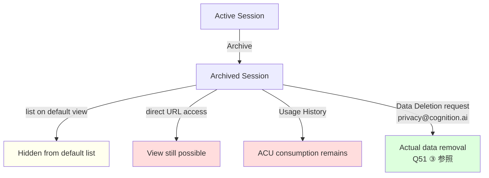

# Q66. Teamsプランで Usage History に他メンバのセッションが見える。自分の作業は丸見え？アーカイブで隠せる？

📚 [トップ索引](../../README.md) ｜ [カテゴリ索引: セキュリティ・監査・ガバナンス](README.md)

---

> **メタ**: 最終確認日 2026/4/17 ｜ 根拠 https://docs.devin.ai/product-guides/invite-team / https://docs.devin.ai/enterprise/security-access/custom-roles / https://docs.devin.ai/api-reference/v1/sessions/create-a-new-devin-session / https://docs.devin.ai/admin/billing ｜ 推定あり

### 結論: **Teamsプランは「共有ワークスペース」設計**であり、**Usage History もセッション一覧も組織メンバに可視なのが仕様**。**アーカイブは一覧整理機能であって隠蔽機能ではない**。個人プライバシーを要求するなら **Enterprise + RBAC**、**個人Coreプラン併用**、または **そもそも機微情報をDevinに入れない**のいずれか。

### Usage History と Session List の違い（重要）

| 画面 | 表示内容 | Teams での可視範囲 | プライバシー設計 |
|---|---|---|---|
| **Usage History** (`Settings → Usage & Limits`) | ACU消費履歴（誰・いつ・何ACU） | **組織全員に可視**（Admin/Member不問） | **プライバシー保護は設計目的外**（課金集計ページ） |
| **Session List** (`/sessions`) | セッション一覧（タイトル・status・owner） | **組織全員に可視**（デフォルト、Memberロール） | デフォルト共有（`unlisted`で一部回避可） |
| **Session Detail** (`/sessions/<id>`) | プロンプト・会話・生成コード・PR | 権限があれば閲覧可、URLを知っていれば直接アクセス可 | Session List と同じ扱い |
| **個人Secrets** | Personalスコープに設定したSecret値 | **自分のみ可視**（Q31参照） | Personalスコープは保護される |

### プラン別 可視範囲マトリクス

| プラン | Usage History 可視範囲 | Session List 可視範囲 | アーカイブ可視範囲 | 隠蔽手段 |
|---|---|---|---|---|
| **Core**（個人契約） | 自分のみ | 自分のみ | 自分のみ | （不要） |
| **Teams**（$500/月・5席〜） | **組織全員に可視** | **組織全員に可視**（Member標準） | 一覧非表示、直URLで閲覧可、Usage Historyには残る | API `unlisted:true`（限定的）／ Core併用 |
| **Enterprise + RBAC** | ViewOrg権限なければ自分のみ | **"View Sessions"権限**なければ自分のみ | 権限依存 | カスタムロール設計／`unlisted:true` |

### 公式ドキュメントの根拠

#### ① Teamsのロール（2種類のみ）
[Invite your Team](https://docs.devin.ai/product-guides/invite-team) より:

| ロール | 権限 |
|---|---|
| **Member** | Devinセッション作成・organization の knowledge/playbooks/environment snapshots 等の閲覧・貢献 |
| **Admin** | Member権限 + billing/integrations/secrets/org設定の管理 |

→ **細粒度の "View Sessions" 権限はTeamsに存在しない**。組織内でのセッション可視性は**デフォルトON相当**と理解すべき。

#### ② Enterprise の "View Sessions" 権限
[Custom Roles & RBAC](https://docs.devin.ai/enterprise/security-access/custom-roles) より:

| ロールレベル | 権限名 | 説明 |
|---|---|---|
| **Organization** | **View Sessions** | "View Devin sessions from other users in the organization" |
| **Account (Enterprise)** | **View Sessions** | "View Devin sessions from other users across any org" |

→ Enterprise RBACでは明示的にこの権限を ON/OFF 制御可能。**この権限を持たないユーザは他メンバのセッションを見られない**設計。**TeamsにはこのRBACが提供されていない**。

#### ③ `unlisted` パラメータ
[Create a new session API](https://docs.devin.ai/api-reference/v1/sessions/create-a-new-devin-session) より、POST `/v1/sessions` の body parameter:

```json
{
  "prompt": "...",
  "unlisted": false  ← デフォルトfalse（= リスト表示される）
}
```

- `unlisted: true` で作成したセッションは**組織のSession Listから非表示**
- ただし **UIからは通常この選択肢が露出していない**（API経由のみ）
- **Usage History の ACU消費集計からは消せない**（課金根拠として記録）
- Admin/権限者は直接URL経由でアクセス可能

#### ④ Usage History の設計思想
[Billing docs](https://docs.devin.ai/admin/billing) より:
- Teamsプランは **"250 ACUs each month"** をチームで共有
- Usage & Limits はチーム全体の消費管理・予算管理が主目的
- 個人プライバシーの保護は**このページの設計目的に含まれていない**

### アーカイブ（Archive）の挙動（誤解されやすい）

**アーカイブ = 「完了した作業を一覧から整理」する機能であって「他メンバから隠す」機能ではない**。

| 項目 | アーカイブ後の挙動 |
|---|---|
| Session List（Active フィルタ） | ❌ 非表示 |
| Session List（All / Archived フィルタ） | ✅ 表示される |
| 直接URL (`/sessions/<id>`) | ✅ **引き続き閲覧可能**（権限があれば） |
| Usage History | ✅ **ACU消費履歴は残る**（停止済みでも） |
| 検索（Session searchなど） | ✅ Archived フィルタONで引っかかる |
| PR / 生成ファイル | ✅ GitHub側で永続（Devinの影響外） |



→ **真に他メンバから見えなくしたい場合は、アーカイブではなく Q51 ③ の完全削除（privacy@cognition.ai経由）が必要**。ただしこれも最終手段であり、業務記録として残すべきセッションまで削除すべきではない。

### Teams プランで「他メンバに見られたくない作業」がある場合の対処

| # | 対処 | 実現性 | 注意点 |
|---|---|---|---|
| 1 | **個人用の別 Core プラン（個人契約）を作成** | ⭐⭐⭐ | 業務利用ポリシー・セキュリティ規定を確認。費用は自腹の場合あり |
| 2 | **そもそも機微情報をDevinに入れない** | ⭐⭐⭐ | Q48のデータ取扱方針準拠。最も健全 |
| 3 | **API から `unlisted: true` で作成** | ⭐⭐ | UIからは非表示だが、Admin/権限者は直URL経由で閲覧可。ACU消費は隠せない |
| 4 | **Admin・メンバに透明性を説明して合意形成** | ⭐⭐⭐ | Teams=共有ワークスペース思想。事前にチームで共有する前提を明示 |
| 5 | **Enterprise 契約への昇格 + RBAC 設定** | ⭐ | 費用大幅増。全社判断事項 |
| 6 | **Secrets は Personal スコープを使う** | ⭐⭐⭐ | Q31 参照。値は個人のみ可視 |

### `unlisted:true` 作成の実例（API）

```bash
# UIには露出していないので API 経由でセッション作成
curl -X POST https://api.devin.ai/v1/sessions \
  -H "Authorization: Bearer $DEVIN_API_KEY" \
  -H "Content-Type: application/json" \
  -d '{
    "prompt": "個人的な調査: ...（機微でない範囲で）",
    "unlisted": true,
    "title": "private-research"
  }'
```

**注意**:
- 返却された `session_id` は自分で記録しておかないと後で辿れない（一覧に出ないため）
- Admin/View Sessions 権限者は**直接URLから引き続き閲覧可能**
- ACU消費は Usage History に残り、他メンバからも集計値として見える

### 誤解されやすいポイント（重要）

| ❌ 誤解 | ✅ 実態 |
|---|---|
| 「アーカイブすればプライバシー保護される」 | アーカイブは一覧整理機能。直URLで引き続き閲覧可、Usage Historyにも残る |
| 「Usage History のACU消費だけ見えてもセッション内容は安全」 | **セッションリンクをクリックすれば内容に辿り着ける**ことが多い。Teams では Link から辿る人が出る前提 |
| 「Secrets の Personal スコープを使えば作業全体が隠れる」 | Secrets の値だけが保護される。セッションのプロンプトや生成コードは可視性の範囲外（Q31参照） |
| 「Teams でも個人プライバシーは守られるはず」 | Teams は共有ワークスペース設計。個人プライバシー保護は Enterprise + RBAC または Core の領域 |
| 「`unlisted:true` なら Admin からも完全に隠せる」 | Admin/権限者は直URLから閲覧可。**完全な隠蔽は Teams 契約では不可能** |

### 組織運用のベストプラクティス

| 推奨 | 理由 |
|---|---|
| **Teams採用時にプライバシー前提をチームに明示** | "この組織のセッションは相互に可視"と合意しておく |
| **機微情報を扱うタスクはガイドラインで別プロセスへ** | 例: 人事/法務関連はDevinに入れない、個人的な学習は個人契約で |
| **Secrets は Personal スコープを徹底** | API Key / トークン等は Personal スコープに（Q31参照） |
| **セッションタイトルは業務的で中立な表現に** | リスト上で他メンバの目に入る前提 |
| **プライベート情報が紛れた場合の対処フロー整備** | Terminate → Data Deletion依頼（Q51③）のエスカレーション手順を決めておく |
| **Enterprise候補企業は "View Sessions" 権限設計を事前検討** | 部署別・役職別の可視性マトリクスを契約前に整理 |

### アンチパターン

| NG | 理由 | 正しい対応 |
|---|---|---|
| Teamsで個人の機微情報（健康・家族・転職活動等）をDevinに入力 | 組織全員に可視 | 個人Coreプランを別途契約 |
| アーカイブすれば削除と同等と考える | 閲覧可能なまま | Q51③ の完全削除依頼を使う |
| `unlisted:true` だから Admin からも完全に隠れると思う | URLを知っていれば閲覧可 | 完全な隠蔽は不可能と認識し、そもそも機微情報を入れない |
| セッションタイトルに「〇〇の個人調査」など個人性を示唆 | 他メンバの好奇心を引く | 業務中立な命名 |
| 他メンバが見ていると気づいたら慌てて削除 | 見られた事実は残る | 事前のプライバシー教育・運用ルール整備 |

### Tips

- **Teams プランの Usage History で "他人の作業が見えて驚く" のは全員が通る道**。社内教育に組み込むのが健全
- **Enterprise 契約への昇格判断基準の一つ**: "個人/部署間のセッション隔離が必要か" — 必要なら Enterprise 一択
- **個人契約と業務契約のハイブリッド運用**: 多くの企業で認めているパターン。ポリシーを確認して整理
- **Q48（機微データ取扱）とセットで読むと理解が深まる**: 「入力時点でリスク判断する」原則
- **Archive の位置づけは Q51 の "3階層削除モデル" で理解**: Terminate（停止）・Archive（整理）・Data Deletion（削除）の使い分け

### まとめ表

| 項目 | Teams の挙動 |
|---|---|
| Usage History 可視範囲 | **組織全員（Admin/Member不問）** |
| Session List 可視範囲 | **組織全員（Memberロールデフォルト）** |
| Session 内容 (`/sessions/<id>`) | URLを知っていれば閲覧可 |
| アーカイブ | 一覧非表示・直URLで可、Usage Historyに残る |
| `unlisted:true` | API経由のみ、Admin/権限者は直URLで閲覧可 |
| Personal Secrets | 自分のみ可視（隠蔽可能） |
| 完全隠蔽の手段 | **Teamsでは存在しない**。個人Core併用か Enterprise+RBAC |

**核心**: Teams プランは**共有ワークスペース前提**の設計であり、**個人プライバシー保護は基本的に提供されない**。Usage History・Session List は**組織メンバに可視**、アーカイブは**一覧整理機能であって隠蔽機能ではない**。**個人の機微情報を扱う作業は Teams ではなく個人 Core プランで分離する**か、**Enterprise+RBAC契約で "View Sessions" 権限を制御**するのが正攻法。**`unlisted:true` も完全な隠蔽にはならない**（URLアクセスは可能）ため、過信してはならない。最も健全な運用は**"Teams では機微情報を扱わない" とチームで合意すること**。

---

[← Q65. 「Devin went to sleep due to session usage settings」と表示されて止まるのはなぜ？対処方法は？](../16-session-recovery/q65-session-sleep.md) ｜ [Q67. 個人プランで登録した GitHub リポジトリや Knowledge / Playbook / Secrets は、企業プランからも使える？ →](../04-github-scm/q67-personal-vs-org-resources.md)
