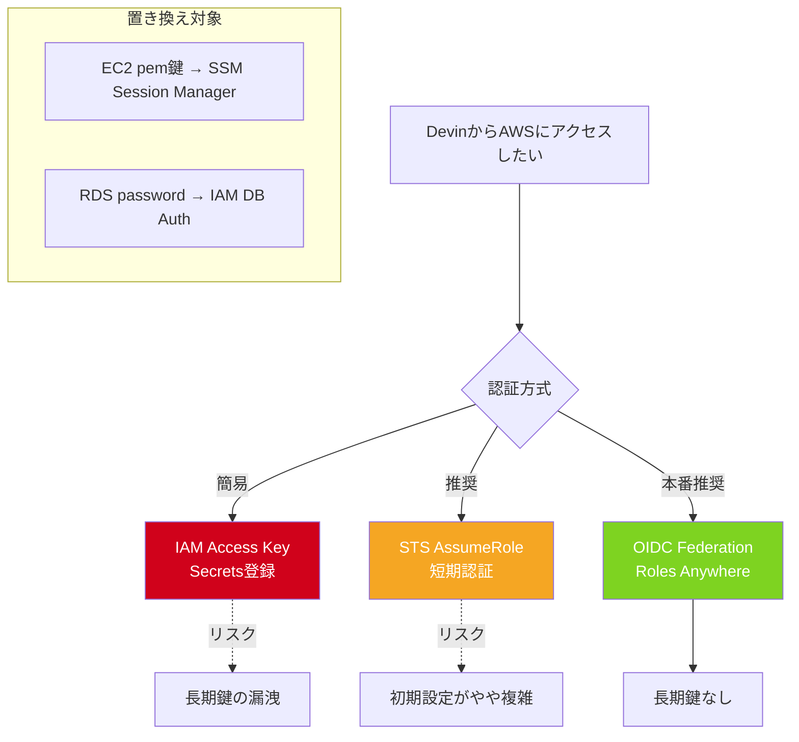

# Q54. AWS S3マウント等でDevinからAWSリソースを利用させる場合、パスワード・セキュリティトークン・pemファイルの扱いは？代替手段は？

📚 [トップ索引](../../README.md) ｜ [カテゴリ索引: クラウド連携・インフラ](README.md)

---

> **メタ**: 最終確認日 2026/4/16 ｜ 根拠 AWS公式 + 運用観察ベース ｜ 推定あり

### AWS認証方式の比較



### 結論: **(1) 基本はSecretsでIAMアクセスキー（Access Key ID / Secret）を渡す**。**(2) 推奨はSTS一時認証（AssumeRole）で寿命短い短期キーに**。**(3) 本番用途は IAM Roles Anywhere / OIDC Federationで長期鍵を持たせない設計に**。**(4) EC2のpem鍵は SSM Session Managerで置き換え**。**(5) RDSはIAM Database Authenticationで password-lessに**

### Devin VMの「AWS認証する場所」

Devinのセッション用VMは**Cognition側のAWS内**にあり、**顧客側のAWSリソースへは認証情報を渡して通信**する必要がある。ここが**AWS-to-AWSの境界**で、認証情報の扱い方が最重要。

### 方式マトリクス

| # | 方式 | セキュリティ | 運用手間 | Devin互換 | 推奨度 |
|---|---|---|---|---|---|
| 1 | **IAMアクセスキー直渡し** | 低 | 低 | ✅ | △ 最小用途のみ |
| 2 | **Secrets + IAMアクセスキー** | 中 | 低 | ✅ | ⭐ 基本 |
| 3 | **STS一時認証（AssumeRole）** | 中高 | 中 | ✅ | ⭐⭐ 推奨 |
| 4 | **OIDC Federation（Web Identity）** | 高 | 中 | △ | ⭐⭐⭐ ベスト（対応次第） |
| 5 | **IAM Roles Anywhere** | 高 | 高 | ✅ | ⭐⭐ 厳格要件向け |
| 6 | **SSO / IAM Identity Center** | 高 | 中 | △ | 人間操作向け |
| 7 | **Enterprise VPC Peering + Instance Profile** | 最高 | 高 | △ | Enterprise Dedicated |

### 方式1: IAMアクセスキー直渡し（NG）

```bash
# 絶対にNG ❌
export AWS_ACCESS_KEY_ID=AKIA...
export AWS_SECRET_ACCESS_KEY=wJalrXUt...
```

- **チャット/コードに平文で書くのは絶対禁止**
- 履歴に残り、漏洩リスク大

### 方式2: Secrets + IAMアクセスキー（基本）

### 手順
1. **AWS側**: IAMユーザ作成、**必要最小権限のみ**付与
2. **Devin側**: Settings → Secretsに登録
   - `AWS_ACCESS_KEY_ID`
   - `AWS_SECRET_ACCESS_KEY`
   - `AWS_DEFAULT_REGION`（例: `ap-northeast-1`）
3. セッション内で環境変数として自動注入
4. `aws s3 ls` 等がそのまま動く

### IAMポリシー例（S3読み取り専用）
```json
{
  "Version": "2012-10-17",
  "Statement": [{
    "Effect": "Allow",
    "Action": ["s3:GetObject", "s3:ListBucket"],
    "Resource": [
      "arn:aws:s3:::my-bucket",
      "arn:aws:s3:::my-bucket/*"
    ]
  }]
}
```

### 推奨運用
- **専用IAMユーザ名**: `devin-session-readonly` 等識別可能に
- **バケット限定**: Resourceで対象バケットを明示
- **MFA不要の設定で**（Devin側でMFAを都度入力できないため）
- **定期ローテーション**: 90日で自動交代を仕組み化
- **CloudTrailで監視**: 異常アクセスを検知

### リスク
- **キーが漏洩すれば長期間悪用可能**（ローテーション前提）
- CognitionのAWS環境経由での利用となるため、**IPアドレスベースの制限は難しい**

### 方式3: STS一時認証（AssumeRole）⭐ 推奨

長期キーを渡さず、**セッション単位で短期トークン発行**する。

### 手順
1. **AWS側**:
   - 「引き受けられるRole」を作成（例: `arn:aws:iam::123456789012:role/DevinS3Reader`）
   - Trust Policyで「特定IAMユーザ」からのAssumeRoleを許可
2. **Devin側 Secrets**: 長期キーは**踏み台ユーザの最小権限キー**
3. セッション内で `sts:AssumeRole` を実行し、短期認証を取得

```python
import boto3
import os

sts = boto3.client("sts")
resp = sts.assume_role(
    RoleArn="arn:aws:iam::123456789012:role/DevinS3Reader",
    RoleSessionName="devin-session-xyz",
    # ★ Trust Policyで ExternalId を要求している場合は必ず渡す（下記 Trust Policy と整合）
    ExternalId=os.environ["AWS_EXTERNAL_ID"],  # Secretsに登録して注入
    DurationSeconds=3600  # 1時間
)
creds = resp["Credentials"]
# 以後はこのcredsでS3にアクセス
s3 = boto3.client(
    "s3",
    aws_access_key_id=creds["AccessKeyId"],
    aws_secret_access_key=creds["SecretAccessKey"],
    aws_session_token=creds["SessionToken"],
)
```

Trust Policy（IAM Role側）の例:

```json
{
  "Version": "2012-10-17",
  "Statement": [{
    "Effect": "Allow",
    "Principal": {"AWS": "arn:aws:iam::123456789012:user/devin-bastion"},
    "Action": "sts:AssumeRole",
    "Condition": {
      "StringEquals": {"sts:ExternalId": "devin-tenant-abc123"}
    }
  }]
}
```

> ⚠️ Trust Policy に `sts:ExternalId` 条件を設定したら、`assume_role` 呼び出し側も**必ず同一の `ExternalId` を渡す**必要がある。条件と呼び出しパラメータが合わないと `AccessDenied` で失敗する（いわゆる「混乱した代理人（confused deputy）」対策）。

### メリット
- **長期キーは最小権限**（AssumeRoleのみ許可）
- **実業務のキーは短期（1時間等）**
- **CloudTrailでRoleごとに監査可能**
- **ExternalIdを設定**すれば、クロスアカウントの「混乱した代理人」攻撃を防げる（上記の Trust Policy 例と呼び出しコードを参照）

### 方式4: OIDC Federation（Web Identity）⭐⭐⭐ ベスト

GitHub Actionsで一般的な「**長期キーを一切持たない**」方式。

### 仕組み
```
Devin → OIDC IDトークン発行 → AWS STS → AssumeRoleWithWebIdentity → 短期認証
```

### 要件
- **DevinがOIDCトークンを発行できるか**が鍵
- 2026年時点でCognitionが**OIDCプロバイダとして対応しているかは要確認**
- 対応していれば:
  1. AWSでOIDC IDプロバイダを登録（Cognitionの`iss`）
  2. IAM Roleの Trust Policyで`sub`=Devinセッション識別子を許可
  3. Devinセッション内で `AssumeRoleWithWebIdentity` 実行

### メリット
- **長期IAMキー一切不要**
- **セッション単位の完全分離**
- **監査ログで「誰のセッションがどのRoleを使ったか」明確**

### 確認方法
- **Cognitionアカウント担当に問合せ**（Enterprise機能の可能性高）
- あるいは **Dedicated SaaSではVPC越しに直接IAM Instance Profile相当を付与可能**

### 方式5: IAM Roles Anywhere

**AWS外のワークロード**にIAM権限を付与する仕組み。X.509証明書ベース。

### 要件
- 顧客が**プライベートCA**を運用
- 証明書をDevin VMに配置
- Trust AnchorをAWSに登録

### 運用手順（概略）
1. AWS Private CA（ACM PCA）または外部CAを用意
2. IAM Roles Anywhereでtrust anchor / profile / roleを作成
3. Devin VMに**クライアント証明書 + 秘密鍵**を配置（Secrets経由）
4. `aws_signing_helper`で一時認証を取得
5. AWS APIコール

### メリット
- **証明書ベース**で鍵管理が一元化
- **証明書失効**で即無効化可能
- 長期キー不要

### デメリット
- **運用手間が大きい**（CA運用が必須）
- 厳格なセキュリティ要件がある企業向け

### 方式6: SSO / IAM Identity Center

**人間がAWSコンソールに入るためのSSO**なので、Devinのような非対話ワークロードには不向き。ただし:

- Devinセッション開始時に**短期credentialsをSSO経由で取得して流し込む**運用は可能
- 毎回ブラウザ認証が必要なため、定常タスクには向かない
- **手動で大きな作業をする前のキー交付**的な用途が現実的

### 方式7: Enterprise VPC + 専用接続

Enterprise Dedicated SaaSなら以下も可能:

- Devin VMが**顧客VPCと直接接続**（VPC Peering / PrivateLink / Transit Gateway）
- **EC2 Instance Profile相当**の役割をDevin VMに付与
- **長期キー不要 + プライベート通信のみ**

→ 最高レベルのセキュリティ、ただしEnterprise交渉必須。

### PEMファイル（SSH秘密鍵）の扱い

### よくあるシナリオ
- EC2にSSHで入りたい → `.pem`ファイルが必要

### 方法A: Secretsに秘密鍵を保管（従来型、△）
```bash
# Secretsで SSH_PRIVATE_KEY を定義
echo "$SSH_PRIVATE_KEY" > /tmp/key.pem
chmod 600 /tmp/key.pem
ssh -i /tmp/key.pem ec2-user@ec2-xx-xx.ap-northeast-1.compute.amazonaws.com
```

- 機能するが**秘密鍵の漏洩リスク**
- ローテーションが必要
- **22番ポート開放が必須**（本番で避けたい）

### 方法B: SSM Session Manager（推奨）⭐

**PEM鍵不要、22番ポート開放不要**でEC2にシェル接続できる。

#### 前提
- EC2に`AmazonSSMManagedInstanceCore`のInstance Profileを付与
- SSM Agentがインストール済み（Amazon Linux 2以降は標準）

#### Devinセッション内で使う
```bash
# SSM Session Manager でEC2に接続
aws ssm start-session --target i-0abc123def456
```

#### ファイル転送
```bash
# ローカル → EC2
aws ssm start-session --target i-xxx --document-name AWS-StartPortForwardingSession \
  --parameters '{"portNumber":["22"],"localPortNumber":["2222"]}'
# 別ターミナルで scp 可能になる
```

#### メリット
- **PEM鍵不要**
- **SSHポート閉じたまま**
- **IAM認証**
- **CloudTrailで監査**
- **実行コマンドを全ログ保存可**

### 方法C: SSM Run Command（コマンドのみ実行）
```bash
aws ssm send-command \
  --instance-ids i-0abc123 \
  --document-name AWS-RunShellScript \
  --parameters 'commands=["ls /var/log"]'
```
→ **対話的でなくバッチ的な操作**に最適

### 方法D: EC2 Instance Connect
```bash
# Temporary SSH keyをpushしてSSH接続
aws ec2-instance-connect send-ssh-public-key ...
ssh ec2-user@instance
```
→ PEM鍵保管不要、短期鍵のみ

### パスワード系サービスの代替

### RDS / Aurora: IAM Database Authentication

パスワード不要でRDSに接続できる。

#### 手順
1. RDSで **IAM認証を有効化**
2. DBユーザ作成（IAM経由で認証）
3. Devin VMから **認証トークン生成 → 接続**

```python
import boto3
rds = boto3.client("rds")
token = rds.generate_db_auth_token(
    DBHostname="mydb.xxx.rds.amazonaws.com",
    Port=5432,
    DBUsername="iam_user"
)

import psycopg2
conn = psycopg2.connect(
    host="mydb.xxx.rds.amazonaws.com",
    port=5432,
    user="iam_user",
    password=token,  # 15分有効
    sslmode="require"
)
```

### Redis / ElastiCache: AUTH token + SSL
- **Redis AUTH**トークンはSecretsへ
- **Secrets Manager連携**でtoken rotationを自動化

### Secrets Managerとの連携

AWSのSecrets Managerに本物の秘密を保管し、Devin側は**IAM権限でSecrets Manager APIを呼ぶだけ**の設計。

```python
import boto3
sm = boto3.client("secretsmanager")
resp = sm.get_secret_value(SecretId="prod/db/password")
password = resp["SecretString"]
```

#### メリット
- **Devin Secretsには「Secrets ManagerにアクセスできるIAMキー」のみ**
- 本物の秘密はAWSで集中管理
- **Secrets Manager側でローテーション自動化**
- **CloudTrailで取得ログ追跡可**

### S3マウント時の認証まとめ

### 🅰️ S3をPOSIX的にマウント（goofys/s3fs）

```bash
# /etc/passwd相当のcredentialsで動作
export AWS_ACCESS_KEY_ID=...
export AWS_SECRET_ACCESS_KEY=...
goofys my-bucket /mnt/s3
```

- 認証は環境変数 or `~/.aws/credentials`
- **Secrets経由で注入**が基本

### 🅱️ ライブラリ経由（s3fs-fuse, rclone）
- 同様に認証情報を環境変数で
- rcloneは**複数認証方式サポート**

### 🅲 boto3で直接（マウントなし）
- 一番シンプル、認証トラブル少
- **ファイル数が少ないならこれでOK**

### 実践: IAMポリシーの最小権限テンプレート

### ケース1: S3読み取り専用
```json
{
  "Version": "2012-10-17",
  "Statement": [{
    "Sid": "ReadOnlyS3",
    "Effect": "Allow",
    "Action": ["s3:GetObject", "s3:ListBucket"],
    "Resource": [
      "arn:aws:s3:::devin-data-bucket",
      "arn:aws:s3:::devin-data-bucket/*"
    ]
  }]
}
```

### ケース2: 特定プレフィックスへの書き込み
```json
{
  "Version": "2012-10-17",
  "Statement": [{
    "Effect": "Allow",
    "Action": ["s3:PutObject", "s3:DeleteObject"],
    "Resource": "arn:aws:s3:::devin-output-bucket/devin-generated/*"
  }]
}
```

### ケース3: AssumeRole用の踏み台キー
```json
{
  "Version": "2012-10-17",
  "Statement": [{
    "Effect": "Allow",
    "Action": "sts:AssumeRole",
    "Resource": "arn:aws:iam::123456789012:role/DevinWorker"
  }]
}
```

### 監査・検知

### CloudTrailで追跡
- どのAPIコールがいつ発生
- どのRole/Userが呼んだか
- **`userAgent` フィールドでDevin経由か識別可能**（例: `boto3/1.28.x Python/3.x`）
- **IP**はCognition側AWSのIPレンジ

### GuardDutyで異常検知
- 異常な地理的アクセス
- 大量データダウンロード
- 異常なAPI呼び出しパターン
- **アラート → Slack/メールに通知**

### CloudWatch Metrics / Alarms
- S3の**Put/Get回数**急増アラート
- Secrets Managerの**GetSecretValue**急増アラート

### AWS Config
- IAMユーザのキーがローテーションされているか
- MFA有効化状態
- コンプライアンスルール

### チェックリスト（AWS連携時）

```
事前準備:
□ 専用IAMユーザ/Role を作成（名前に"devin"明記）
□ 最小権限ポリシーのみ付与
□ 対象リソース（bucket等）を明示的に限定
□ ExternalID / Conditions 設定（AssumeRole時）
□ STS一時認証を優先検討
□ 本番はOIDC/Roles Anywhereを検討

秘密情報の扱い:
□ IAMキーは Devin Secrets に登録
□ コードや.envに直書きしない
□ Secrets Manager 連携で本物の秘密はAWS側管理

EC2接続:
□ SSH PEM鍵の代わりに SSM Session Manager
□ Instance Profileに AmazonSSMManagedInstanceCore
□ SSH ポート閉じる

RDS:
□ IAM Database Authentication を有効化
□ パスワード管理不要

運用:
□ CloudTrail 有効化
□ GuardDuty 有効化
□ 90日で鍵ローテーション
□ 異常検知アラート設定

監査:
□ userAgent で Devin経由かログ分析
□ Role単位でアクセスパターン確認
□ 月次レビュー
```

### トラブルシュート

### 症状: `AccessDenied`
- IAMポリシーが足りない
- ResourceのARN誤り
- AssumeRoleのTrust Policyが違う

### 症状: `The AWS Access Key Id you provided does not exist`
- Secretsのタイポ
- キーがローテーション済み or 失効

### 症状: `ExpiredToken`
- STS一時認証の期限切れ
- `aws sts assume-role` を再実行

### 症状: `Unable to locate credentials`
- 環境変数が設定されていない
- `~/.aws/credentials` もない
- Secretsの注入に失敗

### 症状: `goofys: failed to mount: permission denied`
- FUSE権限不足
- Devin VMの制限で FUSE 不可の場合あり → boto3/s3fs(library)で代替

### 料金面の考慮

| 方式 | 追加コスト |
|---|---|
| IAMアクセスキー | 0 |
| STS | 0 |
| IAM Roles Anywhere | ACM Private CA ・IAM Roles Anywhere の AWS 公式料金は変動するため [AWS 入力の公式料金ページ](https://aws.amazon.com/certificate-manager/pricing/) で要確認 |
| SSM Session Manager | 0（CloudWatch Logs料金のみ） |
| Secrets Manager | $0.40/secret/月 + API料金 |
| IAM Database Authentication | 0 |

### まとめ

| 用途 | 推奨方式 |
|---|---|
| **お試し・PoC** | **Secrets + IAMアクセスキー（最小権限）** |
| **実運用（中）** | **Secrets（踏み台キー）+ STS AssumeRole** |
| **本番・厳格** | **OIDC Federation** or **IAM Roles Anywhere** |
| **Enterprise** | **VPC接続 + Instance Profile相当** |
| **EC2接続** | **SSM Session Manager**（PEM鍵捨てる） |
| **RDS接続** | **IAM Database Authentication**（パスワード捨てる） |
| **秘密値集中管理** | **AWS Secrets Manager** + DevinからIAM経由取得 |

**核心**: Devin→AWSの認証は「**長期キーを持たせない**」が理想原則。現実的には **Secrets + AssumeRole** が推奨ライン。**PEM鍵は SSM Session Manager、RDSパスワードは IAM DB Auth、本物の秘密は AWS Secrets Manager** に逃がす設計で**「Devinに置く秘密を最小化」**する。さらに厳格なら **OIDC Federation / Roles Anywhere / Dedicated SaaS + VPC接続** の順で堅くしていく。

---

[← Q53. Devinは企業の監査に対応している？（SOC 2/GDPR等）](../12-security-governance/q53-compliance-audit.md) ｜ [Q55. DevinはAWS上で動作している？VPC間接続（Devin社と自組織）は可能？ →](q55-aws-vpc.md)
