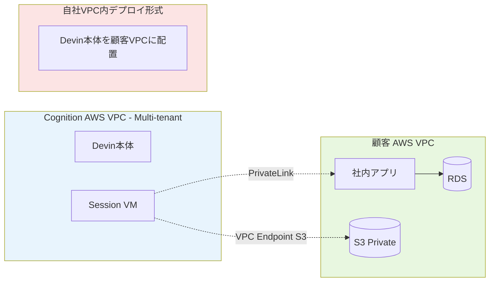

# Q55. DevinはAWS上で動作している？VPC間接続（Devin社と自組織）は可能？

📚 [トップ索引](../../README.md) ｜ [カテゴリ索引: クラウド連携・インフラ](README.md)

---

> **メタ**: 最終確認日 2026/4/16 ｜ 根拠 https://docs.devin.ai/enterprise/vpc-deployment ｜ 推定あり

### Devin VPC ⇔ 自社VPCのネットワーク構成



### 結論: **(1) Yes、DevinはAWS上で動作している**。**(2) Enterpriseなら「Cognition管理AWSのDedicated SaaS」または「自社AWS VPC内にDevin本体をデプロイ」の2パターンが選べる**。**(3) VPC Peering相当の接続は AWS PrivateLink（NLB + VPC Endpoint Service）で実現**、**(4) さらに「自社VPCに丸ごとDevinを入れる」構成なら、内部リソースにはVPC内通信で直接到達**できる

参考:
- https://docs.devin.ai/enterprise/deployment/dedicated_saas_private_networking
- https://docs.devin.ai/enterprise/vpc/aws-setup

### Devinの動作基盤

### インフラ
- **AWS上で動作**（Cognitionが明示）
- 主要リージョン: US（default）、他リージョンはDedicated SaaSで選択可
- 計算環境: EC2 Auto Scaling、S3、IAM、SGなどAWSネイティブ構成

### ユーザが知るべき2つの大分類

| 区分 | 動作場所 | 対象プラン |
|---|---|---|
| **通常のSaaS Devin** | Cognition管理のマルチテナントAWS環境 | Core / Teams |
| **Dedicated SaaS** | Cognition管理だが**顧客専用テナント**のAWS環境 | Enterprise |
| **VPC Deployment（自社AWSに入れる）** | **顧客のAWSアカウント内** | Enterprise |

→ Enterpriseは**Dedicated SaaS** か **VPC Deployment**を選べる。

### 🅰️ Dedicated SaaS + AWS PrivateLink（Cognition側AWSから自社VPCに接続）

### 構成イメージ
```
[自社オンプレ/VPC]          [Cognition AWS Account]
                              ┌─────────────────┐
GitHub Enterprise Server      │                 │
GitLab                        │   Devin 専用    │
Artifactory  ◄── PrivateLink ─┤   Dedicated     │
Nexus                         │   SaaS Tenant   │
社内API                       │                 │
                              └─────────────────┘
```

### 仕組み
1. **顧客側（自社AWS）**:
   - 内部サービス（GitLab等）の前に **NLB（Network Load Balancer）** を置く
   - **VPC Endpoint Service** を作成（NLBをターゲットに）
   - 許可プリンシパルに **CognitionのAWS account ID** を登録
2. **Cognition側**:
   - **Interface VPC Endpoint** を作成して顧客のEndpoint Serviceを消費
   - DNS設定でDevinからアクセス可能に
3. **通信経路**:
   - **AWSバックボーン内のみで完結**、パブリックインターネット不通過
   - 暗号化・プライベート

### ドメイン単位で設定
- PrivateLinkは**ドメインごとに1設定**
- 複数ドメイン（例: `gitlab.company.com`, `artifactory.company.com`）に接続する場合、**それぞれにEndpoint Serviceを用意**

### クロスリージョン対応
- 顧客サービスとDevin Dedicated SaaSが**異なるリージョン**でも接続可能
- AWSのクロスリージョンPrivateLink機能を利用
- Endpoint Service側で `AllowedPrincipals` に加えクロスリージョン許可が必要

### 要件マトリクス

| 顧客提供 | Cognition提供 |
|---|---|
| NLB（各内部サービスの前） | 許可対象のAWS account ID |
| VPC Endpoint Service | Interface Endpointのターゲット情報 |
| Service名（各ドメインごと） | DNS設定（Devin側） |
| 許可プリンシパル設定 | — |
| 対応ポート確認 | — |
| DNS情報 | — |

### メリット
- **Cognitionが運用負荷を負担**（アップデート・監視等）
- 顧客はネットワーク接続のみ準備
- **インターネット経由しない**専用線的な安全性

### デメリット
- **毎ドメインごとに設定**が発生
- Cognition側のリソース構成は**Cognition管理**（カスタム不可）

### 🅱️ VPC Deployment（自社AWSにDevin本体を入れる）

### 構成イメージ
```
┌─── 自社AWSアカウント ────────────────────┐
│                                         │
│  ┌─ Devin 本体 ─────────┐                │
│  │ EC2 Auto Scaling     │                │
│  │ S3                   │                │
│  │ Hypervisor           │                │
│  └──────────────────────┘                │
│         │                                │
│  ┌──────▼─────────────┐                  │
│  │ 社内リソース        │                  │
│  │ GitHub ES / RDS /  │                  │
│  │ 社内API 等          │                  │
│  └────────────────────┘                  │
└──────────────────────────────────────────┘
```

### 導入方式
**Terraform推奨**（Cognitionが設定ファイルを提供）、手動も可能。

### 手順（Terraform版）

#### Step 1: AWS環境情報収集
- AWSアカウント番号（12桁）
- VPC ID（`vpc-xxxxxxxx`）
- サブネット2つ（AZ冗長化のため）
- 対応リージョン

```bash
# 参考コマンド
aws ec2 describe-vpcs
aws ec2 describe-subnets --filters "Name=vpc-id,Values=<your-vpc-id>"
```

#### Step 2: ファイアウォール設定

**ユーザ端末側（社員が使うPC）からのアクセス許可**:
- `*.devin.ai`
- `*.devinenterprise.com`
- `*.devinapps.com`

**VPC内からのアクセス許可**:
- `frp-server-0.devin.ai`
- `static.devin.ai`
- `api.devin.ai`

#### Step 3: Cognitionから以下を受領
- Hypervisorイメージの認証トークン
- カスタマイズされたTerraform設定ファイル

#### Step 4: Terraform実行
```bash
mkdir -p ~/devin-terraform && cd ~/devin-terraform
# Cognition提供ファイルを展開

terraform init
terraform plan
terraform apply
```

#### Step 5: 初回セッション起動
- Cognitionと合同で動作確認
- 接続性テスト
- 問題があれば一緒にデバッグ

### 前提条件

| 要件 | 内容 |
|---|---|
| **IAM Role** | EC2 Auto Scaling作成、S3作成権限 |
| **CPU quota** | Cognition から受領する Terraform に明記の vCPU 要件を満たせること（時期により変動するため要文書確認） |
| **Terraform** | version 1.0以降 |
| **VPC** | 既存または新規 |

### メリット
- **内部リソースにVPC内通信で直接アクセス**（PrivateLink不要）
- データがCognition管理環境を通らない → **データ主権最大化**
- **ファイアウォール・セキュリティ要件**に完全準拠可能
- **IAM Instance Profile** を直接Devin VMに付与可能 → 長期キー不要

### デメリット
- **運用負荷は顧客側**（AWSアカウント・コスト・監視）
- **Cognitionのアップデート**はTerraform再適用が必要
- AWS CPU quota等の事前調整が必要

### 方式比較

| 観点 | 🅰️ Dedicated SaaS + PrivateLink | 🅱️ VPC Deployment | 通常SaaS |
|---|---|---|---|
| Devinが動くAWSアカウント | **Cognition** | **顧客** | Cognition（マルチテナント） |
| VPC Peering / PrivateLink | **PrivateLink** | 不要（同一VPC） | 不可 |
| 内部リソース接続 | PrivateLink経由 | VPC内直接 | パブリック経由のみ |
| Devinコード・データの所在 | Cognitionテナント | 顧客AWS | Cognition（共有） |
| 運用負荷 | 低 | 中〜高 | 最小 |
| カスタムネット構成 | ドメインごと設定 | 自由 | 不可 |
| IAM Instance Profile | 不可（Cognition側） | **可能** | 不可 |
| リージョン選択 | 選択可 | 自由 | US等限定 |
| 契約階層 | Enterprise | Enterprise | 全プラン |

### VPC Peeringはそのまま使えるか？

### 直接的なVPC Peering
- **Cognition側AWSと顧客AWS間の直接ピアリング** → **提供されていない**
- 代替が **PrivateLink**（NLB + VPC Endpoint Service）

### 自社VPC内にDeployした場合
- Devin VMと**同VPC内**の他のVPCとの接続は通常のAWS機能で自由
  - **VPC Peering**（シンプル）
  - **Transit Gateway**（多拠点）
  - **AWS RAM Share**（共有VPC）
- 社内NW（オンプレ）との接続も:
  - **Direct Connect**
  - **VPN**

### なぜPeeringではなくPrivateLink？

| 観点 | VPC Peering | PrivateLink |
|---|---|---|
| ルーティング | フルIP範囲 | **特定サービス限定** |
| IP範囲の重複 | 不可（CIDRが違う必要） | **重複可** |
| セキュリティ | 全ネット見える | **サービス粒度** |
| アカウント跨ぎ | 複雑 | **シンプル** |
| スケール | 数十〜百規模で煩雑 | **1000+接続でも管理可** |

→ SaaSベンダー⇔複数顧客のケースは**PrivateLink**が定石。Cognitionもこれを採用。

### Dedicated SaaS + PrivateLinkの典型ユースケース

### ケース1: GitHub Enterprise Server（オンプレ/内部）
```
Devin → PrivateLink → NLB → GitHub ES
```
→ Devinが社内のGHESを操作可能に（インターネット公開不要）

### ケース2: 内部Artifactory / Nexus（プライベートパッケージ）
```
Devin → PrivateLink → NLB → Artifactory
```
→ プライベートnpm/maven/dockerパッケージを取得

### ケース3: 社内API
```
Devin → PrivateLink → NLB → 社内API Gateway
```
→ 開発中のアプリケーションからの社内API呼び出し

### ケース4: 社内DB（RDS in 自社VPC）
```
Devin → PrivateLink → NLB → RDS endpoint
```
→ 社内DBへのプライベート接続

### VPC Deployment 特有の利点

### 長期キー不要の認証
自社VPC内にDevinがいるなら、**IAM Instance Profile**で:
```
Devin VM → IAM Role attached → AWS Services
```
- Secrets不要
- ローテーション不要
- **AWS内部認証で完結**

### 内部DNS解決
- 社内のプライベートHosted Zoneをそのまま参照可
- 内部ドメイン（`*.internal.corp`）の解決も自動

### VPCフローログ・GuardDuty
- **全通信を顧客側で監視可能**
- 異常検知アラートを顧客のSlack/SIEMに直接配信

### セキュリティグループで厳格制御
- Devin VMから到達できるリソースをSG/NACLで**ピンポイント制限**
- 全許可ではなく最小限

### 導入までの流れ

### 選択フロー
```
Enterpriseか？
├── No → 通常SaaSのみ、VPC接続不可
└── Yes
    ├── 内部リソースへの接続要件あり？
    │   ├── No → 通常Enterprise SaaS
    │   └── Yes
    │       ├── Cognition運用でOK？ → Dedicated SaaS + PrivateLink
    │       └── 自社で運用したい → VPC Deployment
    └──
```

### Dedicated SaaS + PrivateLink
1. Cognition営業と要件定義
2. Cognitionから Cognition AWS Account IDを受領
3. 自社で NLB + Endpoint Service 作成
4. 許可プリンシパルに Cognition ID 登録
5. Cognitionが Interface Endpoint 作成
6. DNS設定、接続テスト

### VPC Deployment
1. Cognition営業と要件定義
2. AWSアカウント情報・VPC/Subnet情報をCognitionへ
3. Cognitionから Terraform config + token 受領
4. `terraform apply`
5. Cognitionと合同で初回セッション確認

### 料金面

| 項目 | Dedicated SaaS | VPC Deployment |
|---|---|---|
| Devinサブスク | Enterprise価格（要問合せ） | Enterprise価格（要問合せ） |
| AWS NLB | **顧客負担**（約$20/月 per NLB） | 不要（内部は不要） |
| VPC Endpoint | **顧客負担**（約$7/月 per ENI） | 不要 |
| データ転送 | 一部顧客負担 | 全て顧客負担 |
| EC2/S3 等 | Cognition負担 | **顧客負担**（Terraform 記載の vCPU 相当） |
| 運用人員 | Cognition | 自社 |

### 監査・コンプライアンス観点

### VPC Deploymentが有利な要件
- **データ主権**（データがCognition管理に渡らない）
- **FedRAMP / IL4 / CJIS**（政府系要件）
- **オンプレ的な完全隔離**
- **SOC 2 Type II + 独自監査**

### Dedicated SaaS + PrivateLinkが有利な要件
- **運用を抑えたい**が内部接続したい
- **PrivateLinkで十分**な機密度
- **複数部門で一括契約**してCognition側集中管理

### よくある誤解・注意点

| 誤解 | 実際 |
|---|---|
| 「Devin本体は顧客AWS内で動く」 | Dedicated SaaSは**Cognition側**、VPC Deploymentのみ**顧客側** |
| 「VPC Peeringでつなげる」 | **PrivateLinkが標準**（Peeringは提供なし） |
| 「PrivateLinkは双方向通信」 | **Devin→内部サービスの単方向**（逆はDevin APIで） |
| 「PrivateLink入れれば社内全リソース見える」 | **ドメインごとに設定必要**、全自動ではない |
| 「VPC Deployment = オンプレ」 | **顧客AWS内**にデプロイする方式、オンプレはまだ未対応 |
| 「BYOC（Bring Your Own Cloud）でAzure/GCPもOK」 | **2026/4時点ではAWSのみ**（他クラウドは要相談） |

### 準備チェックリスト

### Dedicated SaaS + PrivateLink
```
□ Enterprise契約
□ 接続したい内部サービス一覧化（URLs）
□ 各サービス前にNLB構築
□ VPC Endpoint Service作成
□ Cognition AWS Account IDを許可プリンシパルに追加
□ DNS設定
□ 接続テスト
□ CloudWatchで監視
```

### VPC Deployment
```
□ Enterprise契約
□ AWS専用アカウント（または専用VPC）用意
□ CPU quota は **Cognition から受領する Terraform に明記の vCPU 要件** を事前申請（時期により変動のため都度確認）
□ IAM作成権限
□ VPC/Subnet準備（冗長化）
□ エンドポイント経路の確認
□ ファイアウォール設定
□ Terraform環境準備
□ Cognitionから設定ファイル受領
□ terraform apply
□ 合同初回セッション確認
□ CloudTrail / VPCフローログ有効化
□ アップデート運用手順確立
```

### まとめ

| 観点 | 結論 |
|---|---|
| DevinはAWS上で動作するか | **Yes**（明示的にAWS） |
| リージョン | US基本、Dedicated SaaSで選択可 |
| VPC Peering | **直接Peeringは不可**、**AWS PrivateLink**で代替 |
| PrivateLink要件 | **NLB + VPC Endpoint Service + 許可プリンシパル** |
| 自社VPCに入れられるか | **可能**（Enterprise VPC Deployment） |
| VPC Deployment手段 | **Terraform**（推奨）または手動 |
| 最低スペック | Cognition 提供 Terraform の vCPU 要件を満たすこと（時期により変動するため受領時に要確認） |
| クロスリージョン | **PrivateLinkはサポート**、VPC Deploymentはリージョン固定 |
| 運用責任 | Dedicated SaaS=Cognition / VPC=顧客 |
| 契約階層 | 両方とも**Enterprise必須** |

**核心**: Devinは**AWS上で動作**し、企業向けには「**Dedicated SaaS + PrivateLink（Cognition運用）**」と「**自社AWS VPCへのフル・デプロイ（顧客運用）**」の2パターンが用意されている。一般的な**VPC Peeringは提供されず**、代わりに **PrivateLink（NLB + VPC Endpoint Service）**を使うのがCognition標準。**データ主権・厳格なコンプラ要件**なら VPC Deployment、**運用負荷を抑えつつ内部接続が必要**なら Dedicated SaaS + PrivateLink。どちらも**Enterprise契約が必要**です。

---

[← Q54. AWS S3マウント等でDevinからAWSリソースを利用させる場合、パスワード・セキュリティトークン・pemファイルの扱いは？代替手段は？](q54-aws-credentials.md) ｜ [Q56. 複数Organization（個人契約＋会社契約）で、それぞれ別のSlackワークスペースに連携できる？ →](../14-external-pm/q56-multi-org-slack.md)
