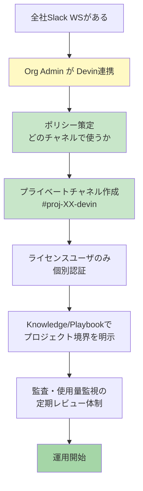

# Q57. Slackワークスペースはプロジェクトごとに分ける必要がある？全社ワークスペース運用の問題点は？

📚 [トップ索引](../../README.md) ｜ [カテゴリ索引: 外部連携（Slack・PM）](README.md)

---

> **メタ**: 最終確認日 2026/4/16 ｜ 根拠 https://docs.devin.ai/integrations/slack ｜ 推定あり

### 結論: **プロジェクトごとに分ける必要なし**、**全社Slack 1ワークスペース運用が基本形**。ただし**チャネル設計・権限運用・機密情報の扱い**でいくつか注意点あり

### 前提

| 設定単位 | 粒度 |
|---|---|
| **Devin Org ↔ Slack Workspace** | 1 Org : 1 WS（同時接続は1つ） |
| **Slack内での利用** | **任意のチャネルで `@Devin`** → セッション起動可能 |
| **Slack側の分離単位** | **チャネル・プライベートチャネル・DM** |

→ 「プロジェクトごとに別ワークスペース」は**Devinの制約上むしろ非推奨**（複数WS＝複数Org契約必要で課金重複）。

### 全社ワークスペースのメリット / デメリット

### ✅ メリット
- Slack 1つで完結、追加WS不要
- 既存の社内コミュニケーション基盤に統合
- どのチャネルからでも `@Devin` 呼び出し可能
- ユーザは新WSにJoin不要、オンボーディング簡単
- クロスプロジェクトな質問（Ask Devin的な使い方）も自然

### ⚠️ デメリット・懸念

| 懸念 | 内容 | 対策 |
|---|---|---|
| **情報漏洩** | 公開チャネルで `@Devin` → 会話履歴・コードが全社員に見える | **プライベートチャネル運用**を標準化 |
| **意図しない起動** | 全社員がライセンス対象でなくても `@Devin` を打てる | **Org側でユーザ個別認証** + 非ライセンスユーザへは未反応 |
| **課金肥大** | 誰でも起動可能だとセッション数が膨らむ | Admin側で使用量監視・予算上限設定 |
| **ナレッジ汚染** | プロジェクト固有文脈がOrg共通Knowledgeに混ざる | **Session-level Knowledge** または **別Playbook** で分離 |
| **機密混在** | 人事・法務・経営系チャネルで誤って `@Devin` を呼ぶ | **Dedicated Devin Channel制**で明示的許可チャネルのみ推奨 |
| **Secrets露出** | チャネルに書かれたAPIキー等をDevinが参照 | Secretsは**Slackに書かない**、Devin Secretsに格納 |
| **通知ノイズ** | PR完了通知が大量に流れる | プロジェクトごとに通知チャネル分離 |
| **監査境界が曖昧** | 誰が何にDevinを使ったかプロジェクト単位で追いにくい | チャネル命名規約 + セッションタグで運用 |

### 推奨運用パターン

### パターンA: 全社WS + プロジェクト別プライベートチャネル ⭐推奨

```
company-workspace.slack.com
├── #devin-general          # Devinの使い方Q&A（公開、全社員）
├── #devin-announce         # アップデート告知
│
├── #proj-alpha-devin       # プロジェクトAlpha専用（プライベート）
│   └── メンバー: Alphaチームのみ
├── #proj-beta-devin        # プロジェクトBeta専用（プライベート）
│   └── メンバー: Betaチームのみ
│
└── #ir-sensitive           # 機密プロジェクト（超プライベート）
    └── メンバー: 経営層+少人数
```

**運用ルール**:
- 「プロジェクト業務タスクは専用プライベートチャネルで @Devin 呼び出し」をポリシー化
- 公開チャネルでは簡単なQ&A・`!ask`程度に限定
- 機密度が高い案件はGuest招待を避ける

### パターンB: 全社WS + Dedicated Devin Channel制

```
Settings > Integrations > Slack > Dedicated Channel
  → #devin-only に限定

→ 他のチャネルで @Devin 呼んでも起動しない
```

**メリット**: 誤起動完全防止
**デメリット**: プロジェクトごとに会話がまざる → **パターンAとの併用が最適**

### パターンC: 機密案件のみ別Slack WS（例外運用）

基本はパターンAだが、**M&A・人事系・顧客機密系**など:
- **別Org + 別Slack WS（有料の追加Org契約）**
- または **Devin Webapp直接利用**（Slack経由しない）

### 情報漏洩リスクの実体

### Devinが参照するスコープ
```
@Devin が呼ばれたチャネルの以下を参照:
 ├─ メッセージ本文（@Devin を含むスレッド）
 ├─ アップロードされたファイル（指定時）
 ├─ 指示されたGitHubリポ・リンク
 └─ Knowledge / Playbook / Secrets（Org共通）

NOT 参照:
 ├─ 他チャネルの内容
 ├─ DMの内容
 └─ 非紐付けリポ
```

→ **「Devinに見られて困る情報」をそのチャネルに書かなければOK**。逆に言えば、**書いた瞬間Devinが読める**可能性があるので、**機密情報はチャネル設計で分離**が正解。

### 具体的なリスク例
| シナリオ | 問題 | 対策 |
|---|---|---|
| `#general`で「@Devin 新製品Xのコード見て」 | 全社員が新製品情報閲覧 | プライベート`#proj-x-devin`で実施 |
| `#marketing`で「@Devin このプレスリリース公開前だけど」 | マーケ非関係者に公開前情報漏洩 | `#marketing-private` or DMで |
| `#dev` でパスワード共有+@Devin | パスワード平文保存 | Secrets登録、Slackに書かない |
| 退職者が`#general`でDevin履歴見る | 退職前の全社員が過去タスク閲覧可能 | アクセス管理 + プライベートチャネル |

### セットアップの推奨手順



### ガバナンス上の推奨設定（YAML例）

```yaml
devin_slack_policy:
  workspace: company-workspace.slack.com
  orgs:
    - org: 会社Org（Enterprise）
      slack_connection: company-workspace

  channel_policy:
    default: "project-private-only"

    public_allowed:
      - "#devin-general"  # 使い方質問・!askのみ
      - "#devin-announce"

    project_channels:
      naming: "#proj-{project-id}-devin"
      visibility: "private"
      auditor: "IT security"

    sensitive:
      recommended: "別Org or Webapp直接"

  user_policy:
    licensed_only: true
    onboarding: "Devin Admin から個別招待"
    auto_reject_unlicensed: true

  data_policy:
    no_secrets_in_slack: true
    no_pii_in_slack: true
    audit_retention: "1年"

  kpi:
    session_count_per_project: "monthly"
    cost_allocation: "per-channel → per-project"
```

### 運用ルールのサンプル（社内通達例）

```markdown
# Devin × Slack運用ガイドライン

## 基本原則
1. プロジェクトタスクは必ず専用プライベートチャネル `#proj-{ID}-devin` で
2. 公開チャネルでは `!ask` での軽い質問のみ
3. Slackに秘密情報を書かない（APIキー/パスワード/個人情報）
4. 機密案件はDMも避け、Devin Webapp直接利用へ

## チャネル作成フロー
- PMが IT Security に申請
- `#proj-{ID}-devin` 作成、メンバー限定
- Devin Dedicated Channel設定

## 監査
- 月次でOrg Admin が使用量・チャネル別レビュー
- 四半期で全プロジェクトチャネル棚卸し

## 緊急時
- 漏洩疑いはまず該当チャネルをアーカイブ
- セッション履歴の保持期間はプラン/契約で異なる（デフォルトは契約期間中。詳細は [Q50](../12-security-governance/q50-data-retention.md) 参照）
```

### よくある質問

| Q | A |
|---|---|
| 本番コードの質問を`#general`でした、大丈夫？ | **履歴がWS全員に見える**ため、機密コードなら即プライベートチャネルへ移行・過去ログ削除検討 |
| プライベートチャネルならDevin見られない？ | **メンバーに追加されたBot（Devin）からは見える**。チャネル内容は読まれる前提 |
| DMでDevinと対話できる？ | **可能**（`@Devin` DM）、個人的なタスクに向く |
| ゲストユーザがDevinを使う可能性は？ | **ライセンス割当されていれば使える**。ゲスト対象外にする運用推奨 |
| Enterprise Gridで複数WSある場合は？ | Slack Enterprise Grid環境では**特定WSのみに限定インストール** or **Grid横断**を Adminで選択 |

### まとめ

| 観点 | 回答 |
|---|---|
| **プロジェクトごとにWS分離が必要?** | **❌ 不要**、むしろWS統一が自然 |
| **全社WSで問題は?** | 技術的には問題なし。**チャネル設計とポリシーで統制**すれば十分 |
| **機密プロジェクトは?** | **プライベートチャネル**が基本、超機密は**別Org or Webapp直接** |
| **誤起動・情報漏洩リスク** | **Dedicated Channel制 + プライベートチャネル運用**でほぼ防げる |
| **推奨構成** | **全社WS 1つ + プロジェクト別プライベートチャネル + ポリシー策定** |
| **ポイント** | 「Slackに書いた瞬間Devinが読める可能性あり」を徹底教育、**Secretsは必ずDevin側で管理** |

**核心**: WS分離より**チャネル設計・ライセンス管理・運用ポリシー**で統制するのが現実解。全社WS運用は**Enterprise企業の標準パターン**なので安心して採用できる。ただし**「プライベートチャネル＋Dedicated Channel制＋機密はDMでも書かない」**の3点は必ず徹底してください。

---

[← Q56. 複数Organization（個人契約＋会社契約）で、それぞれ別のSlackワークスペースに連携できる？](q56-multi-org-slack.md) ｜ [Q58. AsanaやBacklogとの連携は可能？ →](q58-asana-backlog.md)
