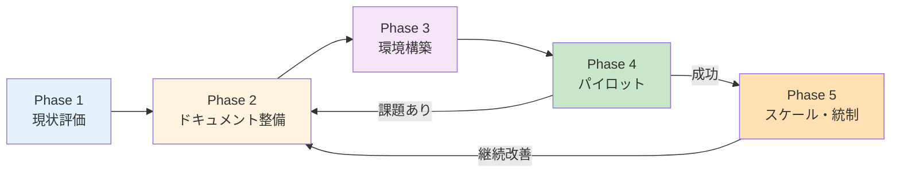
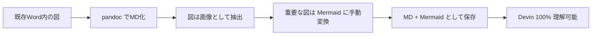
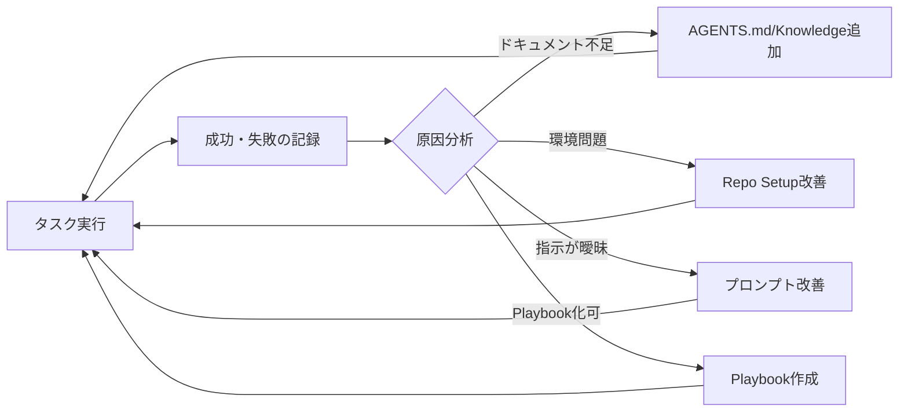

# Q59. 既存の人間主体の開発プロセス/ドキュメントをDevinに把握させ、人とDevinをシームレスに連携させる手順は？

📚 [トップ索引](../../README.md) ｜ [カテゴリ索引: 組織展開・分析](README.md)

---

> **メタ**: 最終確認日 2026/4/16 ｜ 根拠 運用観察ベース ｜ 推定なし

### 結論: **5フェーズで段階的に進める**。**Phase 1: 現状評価**（既存資産の棚卸し）→ **Phase 2: ドキュメント整備**（AGENTS.md / Knowledge / Playbookへの変換）→ **Phase 3: 環境構築**（Repo Setup / Secrets / Snapshot）→ **Phase 4: パイロット**（小さな実タスクで検証）→ **Phase 5: スケール・統制**（組織展開・運用ルール・監査）。**いきなり全移行せず、1チーム・1リポから始めるのが成功の鍵**

### 全体像



**期間目安**: 小規模チーム（10人以下）で **2〜3ヶ月**、中規模（数十人）で **3〜6ヶ月**。

---

### Phase 1: 現状評価（1〜2週間）

### 目的
「いま人間だけで回っている暗黙知・形式知」を棚卸しし、**Devinに渡すべき情報**と**デジタル化されていない情報**を把握する。

### チェックリスト

#### 1-1. プロセス棚卸し
```
□ 開発プロセス図（Waterfall / Agile / Scrum / Kanban）
□ 要件定義 → 設計 → 実装 → テスト → リリースの各工程
□ レビュープロセス（コード / 設計 / 仕様）
□ チケット管理（Jira / GitHub Issues / Redmine / Backlog）
□ ブランチ戦略（Git Flow / GitHub Flow / Trunk Based）
□ デプロイフロー（CI/CD / 手動）
□ インシデント対応フロー
□ 会議体（朝会 / レトロ / PBR）
```

#### 1-2. ドキュメント棚卸し
```
□ README（各リポ）
□ 設計書・仕様書（Word/Excel/PDF/Confluence/Notion）
□ API仕様（Swagger / OpenAPI / 手書き）
□ データモデル・ER図
□ インフラ構成図
□ 運用手順書
□ トラブルシュート集
□ コーディング規約
□ セキュリティガイドライン
□ 用語集（ドメイン用語）
```

#### 1-3. 暗黙知の発見
```
□ 「〇〇さんしか知らない」処理
□ READMEに書かれていないビルド手順
□ 共有されていないSecretや接続情報
□ 過去のインシデントから学んだ非公式ルール
□ チーム内のみで共有されるコーディングパターン
```

#### 1-4. 既存ツール・リソース
```
□ GitHub / GitLab / Bitbucket / Azure DevOps
□ CI/CD（GitHub Actions / Jenkins / CircleCI）
□ コミュニケーション（Slack / Teams）
□ 文書基盤（Confluence / Notion / Google Drive）
□ 監視（Datadog / New Relic / CloudWatch）
□ エラー追跡（Sentry / Rollbar）
```

### 成果物
- **現状評価レポート**（MD形式推奨、Devinに渡せる）
- **ギャップ一覧**（暗黙知・未文書化項目）
- **優先順位付けされた整備対象リスト**

### よくある発見
| 発見 | 対処方向 |
|---|---|
| Confluenceに設計書があるがリポと分離 | 主要部分をリポに転記 or MCP連携 |
| ビルド手順がSlackのピン留めメッセージ | MDドキュメント化 |
| Secretが複数人間で共有エクセル管理 | Devin Secrets + Secrets Managerへ |
| 「このコードは触るな」の口伝ルール | AGENTS.md / コメントで明示化 |
| ドメイン用語が明文化されていない | 用語集.mdをリポに配置 |

---

### Phase 2: ドキュメント整備（2〜6週間）

### 目的
既存ドキュメントを**Devinが読める形**に変換・再編成。**全部を完璧にする必要はなく、最重要部分から**着手。

### 2-1. Devinが「自動で読む」3つの層

| 層 | 内容 | 優先度 |
|---|---|---|
| **AGENTS.md**（リポ直下） | 開発規約・禁止事項・命名規則・レビュー観点 | ⭐⭐⭐ 最優先 |
| **Knowledge**（Devin側設定） | 事実・固定ルール（「本プロジェクトはPython 3.12」等） | ⭐⭐⭐ 最優先 |
| **Playbook**（Devin側設定） | 反復手順（Repo Setup、リリース手順、テスト手順） | ⭐⭐ 高 |
| README / docs/ | 開発者向け説明 | ⭐⭐ 高 |
| `.github/pull_request_template.md` | PRチェックリスト・Review観点 | ⭐⭐ 高 |

### 2-2. AGENTS.mdの書き方

**最小スタート**:
```markdown
# AGENTS.md

## プロジェクト概要
- 名前: [プロジェクト名]
- 目的: [一言で]
- 主要技術: Python 3.12 / FastAPI / PostgreSQL

## 重要な原則
- コミット前に必ず `ruff check` と `pytest` を実行
- DBスキーマ変更は必ずmigrationファイル作成
- secretはコードにハードコードしない

## 禁止事項
- `main` ブランチへの直接push
- `test_*.py` の変更（テスト改変禁止）
- `legacy/` 配下のコードの修正

## レビュー観点
- 型ヒント完備
- N+1クエリの排除
- 認証・認可の網羅
- PII（個人情報）のログ出力禁止

## 既存パターン
- サービス層: `app/services/`
- リポジトリ層: `app/repositories/`
- ルータ: `app/api/v1/`
```

### 2-3. Knowledgeの登録内容（例）

| トリガ | 内容 |
|---|---|
| 「このリポで作業するとき」 | Node 20.x（nvm use）、pnpmを使う |
| 「DBマイグレーション時」 | `alembic revision --autogenerate` を使用 |
| 「PR作成時」 | タイトルは `[JIRA-XXX] 内容` の形式 |
| 「デプロイ時」 | `deploy/` ディレクトリ内のスクリプトを確認 |
| 「テスト失敗時」 | `pytest -xvs` で詳細確認、`--lf` で前回失敗のみ |

### 2-4. Playbookに落とすべき手順

| 反復手順 | Playbook化の価値 |
|---|---|
| 新機能のスキャフォールディング | ⭐⭐⭐ |
| DB migration 追加 → 適用 → テスト | ⭐⭐⭐ |
| リリース手順（tag → deploy → 告知） | ⭐⭐⭐ |
| 依存更新（dependabot対応） | ⭐⭐ |
| Sentryエラー調査フロー | ⭐⭐ |
| Incident Response Runbook | ⭐⭐⭐ |

### 2-5. 既存Word/Excel/PDF文書の処理

| 元形式 | 変換戦略 |
|---|---|
| **Word仕様書** | Markdown化（pandoc）、リポの `docs/` 配置 |
| **Excel 要件表** | CSV化 or Markdown表に変換 |
| **Excel・Word・PDF内の図** | 重要な図は**PNG化+Mermaid再描画**で両形式保存 |
| **Confluence** | Markdown export、またはMCP連携検討 |
| **Notion** | Markdown export |
| **Google Drive** | MCP連携 or Markdownダウンロード |
| **紙文書** | スキャン → OCR → Markdown |

### 2-6. 図の再整備（Q47参照）

- フローチャート → **Mermaid**（テキストで管理、Devin理解最強）
- アーキテクチャ図 → **Mermaid / PlantUML**
- ER図 → **Mermaid / dbml**
- シーケンス図 → **Mermaid**
- オリジナル図（写真・SmartArt）→ **PNG + 文章説明の併記**



### 2-7. ドメイン用語集

```markdown
# 用語集 (docs/glossary.md)

| 用語 | 意味 | 関連 |
|---|---|---|
| 受注（Order） | 顧客から商品購入依頼を受けた状態 | order テーブル |
| 引当（Allocation） | 在庫を特定の受注に紐付けること | allocation テーブル |
| 出荷指示 | 倉庫に発送を指示する行為 | shipment_order |
| SO/PO | Sales Order / Purchase Order | — |
```

→ **Devinはドメイン用語集を読めばビジネスロジックを正確に実装できる**。

### 成果物
- `AGENTS.md`（各リポ）
- `docs/` ディレクトリ整備（README / glossary / architecture / runbook）
- Devin Knowledge 登録済み
- 優先度高いPlaybook作成済み
- 主要な図のMermaid化済み

---

### Phase 3: 環境構築（1〜3週間）

### 目的
Devinが「人と同じ環境で作業できる」状態にする。**Repo Setup / Secrets / Machine Configuration / Snapshot** を整える。

### 3-1. Repo Setup 確立

Devinの`Repo Setup`タブで:

```bash
# 例: Python + PostgreSQL プロジェクト
#!/bin/bash
set -e

# Python
pyenv install 3.12.0 -s
pyenv local 3.12.0

# Poetry install
curl -sSL https://install.python-poetry.org | python3 -
poetry install --no-interaction

# DB (ローカル検証用)
docker compose up -d postgres

# Migration
poetry run alembic upgrade head

# Pre-commit
poetry run pre-commit install

# Initial test
poetry run pytest -x --collect-only > /dev/null
echo "Setup complete"
```

### 3-2. Snapshot化

セットアップが安定したら**Snapshotを作成**。
- 2回目以降のセッションは**Snapshot起動で高速化**（setup再実行不要）
- 新人Devinも即座に動作環境を得る

### 3-3. Secrets移行

| 従来の保管 | Devin側 |
|---|---|
| 個人のPC `.env` | Devin Secrets（Org or Personal） |
| 1Password / KeePass | Secretsに必要なものだけコピー |
| 共有Excelパスワード帳 | **廃止**、Secrets + AWS Secrets Manager |
| Slack共有 | **廃止**、Secretsへ |

**命名規則**（例）:
```
DATABASE_URL               # 開発DB
TEST_DATABASE_URL          # テスト用
AWS_ACCESS_KEY_ID          # AWS（最小権限）
AWS_SECRET_ACCESS_KEY
GITHUB_PAT                 # GitHub personal access
SLACK_WEBHOOK_URL          # 通知
JIRA_API_TOKEN             # チケット連携
OPENAI_API_KEY             # 他LLM連携
```

### 3-4. MCP・Integration 接続

| 連携先 | 方式 | 用途 |
|---|---|---|
| Jira / Linear | MCP | チケット参照・更新 |
| Slack | MCP or Webhook | 通知 |
| Confluence | MCP | 設計書参照 |
| Google Drive | MCP + OAuth | ドキュメント参照 |
| AWS | Secrets + AssumeRole | インフラ操作 |
| Databricks / BigQuery | MCP | データ分析 |

### 3-5. ブランチ・PR規約をDevinに認知

AGENTS.mdに明記:
```markdown
## Branch命名規則
- feature/JIRA-123-brief-desc
- fix/JIRA-456-bug-fix
- release/v1.2.0

## PR規約
- タイトル: `[JIRA-XXX] <概要>`
- 本文: テンプレート準拠
- merge前: レビュー1名以上 + CI全pass
- rebase merge を使用
```

### 成果物
- Repo Setup 完成・Snapshot化済み
- Secrets 登録完了
- 必要なMCP/Integration接続済み
- Devinが初回タスクで環境問題に遭遇しない状態

---

### Phase 4: パイロット（2〜4週間）

### 目的
**小さな実タスク**で人とDevinの協働を試行。**成功パターン・失敗パターン**を蓄積し、Phase 2-3を補強。

### 4-1. パイロット対象の選び方

**✅ 向いているタスク**:
- バグ修正（再現手順明確なもの）
- テストケース追加
- 依存バージョンアップ
- READMEの整備
- リファクタリング（局所的）
- ドキュメント生成（docstring等）
- Lint修正・タイポ修正

**⚠️ 最初は避けるタスク**:
- アーキテクチャ変更
- セキュリティクリティカル
- 納期厳しい本番機能
- 外部依存が大きい作業

### 4-2. 協働パターンの確立

#### パターンA: Devinが主・人間が確認
```
1. ユーザがタスク指示（チケット or チャット）
2. Devinが実装・PR作成
3. Devin Review が一次レビュー
4. 人間が最終レビュー・merge
```

#### パターンB: 人間が主・Devinが補助
```
1. 人間が設計・主要実装
2. Devinにテスト追加・ドキュメント補完を依頼
3. Devinが補助PR作成
4. 人間がレビュー・取り込み
```

#### パターンC: Ask Devinで調査
```
1. 人間が不明点を Ask Devin に質問
2. Devinがリポ横断で調査・回答
3. 人間が実装判断
```

### 4-3. パイロット中に記録すべきこと

```
□ 成功したタスク（何が良かった）
□ 失敗したタスク（原因・対処）
□ Devinが誤解したドキュメントや用語
□ 追加で必要になった Knowledge / Playbook
□ AGENTS.md に加筆すべきルール
□ セットアップで躓いた箇所
□ レビューで発見されたパターン
```

### 4-4. フィードバックループ



### 成果物
- パイロット結果レポート
- 改善されたAGENTS.md / Knowledge / Playbook
- チーム内でのベストプラクティス共有資料
- スケール展開の判断材料

---

### Phase 5: スケール・統制（継続）

### 目的
組織全体にDevinを展開しながら、**統制・監査・品質**を担保する。

### 5-1. 組織展開

#### ロードマップ例
```
Month 1-2: 1チーム1リポでパイロット
Month 3-4: パイロットチーム内で全リポ適用
Month 5-6: 隣接チームに拡大（計2-3チーム）
Month 7-9: 部門展開（10+チーム）
Month 10+: 全社標準化
```

#### 展開時のボトルネック
| 課題 | 対策 |
|---|---|
| チームごとに標準が違う | **組織共通AGENTS.md**を基底に、チーム固有を上書き |
| ドキュメント整備が進まない | Devin自身にドキュメント補完をさせる |
| Secrets管理がバラバラ | Org Secrets 統一運用 |
| ライセンス制約 | Enterprise契約で席数確保 |

### 5-2. 運用ルール・ガイドライン策定

```markdown
# 社内 Devin 利用ガイドライン

## 1. アカウント・権限
- 全員がPersonal Secretを持つ
- Org SecretsはAdminのみ登録可
- DevinのGitHub連携は最小権限で

## 2. タスクの委ね方
- 機密データはSecrets経由
- PII・クレジットカード番号はチャットに書かない
- 本番DBへの直接操作は禁止

## 3. コードレビュー
- DevinのPRも必ず人間が最終承認
- Auto-mergeは事前合意ある場合のみ
- Auto-Fixは開発用ブランチで検証してから有効化

## 4. インシデント時
- セキュリティ事案はSecurityチーム直通
- 機密情報漏洩疑いは即報告

## 5. 教育・オンボーディング
- 新人は2週間のDevinチュートリアル受講
- 既存メンバーは月次勉強会
```

### 5-3. 監査・コンプライアンス

| 観点 | 対策 |
|---|---|
| **操作ログ** | Enterprise監査ログ活用、CloudTrail連携 |
| **データ保護** | GDPR/CCPA準拠設定（Q53参照） |
| **アクセス制御** | RBAC、IdP連携（SAML/OIDC） |
| **Secrets管理** | ローテーション自動化、GuardDuty監視 |
| **コード品質** | Devin Review + 人間レビュー二重チェック |

### 5-4. KPI・効果測定

| 指標 | 目標例 |
|---|---|
| Devinが完了したPR数/月 | 50件以上 |
| Devin主導タスクの成功率 | 80%以上 |
| 人間のレビュー時間削減率 | 30%削減 |
| バグ検出率（Devin Review） | 本番バグ20%削減 |
| ドキュメント整備率 | 主要リポ100%にAGENTS.md |
| オンボーディング時間 | 新人の環境構築30分以内 |

### 5-5. 継続改善のリズム

```
週次: パイロットチームでKPT（Keep/Problem/Try）
月次: 組織全体のDevin運用レビュー
四半期: プロセス・ドキュメント大規模更新
年次: ツール見直し・契約更新
```

### 成果物
- 全社Devin運用ガイドライン
- 監査レポート（四半期）
- KPIダッシュボード
- 継続改善の仕組み

---

### 典型的な「3ヶ月プラン」

### 週次マイルストーン

| 週 | フェーズ | 主要活動 |
|---|---|---|
| 1-2 | Phase 1 | 現状評価・棚卸し |
| 3-4 | Phase 2 | AGENTS.md・Knowledge策定 |
| 5-6 | Phase 2-3 | 主要ドキュメントMD化 / Repo Setup作成 |
| 7-8 | Phase 3 | Secrets移行 / MCP接続 |
| 9-10 | Phase 4 | パイロットタスク実行 |
| 11 | Phase 4 | 改善・ルール整備 |
| 12 | Phase 5 | スケール計画策定 |

---

### よくある失敗パターンと対策

| 失敗 | 原因 | 対策 |
|---|---|---|
| 「Devinがバグだらけのコードを書く」 | AGENTS.md/規約が不十分 | 禁止事項・既存パターンを明記 |
| 「Devinが同じ間違いを繰り返す」 | Knowledge未登録 | 都度Knowledgeに追加 |
| 「環境構築で毎回つまずく」 | Repo Setup未整備 | Snapshot化 |
| 「チームが使ってくれない」 | 成功事例が共有されない | 週次デモ会・成功事例社内発信 |
| 「Secretが散在」 | Org統制不足 | Admin主導のガバナンス強化 |
| 「ドキュメントが古くなる」 | 更新プロセスなし | PR templateに「ドキュメント更新済？」 |
| 「Devinが勝手に変なことをする」 | 権限が広すぎ | 最小権限、禁止事項明記 |
| 「人とDevinの作業が衝突」 | ブランチ戦略・チケット運用が曖昧 | 明示的なタスク分担 |

---

### 各フェーズのチェックリスト

### Phase 1 完了基準
```
□ 開発プロセス図が存在
□ ドキュメント棚卸し済
□ 暗黙知リスト作成済
□ 移行対象の優先順位付け完了
```

### Phase 2 完了基準
```
□ 各リポにAGENTS.md配置
□ 用語集 docs/glossary.md 作成
□ 重要な図をMermaid化
□ Knowledge最低10件登録
□ 上位5つのPlaybook作成
```

### Phase 3 完了基準
```
□ Repo Setup動作確認済
□ Snapshot作成済
□ 必要な全Secrets登録済
□ 主要MCP接続済
□ Devinセッションが環境エラーなく動く
```

### Phase 4 完了基準
```
□ パイロットタスク最低10件完了
□ 成功率70%以上
□ 改善項目を各ドキュメントにフィードバック済
□ チーム内ベストプラクティス共有
```

### Phase 5 継続基準
```
□ 月次KPIレビュー実施
□ 四半期ごとのガイドライン更新
□ 監査ログ確認
□ 教育プログラム運用中
```

---

### Devinへの移行を加速するTips

### Tip 1: Devin自身に整備を手伝わせる
```
"このリポのREADMEを読んで、AGENTS.md を生成して"
"docs/ 配下の全Word文書をMarkdownに変換して"
"主要なクラスにdocstringを追加して"
```

### Tip 2: 既存チャットログ・Slackから学ぶ
- よく聞かれる質問 → Knowledge化
- よく出るエラー → 対処法Playbook化
- ベテランの口伝 → AGENTS.mdの「既存パターン」セクションへ

### Tip 3: ベテランのペアプログラミング録画
- ベテランの作業フローを言語化
- Devinに「この手順をPlaybookに」と依頼
- 暗黙知の形式知化

### Tip 4: 週次のDevin改善会議
- 今週Devinが失敗した事例
- 原因：ドキュメント不足 / 環境 / プロンプト
- 即Knowledge/Playbookへ反映

### Tip 5: 新人教育との統合
- 新人向けのオンボーディング資料 = Devinへの入力資料
- 「新人に説明することは、Devinにも説明するべき」

---

### まとめ

| フェーズ | 期間 | 主眼 | 成果物 |
|---|---|---|---|
| **1. 現状評価** | 1-2週 | 棚卸し・ギャップ発見 | 評価レポート |
| **2. ドキュメント整備** | 2-6週 | AGENTS.md / Knowledge / Playbook | 文書資産 |
| **3. 環境構築** | 1-3週 | Repo Setup / Secrets / MCP | 動作環境 |
| **4. パイロット** | 2-4週 | 実タスクで検証 | 改善フィードバック |
| **5. スケール・統制** | 継続 | 展開・監査・改善 | 組織標準 |

**核心**: 人とDevinのシームレス協働の実現は「**ドキュメント整備 8割、ツール設定 2割**」。特に **AGENTS.md / Knowledge / 用語集 / Mermaid化された図** の4点セットが揃えば、Devinは**人と同じ前提で作業できる**ようになる。**いきなり全社展開せず、1チーム・1リポのパイロットから始める**こと、**失敗をKnowledgeに逐次追加してドキュメントを育てる文化**を作ることが、3〜6ヶ月での定着の決め手です。

---

[← Q58. AsanaやBacklogとの連携は可能？](../14-external-pm/q58-asana-backlog.md) ｜ [Q60. 標準化ドキュメントリポを渡せば、Devinは準拠したリソース構成を自動生成してくれる？ →](q60-standards-docs-auto-resource.md)
