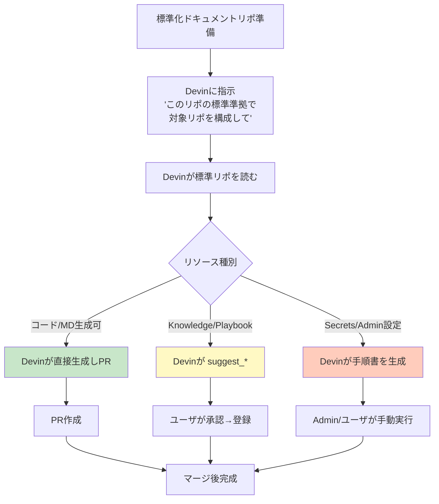

# Q60. 標準化ドキュメントリポを渡せば、Devinは準拠したリソース構成を自動生成してくれる？

📚 [トップ索引](../../README.md) ｜ [カテゴリ索引: 組織展開・分析](README.md)

---

> **メタ**: 最終確認日 2026/4/16 ｜ 根拠 運用観察ベース ｜ 推定なし

### 結論: **大部分は対応可能**、ただし**リソースの種類によって自動化レベルが異なる**。**(1) AGENTS.md / Repo Setup / docs/ 配下の生成**は**完全自動**。**(2) Knowledge / Playbookの「登録」は人間の承認が必要**（Devinは提案・ドラフトまで）。**(3) Secrets / Org設定 / MCP接続 / Auto-Review enrollment** は**管理者の手動操作が必須**。**(4) 標準化リポの構造を整備すれば、Devinは極めて高精度でリソース生成できる**

### 自動化レベル早見表

| Devinリソース | 自動化レベル | 備考 |
|---|---|---|
| **AGENTS.md（対象リポ直下）** | ✅ **完全自動** | Devinがそのまま書く |
| **README.md / docs/** | ✅ **完全自動** | MD生成可 |
| **Repo Setup スクリプト** | ✅ **完全自動** | bash/shを生成・検証 |
| **.github/pull_request_template.md** | ✅ **完全自動** | |
| **Mermaid図・用語集** | ✅ **完全自動** | |
| **Knowledge（ドラフト作成）** | 🟡 **半自動** | Devinが `suggest_knowledge` でsuggest、**ユーザ承認で登録** |
| **Playbook（ドラフト作成）** | 🟡 **半自動** | Devinが提案、**人間がUIで登録** or devin_mcp経由 |
| **Snapshot作成** | 🟡 **半自動** | Repo Setup実行後、Webappで「Snapshot化」する人間操作 |
| **Secrets登録** | ❌ **手動必須** | 秘密情報のため、Devinは値を受け取れない |
| **Org Secrets / Org Knowledge** | ❌ **Admin手動** | Admin権限が必要 |
| **Machine Configuration選択** | ❌ **手動** | プラン・課金に影響 |
| **MCP Integration接続** | ❌ **Admin手動** | OAuth認証が必要 |
| **Auto-Review enrollment** | ❌ **手動** | Settings > Reviewで個別操作 |
| **SSO / IdP設定** | ❌ **Admin手動** | Enterprise設定 |
| **VPC / PrivateLink設定** | ❌ **Admin手動** | インフラ権限 |

### 進め方の全体像



### 標準化ドキュメントリポの理想構造

```
corp-dev-standards/            # 標準リポ
├── README.md                  # 全体概要・適用範囲
├── AGENTS.template.md         # ★ AGENTS.md のテンプレ
├── naming/                    # 命名規則
│   ├── branches.md
│   ├── commits.md
│   └── variables.md
├── coding/                    # コーディング規約
│   ├── python.md
│   ├── typescript.md
│   ├── security.md
│   └── testing.md
├── docs/                      # ドキュメント規約
│   ├── readme-template.md
│   ├── api-doc-guide.md
│   └── glossary-template.md
├── review/                    # レビュー観点
│   ├── code-review.md
│   ├── pr-template.md
│   └── security-review.md
├── repo-setup/                # Repo Setup テンプレ
│   ├── python-poetry.sh
│   ├── node-pnpm.sh
│   ├── go-modules.sh
│   └── docker-compose.yml.template
├── workflows/                 # CI/CD テンプレ
│   ├── github-actions/
│   └── gitlab-ci/
├── knowledge/                 # Knowledgeエクスポート
│   ├── python-projects.md
│   ├── frontend-projects.md
│   └── backend-projects.md
├── playbooks/                 # Playbookテンプレ
│   ├── release.md
│   ├── incident-response.md
│   └── new-feature.md
└── governance/
    ├── secrets-policy.md
    ├── branch-protection.md
    └── audit-requirements.md
```

### 実行プロンプト例

### 🎯 単一リポを標準準拠にする

```
リポ `github.com/mycorp/sample-app` を、標準化リポ `github.com/mycorp/corp-dev-standards` の
規約に準拠させてください。具体的には:

1. AGENTS.template.md をベースに、本リポ固有の情報を反映した AGENTS.md を生成
2. docs/readme-template.md を適用して README.md を刷新
3. repo-setup/python-poetry.sh を参考に本リポ向けの Repo Setup スクリプトを作成
4. review/pr-template.md を元に .github/pull_request_template.md を配置
5. knowledge/python-projects.md をベースに、このリポ向けの Knowledge をsuggestして
6. 上記をまとめてPRを作成
```

→ Devinは標準リポをcloneし、対象リポにcloneし、差分を生成してPR化する。

### 🎯 複数リポを一括適用

```
組織配下の全リポ（github.com/mycorp/*）に対し、
標準化リポ corp-dev-standards の規約を適用してください。

手順:
1. リポ一覧を列挙（GitHub API）
2. 各リポの言語・フレームワークを自動判定
3. 適合する標準テンプレートを選択
4. リポごとにブランチ切ってPR作成
5. 標準に抵触する既存コードを検出（Reviewは別途）
6. 完了レポートを提示
```

→ 数十リポ規模なら数時間で完了。**複数セッション並列**でさらに高速化可能。

### 🎯 既存リソースの棚卸しと差分

```
対象: github.com/mycorp/sample-app

以下をチェックし、標準化リポとの差分レポートを出して:
- AGENTS.md があるか、内容は標準準拠か
- README.md 必須項目の有無
- Repo Setup 実行可能性
- PRテンプレの有無
- ブランチ保護の設定
- セキュリティスキャン設定

不足分を自動補完し、改善点をJira-XXXチケット化して。
```

### 自動化できる範囲の詳細

### ✅ 完全自動（Devinだけで完結）

#### ファイル系
- **AGENTS.md**: 対象リポの言語・構成・ドメイン文脈を踏まえてテンプレに具体情報を注入
- **README.md**: 標準テンプレ + リポ固有セクション
- **docs/ 配下**: 設計書・用語集・アーキテクチャ図
- **Repo Setup**: `devin.setup.sh` 的スクリプト生成、実行検証まで
- **PRテンプレート**: `.github/pull_request_template.md`
- **Mermaid/PlantUML図**: 標準リポの構成図をベースに再描画
- **.devcontainer / docker-compose**: テンプレ適用
- **.editorconfig / .gitignore / pre-commit-config**: コピー配置
- **CI/CD yaml**: GitHub Actions / GitLab CIのテンプレ展開
- **既存コードの部分的リファクタ**: lint適用・命名規則修正

#### 検証系
- **Repo Setupの動作確認**（実行してエラー解消まで自動）
- **テスト・リント実行**
- **PR作成とDevin Auto-Review**（enrollされていれば）

### 🟡 半自動（Devinが提案、人間が承認・登録）

#### Knowledge
- Devinは `suggest_knowledge` ツールで**提案**まで実行
- ユーザは**webapp上で承認 → 登録**
- 承認UIは `Settings > Knowledge` または「セッション内のsuggestion」から
- または **devin_mcp経由でプログラマティックに登録**（APIキー必要）

#### Playbook
- Devinは **Playbookの草案（Markdown）** を生成
- ユーザは `Settings > Playbooks`で**手動登録**
- 将来的には **devin_mcp経由で一括登録**も可能（APIが開いている場合）

#### Snapshot
- Repo Setup実行まではDevinが自動化
- 「このセットアップ状態をSnapshotとして保存」はユーザUI操作

### ❌ 自動化不可（人間/Adminの操作が必須）

#### Secrets
```
❌ Devinが「AWS_ACCESS_KEY_ID を登録して」はできない
   → 値を受け取ることがセキュリティ的に不可

✅ Devinができること:
   "Settings > Secrets で以下を登録してください:
   - AWS_ACCESS_KEY_ID (用途: S3読み書き)
   - AWS_SECRET_ACCESS_KEY
   - DATABASE_URL (用途: 開発DB接続)"
   → 登録すべきSecretの一覧と用途を提示
```

#### Org設定 / Admin操作
- Org Secrets登録 → **Admin手動**
- Org Knowledge登録 → **Admin手動**（またはAdmin APIキー）
- Auto-Review enrollment → ユーザ個別 or Admin
- Machine Configuration変更 → 契約・課金絡み、手動
- IdP設定（SSO/SAML/OIDC）→ Admin
- VPC / PrivateLink → インフラチーム

#### Integration / MCP接続
- Jira / Slack / Confluence / Google Driveの**OAuth認証**
- → ブラウザでの対話的認証が必要
- Devinは**接続手順のガイド**までは提示可能

### 標準化リポ側で用意しておくと効くもの

### 📘 テンプレファイル（Devinが直接コピー・カスタムできる）

```
corp-dev-standards/
├── AGENTS.template.md
├── repo-setup/
│   ├── python-poetry.sh
│   └── node-pnpm.sh
├── pr-template.md
└── editorconfig.template
```

### 📝 自然言語の指示書（Devinがプロンプトとして解釈）

```markdown
# apply-standards.md

Devinへの指示: 対象リポジトリに対し、以下の手順で標準化を適用してください。

1. 言語判定:
   - package.json があれば Node → node-pnpm.sh を使用
   - pyproject.toml があれば Python → python-poetry.sh を使用
   - ...

2. AGENTS.md生成:
   - AGENTS.template.md を読む
   - `{{PROJECT_NAME}}` を実際のリポ名に置換
   - `{{MAIN_LANGUAGE}}` を判定結果で埋める
   - `{{DOMAIN_TERMS}}` は対象リポの README / docs から抽出

3. Repo Setup:
   - 対応言語のスクリプトを配置
   - 実際に実行して動作確認
   - エラーがあればトラブルシュート

4. PR作成:
   - タイトル: "chore: apply corporate dev standards"
   - 本文: 適用した標準一覧とチェックリスト
```

### 🔧 検証用CI

標準化リポにCIを入れて、**対象リポが標準準拠かを自動検査**:
```yaml
# .github/workflows/validate-standards.yml
name: Validate Standards Compliance
on: [push, pull_request]
jobs:
  validate:
    steps:
      - name: Check AGENTS.md exists
      - name: Check README minimum sections
      - name: Check Repo Setup script
      - name: Check PR template
      - name: Report compliance score
```

Devinにこれを走らせれば、**標準準拠度を数値化**できる。

### 実際のセッション例

### プロンプト
```
対象: github.com/mycorp/product-api
標準: github.com/mycorp/corp-dev-standards

標準化ドキュメントに準拠した設定を product-api に適用してください。
不足するKnowledge/Playbookがあれば提案してください。
Secrets等のAdmin操作が必要なものは、手順書として出してください。
```

### Devinが行う典型的な動き

```
1. 両リポをclone
2. 標準リポの apply-standards.md を読み込み
3. product-api の言語・構成を判定 (Python/FastAPI 等)
4. AGENTS.template.md を参照、product-api/AGENTS.md を生成
5. python-poetry.sh をベースに product-api/devin.setup.sh 生成
6. Repo Setup を実行して動作確認 (pytest 通過)
7. PR template / .editorconfig 配置
8. docs/glossary.md のスケルトンを生成（既存READMEから用語抽出）
9. Knowledge提案をsuggest_knowledgeで投稿
10. Playbookドラフトを .devin/playbooks/ に配置
11. Admin手順書 admin-setup-checklist.md を生成
12. PR作成
13. Devin Auto-Review走行（enrolled済）
14. 結果サマリをユーザに報告
```

### 成果物の一例
```
PR #123: chore: apply corporate dev standards

## 自動適用済み ✅
- AGENTS.md 新規作成
- devin.setup.sh（Python 3.12 / Poetry）
- .github/pull_request_template.md
- docs/glossary.md（10用語のスケルトン）
- .editorconfig / .pre-commit-config.yaml

## 提案・承認待ち 🟡
- Knowledge 5件（session/suggestions で確認してください）
- Playbook: "New Endpoint Creation" (.devin/playbooks/new-endpoint.md)

## Admin作業が必要 ⚠️
- Org Secrets: DATABASE_URL_PROD, SLACK_WEBHOOK
- Auto-Review enrollment (Settings > Review)
- Branch protection ruleset 適用
- Jira MCP接続

詳細は admin-setup-checklist.md を参照。
```

### ハマりどころと対策

| 問題 | 対策 |
|---|---|
| **Devinが標準を誤解釈** | 標準リポ側に「Devinへの指示書」を明示 |
| **対象リポの言語が複数** | 標準リポで複合プロジェクト向けテンプレも用意 |
| **既存コードと規約衝突** | 「既存コードには触れず新規部分のみ標準適用」と指示 |
| **Knowledge/Playbookが無秩序に増える** | レビュアーを指名、月次で整理 |
| **Secretsを巡る混乱** | Admin手順書を自動生成させて属人化防止 |
| **標準リポ自体の更新が伝搬しない** | 対象リポにschedule設定、月次で標準準拠チェック |

### さらに加速する工夫

### Schedule機能と組み合わせる
```
[Schedule]
毎週月曜 9:00、全対象リポに対し:
  1. 標準化リポの最新版を取得
  2. 各対象リポの準拠度をチェック
  3. 差分があれば自動PR作成
  4. Slackに報告
```

### Wikiと組み合わせる
- 標準化リポを **Devin Wiki** に登録
- 全セッションから Ask Devinで**「社内の命名規則は？」**と参照可能

### Playbook経由で実行を簡略化
```
Playbook: "apply-corp-standards"
  Input: target_repo_url
  Steps:
    1. standard_repo = "github.com/mycorp/corp-dev-standards"
    2. Read apply-standards.md in standard_repo
    3. Apply to target_repo
    4. Create PR
```

→ 「**Playbookを実行して**」だけで全自動化。

### まとめ

| 問い | 答え |
|---|---|
| 標準リポを渡して自動構成できる？ | **Yes、かなり対応可** |
| どこまで自動？ | **AGENTS.md / Repo Setup / docs / PRテンプレは完全自動**、**Knowledge/Playbookは提案までDevin、登録は人間**、**Secrets/Org設定は手動** |
| 標準リポに何があると良い？ | **AGENTS.template.md / Repo Setupスクリプト / PRテンプレ / 言語別テンプレ / Devinへの指示書（apply-standards.md）** |
| 複数リポ一括適用できる？ | **Yes**（複数セッション並列推奨） |
| 継続的に準拠状態を維持するには？ | **Schedule機能 + 準拠度CI + 月次レビュー** |
| 注意点 | **Secretsと Admin操作は Devin 単独で不可**、手順書生成まで |

**核心**: 「標準化リポをDevinに渡して『準拠させて』」は**極めて有効なパターン**です。**自動化できる部分（ファイル生成・MD整備・Repo Setup）** と **人間承認が必要な部分（Knowledge/Playbook登録）** と **Admin手動部分（Secrets/Org設定/MCP認証）** を明確に分離し、**標準リポ側に「Devinへの指示書（apply-standards.md）」を置いておく**ことで、Devinは**対象リポを読み取り→標準適用→PR作成→レビュー依頼**までを一貫で処理できる。さらに **Schedule + Playbook**と組み合わせれば、**常に標準準拠を保つ自動運用**が実現する。

---

[← Q59. 既存の人間主体の開発プロセス/ドキュメントをDevinに把握させ、人とDevinをシームレスに連携させる手順は？](q59-existing-process-integration.md) ｜ [Q61. 実例: `internal-standards-docs`（自社旧標準）に準拠したDevinリソース構成の手順は？ →](q61-internal-standards-example.md)
