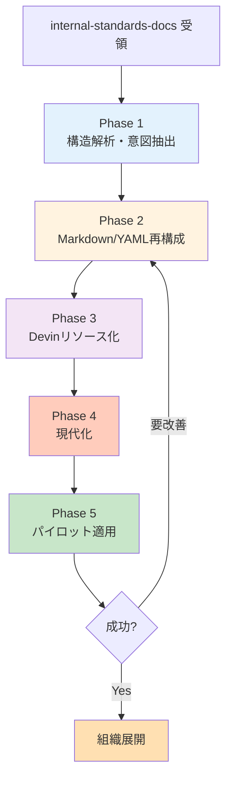
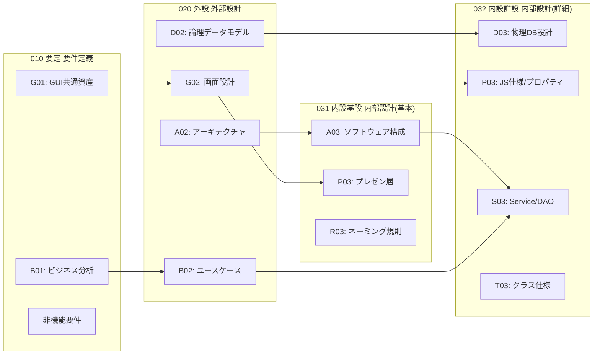
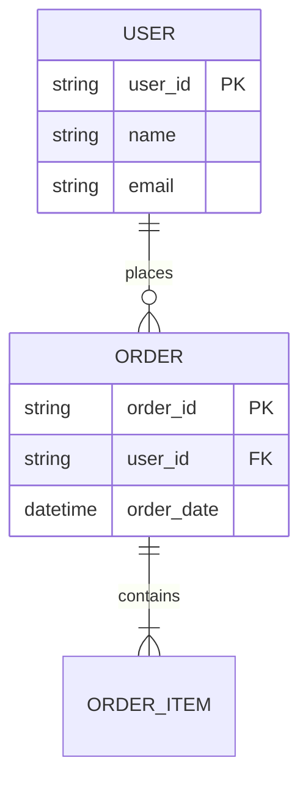
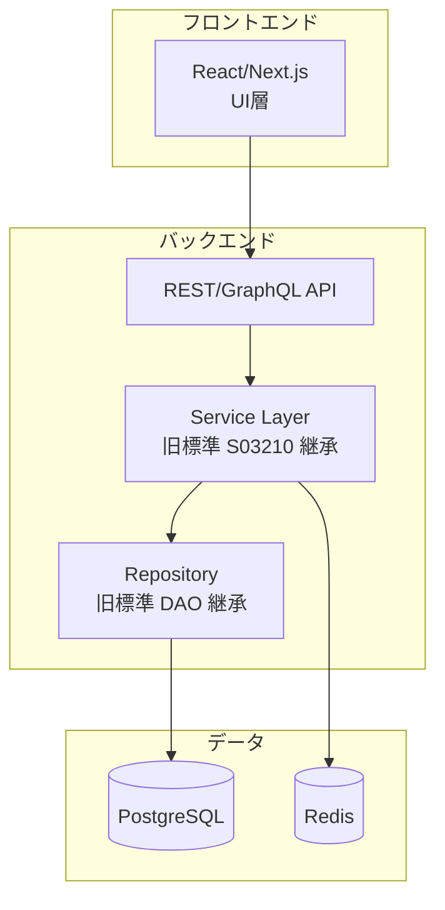
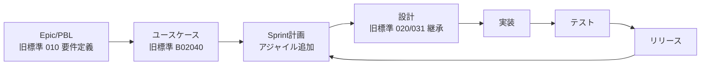
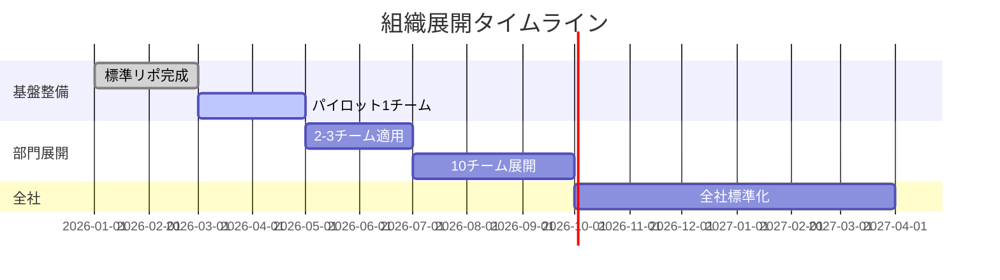

# Q61. 実例: `internal-standards-docs`（自社旧標準）に準拠したDevinリソース構成の手順は？

📚 [トップ索引](../../README.md) ｜ [カテゴリ索引: 組織展開・分析](README.md)

---

> **メタ**: 最終確認日 2026/4/16 ｜ 根拠 運用観察ベース ｜ 推定あり

### 結論: **このリポは Excel/Word/Astah中心のウォーターフォール前提・Java UI-Service-DAOテンプレートで、そのままではDevin最適ではない**。**(1) リポ構造・テンプレを Devinに解釈させて「意図」を抽出** → **(2) Markdown/YAMLに再構成** → **(3) AGENTS.md / Knowledge / Playbook / Repo Setupとして Devinリソース化** → **(4) 現代化（古い前提の更新）** → **(5) パイロット適用** の5段階で進める。**保守終了のため「温故知新」としてエッセンスを抽出する姿勢**が重要

### 📂 受領リポの実構造

### README要点
```
WebPot SI Docs 1.3
- TI部が2015年まで提供していたWebアプリ開発成果物テンプレート
- 現在は保守終了、参考として公開
- UI-Service-DAO構造のJavaベースWebアプリが前提
- 要件定義→外部設計→内部設計のウォーターフォール前提
- Excel/Astah前提のテンプレート
- プロジェクトで使用する場合は標準化チームで修正してから
```

### ディレクトリ構造

```
internal-standards-docs/
├── README.md
├── WebPot SI Docs 概.pdf/pptx          # 概要資料
├── WebPot SI Docs 工成物覧.xlsx         # 成果物一覧
├── WebPot SI Docs 工成物覧全構.png      # 全体構成図
├── T00000 テンプレート.xlsx             # 共通テンプレ
├── T00001 更新履歴.xlsx
├── R00010 用語集.xlsx
├── ReleaseNotes.txt
│
├── 010 要定/                            # 要件定義フェーズ
│   ├── B01010 システム振舞い全体通し図.xlsx
│   ├── B01020 システム化業務一覧.xlsx
│   ├── B01030 システム化業務フロー.xlsx
│   ├── B01040 システム化業務説明.xlsx
│   ├── B01050 システム化業務シナリオ記述.xlsx
│   ├── G01010 レイアウト全体通し図.xlsx
│   ├── G01020 共通CSSファイル/
│   ├── G01030 共通イメージファイル/
│   ├── G01040 共通JavaScript.txt
│   ├── G01050 共通画面モックアップHTML.txt
│   ├── G01060 画面モックアップ用サンプル.txt
│   └── 参 非機能要件レディ用シート.xls
│
├── 020 外設/                            # 外部設計フェーズ
│   ├── A02010 システム構成／ハード配置.xlsx
│   ├── A02020 ノード構成.xlsx
│   ├── A02030 アーキテクチャ方針.xlsx
│   ├── B02010 システムコンテキスト図.xlsx
│   ├── B02020 アクタ定義・ロール定義.xlsx
│   ├── B02030 ユースケース図.xlsx
│   ├── B02040 ユースケース記述.xlsx
│   ├── B02050 ユースケースシナリオ.xlsx
│   ├── D02010 データ辞書（論理モデル）.txt
│   ├── D02020 ER図（論理モデル）.asta/xlsx
│   ├── D02030 エンティティ一覧（論理）.xlsx
│   ├── D02040 エンティティ定義（論理）.xls
│   ├── D02050 CRUD図（論理）.xlsx
│   ├── D02060 ファイル一覧・定義.xlsx
│   ├── G02010 画面一覧.xlsx
│   ├── G02020 画面遷移.xlsx
│   ├── G02030 画面レイアウト.xlsx
│   ├── G02040 画面入力項目一覧.xlsx
│   ├── G02050 画面アクション詳細.xlsx
│   ├── G02060 画面モックアップ/
│   └── G02070 メッセージ一覧.xlsx
│
├── 031 内設 基設/                       # 内部設計 基本設計
│   ├── A03110 ソフトウェア論理構成.docx
│   ├── A03120 ソフトウェア物理構成.docx
│   ├── A03130 ソフトウェア実装方式.docx
│   ├── P03110～P03140/WebContent/       # サンプルHTML
│   ├── P03150 コンポーネント移植.xlsx
│   ├── R03120 実装成果物ネーミングルール.xlsx  ⭐重要
│   ├── 参 Javaコーディング規約.xls       ⭐重要
│   └── 図/
│
└── 032 内設 詳設/                       # 内部設計 詳細設計
    ├── D03210 ER図（物理モデル）.asta
    ├── D03230 テーブル一覧/定義.xls
    ├── D03240 テーブル定義.xlsx
    ├── P03210 JavaScript関数仕様.xlsx
    ├── P03240 プロパティファイル.xlsx
    ├── S03210 クラス（サービス・DAO）.xlsx
    ├── S03220 サービスインタフェース仕様.xlsx
    ├── T03210 クラス仕様詳細.xlsx
    └── T03220 インタフェース仕様詳細.xlsx
```

### 重要な観察
| 項目 | 現状 | Devin最適化の要否 |
|---|---|---|
| **ファイル形式** | Excel / Word / Astah(.asta) / PPT / PDF / HTMLサンプル | ⚠️ **要変換**（Markdown/YAMLへ） |
| **日本語ファイル名** | 全てSJIS前提の日本語命名 | ⚠️ **要対応**（Unicodeは可、ただしASCII補助推奨） |
| **アーキテクチャ前提** | UI-Service-DAO（Java Servlet/jQuery UI 1.10.4/Velocity） | ⚠️ **古い**、**現代スタックへの読み替え必要** |
| **プロセス前提** | ウォーターフォール（要定→外設→内設基→内設詳） | ⚠️ **Agile/Scrumと併用案を提示** |
| **成果物一覧** | 4フェーズ × 複数カテゴリ（A/B/D/G/P/R/S/T/G） | ✅ **体系的**、そのまま活用可能 |
| **命名規則** | `{カテゴリ}{工程番号}{連番} {名称}.xlsx` | ✅ **優秀**、Devinに学ばせやすい |
| **標準テンプレ** | T00000 テンプレート.xlsx | ✅ **再利用価値あり** |
| **用語集** | R00010 用語集.xlsx | ✅ **最重要資産**（Devinへのドメイン教育素材） |
| **保守状態** | 2015年から停止 | ⚠️ **温故知新**、**エッセンスを抽出** |

### 📋 進め方の全体フロー



### Phase 1: 構造解析・意図抽出（1〜2週間）

### 目的
**Devinに既存リポを読ませ、「どんな成果物を、どんな観点で、どんな順序で作っていたか」を抽出**。Excelの中身まで踏み込んで解析。

### Devinへのプロンプト例
```
リポ /tmp/internal-standards/internal-standards-docs を解析してください。

1. README.md / 概要PDF/PPTを読み、このリポの全体像を把握
2. 「WebPot SI Docs 工成物覧.xlsx」を Python (openpyxl) で解析し、
   全成果物の工程・カテゴリ・役割を一覧化
3. 各フェーズ（010/020/031/032）のディレクトリを走査し、
   含まれる成果物と命名規則を抽出
4. R00010 用語集.xlsx を全セル抽出して用語リストを作成
5. R03120 実装成果物ネーミングルール.xlsx を解析
6. 参 Javaコーディング規約.xls を解析
7. 全体をまとめた "standards-analysis.md" を出力
   - 工程別成果物マトリクス
   - 命名規則
   - コーディング規約の抜粋
   - 用語集（主要100語）
   - 強み・弱み・現代化ポイント
```

### Devinが使うツール
| 形式 | Pythonライブラリ |
|---|---|
| Excel | `openpyxl` / `pandas.read_excel` |
| Word | `python-docx` |
| PPT | `python-pptx` |
| PDF | `pdfplumber` / `pymupdf` |
| Astah | `.asta` はバイナリXML、**画像エクスポート推奨** |

### 成果物
- `standards-analysis.md`（リポ全体の解析レポート）
- `deliverables-matrix.csv`（成果物一覧）
- `naming-rules-extracted.md`
- `coding-rules-extracted.md`
- `glossary-extracted.md`

### 工程別の解釈（Devinが読み取るべき構造）



### カテゴリ記号の意味（Devinに覚えさせる）
| 記号 | カテゴリ | 例 |
|---|---|---|
| **A** | Architecture / Application | A02010 システム構成 |
| **B** | Business / Behavior | B01010 業務通し図 |
| **D** | Data | D02020 ER図 |
| **G** | GUI / Screen | G02010 画面一覧 |
| **P** | Presentation / Presentation-layer | P03210 JS関数仕様 |
| **R** | Rule / Reference | R03120 ネーミング規則 |
| **S** | Service | S03210 Service/DAO |
| **T** | Transport / interface layer（**暫定推定**、原典未確認） | T03210 クラス仕様詳細 |

---

### Phase 2: Markdown/YAML再構成（2〜4週間）

### 目的
**Excel/Wordの情報を Devinが読みやすい形式に変換**、かつ **モダンツールチェーン**（Git/GitHub/Markdown/Mermaid）に適合させる。

### 変換マトリクス
| 元ファイル | 変換先 | 方法 |
|---|---|---|
| 成果物一覧.xlsx | `deliverables.yaml` | openpyxl → YAML |
| 業務一覧/フロー | `docs/business-flows.md` + Mermaid | 手動+Devin補助 |
| ER図（論理/物理） | `docs/er-logical.md` / `er-physical.md`（Mermaid ER図） | asta→画像→Mermaid手動 |
| CRUD図 | `docs/crud-matrix.md`（Markdown表） | 自動変換可 |
| ユースケース | `docs/usecases/{UC-01}.md` | 1ユースケース=1MDに分割 |
| 画面一覧/遷移 | `docs/screens/{screen-id}.md` + 遷移図（Mermaid） | 表+図に分離 |
| メッセージ一覧 | `i18n/messages.ja.yaml` | 多言語対応形式 |
| Javaコーディング規約 | `docs/coding/java.md` | 章立てMD化 |
| ネーミング規則 | `docs/naming.md` | 表形式MD |
| 用語集 | `docs/glossary.md` | **最重要**、Devinの基盤 |
| クラス仕様 | `docs/design/{pkg}/{class}.md` + OpenAPI仕様 | 半自動 |
| Service/DAOインタフェース | `docs/api/services.openapi.yaml` | OpenAPI 3.1化 |

### 変換の優先順位
```
優先度1: 用語集・ネーミング規則・コーディング規約（基盤情報）
優先度2: 成果物一覧・全体構成図（全体像）
優先度3: ユースケース・画面一覧（機能定義）
優先度4: ER図・CRUD図（データモデル）
優先度5: クラス/インタフェース仕様（実装層）
```

### 例: `deliverables.yaml` の再構成
```yaml
phases:
  - code: "010"
    name: 要件定義
    deliverables:
      - id: B01010
        name: システム振舞い全体通し図
        category: B
        format: xlsx
        purpose: 業務フローの鳥瞰図
        modern_equivalent: Mermaid flowchart TD
      - id: B01020
        name: システム化業務一覧
        category: B
        format: xlsx
        purpose: 業務棚卸し
        modern_equivalent: Markdown表 or CSV
      - id: G01020
        name: 共通CSSファイル
        category: G
        format: directory
        purpose: CSS統一
        modern_equivalent: "Tailwind/CSS Modules/shadcn"
  - code: "020"
    name: 外部設計
    deliverables:
      - id: A02030
        name: アーキテクチャ方針
        category: A
        format: xlsx
        modern_equivalent: "ADR (Architecture Decision Records)"
```

### 例: ユースケース1件のMD化
```markdown
# UC-020301 ログイン

## 概要
利用者がシステムにログインする

## アクター
- 一般利用者
- 管理者

## 事前条件
- ユーザIDが発行済み

## 基本フロー
1. ログイン画面表示
2. ユーザID・パスワード入力
3. 認証
4. ホーム画面表示

## 代替フロー
- 2a. 認証失敗: エラーメッセージ表示

## 事後条件
- セッション確立
- 監査ログ記録

## 関連成果物
- 画面: G02030-LOGIN
- Service: S03210-AuthService
- DAO: S03210-UserDao
```

### 図の再構成（Mermaidに）
Asta(UML) → 画像 → Mermaid手動再描画



---

### Phase 3: Devinリソース化（1〜2週間）

### 目的
変換した成果物を **Devinの仕組み（AGENTS.md / Knowledge / Playbook / apply-standards.md）** に落とし込む。

### 3-1. 標準化リポの再構築

```
mycorp-dev-standards/                  # 新設（internal-standards-docsの後継）
├── README.md
├── apply-standards.md              # ⭐ Devinへの指示書
├── AGENTS.template.md              # ⭐ 派生リポ用テンプレ
│
├── docs/
│   ├── glossary.md                 # 旧標準 R00010から
│   ├── naming.md                   # 旧標準 R03120から
│   ├── coding/
│   │   ├── java.md                 # 旧標準の参考 Java コーディング規約から
│   │   ├── javascript.md
│   │   └── sql.md
│   └── architecture/
│       ├── ui-service-dao.md       # レガシー
│       └── modern-stack.md         # 現代版
│
├── deliverables/
│   ├── deliverables.yaml
│   ├── matrix.md
│   └── templates/
│       ├── usecase.md
│       ├── screen.md
│       ├── er-diagram.md
│       └── class-spec.md
│
├── process/
│   ├── waterfall.md                # 旧内部標準原典
│   ├── agile.md                    # 現代化版
│   └── hybrid.md                   # 折衷
│
├── repo-setup/
│   ├── java-spring.sh
│   ├── java-legacy.sh
│   └── modern-web.sh
│
├── knowledge/
│   └── exa-standards.md
│
├── playbooks/
│   ├── new-feature.md
│   ├── design-review.md
│   └── migration-from-legacy.md
│
└── pr-template.md
```

### 3-2. apply-standards.md（Devinへの指示書）

```markdown
# apply-standards.md

## Devinへの指示

このリポ（mycorp-dev-standards）を参照して対象リポを標準化してください。

## Step 1: 対象リポの性質判定
- 言語: Java/TypeScript/Python等を検出
- フレームワーク: Spring/Next.js/FastAPI等
- アーキテクチャ: UI-Service-DAO or Clean Architecture
- プロセス: Agile/Waterfall/Hybrid

## Step 2: 標準適用
判定結果に応じて:

**Java + UI-Service-DAO (legacyパス)**
→ repo-setup/java-legacy.sh を展開
→ docs/coding/java.md を docs/ に配置
→ architecture/ui-service-dao.md を参照させる

**Modern Web (Next.js等)**
→ repo-setup/modern-web.sh を展開
→ docs/coding/javascript.md を配置

## Step 3: 共通適用
- docs/glossary.md を対象リポにコピー（プロジェクト固有用語は残す）
- docs/naming.md を AGENTS.md に統合
- pr-template.md を .github/pull_request_template.md に配置
- deliverables/matrix.md を docs/deliverables.md に配置

## Step 4: ドメイン文脈の適用
- 対象リポの README から現行用語を抽出
- glossary.md と突き合わせ
- 差分があれば「用語統一レビュー」PR作成

## Step 5: 適用漏れ検出
- 旧内部標準成果物で未変換のもの（.xlsx/.asta）があれば警告
- 対応するMD/YAMLへの変換を提案
```

### 3-3. AGENTS.template.md（抜粋）

```markdown
# AGENTS.md — {{PROJECT_NAME}}

## プロジェクト概要
- 名前: {{PROJECT_NAME}}
- 言語/FW: {{LANGUAGE}} / {{FRAMEWORK}}
- アーキテクチャ: {{ARCHITECTURE}}
- 標準準拠: mycorp-dev-standards v{{VERSION}}

## 自社標準（旧内部標準継承）からの重要規約

## ネーミング規則（R03120由来）
- クラス: `{機能省略}{役割}` 例: `UserService`, `OrderDao`
- メソッド: camelCase, 動詞開始（`getUser`, `saveOrder`）
- 画面ID: `{フェーズ}-{連番}` 例: `G02010-001`
- URL: `/api/v1/{resource}`（REST統一）

## コーディング規約（参Javaコーディング規約由来）
- インデント: スペース4
- 1メソッド最大行数: 50行
- nullチェック: Optional優先
- 例外: 業務例外と技術例外を分離
- ログ: SLF4J経由

## レビュー観点（旧内部標準の設計レビュー基準）
- 用語集準拠（docs/glossary.md）
- Service層でのトランザクション境界
- DAO層でのSQL埋め込み禁止（MyBatis/JPA利用）
- 画面入力のバリデーション網羅
- PII（個人情報）のログ出力禁止

## ドキュメント要件
- 新機能: ユースケース/画面/クラス仕様3点セット
- ER図変更: 論理・物理両方を更新
- 用語追加: glossary.md 必ず更新
```

### 3-4. Knowledge登録（suggest_knowledgeでDevinに提案させる）

```
Knowledge例:
1. 「自社旧内部標準では、カテゴリ記号A/B/D/G/P/R/S/T が明確に定義されている」
2. 「命名は `{カテゴリ}{工程番号}{連番} {名称}` の形式で統一」
3. 「UI-Service-DAO 3層が基本、サービス層でトランザクション境界」
4. 「ユースケースは基本フロー+代替フローを必ず記述」
5. 「画面遷移図は必須成果物」
6. 「共通CSS/JS/画像は010要件定義フェーズで確定」
7. 「非機能要件は独立シートで管理」
8. 「ウォーターフォール前提だが、アジャイル併用可」
```

### 3-5. Playbookへ（移行支援）

**`migration-from-legacy.md`**:
```markdown
## 目的
旧内部標準で作られた既存資産を現代的な開発フローに移行

## Input
- legacy_repo: 旧内部標準準拠リポのURL
- target_stack: "spring-boot" | "next.js" | "keep"

## Steps
1. Phase 1の解析Playbookを実行
2. 成果物を Markdown/YAML へ変換
3. 新リポ構造に配置
4. AGENTS.md生成
5. Repo Setup実行・確認
6. 差分レビュー用PR作成
```

---

### Phase 4: 現代化（2〜3週間）

### 目的
旧世代スタックの前提（Java Servlet + jQuery UI 1.10 + Velocity + Oracle 11g）を現代スタックに写像。

### 現代化マッピング

| 旧標準前提 | 現代化候補 |
|---|---|
| Java Servlet + JSP | Spring Boot + Thymeleaf / SPA (React/Vue/Angular) |
| jQuery UI 1.10.4 | shadcn/ui / Material UI / Tailwind |
| Velocity | Thymeleaf / Freemarker / React + TypeScript |
| Oracle 11g | PostgreSQL / MySQL / Cloud DB |
| Ant/Maven（推測） | Gradle / Maven最新 |
| UML Astah | Mermaid / PlantUML |
| Excel設計書 | Markdown / OpenAPI / JSON Schema |
| 手動モック | Figma / Storybook |
| CRUD図（Excel） | CRUD表はMD、Data Lineageはdbt等 |
| 非機能要件Excel | `non-functional-requirements.md` + テスト可能化 |
| ウォーターフォール | Scrum+ユースケース起点 |

### アーキテクチャ図の更新例



### プロセスのハイブリッド化



---

### Phase 5: パイロット適用（2〜4週間）

### 適用先候補
- 比較的小さな既存Javaプロジェクト
- 新規フロントエンドプロジェクト
- **最初は1リポ**

### Devinへのプロンプト例
```
対象: github.com/mycorp/sample-app
標準: github.com/mycorp/mycorp-dev-standards (旧内部標準を現代化した新版)

以下を実行してください:
1. sample-app の言語・FWを判定
2. mycorp-dev-standards/apply-standards.md に従って標準を適用
3. 旧内部標準成果物（Excel等）があれば Markdown/YAML に変換
4. AGENTS.md 生成、docs/ 整備、Repo Setup 作成
5. Knowledge 提案を suggest_knowledge で投稿
6. Admin作業（Secrets/MCP/Auto-Review）の手順書を生成
7. PR作成
8. Devin Review に一次レビューさせる
```

### KPI
| 指標 | 目標 |
|---|---|
| 変換完了率 | 主要成果物90% |
| AGENTS.md生成 | 100% |
| Repo Setup成功 | 一発起動 |
| 用語集一貫性 | 違反0 |
| Review所見 | Severe 0、Non-severe 5以下 |

---

### Phase 6: 組織展開（継続）

### 段階計画



### ガバナンス
- **四半期標準レビュー**: 現代化・追加要件
- **月次KPI確認**: 適用リポ数・Review所見傾向
- **年次改訂**: 旧標準の温故知新、新技術取り込み

---

### よくある質問

### Q: 日本語ファイル名のまま扱える？
A: **扱えます**が、**ASCIIの正式IDを先頭に付ける**のを推奨:
```
old: "B01010 システム振舞い全体通し図.xlsx"
new: "B01010-system-behavior-overview.md"
```
→ Devinの読み取り・Git・URLで安定。日本語タイトルはMDヘッダに残す。

### Q: Astah(.asta)ファイルはDevinで開ける？
A: **バイナリXMLのため直接編集は困難**。対応方針:
- Astah CLI / Astah Community でPNGエクスポート（手動）
- PNG + Mermaid再描画（Devinが助力）
- 新規はMermaid優先

### Q: Excelの表形式テンプレはどう扱う？
A: **意図を抽出して Markdown表 or YAMLに再構成**。テンプレの「列定義」は YAML Schema 化すると強い。

### Q: ウォーターフォール前提のドキュメントをアジャイルチームで使える？
A: **成果物のエッセンスだけ取り出して使う**。例えば:
- 「ユースケース記述」→ ストーリー+受け入れ基準の元ネタ
- 「CRUD図」→ 現在でも有効（そのまま活用）
- 「ER図」→ dbt/Prisma等でも活用
- 「画面遷移」→ Storybook/ルーティングMD化

### Q: 旧内部標準の「参考 Java コーディング規約.xls」は今も使える？
A: **基本原則は生き続ける**（null安全・例外分離・ログ戦略等）、**Java17/21の新機能は追記が必要**（record/sealed/pattern matching/virtual threads）。

### Q: 移行コストは？
A: **標準リポ再構築 2〜3ヶ月**、**1つのパイロット適用 1〜2週間**、**全組織展開 6〜12ヶ月**が目安。

---

### まとめ

| フェーズ | 期間 | 主眼 | 成果物 |
|---|---|---|---|
| **1. 構造解析** | 1-2週 | 旧標準のエッセンス抽出 | standards-analysis.md |
| **2. MD/YAML再構成** | 2-4週 | Excel→Markdown化、用語集・命名規則・コーディング規約を優先 | 新docs/ ツリー |
| **3. Devinリソース化** | 1-2週 | AGENTS.template / apply-standards / Playbook | 新リポ mycorp-dev-standards |
| **4. 現代化** | 2-3週 | 古いスタック前提を更新、ウォーターフォール→ハイブリッド | modern-stack.md 等 |
| **5. パイロット** | 2-4週 | 1リポ適用→検証 | パイロット完了レポート |
| **6. 組織展開** | 継続 | KPI・監査・標準改訂 | 全社標準化 |

### 核心メッセージ

| 観点 | 結論 |
|---|---|
| このリポ`internal-standards-docs`の扱い | **「温故知新」の資産**、保守終了・最新化必要だが**エッセンスは現役** |
| いきなり「このリポ準拠で」と頼む場合 | **部分的には可能**、ただしExcel/Astahが多いため**Phase 1-2を先に通す**のが実用的 |
| Devinに任せられる範囲 | **構造解析・MD変換・新リポ生成・対象リポ適用**まで。**Excel→Markdownも自動化可** |
| 人間の判断が必要な範囲 | **現代化マッピング方針**、**アーキテクチャ選定**、**Admin操作** |
| 最大の資産 | **用語集(R00010)**、**ネーミング規則(R03120)**、**成果物一覧**、**プロセスの体系性** |
| 早期の勝ちパターン | **用語集・命名規則・コーディング規約を先にMD化**、**AGENTS.templateに組み込む**、**Playbookで移行自動化**、**パイロット1リポから開始** |

**実行プロンプトの最短例**:
```
/tmp/internal-standards/internal-standards-docs を解析し、自社の開発標準として現代化した新リポ
"mycorp-dev-standards" の雛形を生成してください。

手順:
1. README/概要PDF/成果物一覧Excelを解析
2. 用語集(R00010)、ネーミング規則(R03120)、Javaコーディング規約 を Markdown化
3. 成果物一覧を deliverables.yaml に再構成
4. apply-standards.md / AGENTS.template.md を生成
5. ウォーターフォールとアジャイルの両対応ドキュメントを用意
6. Git初期化してPR準備

出力: 新リポのディレクトリツリー + 主要ファイル内容
```

→ これをそのまま新セッションにお願いすれば、**1日〜数日で新標準リポの初版が完成**する。

**核心**: **旧標準リポは「Devinが構造を読み取り Markdown/YAMLに再構成 → Knowledge / Playbook / Repo Setupに変換 → 現代化 → パイロット適用」の5段階で移行する**。温故知新の姿勢で本質を抽出する。

---

[← Q60. 標準化ドキュメントリポを渡せば、Devinは準拠したリソース構成を自動生成してくれる？](q60-standards-docs-auto-resource.md) ｜ [Q62. 複数のDevinセッションで協業できる？リーダ→開発者/レビューア/テスター型のマルチエージェント体制は可能？ →](q62-multi-agent-collaboration.md)
