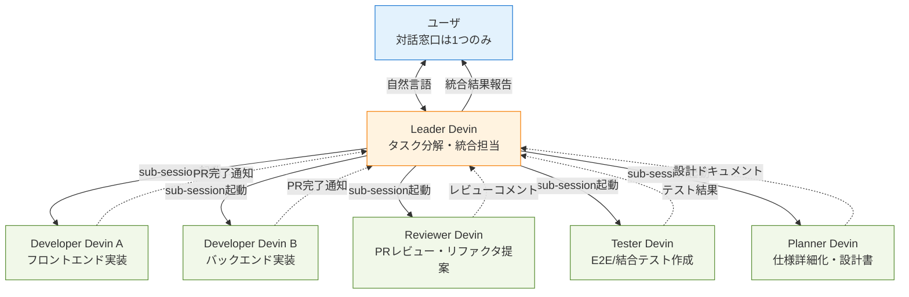

# Q62. 複数のDevinセッションで協業できる？リーダ→開発者/レビューア/テスター型のマルチエージェント体制は可能？

📚 [トップ索引](../../README.md) ｜ [カテゴリ索引: 組織展開・分析](README.md)

---

> **メタ**: 最終確認日 2026/4/17 ｜ 根拠 https://docs.devin.ai/product-guides/sub-sessions ｜ 推定あり

### 結論: **すべて実現可能**。Devinには**公式に「Sub-Session（子セッション）」機構**があり、リーダDevinが開発者/レビューア/テスター役の子Devinを起動して並列協業できる。ユーザは**リーダとだけ対話**し、子への指示はリーダから行う体制も組める

### マルチエージェント体制の全体像



### 実現を支える2つの仕組み

#### 仕組み1: Sub-Session（子セッション）機能 ⭐

- **Devin標準機能**。親セッションから子セッションを起動する組込の仕組み
- 公式: https://docs.devin.ai/product-guides/sub-sessions
- 親から子へ **プロンプト + 成果物の受け渡し方針** を指定
- 子は**独立したVM・独立したファイルシステム・独立した環境変数**で動作
- 子の完了後、結果（PR / レポート / メッセージ）が親に集約される

#### 仕組み2: Devin API経由の並列起動

- リーダDevinが Devin API（`POST /v3/organizations/{org_id}/sessions`）を呼び出して任意数の子を起動
- API Keyは Secrets（`DEVIN_API_KEY` 等）で渡す → Q32 参照
- **柔軟性が高い**（サイクル制御・外部オーケストレータと連動しやすい）が、設計は複雑

### 役割割当の具体例（5役体制）

| 子 Devin | 渡すプロンプト/Playbook | 期待成果物 | 独立性 |
|---|---|---|---|
| **Planner** | 要求仕様 + 設計Playbook | 詳細設計書 / タスク分解表 | 独立VM、成果物は Markdown |
| **Developer A（Frontend）** | リポURL + 設計書 + `playbook/dev-frontend` | Frontend PR（`frontend/` 配下） | 独立VM、PRで成果物 |
| **Developer B（Backend）** | リポURL + API仕様 + `playbook/dev-backend` | Backend PR（`backend/` 配下） | 独立VM、PRで成果物 |
| **Reviewer** | 対象PR番号 + レビュー観点Knowledge | レビューコメント・ApprovalRequest | 独立VM、PRコメント |
| **Tester** | 対象PR + テスト観点Playbook | テストコード PR / テスト結果 | 独立VM、別PR or 同PR追加 |

### 実現方法A: 組込Sub-Session機能（推奨）

#### ステップ

1. **リーダセッション起動**: ユーザが Devin Web UI で新セッション起動、AGENTS.md や初期プロンプトに以下を記載

   ```
   あなたはリーダDevinです。以下の役割分担で作業を進めてください：
   - 仕様詳細化: Planner子セッションを起動
   - フロント実装: Developer子セッション（playbook/dev-frontend）
   - バック実装: Developer子セッション（playbook/dev-backend）
   - レビュー: Reviewer子セッション（playbook/reviewer）
   - テスト: Tester子セッション（playbook/tester）
   必要に応じて sub-session を起動し、結果を統合してユーザに報告してください。
   ```

2. **ユーザはリーダとだけ対話**: Web UIのチャットは1つ、リーダが自律的に子を起動・管理
3. **リーダが子を起動**: 子のプロンプト・参照リポ・Playbookを指定
4. **子は独立実行**: それぞれ別VMで作業、PR作成やレポート生成
5. **リーダが集約**: 全子の結果を統合してユーザに報告

#### メリット

- **公式サポート済み**で安定
- ユーザは1つの会話窓口だけ意識すれば良い
- Devin の LLM が自律的に並列度を判断

#### 制約

- 子セッションの**並列数はプラン/ACU予算**に依存
- 2階層までが実用的（子→孫は管理複雑）

### 実現方法B: Devin API経由（プログラム制御）

#### ステップ

1. リーダセッションの Secrets に `DEVIN_API_KEY`（Service User Key, `cog_...`）を登録
2. リーダへのプロンプトに「このタスクを N 人のワーカに分割して API 経由で並列実行せよ」と明示
3. リーダは以下のような Python を実行:

   ```python
   import os, time, requests
   API = "https://api.devin.ai/v3/organizations/" + os.environ["ORG_ID"] + "/sessions"
   H = {"Authorization": f"Bearer {os.environ['DEVIN_API_KEY']}"}

   tasks = [
       {"prompt": "frontend/ 配下にReactでログイン画面を実装してPR作成", "playbook_id": "pb_frontend"},
       {"prompt": "backend/ 配下にFastAPIで/auth/loginを実装してPR作成", "playbook_id": "pb_backend"},
   ]
   session_ids = []
   for t in tasks:
       r = requests.post(API, headers=H, json=t)
       session_ids.append(r.json()["session_id"])

   # 完了待ち（ポーリング）
   while session_ids:
       for sid in list(session_ids):
           s = requests.get(f"{API}/{sid}", headers=H).json()
           if s["status"] in ("completed", "failed"):
               print(f"Session {sid}: {s['status']}, PR: {s.get('pr_url')}")
               session_ids.remove(sid)
       time.sleep(30)
   ```

4. 各子セッションは通常のDevinセッションとして実行、PR作成などを自律遂行
5. リーダは結果を統合してユーザにメッセージ

#### メリット

- **細かい制御が可能**（並列度・順序・条件分岐）
- 外部ワークフロー（GitHub Actions / Temporal 等）と組み合わせやすい

#### 制約

- リーダセッションの**寿命（目安8時間）** を超える長期プロジェクトは Schedule 併用
- API呼び出しのエラーハンドリング・再試行はリーダの実装次第

### 実現方法C: Orchestratorを外出し

#### パターン

- **親役は外部**（GitHub Actions / AWS Step Functions / Temporal / n8n 等）
- リーダDevinは「計画立案」だけを担当、実行は外部
- 子Devinは外部オーケストレータが API で起動

#### 向いているケース

- CI/CDパイプラインに組み込みたい
- 定期実行（夜間バッチで10件並列処理等）
- 監査ログを外部システムに統合したい

### 比較: 3つの実現方法

| 観点 | 方法A: Sub-Session | 方法B: Devin API | 方法C: 外部Orchestrator |
|---|---|---|---|
| **実装コスト** | ⭐⭐⭐ 最小 | ⭐⭐ 中 | ⭐ 大 |
| **柔軟性** | ⭐⭐ 中 | ⭐⭐⭐ 高 | ⭐⭐⭐ 高 |
| **ユーザ体験** | ⭐⭐⭐ 窓口1つ | ⭐⭐ リーダ経由 | ⭐ 複数UI |
| **長期運用** | ⭐⭐ リーダ寿命依存 | ⭐⭐ 同左 | ⭐⭐⭐ 永続 |
| **公式サポート** | ⭐⭐⭐ 明示 | ⭐⭐⭐ API提供 | ⭐ 自前実装 |
| **推奨** | 通常はこれ | 大規模・複雑フロー | エンタープライズCI/CD統合 |

### 制約・注意事項

#### 1. 子セッションの独立性

- 子は親の**bash / ファイル / 環境変数を継承しない**
- 必要情報は**プロンプト / Knowledge / Secrets** で明示的に渡す
- 共有の原則: **リポ（GitHub経由）** と **Knowledge / Playbook（Devin Web経由）**

#### 2. ACUコスト

- 子セッションも**それぞれACUを消費** → N人並列 = N倍のACU
- Teams/Enterpriseプランでの運用を強く推奨（Coreプランでは現実的でない）
- リーダ自身のACUも消費（監督/統合作業分）

#### 3. PR競合・マージ戦略

- 複数子が**同じファイルを触るとmerge conflict**発生
- 対策:
  - **担当領域を明確分割**（モノレポなら `frontend/` `backend/` `infra/` で分離）
  - リーダが**依存順序を制御**（Planner → Dev → Test の直列化）
  - **統合ブランチ運用**（`feature/leader-xxx-fe`, `feature/leader-xxx-be` → `feature/leader-xxx`）

#### 4. リーダの寿命

- リーダセッションも**セッション上限（目安8時間）** がある
- 長期プロジェクトは:
  - **Schedule機能で定期起動**（日次でリーダを再開）
  - **Knowledge に進捗を記録**させて次リーダに引き継ぐ
  - 方法C（外部Orchestrator）への移行を検討

#### 5. 子から子への指示（ネスト）

- 技術的には可能だが**2段階（親→子）まで**が現実的
- 3段階以上は**管理複雑化・デバッグ困難**
- 必要なら方法Cで外部オーケストレーション

#### 6. エラー時のリカバリ

- 子が失敗した場合のリカバリはリーダの責任
- プロンプトに**失敗時の再試行ポリシー**を明示
  - 例: 「テストが3回連続失敗したらユーザにエスカレーション」

### 実運用Tips

#### Tip 1: 役割別Playbookを事前登録

```
Playbook 一覧:
- playbook/dev-frontend  : React + TypeScript 規約、lint/format/test 手順
- playbook/dev-backend   : FastAPI + Pydantic 規約、テスト手順
- playbook/reviewer      : レビュー観点チェックリスト、承認基準
- playbook/tester        : テスト粒度（単体/結合/E2E）、カバレッジ目標
- playbook/planner       : 設計書テンプレ、ADR 書式
```

#### Tip 2: Knowledgeで共通規約を共有

- コーディング規約・セキュリティガイドライン・命名規則はKnowledge登録
- **全子セッションに自動注入**されるので再記述不要

#### Tip 3: 監視とエスカレーション

- リーダに「子の失敗率が30%超で Slack通知」等のルールを組込
- Devin Slack連携（Q56/Q57）で**ユーザ/管理者へアラート**

#### Tip 4: 権限分離

- 子セッションごとに**異なるService User Key**を使う設計
  - Reviewer役は**読み取り+コメント権限のみ**
  - Developer役は**書き込み権限**
  - RBAC（Role-Based Access Control）で最小権限を強制

#### Tip 5: 統合テスト後の自動マージ

- Tester 子が全テスト通過を確認後、リーダが統合PRを作成
- `gh pr merge --auto` 等で条件付き自動マージ

### アンチパターン（やりがちな失敗）

| アンチパターン | 問題 | 対策 |
|---|---|---|
| 子セッション数を固定で 10 人並列 | ACU枯渇・PR競合頻発 | **2〜3並列から開始**、段階的に増やす |
| リーダに全コード実装させる | リーダの文脈が膨張・セッション寿命超過 | リーダは**分解・集約のみ**、実装は子に委譲 |
| 子に同じプロンプトを投げる | 全子が同じPRを作ろうとする | **担当領域を必ず明示**、`frontend/`/`backend/` 等 |
| 子の失敗を無視 | 統合時に矛盾発覚 | リーダに**失敗時エスカレーション**を組込 |
| 2段以上のネスト（子→孫） | デバッグ困難・コスト制御不能 | **2段まで**、深い階層は方法C |

### まとめ

| 観点 | 結論 |
|---|---|
| マルチセッション協業 | **可能**。Sub-Session機能またはDevin API経由 |
| リーダ→ワーカ体制 | **可能**。ユーザはリーダとだけ対話、子への指示はリーダ経由 |
| 役割分担（Dev/Reviewer/Tester/Planner） | **可能**。Playbookで役割別の振る舞いを定義 |
| 推奨方法 | **Sub-Session（方法A）が最小コスト・公式サポート済み** |
| 注意 | ACUコストN倍・PR競合分割・リーダ寿命・2段階まで |
| 向いているケース | **大規模機能開発、モノレポ並列開発、レビュー/テスト自動化** |
| 向かないケース | 小さなタスク・1人で十分なケース・ACU予算が限られる場合 |

**核心**: **Devinはマルチエージェント協業を公式サポート**。Sub-Session機能でリーダDevinが開発者/レビューア/テスター役の子Devinを起動し、ユーザはリーダとだけ対話する体制が組める。成功の鍵は**役割別Playbook・担当領域分離・ACU予算管理**の3点。

---

[← Q61. 実例: `internal-standards-docs`（自社旧標準）に準拠したDevinリソース構成の手順は？](q61-internal-standards-example.md) ｜ [Q63. セッション操作履歴からユーザ＆Devinの開発生産性を計測できる？（応答時間・思考時間の取得） →](q63-productivity-metrics.md)
