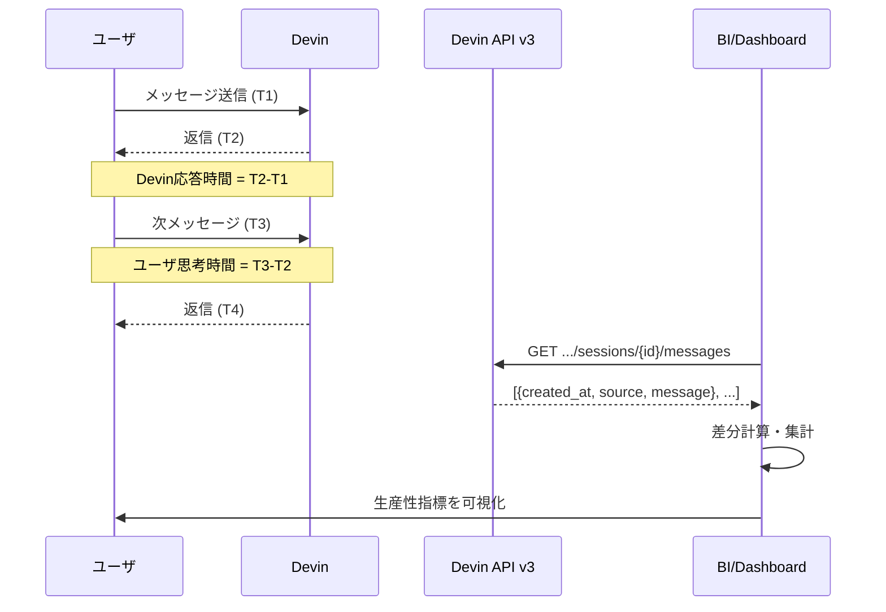

# Q63. セッション操作履歴からユーザ＆Devinの開発生産性を計測できる？（応答時間・思考時間の取得）

📚 [トップ索引](../../README.md) ｜ [カテゴリ索引: 組織展開・分析](README.md)

---

> **メタ**: 最終確認日 2026/4/17 ｜ 根拠 https://docs.devin.ai/api-reference/v3/sessions/get-organizations-session-messages ｜ 推定なし

### 結論: **可能**。Devin API v3 の List session messages エンドポイントで、メッセージ単位のタイムスタンプ（`created_at`）と送信者（`source: user`/`devin`）が取得できるため、「ユーザ→Devin 応答時間」「Devin→ユーザ 思考時間」の両方を計測・集計・ダッシュボード化できる

### 全体像



### 公式API仕様（裏取り済）

#### エンドポイント（v3 推奨）

```
GET https://api.devin.ai/v3/organizations/{org_id}/sessions/{devin_id}/messages
Authorization: Bearer cog_xxx   (Service User Key)
```

- 公式: https://docs.devin.ai/api-reference/v3/sessions/get-organizations-session-messages
- **権限**: Service User に `ViewOrgSessions` が必要
- **ページング**: cursor-based（`after` パラメータ、`first` で件数指定、最大200）
- **順序**: **時系列順（古い→新しい）**

#### レスポンス（`SessionMessage` スキーマ）

| フィールド | 型 | 説明 |
|---|---|---|
| `event_id` | string | メッセージの一意ID |
| `source` | enum: `user` / `devin` | **送信者区別** ⭐ |
| `message` | string | 本文 |
| `created_at` | integer | **Unix timestamp（UTC、秒）** ⭐ |

#### v1 API（レガシー・参考）

```
GET https://api.devin.ai/v1/sessions/{session_id}
```

- レスポンスの `messages[]` に同様の情報が含まれる
- **v3 + Service User 推奨**（Q33 参照）

### 計測する指標（提案）

| 指標 | 計算方法 | 意味 |
|---|---|---|
| **Devin応答時間** | `T(Devin返信) - T(直前のUser送信)` | Devin の処理速度、並列タスク吸収力 |
| **ユーザ思考時間** | `T(次のUser送信) - T(直前のDevin返信)` | ユーザのレビュー/判断/介入の重さ |
| **1往復時間** | Devin応答時間 + ユーザ思考時間 | 1ターンの全体スループット |
| **ユーザ介入率** | User送信数 / Devin返信数 | 低いほど自律性高い |
| **セッション効率** | PR作成までの往復回数 | 少ないほど効率的 |
| **総稼働時間** | 最後のメッセージ - 最初のメッセージ | セッションの総実時間 |
| **Devin累積稼働時間** | Σ(Devin応答時間) | Devin実処理時間（ACU相関） |
| **ユーザ累積占有時間** | Σ(ユーザ思考時間) | ユーザ工数の近似値 |

### 取得スクリプト（Python）

```python
import os, requests
from datetime import datetime
from statistics import mean, median

ORG = os.environ["DEVIN_ORG_ID"]     # org-xxxx
DEVIN_ID = "devin-abc123"            # 対象セッション
KEY = os.environ["DEVIN_API_KEY"]    # cog_xxxx (Service User)

url = f"https://api.devin.ai/v3/organizations/{ORG}/sessions/{DEVIN_ID}/messages"
headers = {"Authorization": f"Bearer {KEY}"}

# 全メッセージをcursor pagingで取得
msgs, cursor = [], None
while True:
    params = {"first": 200}
    if cursor:
        params["after"] = cursor
    r = requests.get(url, headers=headers, params=params).json()
    msgs.extend(r["items"])
    if not r.get("has_next_page"):
        break
    cursor = r["end_cursor"]

# 差分を計算
devin_response_times, user_thinking_times = [], []
for i in range(1, len(msgs)):
    prev, curr = msgs[i-1], msgs[i]
    delta = curr["created_at"] - prev["created_at"]  # 秒
    ts = datetime.fromtimestamp(curr["created_at"])

    if prev["source"] == "user" and curr["source"] == "devin":
        devin_response_times.append(delta)
        print(f"[{ts}] Devin応答: {delta}秒")
    elif prev["source"] == "devin" and curr["source"] == "user":
        user_thinking_times.append(delta)
        print(f"[{ts}] ユーザ思考: {delta}秒")

print(f"\n=== サマリ ===")
print(f"Devin応答時間: mean={mean(devin_response_times):.0f}s, median={median(devin_response_times):.0f}s")
print(f"ユーザ思考時間: mean={mean(user_thinking_times):.0f}s, median={median(user_thinking_times):.0f}s")
print(f"往復回数: {len(devin_response_times)}")
```

### 組織横断での集計

#### 1. セッション一覧を取得

```
GET /v3/organizations/{org_id}/sessions?created_after=2026-04-01&created_before=2026-04-30
```

#### 2. 各セッションの messages を取得して指標化

```python
# 疑似コード
sessions = list_sessions(org_id, created_after="2026-04-01")
metrics = []
for s in sessions:
    msgs = get_messages(org_id, s["devin_id"])
    m = compute_metrics(msgs)
    metrics.append({
        "devin_id": s["devin_id"],
        "user": s["owner"],
        "team": s["team"],
        "avg_devin_response": m["avg_devin_response"],
        "avg_user_thinking": m["avg_user_thinking"],
        "turns": m["turns"],
        "created_pr": s.get("pr_url") is not None,
    })

# BigQuery / Datadog / Grafana へ送信
send_to_warehouse(metrics)
```

#### 3. ダッシュボード化

- **週次/月次の平均指標**（ユーザ別・チーム別）
- **Playbook 適用効果**（適用 vs 未適用で平均往復時間を比較）
- **外れ値検出**（思考時間が30分超のセッション一覧）

### 定期ジョブ化（Schedule機能連携）

Devin Schedule 機能で日次/週次にスクリプトを自動実行:

```
Schedule名: daily-productivity-metrics
Cron: 0 9 * * *  (毎日 9:00 JST)
プロンプト:
  昨日のDevinセッション全てを集計し、以下をSlack #devin-metrics に投稿:
  - セッション数
  - 平均Devin応答時間
  - 平均ユーザ思考時間
  - PR作成率
  詳細CSVは S3://mycorp-devin-metrics/YYYY-MM-DD.csv に保存
```

### 制約・注意事項

#### 1. 権限管理

- Service User に `ViewOrgSessions`（組織内の全セッション閲覧）権限が必要
- **全メンバーの会話内容が見える**ため、取得方針は**組織合意形成**が必要（Q52 参照）
- 集計結果だけを公開し、生の会話は管理者限定にする運用を推奨

#### 2. メッセージ以外のイベントは取得できない

- メッセージ API に含まれるのは**ユーザ/Devin の会話メッセージのみ**
- PR 作成・シェルコマンド実行・ファイル編集などの**操作ログは別**
- 詳細な操作履歴は Web UI の session transcript 画面で閲覧

#### 3. タイムスタンプの解釈

- `created_at` は **Unix timestamp（UTC、秒単位）**
- JST 変換は `+9時間` またはライブラリで処理
- 夜間バッチで集計する場合はタイムゾーン統一に注意

#### 4. Ask Devin / Slack 連携の扱い

- このメッセージAPIは **Session** 用
- **Ask Devin** の履歴取得可否、**Slack mention** の履歴取得可否は**別途要確認**
- 公式ドキュメントで Ask Devin 用のメッセージAPIは**執筆時点で未確認**

#### 5. 長時間セッションの偏り

- Devin が長時間考えている（実装中）の時間も「Devin応答時間」に含まれる
- 短い返信 vs 実装完了までの差が混ざるため、**カテゴリ分け**が有効:
  - Devin返信が `PR URL を含む` → タスク完了返信（長い）
  - Devin返信が `質問` → 中間返信（短い）

#### 6. ユーザ思考時間の解釈

- 「思考時間」には**席を離れた時間**も含まれる（休憩・ミーティング等）
- 夜間・週末を除外する処理が必要:

  ```python
  # 業務時間（平日 9:00-18:00 JST）のみに絞る
  def is_work_time(ts_unix):
      dt = datetime.fromtimestamp(ts_unix, tz=timezone(timedelta(hours=9)))
      return dt.weekday() < 5 and 9 <= dt.hour < 18
  ```

### 実用的ユースケース

#### ユースケース1: 個人の生産性可視化

| 観点 | 使い方 |
|---|---|
| **週次レポート** | 自分の週次平均「Devin応答時間/思考時間/1往復時間」 |
| **改善サイクル** | プロンプト改善後に往復回数が減ったか検証 |
| **効率の良い時間帯** | 朝型/夜型、集中時間の発見 |

#### ユースケース2: チーム比較・改善

| 観点 | 使い方 |
|---|---|
| **チーム別ダッシュボード** | 平均往復時間・介入率・PR作成率 |
| **Playbook効果測定** | Playbook 適用セッションと未適用で平均往復時間を比較 |
| **ベストプラクティス発見** | 効率の高いメンバーのプロンプト・Playbook を横展開 |

#### ユースケース3: 改善アラート

| 観点 | 使い方 |
|---|---|
| **長時間思考アラート** | ユーザ思考時間 >30分のセッションを抽出 → プロンプト品質改善の対象 |
| **Devin応答遅延アラート** | Devin応答時間 >1時間 → ACU 不足・Knowledge 不足の兆候 |
| **無効セッション** | 5分以内に終了したセッション → プロンプトの不明瞭さ検知 |

#### ユースケース4: ROI計算

| 観点 | 使い方 |
|---|---|
| **Devin削減時間** | Σ(Devin応答時間) ≒ 人間が代わりにやったら要した時間の下限 |
| **ACU単価効率** | Devin応答時間 / ACU消費量 → コストパフォーマンス |
| **経営報告** | 月次で「Devinが N 時間の開発作業を代行」と定量化 |

### アンチパターン（やりがちな失敗）

| アンチパターン | 問題 | 対策 |
|---|---|---|
| 応答時間だけで評価 | 長考=悪ではない（複雑なタスクなら妥当） | **タスク種別と併せて評価**、PR作成率も重視 |
| 個人を監視ツール化 | 心理的安全性低下、利用忌避 | **集計値のみ可視化**、個人の生ログは本人のみ |
| 業務時間外を含めて集計 | 休日・夜間で「思考時間」が肥大化 | **業務時間フィルタ**を必ず入れる |
| 外れ値を平均で均す | 中央値と乖離して実態を誤認 | **median・95パーセンタイル**も併記 |
| PR作成率を無視 | 速くても成果無しでは意味なし | **PR作成率・マージ率**を主指標に |

### まとめ

| 観点 | 結論 |
|---|---|
| メッセージ単位タイムスタンプ | **取得可能**（`created_at` + `source`） |
| 推奨エンドポイント | `GET /v3/organizations/{org_id}/sessions/{devin_id}/messages` |
| 計測可能指標 | Devin応答時間・ユーザ思考時間・往復回数・PR作成率 |
| 権限 | Service User に `ViewOrgSessions` が必要 |
| 注意 | 個人監視ツール化の回避、業務時間フィルタ、タスク種別との併用評価 |
| 拡張 | Schedule + Slack + BI で**日次自動レポート**化可能 |
| 向いているケース | **チーム全体の利用状況・Playbook効果測定・ROI算出** |
| 限界 | メッセージ以外の操作ログは別、Ask Devin履歴は別途確認 |

**核心**: **Devin API v3 の messages エンドポイントで送信者付きタイムスタンプが取れる**ため、「応答時間」「思考時間」「往復回数」「PR作成率」等の生産性指標化は完全に実現可能。**チーム比較・Playbook効果測定・ROI算出**に活用できるが、個人監視ツール化を避け**集計値可視化・業務時間フィルタ・タスク種別併用**を守ることが成功の鍵。

---

[← Q62. 複数のDevinセッションで協業できる？リーダ→開発者/レビューア/テスター型のマルチエージェント体制は可能？](q62-multi-agent-collaboration.md) ｜ [Q64. Devinシェルで `git clone` が失敗するのはなぜ？（git-manager.devin.ai/proxy と認証プロキシ／403切り分け） →](../04-github-scm/q64-clone-failures.md)
