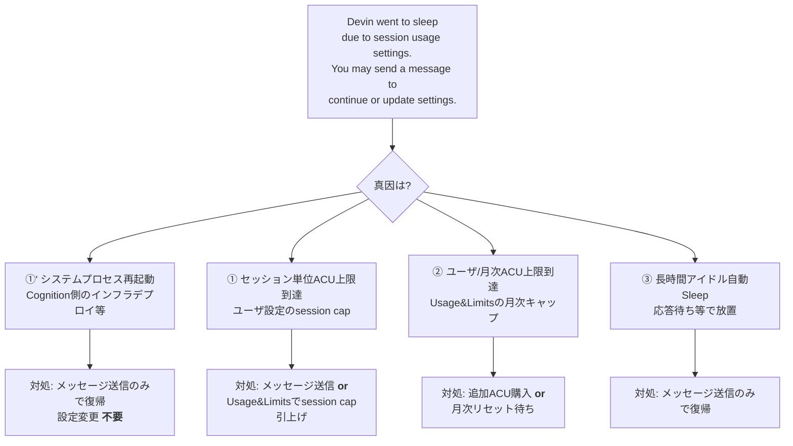
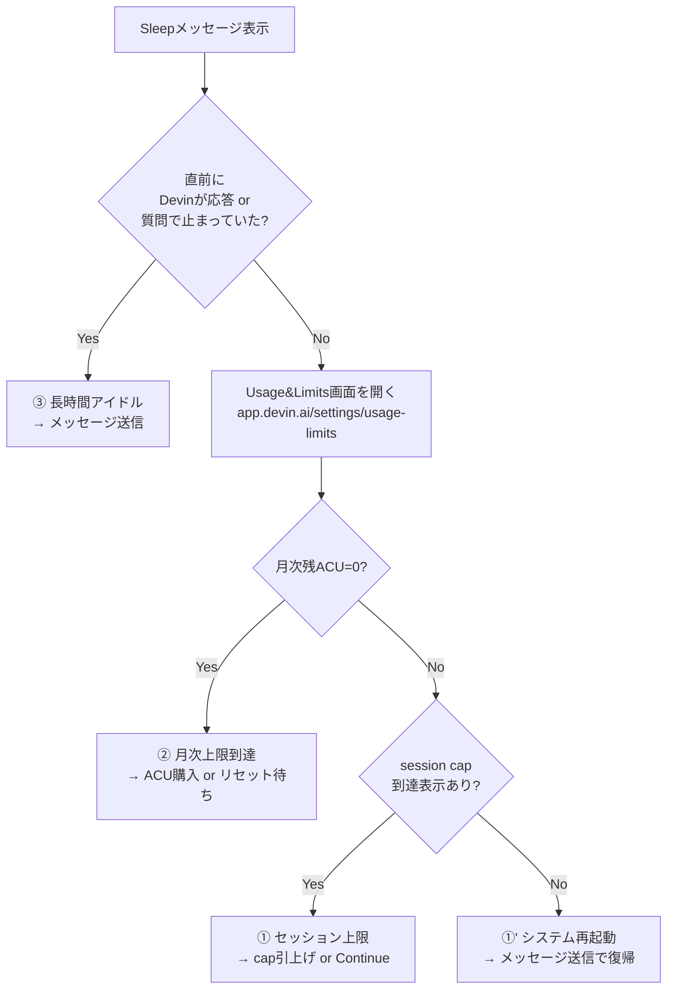

# Q65. 「Devin went to sleep due to session usage settings」と表示されて止まるのはなぜ？対処方法は？

📚 [トップ索引](../../README.md) ｜ [カテゴリ索引: セッション停止・復旧](README.md)

---

> **メタ**: 最終確認日 2026/4/17 ｜ 根拠 https://docs.devin.ai/admin/billing / https://app.devin.ai/settings/usage-limits / 実観察（当該セッションDevin自身の証言 + 本FAQ作成中の実体験） ｜ 推定あり

### 結論: この文言は **4種類の原因に対する共通文言** であり、文字通りの「usage settings 到達」以外のケース（特に **Cognition側のシステムプロセス再起動** ）でも同じメッセージが表示される。**メッセージ送信で即復旧するか、追加設定変更が必要か**は真因次第。**ファイルシステムとcommit履歴は保全される** ため、差分やソースが失われる心配はない。

### 同じ文言が出る4つの真因（重要）



### 4パターンの切り分け早見表

| パターン | 真因 | ユーザ側の表示 | 判別方法 | 復旧 |
|---|---|---|---|---|
| **①' システム再起動** | Cognition側のインフラ再起動 (**公式に明記されていないが存在**) | 同一文言 | Usage&Limitsに到達なし／同時刻に他セッションも停止／セッション内シェルプロセスが全消失 | メッセージ送信のみ |
| **① セッション単位ACU上限** | ユーザが設定した「max ACUs per session」 | 同一文言 | Usage&Limits画面でsession capに到達表示 | メッセージ送信 or cap変更 |
| **② 月次ACU上限** | Usage&Limitsの月次キャップ到達 | 同一文言（残高ゼロ表示も併記の場合あり） | Usage&Limitsで残ACU=0 | 追加ACU購入 or 翌月待ち |
| **③ 長時間アイドル** | 質問待ち/テスト待ち等で放置 | 同一文言 | 直前にDevinが応答 or 質問で止まっていた | メッセージ送信のみ |

### 公式ドキュメントとの関係

- 公式の [Billing](https://docs.devin.ai/admin/billing) は「Devinはアイドル時にSleepし、メッセージ送信で起動する」と記載（③の説明）
- 公式はACU上限到達時に **「ACU limit reached, contact Enterprise Admin」** という別文言を明記（**Enterprise Orgキャップの場合のみ**）
- **パターン①'（システムプロセス再起動）については公式ドキュメントに明記がない** — 実観察と当該セッションDevin自身の発言で確認

### 実観察: システムプロセス再起動時のシステムメッセージ

本FAQ作成中に実際に発生したケース:

```
This conversation was resumed after a system process restart.
IMPORTANT: Your entire filesystem has been fully preserved — all files,
repositories, screenshots, build artifacts, and any other data you wrote
to disk are exactly as you left them. Nothing on disk was lost or modified.
The only things affected are ephemeral OS state: running processes and
shell sessions were killed, so you will need to re-run any servers or
background processes.
```

**つまり、システムプロセス再起動 = 「Devinの実行プロセス（Claude/思考ループ + シェル）が内部的に再起動した」** 状態。ユーザ側のUIでは「session usage settings による Sleep」と表示される。

### ファイル保全範囲（重要）

| 保全される | 失われる/再起動が必要 |
|---|---|
| `/home/ubuntu` 配下の **全ファイル** | **実行中のシェルセッション**（バックグラウンドプロセス含む） |
| ソースコード・`git` の commit 履歴 | 起動中の **dev server / webpack / pytest-watch** 等 |
| エディタでの作業中差分（未コミット変更） | シェル起動後に `export` した環境変数 |
| リポジトリの clone 状態 | `tmux`/`screen` の内部状態 |
| Skills / Knowledge / Playbook / Secrets | **会話のdetailed context**（引き継ぎ時に要約化される） |
| Todo list（Devin内部状態） | 一部の思考プロセス詳細 |

**実務上の影響はほぼゼロ**だが、以下2点だけ注意:
- **起動中のサーバは停止**している → `curl localhost:XXXX` で確認、必要なら再起動
- **会話contextが要約化**される可能性 → 再開メッセージで「何をやっていたか」を軽く再確認するプロンプトが効果的

### 眠っている間の課金（ACU消費）はどうなる？

**結論: 眠っている間は ACU 消費されない（=課金されない）**。ACU の計量は **「Devinが能動的に実行している時間」のみ** が対象で、Sleep状態・アイドル・ユーザ応答待ちは**すべて非課金**。System restart による Sleep も Cognition 側事由のため当然非課金。

#### 課金される/されない タイミング

| 状態 | ACU消費 | 備考 |
|---|---|---|
| **Sleep中（"went to sleep"表示中）** | ❌ なし | メッセージ待ち。CPU/実行は停止 |
| **ユーザ応答待ち（Devinが質問を投げた後）** | ❌ なし | Devin側は何もしていない |
| **アイドル（指示間の待機）** | ❌ なし | 同上 |
| **System restart 中（①'）** | ❌ なし | Cognition側インフラ事由、ユーザ負担なし |
| **Archive後のセッション閲覧** | ❌ なし | 読み取り専用 |
| **Session一覧の表示・検索** | ❌ なし | Webアプリ機能 |
| Devinが思考中（Thinking...） | ✅ あり | LLM推論時間 |
| ツール呼び出し実行中（browser/shell/edit等） | ✅ あり | 主要な消費源 |
| Playbook/Skill/Schedule による自動実行 | ✅ あり | 実行時間ベース |
| ユーザが他タブ作業中でもDevinが自律実行中 | ✅ あり | 裏で動いている限り計量される |

#### パターン別の課金実態

| パターン | Sleep中の課金 | 再開後の課金 |
|---|---|---|
| ①' システム再起動 | なし | 通常通り消費再開。**再起動によるロスは Cognition 側負担** |
| ① セッション cap 到達 | なし | 上限引き上げ or 「続行」選択後に新規ACU消費開始 |
| ② 月次 cap 到達 | なし | 追加ACU購入 or 月次リセット後、通常通り |
| ③ アイドル自動Sleep | なし（アイドル中も非課金） | メッセージ送信で通常通り再開 |

→ **どのパターンでも「眠っている時間分」は料金発生しない**。

#### 「二重課金」懸念の細部（よくある質問）

System restart（①'）で中断 → 再開した場合:

| 項目 | 扱い |
|---|---|
| restart **前** までに消費した ACU | **既に消費済み**（戻らない） |
| restart **中** の時間 | 0 ACU（非課金） |
| restart **後** の状況再確認やり取り | 若干の新規ACU消費（通常1〜2 ACU程度） |
| restart 前の commit や差分 | 保全されているので**作り直さない**（二重課金回避） |

→ **「全部やり直し」にはならない**のが通常。ただし:
- **未commit の思考途中情報**（デバッグ仮説・試行錯誤中の実装方針）は要約化で細部欠落 → 再開時の再確認で若干ACU増
- 対策: 重要な試行結果はこまめに commit、思考メモは filesystem 上のファイルに書かせる

#### 誤解されやすいポイント

| ❌ 誤解 | ✅ 実態 |
|---|---|
| 眠っている間も時間課金される | ACUは実行時間ベース。眠っている=非課金 |
| セッションを開いたままにすると課金が続く | 開きっぱなしでも Devin が何もしていなければ 0 ACU |
| System restart で消費したACUは無駄になる | 再起動前までの成果（差分/commit）は保全、再起動中は 0 ACU |
| 再開時に再度全部やり直すから二重課金 | ファイル保全 + context要約引き継ぎで、大半は続きから再開 |
| Archive/Terminate したセッションは閲覧でも ACU 消費 | 閲覧は非課金（再開時のみ新規消費） |

#### 検証方法（自分で確認したい場合）

1. セッション開始時に `Settings → Usage & Limits` で**残ACU値**をメモ
2. Devinにタスクを投げる → Sleep 発生
3. Sleep中に数分〜数十分放置 → Usage & Limits を再確認
   - **値が減っていない** = Sleep中は非課金の証拠
4. メッセージ送信で再開 → その後の実行で消費再開を確認

### パターン別の具体的対処手順

#### ①' システムプロセス再起動の場合（最も多い・設定変更不要）

**症状**: 作業中、突然Sleep。Usage&Limitsを見てもACU到達なし。

**手順**:
1. チャット欄に **「続けて」** と送信（短文でOK）
2. Devinが状況を復元し、作業を継続
3. バックグラウンドサーバを動かしていた場合:
   ```bash
   # 例: dev serverの再起動
   cd /home/ubuntu/repos/your-project && npm run dev &
   ```
4. 再開プロンプト例（推奨）:
   ```
   システム再起動前、Q65のドラフトを作成中でした。
   /tmp/q65.md があるなら内容を確認し、続きから再開してください。
   ```

#### ① セッション単位ACU上限到達の場合

**症状**: Usage&Limits画面で「session usage limit reached」表示。

**ワンクリック対処（UIにボタンがある場合）**:
- メッセージ下に **「Continue anyway」** / **「Raise session limit」** ボタンが表示されることあり → クリックで解除

**設定から恒久変更**:
1. `https://app.devin.ai/settings` を開く
2. 左メニュー **Usage & Limits**（または Settings → Billing → Limits）
3. **Session Usage Limits** セクションで以下を調整:
   - **Max ACUs per session**: 現在値を上げる（例: 20 → 50）
   - 無効化したい場合は **Unlimited** / チェック解除
4. Save
5. チャットに戻ってメッセージ送信 → 新しい上限で再開

**注意**: 不用意に上限解除するとACUが想定外に膨張する（[公式ケーススタディ](https://docs.devin.ai/use-cases/gallery/analyze-session-acu-efficiency)では12 ACU想定→42 ACUに膨張の事例あり）。無効化ではなく**適正な値への引き上げ**が推奨。

#### ② 月次ACU上限到達の場合

**症状**: Usage&Limitsで残ACU=0。

**Core プラン**:
1. `Settings → Usage & Limits` → **Buy ACUs**
2. 必要量を購入（$2.25/ACU）
3. または **Auto-reload** を有効化して同じ現象を自動回避
4. チャットに戻ってメッセージ送信

**Teams プラン**:
1. 毎月250 ACU込みのサブスクなので、**月次リセットまで待つ**か追加購入
2. Auto-reload 有効化で同現象回避

**Enterprise Org キャップ（別文言の場合）**:
- 自力解除不可。`app.devin.ai/settings/organizations` の管理権限を持つ **Enterprise Admin に連絡**して Org Limit 引き上げ

#### ③ 長時間アイドル自動Sleepの場合

**症状**: 直前にDevinが質問 or 応答で止まっており、一定時間操作なし。

**対処**: チャット欄に返信を送るだけ。ACUは消費されていないので追加課金なし。

### 判別フロー（最短診断）



### 予防策（再発抑制）

| 策 | 対象パターン | 効果 |
|---|---|---|
| **Auto-reload有効化** | ② | 月次残高切れを自動回避 |
| **session capを業務実態に合わせて設定** | ① | 小〜中タスク20 ACU、大タスク50 ACU 目安 |
| **タスク分割** | ①② | 1セッションあたりの消費を抑制（Teamsは並列数制限なし） |
| **プロンプト具体化** | ①② | [Good vs. Bad Instructions](https://docs.devin.ai/essential-guidelines/good-vs-bad-instructions)準拠 |
| **Session Insights活用** | ①② | 高ACUセッションの原因を事後分析 |
| **Playbook化** | ①② | 反復タスクの手順固定化でACU削減 |
| **重要な中間成果物は都度commit/push** | ①' | システム再起動で「shellが止まっても差分は残る」が、未commitの作業ファイルも基本残る。ただし念のため頻繁にcommit推奨 |

### アンチパターン

| NG | 理由 | 正しい対処 |
|---|---|---|
| メッセージ文言だけで「ACU使いすぎ」と判断 | 4パターンのうちシステム再起動は文言に反して「ACU未消費」 | Usage&Limits確認で真因切り分け |
| session capを毎回Unlimitedに解除 | 暴走時に高額請求の危険 | 適正値への引き上げ（例: 20→50） |
| 焦って新規セッションを作り直す | 既存作業のcontextが失われる | まず既存セッションにメッセージ送信で復帰試行 |
| 再開後すぐバックグラウンド処理を前提にする | システム再起動時はプロセスが死んでいる | `ps aux`/`curl localhost` で生存確認後に続行 |
| 「ファイルも消えたのでは」と不安でcloneし直す | 保全されているため不要 | `ls`/`git status` で確認 |

### Tips

- **最頻出は ①'（システム再起動）**。長時間セッションを使っていると遭遇確率が上がる（Cognition側のインフラデプロイは不定期）
- **真因判別の最速ルート**: Usage&Limits画面を見て到達なし → ほぼ①'
- **重要な作業の途中で遭遇した場合**: まず `git status` と `ls -la` で作業ファイルの無事を確認、次に `git log` で最後のcommitを確認、その後にメッセージで再開指示
- **Schedule実行中のセッション**: Schedule側で再試行ロジックがあれば自動復旧。手動フォローが必要か Schedule 画面で確認
- **同一時刻に複数セッションが一斉停止**した場合は、ほぼ確実にCognition側のインフラ再起動（大規模デプロイ時に起こり得る）
- **`privacy@cognition.ai`** や **`support@cognition.ai`** への問い合わせは、再現性があり繰り返し発生する場合のみ（単発なら経過観察で十分）

### まとめ表

| 項目 | 内容 |
|---|---|
| 文言 | "Devin went to sleep due to session usage settings. You may send a message to continue or update settings." |
| 真因 | 4種類（①'システム再起動 / ①session cap / ②月次上限 / ③アイドル） |
| 最短対処 | **まずメッセージ送信で復帰試行**、ダメなら Usage&Limits で切り分け |
| ファイル保全 | **保全される**（ソース・commit履歴・作業差分） |
| 失われるもの | 実行中のシェル・バックグラウンドプロセス・一部contextの詳細 |
| 予防 | session cap適正化・Auto-reload・タスク分割・Playbook化 |

**核心**: 「session usage settings」という文言は**UIの汎用表示**であり、真因は **(1) システム再起動 / (2) セッションACU上限 / (3) 月次ACU上限 / (4) アイドル** の4択。**まずメッセージを送れ**ば半数のケース（システム再起動・アイドル）は即復旧、残りは **Usage & Limits 画面で切り分けて設定変更 or ACU追加**。**ファイルは保全**されているので焦ってcloneし直す必要はない。

---

[← Q64. Devinシェルで `git clone` が失敗するのはなぜ？（git-manager.devin.ai/proxy と認証プロキシ／403切り分け）](../04-github-scm/q64-clone-failures.md) ｜ [Q66. Teamsプランで Usage History に他メンバのセッションが見える。自分の作業は丸見え？アーカイブで隠せる？ →](../12-security-governance/q66-session-visibility-teams.md)
